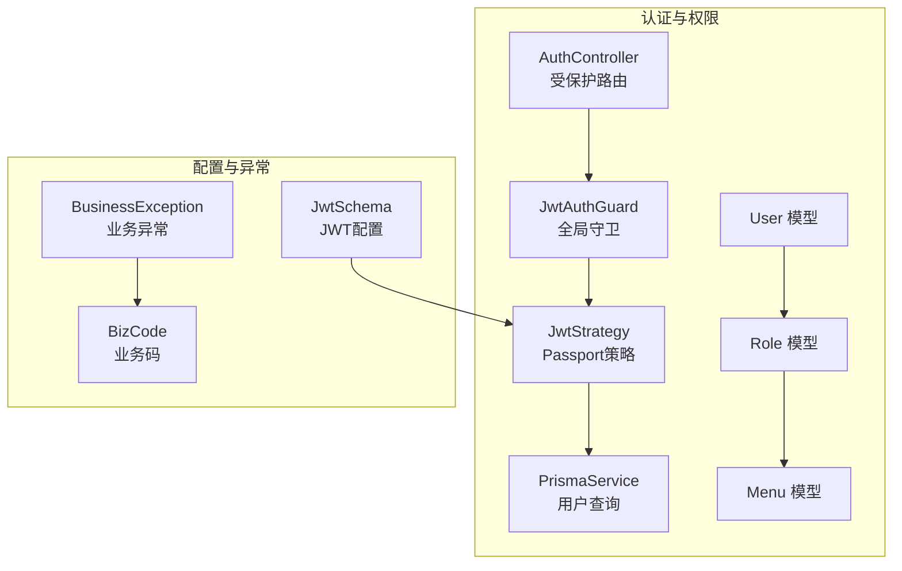
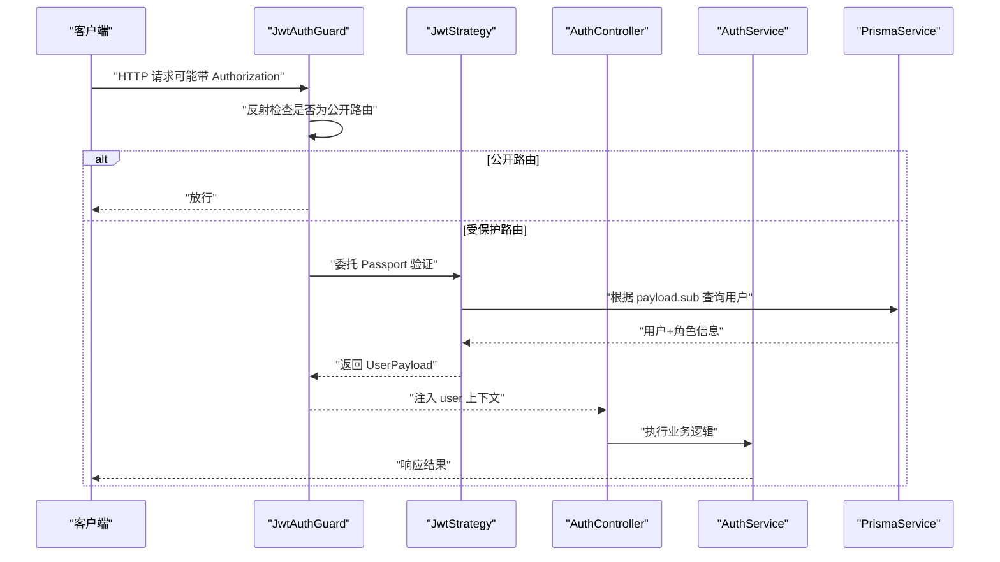
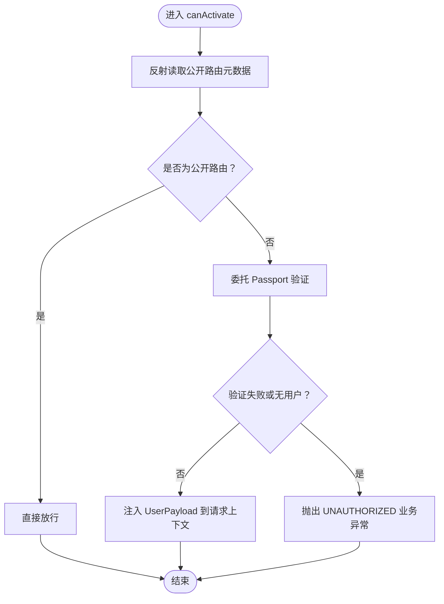
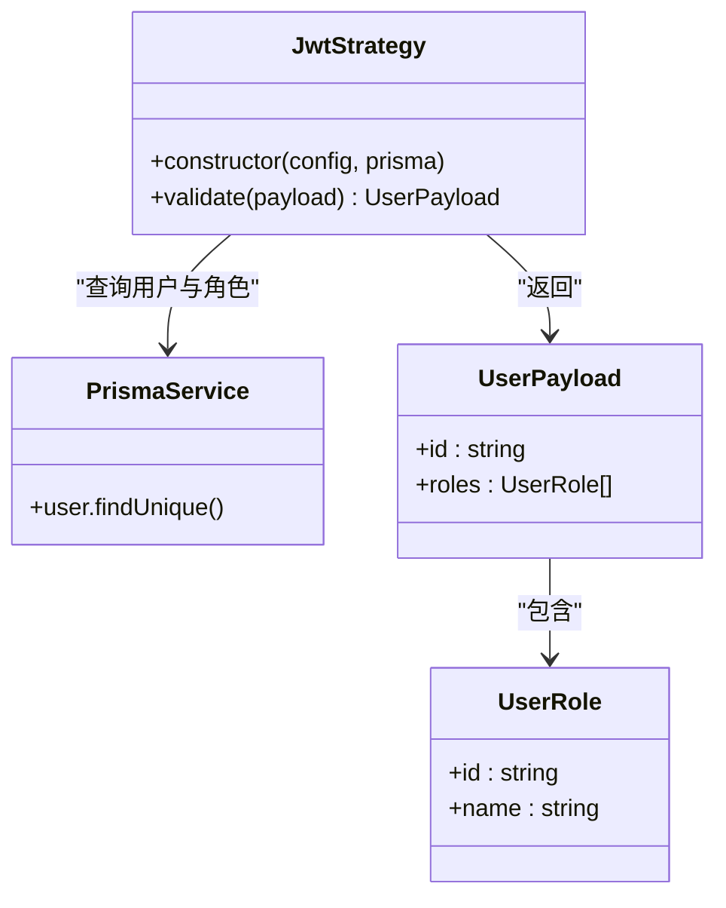
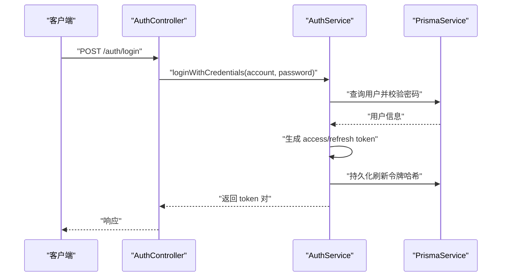
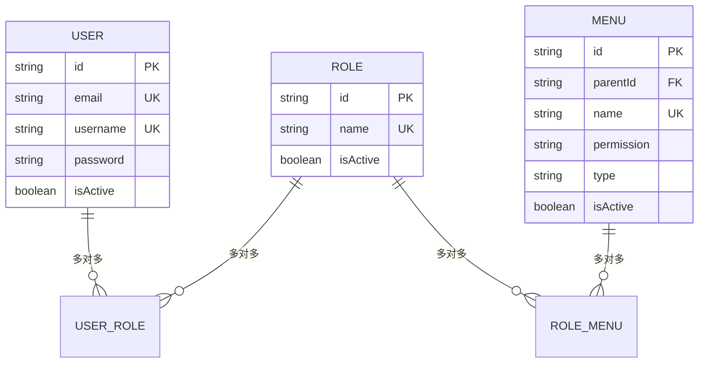
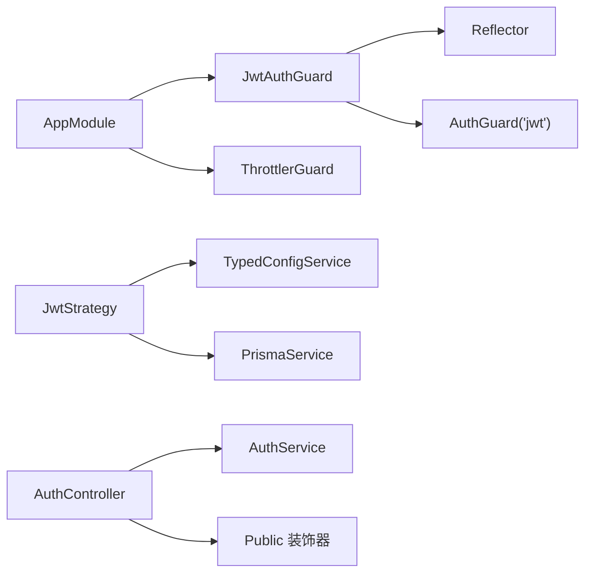

# 用户权限控制

<cite>
**本文档引用的文件**
- [src/common/guards/jwt-auth.guard.ts](file://src/common/guards/jwt-auth.guard.ts)
- [src/modules/auth/strategies/jwt.strategy.ts](file://src/modules/auth/strategies/jwt.strategy.ts)
- [src/common/decorators/public.decorator.ts](file://src/common/decorators/public.decorator.ts)
- [src/common/interfaces/jwt.interface.ts](file://src/common/interfaces/jwt.interface.ts)
- [src/common/interfaces/user.interface.ts](file://src/common/interfaces/user.interface.ts)
- [src/modules/auth/auth.controller.ts](file://src/modules/auth/auth.controller.ts)
- [src/modules/auth/auth.service.ts](file://src/modules/auth/auth.service.ts)
- [src/common/enums/biz-code.enum.ts](file://src/common/enums/biz-code.enum.ts)
- [src/common/exceptions/business.exception.ts](file://src/common/exceptions/business.exception.ts)
- [prisma/schema/User.prisma](file://prisma/schema/User.prisma)
- [prisma/schema/Role.prisma](file://prisma/schema/Role.prisma)
- [prisma/schema/Menu.prisma](file://prisma/schema/Menu.prisma)
- [src/app.module.ts](file://src/app.module.ts)
- [src/config/schemas/jwt.schema.ts](file://src/config/schemas/jwt.schema.ts)
- [src/common/guards/jwt-auth.guard.spec.ts](file://src/common/guards/jwt-auth.guard.spec.ts)
</cite>

## 目录
1. [简介](#简介)
2. [项目结构](#项目结构)
3. [核心组件](#核心组件)
4. [架构总览](#架构总览)
5. [详细组件分析](#详细组件分析)
6. [依赖关系分析](#依赖关系分析)
7. [性能考虑](#性能考虑)
8. [故障排除指南](#故障排除指南)
9. [结论](#结论)
10. [附录](#附录)

## 简介
本文件系统性阐述本项目的用户权限控制体系，重点覆盖以下方面：
- JWT 守卫的实现原理与访问控制流程
- 公开路由与受保护路由的区别
- 权限检查逻辑与访问控制列表（ACL）设计
- 角色与权限模型（用户-角色-菜单）与动态权限控制思路
- 用户会话管理、令牌验证与安全上下文传递机制
- 权限配置示例、常见问题与安全最佳实践

## 项目结构
围绕权限控制的关键目录与文件如下：
- 守卫与策略：JwtAuthGuard、JwtStrategy
- 装饰器：Public（公开路由标记）
- 接口与枚举：JwtPayload、UserPayload、BizCode
- 控制器与服务：AuthController、AuthService
- 数据模型：User、Role、Menu（Prisma）
- 应用模块：AppModule（全局守卫注册）

**图表来源**
- [src/common/guards/jwt-auth.guard.ts:1-46](file://src/common/guards/jwt-auth.guard.ts#L1-L46)
- [src/modules/auth/strategies/jwt.strategy.ts:1-49](file://src/modules/auth/strategies/jwt.strategy.ts#L1-L49)
- [src/modules/auth/auth.controller.ts:1-129](file://src/modules/auth/auth.controller.ts#L1-L129)
- [prisma/schema/User.prisma:1-15](file://prisma/schema/User.prisma#L1-L15)
- [prisma/schema/Role.prisma:1-13](file://prisma/schema/Role.prisma#L1-L13)
- [prisma/schema/Menu.prisma:1-28](file://prisma/schema/Menu.prisma#L1-L28)
- [src/config/schemas/jwt.schema.ts:1-11](file://src/config/schemas/jwt.schema.ts#L1-L11)
- [src/common/exceptions/business.exception.ts:1-42](file://src/common/exceptions/business.exception.ts#L1-L42)
- [src/common/enums/biz-code.enum.ts:1-171](file://src/common/enums/biz-code.enum.ts#L1-L171)

**章节来源**
- [src/app.module.ts:1-61](file://src/app.module.ts#L1-L61)
- [src/common/guards/jwt-auth.guard.ts:1-46](file://src/common/guards/jwt-auth.guard.ts#L1-L46)
- [src/modules/auth/strategies/jwt.strategy.ts:1-49](file://src/modules/auth/strategies/jwt.strategy.ts#L1-L49)

## 核心组件
- 全局 JWT 守卫：负责拦截请求、判断是否为公开路由、调用 Passport 验证并处理异常
- JWT 策略：从 Authorization 头解析 Bearer Token，校验签名与过期，加载用户角色信息
- 公开路由装饰器：通过反射标记公开接口，绕过 JWT 验证
- 业务异常与状态码：统一错误响应，便于前端识别未授权/权限不足等场景
- 用户-角色-菜单模型：支撑基于角色的权限控制与菜单级权限点

**章节来源**
- [src/common/guards/jwt-auth.guard.ts:17-46](file://src/common/guards/jwt-auth.guard.ts#L17-L46)
- [src/modules/auth/strategies/jwt.strategy.ts:9-49](file://src/modules/auth/strategies/jwt.strategy.ts#L9-L49)
- [src/common/decorators/public.decorator.ts:1-5](file://src/common/decorators/public.decorator.ts#L1-L5)
- [src/common/enums/biz-code.enum.ts:13-78](file://src/common/enums/biz-code.enum.ts#L13-L78)
- [src/common/exceptions/business.exception.ts:16-42](file://src/common/exceptions/business.exception.ts#L16-L42)

## 架构总览
下图展示从客户端请求到服务端鉴权与上下文注入的完整流程。

**图表来源**
- [src/common/guards/jwt-auth.guard.ts:23-44](file://src/common/guards/jwt-auth.guard.ts#L23-L44)
- [src/modules/auth/strategies/jwt.strategy.ts:22-47](file://src/modules/auth/strategies/jwt.strategy.ts#L22-L47)
- [src/modules/auth/auth.controller.ts:116-127](file://src/modules/auth/auth.controller.ts#L116-L127)
- [src/modules/auth/auth.service.ts:117-153](file://src/modules/auth/auth.service.ts#L117-L153)

## 详细组件分析

### JWT 守卫（JwtAuthGuard）
- 功能职责
  - 通过反射读取控制器/处理器上的公开路由元数据
  - 若为公开路由则直接放行；否则委托 Passport 的 jwt 策略进行验证
  - 在 handleRequest 中统一抛出业务异常，确保未授权场景返回一致的错误码
- 关键点
  - 公开路由判定：使用 IS_PUBLIC_KEY 元数据
  - 异常处理：未通过验证或用户缺失时抛出 UNAUTHORIZED
- 适用范围：全局生效，所有路由均受控于该守卫

**图表来源**
- [src/common/guards/jwt-auth.guard.ts:23-44](file://src/common/guards/jwt-auth.guard.ts#L23-L44)

**章节来源**
- [src/common/guards/jwt-auth.guard.ts:17-46](file://src/common/guards/jwt-auth.guard.ts#L17-L46)
- [src/common/decorators/public.decorator.ts:1-5](file://src/common/decorators/public.decorator.ts#L1-L5)
- [src/common/enums/biz-code.enum.ts:22-23](file://src/common/enums/biz-code.enum.ts#L22-L23)
- [src/common/exceptions/business.exception.ts:16-42](file://src/common/exceptions/business.exception.ts#L16-L42)

### JWT 策略（JwtStrategy）
- 功能职责
  - 配置 Passport 策略：从 Authorization 头提取 Bearer Token，使用配置的密钥与过期策略
  - validate 回调中根据 payload.sub 查询用户，并仅选择必要的角色信息返回给守卫
- 安全要点
  - 忽略过期检查关闭，确保令牌过期即失效
  - 密钥来自配置服务，避免硬编码
- 返回上下文
  - 返回 UserPayload，包含用户 id 与角色列表，供后续业务逻辑使用

**图表来源**
- [src/modules/auth/strategies/jwt.strategy.ts:9-49](file://src/modules/auth/strategies/jwt.strategy.ts#L9-L49)
- [src/common/interfaces/user.interface.ts:1-10](file://src/common/interfaces/user.interface.ts#L1-L10)

**章节来源**
- [src/modules/auth/strategies/jwt.strategy.ts:10-49](file://src/modules/auth/strategies/jwt.strategy.ts#L10-L49)
- [src/common/interfaces/jwt.interface.ts:5-10](file://src/common/interfaces/jwt.interface.ts#L5-L10)

### 公开路由装饰器（Public）
- 作用：在控制器或方法上标注“无需 JWT 验证”的接口
- 实现：通过 SetMetadata 写入 IS_PUBLIC_KEY 元数据，供 JwtAuthGuard 读取
- 使用场景：注册、登录、获取验证码、刷新令牌等匿名接口

**章节来源**
- [src/common/decorators/public.decorator.ts:1-5](file://src/common/decorators/public.decorator.ts#L1-L5)
- [src/modules/auth/auth.controller.ts:44-86](file://src/modules/auth/auth.controller.ts#L44-L86)

### 认证控制器与服务（AuthController/Service）
- AuthController
  - 登录、注册、刷新、退出、获取个人资料等接口
  - 使用 Public 装饰器标注匿名接口；受保护接口通过 Bearer Auth 标注
  - 受保护接口可直接从 Request 中获取注入的 UserPayload
- AuthService
  - 生成访问令牌与刷新令牌，使用不同密钥与过期时间
  - 刷新令牌持久化（哈希存储），支持撤销与过期校验
  - 退出登录时撤销用户所有未撤销的刷新令牌

**图表来源**
- [src/modules/auth/auth.controller.ts:70-86](file://src/modules/auth/auth.controller.ts#L70-L86)
- [src/modules/auth/auth.service.ts:29-43](file://src/modules/auth/auth.service.ts#L29-L43)
- [src/modules/auth/auth.service.ts:117-153](file://src/modules/auth/auth.service.ts#L117-L153)

**章节来源**
- [src/modules/auth/auth.controller.ts:1-129](file://src/modules/auth/auth.controller.ts#L1-L129)
- [src/modules/auth/auth.service.ts:15-162](file://src/modules/auth/auth.service.ts#L15-L162)

### 数据模型与权限基础（User-Role-Menu）
- User 模型
  - 与 Role 多对多关联，支持用户拥有多个角色
- Role 模型
  - 与 Menu 多对多关联，支撑菜单级权限控制
- Menu 模型
  - 支持自引用父子关系，形成菜单树；包含 permission 字段作为权限标识
- 权限控制思路
  - 用户具备的角色集合决定其可访问的菜单与按钮
  - 可在策略层或业务层进一步扩展为细粒度的权限点校验（如 user:create）

**图表来源**
- [prisma/schema/User.prisma:1-15](file://prisma/schema/User.prisma#L1-L15)
- [prisma/schema/Role.prisma:1-13](file://prisma/schema/Role.prisma#L1-L13)
- [prisma/schema/Menu.prisma:1-28](file://prisma/schema/Menu.prisma#L1-L28)

**章节来源**
- [prisma/schema/User.prisma:1-15](file://prisma/schema/User.prisma#L1-L15)
- [prisma/schema/Role.prisma:1-13](file://prisma/schema/Role.prisma#L1-L13)
- [prisma/schema/Menu.prisma:1-28](file://prisma/schema/Menu.prisma#L1-L28)

### 会话管理、令牌验证与安全上下文
- 会话管理
  - 使用刷新令牌机制：access token 短有效期，refresh token 较长有效期
  - 刷新时撤销旧刷新令牌，保证一次性使用
- 令牌验证
  - JwtStrategy 严格校验签名与过期；payload.sub 作为用户标识
  - validate 返回 UserPayload，包含用户 id 与角色列表
- 安全上下文
  - 守卫在通过验证后将 user 注入到请求对象，控制器可直接使用

**章节来源**
- [src/modules/auth/auth.service.ts:72-96](file://src/modules/auth/auth.service.ts#L72-L96)
- [src/modules/auth/auth.service.ts:117-153](file://src/modules/auth/auth.service.ts#L117-L153)
- [src/modules/auth/strategies/jwt.strategy.ts:22-47](file://src/modules/auth/strategies/jwt.strategy.ts#L22-L47)
- [src/common/guards/jwt-auth.guard.ts:36-44](file://src/common/guards/jwt-auth.guard.ts#L36-L44)

### 权限检查逻辑与访问控制列表（ACL）
- 当前实现
  - 全局 JwtAuthGuard 已实现“公开/受保护”路由区分与统一异常处理
  - 用户角色信息通过 JwtStrategy 注入到请求上下文
- ACL 设计建议
  - 在 JwtStrategy 或业务层扩展角色-菜单映射，构建用户可访问菜单集合
  - 可引入自定义权限装饰器（例如基于 Menu.permission 的细粒度校验），结合策略层进行二次校验
  - 对于按钮级权限，可在前端或服务端依据用户角色集合进行渲染/校验

**章节来源**
- [src/common/guards/jwt-auth.guard.ts:23-34](file://src/common/guards/jwt-auth.guard.ts#L23-L34)
- [src/modules/auth/strategies/jwt.strategy.ts:22-47](file://src/modules/auth/strategies/jwt.strategy.ts#L22-L47)
- [prisma/schema/Menu.prisma:18-20](file://prisma/schema/Menu.prisma#L18-L20)

## 依赖关系分析
- 全局守卫注册
  - AppModule 将 JwtAuthGuard 与 ThrottlerGuard 注册为全局守卫，确保所有路由受控
- 模块间耦合
  - JwtAuthGuard 依赖 Reflector 与 Passport AuthGuard
  - JwtStrategy 依赖配置服务与 PrismaService
  - AuthController 依赖 AuthService 与装饰器（Public、ApiBearerAuth 等）
- 外部依赖
  - Passport-JWT 用于令牌解析与验证
  - Prisma 用于用户与令牌持久化

**图表来源**
- [src/app.module.ts:18-61](file://src/app.module.ts#L18-L61)
- [src/common/guards/jwt-auth.guard.ts:17-34](file://src/common/guards/jwt-auth.guard.ts#L17-L34)
- [src/modules/auth/strategies/jwt.strategy.ts:10-20](file://src/modules/auth/strategies/jwt.strategy.ts#L10-L20)
- [src/modules/auth/auth.controller.ts:35-42](file://src/modules/auth/auth.controller.ts#L35-L42)

**章节来源**
- [src/app.module.ts:18-61](file://src/app.module.ts#L18-L61)

## 性能考虑
- 令牌验证成本
  - JwtStrategy 的 validate 每次请求都会查询用户与角色，建议在缓存层或连接池层面优化数据库访问
- 并发与延迟
  - 生成双令牌采用并发 Promise，减少往返时间
- 速率限制
  - 全局 ThrottlerGuard 已启用，防止暴力破解与频繁刷新

**章节来源**
- [src/modules/auth/auth.service.ts:127-136](file://src/modules/auth/auth.service.ts#L127-L136)
- [src/app.module.ts:21-25](file://src/app.module.ts#L21-L25)

## 故障排除指南
- 未授权（401）
  - 现象：请求被 JwtAuthGuard 拦截，抛出 UNAUTHORIZED
  - 常见原因：缺少 Authorization 头、令牌无效、令牌过期、用户不存在
  - 解决：确认前端携带正确的 Bearer 令牌；检查令牌有效期与密钥配置
- 权限不足（403）
  - 现象：业务层校验失败返回 FORBIDDEN
  - 常见原因：用户角色不满足目标资源访问要求
  - 解决：为用户分配相应角色或调整资源访问策略
- 刷新令牌无效（401）
  - 现象：refresh 接口返回 AUTH_INVALID_REFRESH_TOKEN
  - 常见原因：刷新令牌不存在、已撤销、已过期
  - 解决：引导用户重新登录获取新令牌；检查服务端撤销逻辑

**章节来源**
- [src/common/enums/biz-code.enum.ts:22-39](file://src/common/enums/biz-code.enum.ts#L22-L39)
- [src/common/exceptions/business.exception.ts:16-42](file://src/common/exceptions/business.exception.ts#L16-L42)
- [src/modules/auth/auth.service.ts:72-96](file://src/modules/auth/auth.service.ts#L72-L96)

## 结论
本项目以 JwtAuthGuard 为核心，结合 JwtStrategy 与 Prisma 模型，实现了简洁而可靠的用户认证与会话管理。通过 Public 装饰器与全局守卫，清晰地区分了公开与受保护路由。当前权限控制以角色为基础，配合菜单模型提供了菜单级权限控制的基础能力。未来可在策略层或业务层扩展细粒度权限点校验，以满足更复杂的权限需求。

## 附录

### 公开路由与受保护路由示例
- 公开路由（无需登录）
  - 注册、登录、获取验证码、刷新令牌
  - 使用 Public 装饰器标注
- 受保护路由（需携带有效令牌）
  - 获取个人资料、退出登录等
  - 通过 Bearer Auth 标注并在控制器内读取 user 上下文

**章节来源**
- [src/modules/auth/auth.controller.ts:44-114](file://src/modules/auth/auth.controller.ts#L44-L114)
- [src/common/decorators/public.decorator.ts:1-5](file://src/common/decorators/public.decorator.ts#L1-L5)

### 权限装饰器使用方法（建议）
- 公开路由
  - 在控制器或方法上使用 Public 装饰器
- 自定义权限校验（建议实现）
  - 基于角色-菜单映射，实现自定义装饰器与守卫
  - 在业务层依据用户角色集合进行按钮级/资源级校验

**章节来源**
- [src/common/decorators/public.decorator.ts:1-5](file://src/common/decorators/public.decorator.ts#L1-L5)

### 角色与权限模型设计说明
- 角色继承与权限分配
  - 通过用户-角色-菜单三层关系实现权限分配
  - 可在角色层叠加权限点，或在菜单层绑定具体权限标识
- 动态权限控制
  - 在 JwtStrategy 或业务层构建用户权限集合
  - 结合自定义守卫/装饰器实现运行时权限校验

**章节来源**
- [prisma/schema/User.prisma:1-15](file://prisma/schema/User.prisma#L1-L15)
- [prisma/schema/Role.prisma:1-13](file://prisma/schema/Role.prisma#L1-L13)
- [prisma/schema/Menu.prisma:1-28](file://prisma/schema/Menu.prisma#L1-L28)

### 令牌配置示例
- 配置项
  - secret、refreshSecret（长度至少 32 位）
  - accessTokenTtl、refreshTokenTtl（默认 15 分钟、7 天）
- 生成与刷新
  - 使用不同密钥分别签发访问与刷新令牌
  - 刷新时撤销旧令牌并持久化新令牌

**章节来源**
- [src/config/schemas/jwt.schema.ts:3-8](file://src/config/schemas/jwt.schema.ts#L3-L8)
- [src/modules/auth/auth.service.ts:117-153](file://src/modules/auth/auth.service.ts#L117-L153)

### 测试参考
- JwtAuthGuard 单元测试
  - 覆盖公开路由放行与受保护路由验证逻辑
  - 通过 MockAuthGuard 验证守卫行为

**章节来源**
- [src/common/guards/jwt-auth.guard.spec.ts:1-53](file://src/common/guards/jwt-auth.guard.spec.ts#L1-L53)