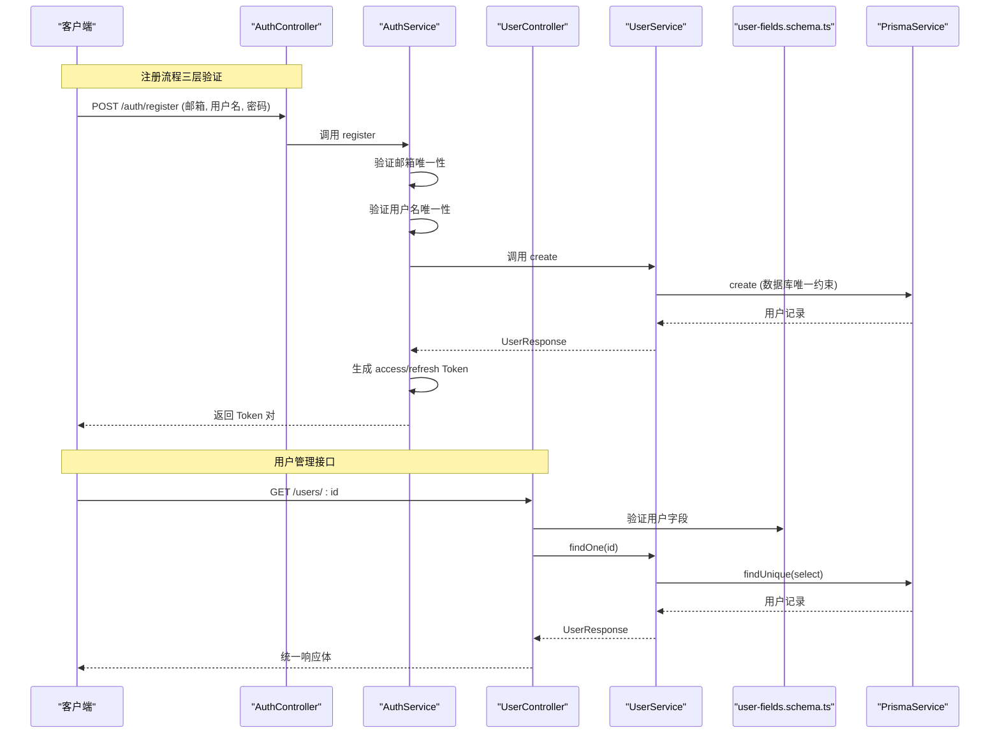
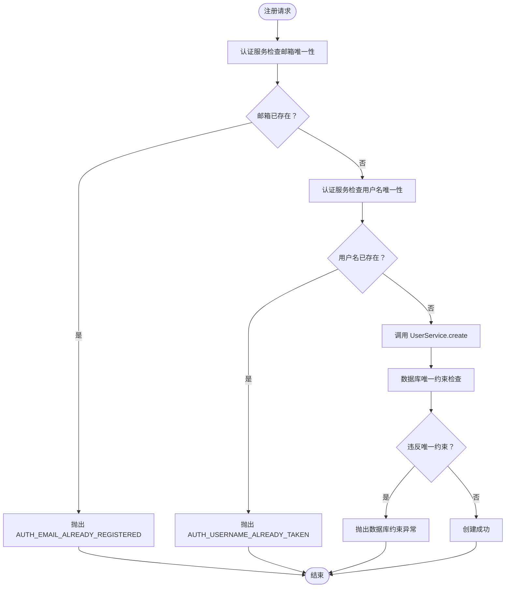
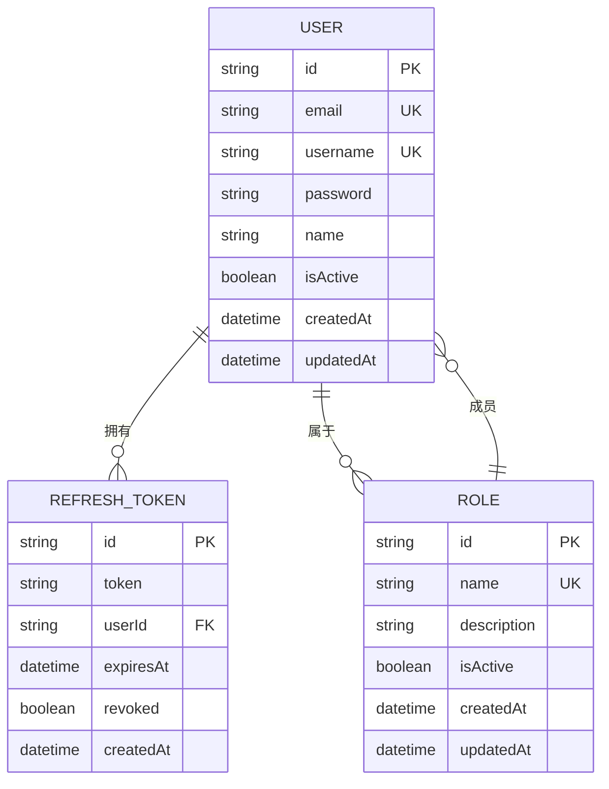
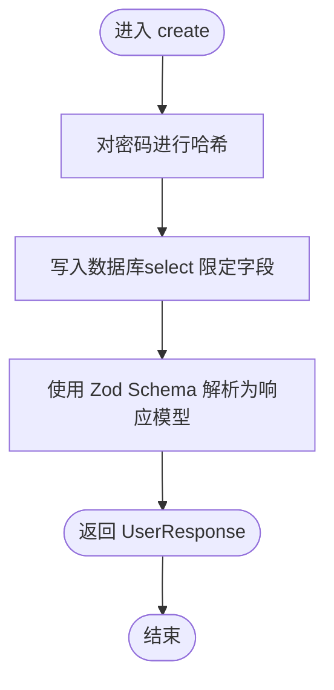
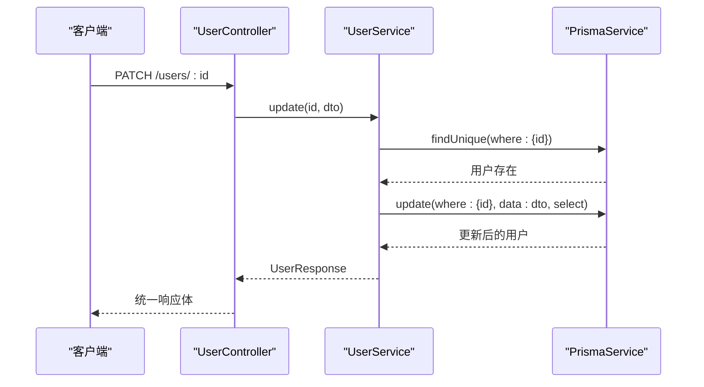
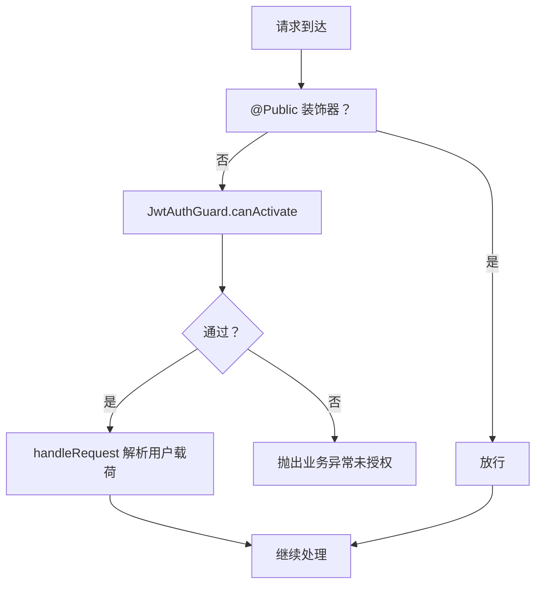
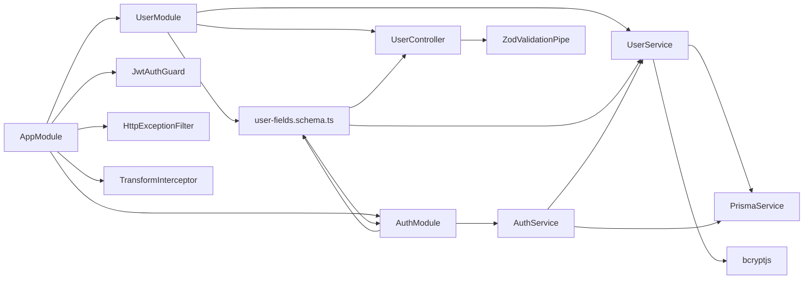

# 用户管理系统

<cite>
**本文引用的文件**
- [src/modules/user/user.service.ts](file://src/modules/user/user.service.ts)
- [src/modules/user/user.controller.ts](file://src/modules/user/user.controller.ts)
- [src/modules/user/dto/user.dto.ts](file://src/modules/user/dto/user.dto.ts)
- [src/modules/auth/auth.service.ts](file://src/modules/auth/auth.service.ts)
- [src/modules/auth/auth.controller.ts](file://src/modules/auth/auth.controller.ts)
- [src/modules/auth/dto/auth.dto.ts](file://src/modules/auth/dto/auth.dto.ts)
- [src/common/schemas/user-fields.schema.ts](file://src/common/schemas/user-fields.schema.ts)
- [src/common/schemas/datetime.schema.ts](file://src/common/schemas/datetime.schema.ts)
- [prisma/schema/User.prisma](file://prisma/schema/User.prisma)
- [prisma/schema/Role.prisma](file://prisma/schema/Role.prisma)
- [src/common/guards/jwt-auth.guard.ts](file://src/common/guards/jwt-auth.guard.ts)
- [src/common/exceptions/business.exception.ts](file://src/common/exceptions/business.exception.ts)
- [src/common/enums/biz-code.enum.ts](file://src/common/enums/biz-code.enum.ts)
- [src/modules/auth/captcha.service.ts](file://src/modules/auth/captcha.service.ts)
- [src/common/decorators/api-success-response.decorator.ts](file://src/common/decorators/api-success-response.decorator.ts)
- [src/common/decorators/public.decorator.ts](file://src/common/decorators/public.decorator.ts)
- [src/modules/user/user.module.ts](file://src/modules/user/user.module.ts)
- [src/app.module.ts](file://src/app.module.ts)
- [package.json](file://package.json)
</cite>

## 更新摘要

**所做更改**

- 重构邮箱唯一性验证流程：将主要验证责任从用户服务转移到认证服务，实现三层保护机制
- 新增共享用户字段schema架构，消除Auth模块和User模块间的重复验证逻辑
- 优化注册流程：认证服务在创建用户前进行邮箱和用户名的双重验证
- 更新数据验证与安全章节，反映新的邮箱唯一性验证机制
- 新增三层保护机制说明，详细说明数据库约束、认证服务验证、用户服务验证的协同工作

## 目录

1. [简介](#简介)
2. [项目结构](#项目结构)
3. [核心组件](#核心组件)
4. [架构总览](#架构总览)
5. [详细组件分析](#详细组件分析)
6. [依赖关系分析](#依赖关系分析)
7. [性能考虑](#性能考虑)
8. [故障排查指南](#故障排查指南)
9. [结论](#结论)
10. [附录](#附录)

## 简介

本文件为用户管理系统的完整技术文档，覆盖用户数据模型、CRUD 实现、业务逻辑、权限控制、数据验证、错误处理与性能优化策略，并提供完整的 API 接口说明与安全存储、隐私保护、访问控制机制说明。系统采用 NestJS + Prisma + JWT 的架构，通过统一的业务异常与响应装饰器，确保接口一致性与可维护性。

**更新** 系统现已重构邮箱唯一性验证流程，将主要验证责任从用户服务转移到认证服务，实现了三层保护机制：数据库唯一约束、认证服务验证、用户服务验证。同时新增共享用户字段schema架构，消除了Auth模块和User模块之间的重复验证逻辑，提升了代码复用性和维护性。

## 项目结构

用户管理模块位于 src/modules/user，核心由控制器、服务、DTO与 Prisma 数据模型组成；认证模块位于 src/modules/auth，负责登录、注册、Token 刷新与注销；全局守卫、过滤器与拦截器在 src/app.module.ts 中集中配置，确保统一的鉴权、限流、日志与响应格式化。

```mermaid
graph TB
subgraph "应用层"
UC["UserController<br/>用户控制器"]
UM["UserModule<br/>用户模块"]
AM["AuthModule<br/>认证模块"]
APP["AppModule<br/>应用入口"]
END
subgraph "共享架构层"
SCHEMA["user-fields.schema.ts<br/>共享用户字段定义"]
DTIME["datetime.schema.ts<br/>日期时间字段定义"]
CAPTCHA["CaptchaService<br/>验证码服务"]
END
subgraph "服务层"
US["UserService<br/>用户服务"]
AS["AuthService<br/>认证服务"]
END
subgraph "数据层"
PRISMA["PrismaService<br/>数据库服务"]
SCHEMA_USER["User 模型"]
SCHEMA_ROLE["Role 模型"]
END
subgraph "安全与基础设施"
GUARD["JwtAuthGuard<br/>JWT 守卫"]
FILTER["HttpExceptionFilter<br/>异常过滤器"]
INTER["TransformInterceptor<br/>响应拦截器"]
PIPE["ZodValidationPipe<br/>参数校验管道"]
END
UC --> US
UM --> US
AM --> AS
AS --> US
US --> PRISMA
AS --> PRISMA
SCHEMA --> UC
SCHEMA --> US
SCHEMA --> AM
DTIME --> UC
DTIME --> US
CAPTCHA --> AM
APP --> GUARD
APP --> FILTER
APP --> INTER
APP --> PIPE
```

**图表来源**

- [src/modules/user/user.controller.ts:1-90](file://src/modules/user/user.controller.ts#L1-90)
- [src/modules/user/user.service.ts:1-119](file://src/modules/user/user.service.ts#L1-119)
- [src/modules/auth/auth.service.ts:1-163](file://src/modules/auth/auth.service.ts#L1-163)
- [src/app.module.ts:18-61](file://src/app.module.ts#L18-L61)
- [src/common/schemas/user-fields.schema.ts:1-23](file://src/common/schemas/user-fields.schema.ts#L1-23)
- [src/modules/auth/captcha.service.ts:1-97](file://src/modules/auth/captcha.service.ts#L1-L97)

**章节来源**

- [src/modules/user/user.module.ts:1-11](file://src/modules/user/user.module.ts#L1-L11)
- [src/app.module.ts:18-61](file://src/app.module.ts#L18-L61)

## 核心组件

- 用户控制器：提供用户创建、查询、更新、删除等 REST 接口，使用 Swagger 装饰器标注接口文档与统一响应结构。
- 用户服务：封装用户 CRUD 逻辑，包含邮箱唯一性检查、密码哈希、按账号查询、密码校验等。
- **三层邮箱唯一性验证机制**：重构后的邮箱验证流程，通过认证服务、用户服务和数据库约束三级保护，确保数据完整性。
- **共享DTO架构**：基于共享的user-fields.schema.ts定义用户核心字段(email、username、password、name)，Auth模块和User模块通过导入该共享定义，消除了重复验证逻辑，提升了代码复用性。
- DTO 与校验：基于 Zod 的 CreateUserSchema、UpdateUserSchema、UserResponseSchema，确保入参与出参的强类型与约束。
- 数据模型：User 与 Role 模型定义用户基本信息、激活状态、关联角色与刷新令牌等字段。
- 安全与异常：统一业务异常 BusinessException，结合业务码 BizCode 映射 HTTP 状态码；JWT 守卫控制访问；全局异常过滤器与响应拦截器保证输出一致性。

**更新** 新增三层邮箱唯一性验证机制，通过认证服务在创建用户前进行邮箱和用户名的双重验证，用户服务仅负责创建操作，数据库约束作为最终防线。

**章节来源**

- [src/modules/user/user.controller.ts:1-90](file://src/modules/user/user.controller.ts#L1-L90)
- [src/modules/user/user.service.ts:1-119](file://src/modules/user/user.service.ts#L1-L119)
- [src/modules/user/dto/user.dto.ts:1-32](file://src/modules/user/dto/user.dto.ts#L1-L32)
- [src/modules/auth/auth.service.ts:50-65](file://src/modules/auth/auth.service.ts#L50-L65)
- [src/common/schemas/user-fields.schema.ts:1-23](file://src/common/schemas/user-fields.schema.ts#L1-L23)
- [prisma/schema/User.prisma:1-15](file://prisma/schema/User.prisma#L1-L15)
- [prisma/schema/Role.prisma:1-13](file://prisma/schema/Role.prisma#L1-L13)
- [src/common/exceptions/business.exception.ts:16-41](file://src/common/exceptions/business.exception.ts#L16-L41)
- [src/common/enums/biz-code.enum.ts:13-78](file://src/common/enums/biz-code.enum.ts#L13-L78)

## 架构总览

系统采用分层架构：控制器负责接口与文档，服务层承载业务逻辑，数据层通过 Prisma 访问数据库。认证服务与用户服务协作完成登录、注册、Token 刷新与注销流程。全局守卫确保接口受 JWT 保护，异常与响应拦截器统一错误与返回格式。

**更新** 新架构中，共享用户字段schema成为认证和用户模块的共同依赖，通过统一的验证规则确保两个模块间的一致性。认证服务承担主要的邮箱唯一性验证责任，实现三层保护机制。



**图表来源**

- [src/modules/auth/auth.controller.ts:68-70](file://src/modules/auth/auth.controller.ts#L68-L70)
- [src/modules/auth/auth.service.ts:50-65](file://src/modules/auth/auth.service.ts#L50-L65)
- [src/modules/user/user.controller.ts:55-63](file://src/modules/user/user.controller.ts#L55-L63)
- [src/modules/user/user.service.ts:40-51](file://src/modules/user/user.service.ts#L40-L51)
- [src/common/schemas/user-fields.schema.ts:8-22](file://src/common/schemas/user-fields.schema.ts#L8-L22)

## 详细组件分析

### 三层邮箱唯一性验证机制

**新增** 系统重构了邮箱唯一性验证流程，实现了三层保护机制：

- **第一层：认证服务验证**：在注册前，认证服务直接查询用户邮箱和用户名，确保在创建用户前就发现重复
- **第二层：用户服务验证**：作为调用方的前置验证，用户服务仅负责创建操作，依赖数据库约束作为最终防线
- **第三层：数据库约束**：Prisma模型定义的唯一约束作为最终防线，防止任何并发冲突



**图表来源**

- [src/modules/auth/auth.service.ts:50-65](file://src/modules/auth/auth.service.ts#L50-L65)
- [src/modules/user/user.service.ts:17-31](file://src/modules/user/user.service.ts#L17-L31)
- [prisma/schema/User.prisma:3-4](file://prisma/schema/User.prisma#L3-L4)

**章节来源**

- [src/modules/auth/auth.service.ts:50-65](file://src/modules/auth/auth.service.ts#L50-L65)
- [src/modules/user/user.service.ts:17-31](file://src/modules/user/user.service.ts#L17-L31)
- [prisma/schema/User.prisma:3-4](file://prisma/schema/User.prisma#L3-L4)

### 共享用户字段架构

**新增** 系统引入了共享用户字段schema(user-fields.schema.ts)，作为Auth模块和User模块的共同依赖，消除了重复的验证逻辑。

- **核心字段定义**：email、username、password、name四个基础字段的验证规则
- **验证规则**：邮箱格式验证、用户名最小长度3字符、密码最小长度6字符、显示名称可选
- **模块集成**：Auth模块通过导入userFields对象使用共享验证规则；User模块同样导入并扩展为完整的用户DTO
- **一致性保证**：两个模块使用相同的验证规则，确保用户数据格式的一致性

```mermaid
graph TB
subgraph "共享架构层"
SCHEMA["user-fields.schema.ts<br/>共享用户字段定义"]
EMAIL["邮箱验证<br/>email() + min(1)"]
USERNAME["用户名验证<br/>string() + min(3)"]
PASSWORD["密码验证<br/>string() + min(6)"]
NAME["显示名称<br/>string().optional()"]
END
subgraph "认证模块"
AUTH_DTO["auth.dto.ts<br/>Auth专用字段(account, tokens)"]
AUTH_SCHEMA["RegisterSchema<br/>组合共享字段"]
LOGIN_SCHEMA["LoginSchema<br/>组合共享字段"]
END
subgraph "用户模块"
USER_DTO["user.dto.ts<br/>用户专用字段(id, isActive)"]
USER_SCHEMA["CreateUserSchema<br/>组合共享字段"]
UPDATE_SCHEMA["UpdateUserSchema<br/>组合共享字段"]
END
SCHEMA --> EMAIL
SCHEMA --> USERNAME
SCHEMA --> PASSWORD
SCHEMA --> NAME
AUTH_DTO --> AUTH_SCHEMA
AUTH_DTO --> LOGIN_SCHEMA
USER_DTO --> USER_SCHEMA
USER_DTO --> UPDATE_SCHEMA
```

**图表来源**

- [src/common/schemas/user-fields.schema.ts:8-22](file://src/common/schemas/user-fields.schema.ts#L8-L22)
- [src/modules/auth/dto/auth.dto.ts:30-42](file://src/modules/auth/dto/auth.dto.ts#L30-L42)
- [src/modules/user/dto/user.dto.ts:6-15](file://src/modules/user/dto/user.dto.ts#L6-L15)

**章节来源**

- [src/common/schemas/user-fields.schema.ts:1-23](file://src/common/schemas/user-fields.schema.ts#L1-L23)
- [src/modules/auth/dto/auth.dto.ts:1-77](file://src/modules/auth/dto/auth.dto.ts#L1-L77)
- [src/modules/user/dto/user.dto.ts:1-32](file://src/modules/user/dto/user.dto.ts#L1-L32)

### 用户数据模型与关系

- User 模型：包含唯一邮箱与用户名、密码、显示名称、激活状态、创建/更新时间，以及与 Role 的多对多关系与 RefreshToken 的一对多关系。
- Role 模型：包含唯一名称、描述、激活状态与创建/更新时间，与 User、Menu 的多对多关系。
- 关系映射：User 与 Role 通过中间表实现多对多；User 与 RefreshToken 通过外键关联。



**图表来源**

- [prisma/schema/User.prisma:1-15](file://prisma/schema/User.prisma#L1-L15)
- [prisma/schema/Role.prisma:1-13](file://prisma/schema/Role.prisma#L1-L13)

**章节来源**

- [prisma/schema/User.prisma:1-15](file://prisma/schema/User.prisma#L1-L15)
- [prisma/schema/Role.prisma:1-13](file://prisma/schema/Role.prisma#L1-L13)

### 用户服务实现细节

- 创建用户：密码使用 bcrypt 哈希后写入，仅返回选择字段，避免泄露敏感信息。邮箱唯一性验证由调用方负责，此处依赖数据库唯一约束作为最终防线。
- 查询用户：支持按 ID、邮箱、用户名、账号（邮箱或用户名）查询；查询列表时使用 select 限制字段。
- 更新与删除：先校验用户存在性，再执行更新/删除；删除时依赖数据库级联删除刷新令牌。
- 密码校验：使用 bcrypt.compare 对明文与哈希密码进行比对。



**图表来源**

- [src/modules/user/user.service.ts:17-31](file://src/modules/user/user.service.ts#L17-L31)

**章节来源**

- [src/modules/user/user.service.ts:1-119](file://src/modules/user/user.service.ts#L1-L119)

### 用户控制器与 API 文档

- 控制器路径：/users，使用 @ApiBearerAuth 与 @ApiTags 标注模块与认证要求。
- 接口能力：
  - POST /users：创建用户（返回 201 与统一响应体）
  - GET /users：获取用户列表（返回数组）
  - GET /users/:id：按 ID 获取用户
  - PATCH /users/:id：更新用户
  - DELETE /users/:id：删除用户（无返回数据）
- 统一响应：通过 ApiSuccessResponse 与 ApiSuccessNoDataResponse 装饰器生成 Swagger 文档与响应结构。



**图表来源**

- [src/modules/user/user.controller.ts:72-77](file://src/modules/user/user.controller.ts#L72-L77)
- [src/modules/user/user.service.ts:79-92](file://src/modules/user/user.service.ts#L79-L92)

**章节来源**

- [src/modules/user/user.controller.ts:1-90](file://src/modules/user/user.controller.ts#L1-L90)
- [src/common/decorators/api-success-response.decorator.ts:88-128](file://src/common/decorators/api-success-response.decorator.ts#L88-L128)

### 认证与权限控制

- JWT 守卫：继承 Passport 的 AuthGuard('jwt')，支持 @Public 跳过鉴权；未通过时抛出业务异常。
- 全局配置：AppModule 将 JwtAuthGuard 作为全局守卫，配合 @ApiBearerAuth 在 Swagger 中标注。
- 业务异常：统一 BusinessException，携带业务码、消息与可选详情，BizCode 提供枚举与 HTTP 状态码映射。



**图表来源**

- [src/common/guards/jwt-auth.guard.ts:23-44](file://src/common/guards/jwt-auth.guard.ts#L23-L44)
- [src/common/decorators/public.decorator.ts:1-5](file://src/common/decorators/public.decorator.ts#L1-L5)
- [src/common/exceptions/business.exception.ts:16-41](file://src/common/exceptions/business.exception.ts#L16-L41)
- [src/common/enums/biz-code.enum.ts:127-170](file://src/common/enums/biz-code.enum.ts#L127-L170)

**章节来源**

- [src/common/guards/jwt-auth.guard.ts:1-46](file://src/common/guards/jwt-auth.guard.ts#L1-L46)
- [src/app.module.ts:33-57](file://src/app.module.ts#L33-L57)

### 数据验证与安全

- **三层邮箱唯一性验证**：重构后的验证流程，通过认证服务、用户服务和数据库约束三级保护，确保数据完整性。
- **共享验证架构**：通过user-fields.schema.ts统一管理用户核心字段的验证规则，Auth模块和User模块共享同一套验证逻辑，消除了重复代码。
- 参数校验：全局 ZodValidationPipe 自动校验 DTO，Create/Update Schema 严格约束邮箱、用户名、密码长度与格式。
- 密码安全：bcrypt 哈希存储，密码比较使用 bcrypt.compare；注册与登录流程均进行密码校验。
- Token 安全：刷新令牌入库前进行 SHA-256 哈希存储，过期与撤销状态统一管理。

**更新** 新架构下，邮箱唯一性验证集中在认证服务中实现，用户服务仅负责创建操作，数据库约束作为最终防线，形成了完整的三层保护机制。

**章节来源**

- [src/modules/auth/auth.service.ts:50-65](file://src/modules/auth/auth.service.ts#L50-L65)
- [src/common/schemas/user-fields.schema.ts:1-23](file://src/common/schemas/user-fields.schema.ts#L1-L23)
- [src/modules/user/dto/user.dto.ts:1-32](file://src/modules/user/dto/user.dto.ts#L1-L32)
- [src/modules/user/user.service.ts:102-107](file://src/modules/user/user.service.ts#L102-L107)
- [src/modules/auth/auth.service.ts:158-160](file://src/modules/auth/auth.service.ts#L158-L160)

### 错误处理与统一响应

- 业务异常：BusinessException 统一封装业务码与 HTTP 状态码映射，BizCode 提供模块化错误码。
- 全局过滤器：HttpExceptionFilter 与响应拦截器 TransformInterceptor 统一输出格式。
- Swagger 文档：ApiSuccessResponse/ApiSuccessNoDataResponse 自动生成接口文档与示例结构。

**章节来源**

- [src/common/exceptions/business.exception.ts:16-41](file://src/common/exceptions/business.exception.ts#L16-L41)
- [src/common/enums/biz-code.enum.ts:127-170](file://src/common/enums/biz-code.enum.ts#L127-L170)
- [src/common/decorators/api-success-response.decorator.ts:138-171](file://src/common/decorators/api-success-response.decorator.ts#L138-L171)
- [src/app.module.ts:54-57](file://src/app.module.ts#L54-L57)

## 依赖关系分析

- 模块依赖：UserModule 向外导出 UserService；AppModule 引入 UserModule、AuthModule 并配置全局守卫、过滤器与拦截器。
- **共享依赖**：Auth模块和User模块都依赖于common/schemas/user-fields.schema.ts，形成双向依赖关系，确保验证逻辑的一致性。
- **三层验证依赖**：认证服务依赖用户服务进行邮箱和用户名查询，用户服务依赖PrismaService进行数据库操作，形成清晰的职责分离。
- 外部依赖：bcryptjs 用于密码哈希；nestjs-zod 提供 Zod 校验；@prisma/client 与 PrismaService 访问数据库。
- 关键耦合点：UserService 与 PrismaService；AuthService 与 UserService、PrismaService；JwtAuthGuard 与 Passport/JWT。

**更新** 新增三层验证机制的依赖关系，认证服务承担主要验证职责，用户服务专注于数据创建，数据库约束作为最终防线。



**图表来源**

- [src/app.module.ts:18-61](file://src/app.module.ts#L18-L61)
- [src/modules/user/user.module.ts:5-10](file://src/modules/user/user.module.ts#L5-L10)
- [src/common/schemas/user-fields.schema.ts:1-23](file://src/common/schemas/user-fields.schema.ts#L1-L23)
- [package.json:26-54](file://package.json#L26-L54)

**章节来源**

- [src/app.module.ts:18-61](file://src/app.module.ts#L18-L61)
- [package.json:26-54](file://package.json#L26-L54)

## 性能考虑

- 查询优化：UserService 使用 select 仅返回必要字段，减少网络传输与序列化开销。
- 并发与限流：全局 ThrottlerGuard 配置短、中、长三档限流策略，防止滥用。
- 缓存：引入 CacheModule，可在高频读取场景（如用户信息）增加缓存以降低数据库压力。
- 日志与监控：LoggingInterceptor 与 LoggerModule 记录请求链路，便于定位性能瓶颈。
- 数据库连接：Prisma 通过连接池管理连接，建议在生产环境合理配置连接数与超时。
- **三层验证优化**：通过共享用户字段schema和三层验证机制，减少了重复的验证逻辑，降低了内存占用和编译时间。
- **并发安全**：三层验证机制有效防止了并发注册导致的数据不一致问题。

**更新** 新架构通过共享验证逻辑和三层验证机制减少了重复代码，提升了编译效率和运行时性能，同时增强了并发安全性。

## 故障排查指南

- 未授权访问：确认请求头携带有效的 Bearer Token，或接口是否被 @Public 装饰器允许。
- 参数校验失败：检查请求体是否符合 CreateUserSchema/UpdateUserSchema 约束（邮箱格式、用户名长度、密码长度）。
- 用户不存在：调用 /users/:id 时需确保 ID 存在；若不存在将触发业务异常。
- **邮箱已注册**：注册时邮箱重复将触发 AUTH_EMAIL_ALREADY_REGISTERED 业务异常。
- **用户名已被占用**：注册时用户名重复将触发 AUTH_USERNAME_ALREADY_TAKEN 业务异常。
- Token 无效：刷新令牌过期或已被撤销将触发认证相关业务异常。
- **三层验证问题**：如果出现验证错误，检查认证服务的邮箱和用户名验证逻辑，确认用户服务的创建操作是否正常执行，验证数据库唯一约束是否生效。

**更新** 新增三层邮箱唯一性验证相关的故障排查指导，包括认证服务验证、用户服务创建和数据库约束三个层面的问题诊断。

**章节来源**

- [src/common/guards/jwt-auth.guard.ts:36-44](file://src/common/guards/jwt-auth.guard.ts#L36-L44)
- [src/common/exceptions/business.exception.ts:16-41](file://src/common/exceptions/business.exception.ts#L16-L41)
- [src/common/enums/biz-code.enum.ts:127-170](file://src/common/enums/biz-code.enum.ts#L127-L170)
- [src/modules/auth/auth.service.ts:50-65](file://src/modules/auth/auth.service.ts#L50-L65)

## 结论

本用户管理系统通过清晰的分层设计、严格的参数校验、统一的业务异常与响应格式，以及完善的 JWT 权限控制，提供了稳定、可扩展的用户管理能力。结合 Prisma 的数据模型与 NestJS 的模块化特性，系统具备良好的可维护性与安全性。

**更新** 通过引入共享用户字段schema架构和三层邮箱唯一性验证机制，系统实现了认证和用户模块间验证逻辑的统一，消除了重复代码，提升了代码复用性和维护性。三层验证机制确保了数据完整性，增强了系统的健壮性。建议在生产环境中进一步引入缓存、数据库索引优化与更细粒度的权限控制。

## 附录

### API 接口文档（用户模块）

- 标签：用户模块
- 认证：Bearer Token（除 @Public 标记的接口）

- 创建用户
  - 方法：POST
  - 路径：/users
  - 认证：是
  - 请求体：CreateUserDto（邮箱、用户名、密码、可选显示名称）
  - 成功响应：201，UserResponse
  - 失败响应：400/409/500（业务异常）

- 获取所有用户
  - 方法：GET
  - 路径：/users
  - 认证：是
  - 成功响应：200，UserResponse 数组
  - 失败响应：500（业务异常）

- 根据 ID 获取用户
  - 方法：GET
  - 路径：/users/:id
  - 认证：是
  - 成功响应：200，UserResponse
  - 失败响应：404/500（业务异常）

- 更新用户
  - 方法：PATCH
  - 路径：/users/:id
  - 认证：是
  - 请求体：UpdateUserDto（可选字段：邮箱、用户名、显示名称）
  - 成功响应：200，UserResponse
  - 失败响应：404/500（业务异常）

- 删除用户
  - 方法：DELETE
  - 路径：/users/:id
  - 认证：是
  - 成功响应：200，无数据
  - 失败响应：404/500（业务异常）

**章节来源**

- [src/modules/user/user.controller.ts:33-88](file://src/modules/user/user.controller.ts#L33-L88)
- [src/common/decorators/api-success-response.decorator.ts:88-128](file://src/common/decorators/api-success-response.decorator.ts#L88-L128)

### API 接口文档（认证模块）

- 标签：认证模块
- 认证：除 @Public 标记的接口

- 获取验证码
  - 方法：GET
  - 路径：/auth/captcha
  - 认证：否
  - 成功响应：200，CaptchaResponse
  - 用途：登录时需要验证码ID

- 用户注册
  - 方法：POST
  - 路径：/auth/register
  - 认证：否
  - 请求体：RegisterDto（邮箱、用户名、密码、可选显示名称）
  - 成功响应：201，TokenResponse
  - 失败响应：400/409/500（业务异常）

- 用户登录
  - 方法：POST
  - 路径：/auth/login
  - 认证：否
  - 请求体：LoginDto（account, password, captchaId, captchaCode）
  - 成功响应：200，TokenResponse
  - 失败响应：400/401/404（业务异常）

- 刷新访问令牌
  - 方法：POST
  - 路径：/auth/refresh
  - 认证：否
  - 请求体：RefreshTokenDto（refreshToken）
  - 成功响应：200，TokenResponse
  - 失败响应：400/401（业务异常)

- 退出登录
  - 方法：POST
  - 路径：/auth/logout
  - 认证：是
  - 成功响应：200，无数据
  - 失败响应：500（业务异常）

- 获取个人资料
  - 方法：GET
  - 路径：/auth/profile
  - 认证：是
  - 成功响应：200，ProfileResponse
  - 失败响应：404/500（业务异常）

**章节来源**

- [src/modules/auth/auth.controller.ts:46-120](file://src/modules/auth/auth.controller.ts#L46-L120)
- [src/common/decorators/api-success-response.decorator.ts:88-128](file://src/common/decorators/api-success-response.decorator.ts#L88-L128)

### 数据模型字段说明（用户）

- id：字符串，主键（UUID）
- email：字符串，唯一，登录标识
- username：字符串，唯一，登录标识
- password：字符串，存储哈希值
- name：字符串，可空
- isActive：布尔，默认 true
- createdAt/updatedAt：日期时间

**章节来源**

- [prisma/schema/User.prisma:1-15](file://prisma/schema/User.prisma#L1-L15)

### 数据模型字段说明（角色）

- id：字符串，主键（UUID）
- name：字符串，唯一
- description：字符串，可空
- isActive：布尔，默认 true
- createdAt/updatedAt：日期时间

**章节来源**

- [prisma/schema/Role.prisma:1-13](file://prisma/schema/Role.prisma#L1-L13)

### 共享用户字段架构说明

**新增** 系统通过user-fields.schema.ts提供共享的用户字段验证定义，包含以下核心字段：

- **email字段**：邮箱格式验证，不能为空
- **username字段**：用户名验证，至少3个字符
- **password字段**：密码验证，至少6个字符
- **name字段**：显示名称，可选参数

**使用方式**：

- Auth模块通过导入userFields对象使用共享验证规则
- User模块同样导入并扩展为完整的用户DTO
- 两个模块使用相同的验证逻辑，确保数据一致性

**章节来源**

- [src/common/schemas/user-fields.schema.ts:1-23](file://src/common/schemas/user-fields.schema.ts#L1-L23)
- [src/modules/auth/dto/auth.dto.ts:30-35](file://src/modules/auth/dto/auth.dto.ts#L30-L35)
- [src/modules/user/dto/user.dto.ts:6-11](file://src/modules/user/dto/user.dto.ts#L6-L11)

### 三层邮箱唯一性验证机制说明

**新增** 系统通过三层保护机制确保邮箱和用户名的唯一性：

- **第一层：认证服务验证**（业务逻辑层）
  - 在注册前直接查询用户邮箱和用户名
  - 发现重复立即抛出相应的业务异常
  - 避免不必要的数据库操作

- **第二层：用户服务验证**（服务层）
  - 作为调用方负责创建操作
  - 依赖数据库唯一约束作为最终防线
  - 专注于用户数据的创建逻辑

- **第三层：数据库约束**（数据层）
  - Prisma模型定义的唯一约束
  - 防止任何并发冲突导致的数据不一致
  - 作为最后的防线确保数据完整性

**优势**：

- 提高了系统的健壮性和数据一致性
- 减少了不必要的数据库查询
- 增强了并发安全性
- 清晰的职责分离，便于维护

**章节来源**

- [src/modules/auth/auth.service.ts:50-65](file://src/modules/auth/auth.service.ts#L50-L65)
- [src/modules/user/user.service.ts:17-31](file://src/modules/user/user.service.ts#L17-L31)
- [prisma/schema/User.prisma:3-4](file://prisma/schema/User.prisma#L3-L4)
