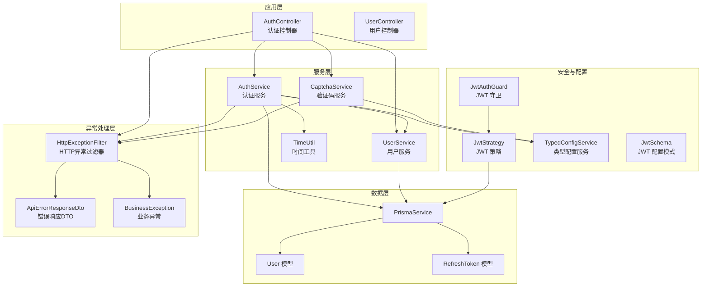
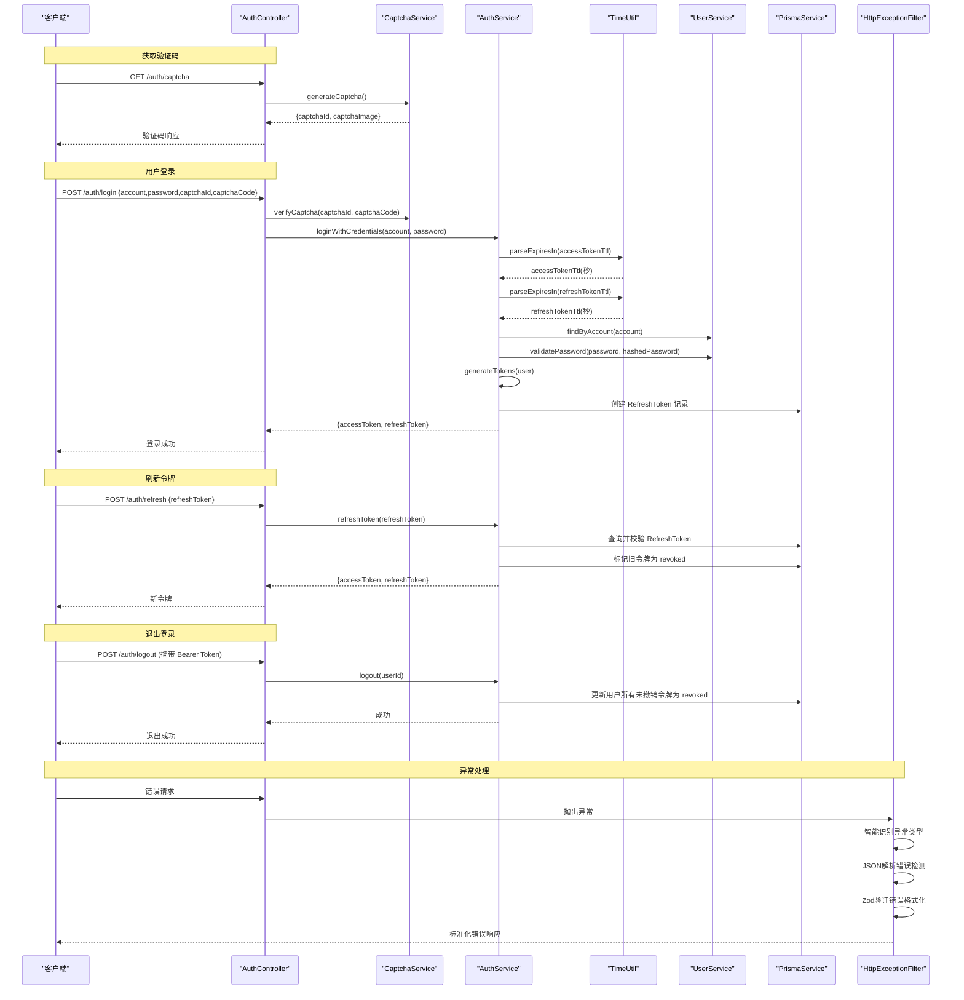
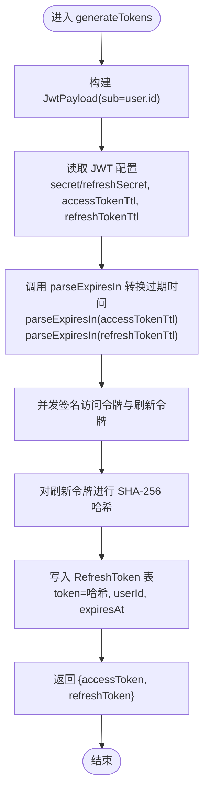
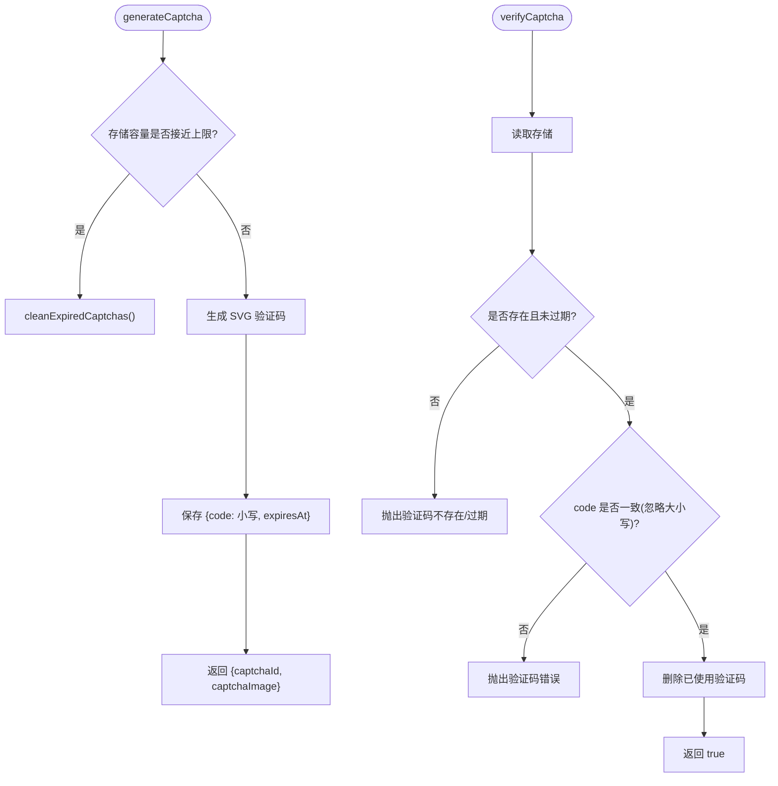
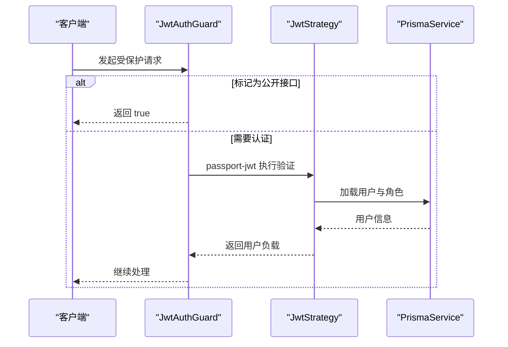
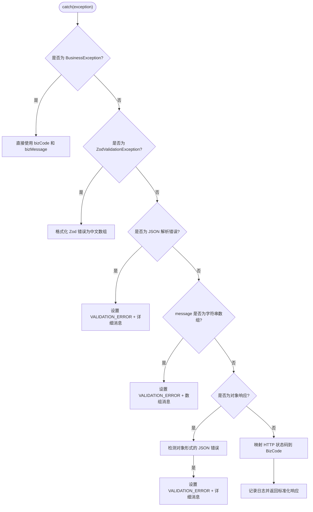
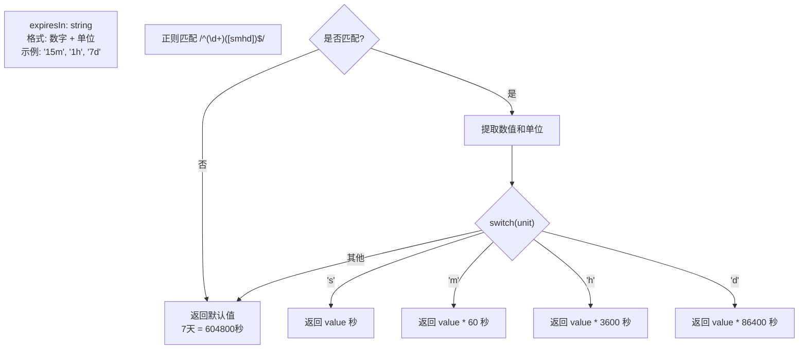
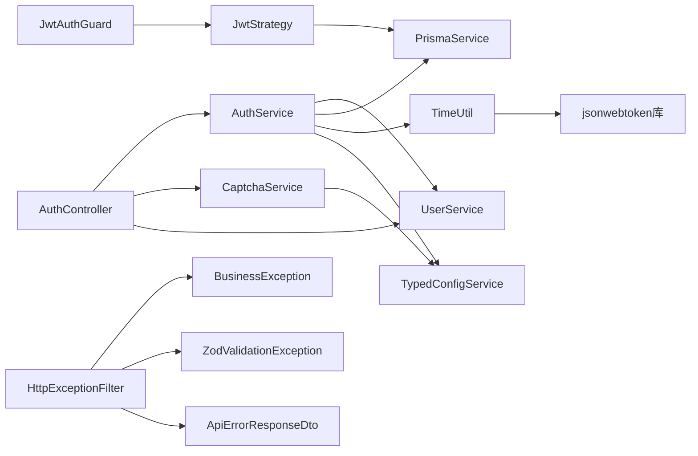
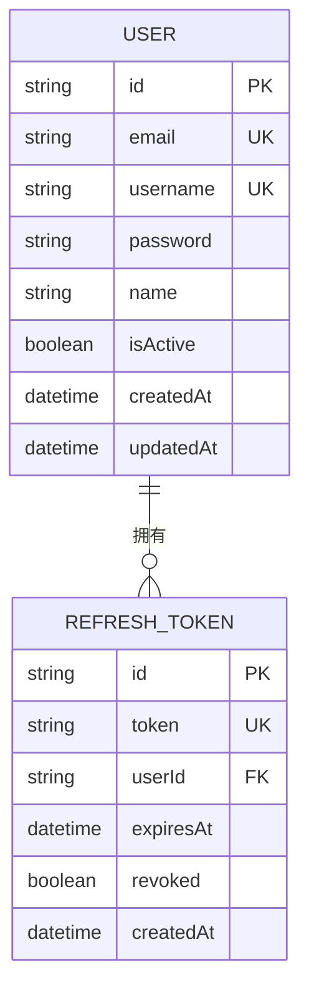

# 认证授权系统

<cite>
**本文引用的文件**
- [src/modules/auth/auth.module.ts](file://src/modules/auth/auth.module.ts)
- [src/modules/auth/auth.controller.ts](file://src/modules/auth/auth.controller.ts)
- [src/modules/auth/auth.service.ts](file://src/modules/auth/auth.service.ts)
- [src/modules/auth/captcha.service.ts](file://src/modules/auth/captcha.service.ts)
- [src/modules/auth/strategies/jwt.strategy.ts](file://src/modules/auth/strategies/jwt.strategy.ts)
- [src/modules/auth/dto/auth.dto.ts](file://src/modules/auth/dto/auth.dto.ts)
- [src/common/guards/jwt-auth.guard.ts](file://src/common/guards/jwt-auth.guard.ts)
- [src/common/guards/jwt-auth.guard.spec.ts](file://src/common/guards/jwt-auth.guard.spec.ts)
- [src/config/schemas/jwt.schema.ts](file://src/config/schemas/jwt.schema.ts)
- [src/common/interfaces/jwt.interface.ts](file://src/common/interfaces/jwt.interface.ts)
- [src/common/interfaces/user.interface.ts](file://src/common/interfaces/user.interface.ts)
- [src/common/enums/biz-code.enum.ts](file://src/common/enums/biz-code.enum.ts)
- [src/modules/user/user.service.ts](file://src/modules/user/user.service.ts)
- [src/config/typed-config.service.ts](file://src/config/typed-config.service.ts)
- [src/common/filters/http-exception.filter.ts](file://src/common/filters/http-exception.filter.ts)
- [src/common/dto/api-error-response.dto.ts](file://src/common/dto/api-error-response.dto.ts)
- [src/common/exceptions/business.exception.ts](file://src/common/exceptions/business.exception.ts)
- [src/common/decorators/api-success-response.decorator.ts](file://src/common/decorators/api-success-response.decorator.ts)
- [prisma/schema/User.prisma](file://prisma/schema/User.prisma)
- [prisma/schema/RefreshToken.prisma](file://prisma/schema/RefreshToken.prisma)
- [src/common/utils/time.util.ts](file://src/common/utils/time.util.ts)
- [src/common/utils/time.util.spec.ts](file://src/common/utils/time.util.spec.ts)
- [scripts/debug-token.ts](file://scripts/debug-token.ts)
</cite>

## 更新摘要
**所做更改**
- 新增 parseExpiresIn 工具函数解决 jsonwebtoken 库的类型兼容性问题
- 修正 jwt-auth.guard.ts 中的 canActivate 方法返回值问题，确保正确的认证流程
- 改进访问令牌和刷新令牌的过期时间计算逻辑，从毫秒计算改为秒计算
- 增强 HTTP 异常过滤器的 JSON 解析错误检测功能
- 改进 Zod 验证错误格式化，提升错误处理的智能化程度
- 新增智能 JSON 解析错误识别机制
- 优化 Zod 验证错误的中文格式化输出

## 目录
1. [简介](#简介)
2. [项目结构](#项目结构)
3. [核心组件](#核心组件)
4. [架构总览](#架构总览)
5. [详细组件分析](#详细组件分析)
6. [依赖关系分析](#依赖关系分析)
7. [性能考量](#性能考量)
8. [故障排查指南](#故障排查指南)
9. [结论](#结论)
10. [附录](#附录)

## 简介
本文件为认证授权系统的全面技术文档，围绕基于 JWT 的认证机制、用户登录注册流程与令牌管理策略展开，覆盖以下主题：
- 认证流程设计与安全考虑
- 图形验证码服务与防暴力破解策略
- 密码加密处理与安全存储
- 会话管理与令牌生命周期
- 安全防护措施与最佳实践
- 完整 API 接口文档与错误处理
- 认证中间件实现与自定义认证策略扩展

**更新** 新增了 parseExpiresIn 工具函数以解决 jsonwebtoken 库的类型兼容性问题，修正了 jwt-auth.guard.ts 中的 canActivate 方法返回值问题，改进了访问令牌和刷新令牌的过期时间计算逻辑，从毫秒计算改为秒计算。同时增强了 HTTP 异常过滤器的 JSON 解析错误检测功能，改进了 Zod 验证错误格式化，提升了错误处理的智能化程度。

## 项目结构
认证授权系统采用模块化设计，核心位于 auth 模块，配合用户模块、配置模块与 Prisma 数据层协同工作。主要目录与职责如下：
- 模块层
  - 认证模块：负责登录、注册、刷新、退出、验证码等认证相关功能
  - 用户模块：负责用户信息的查询与密码校验
- 配置层
  - TypedConfigService 提供类型安全的配置读取
  - JWT 配置模式校验与默认值
- 数据层
  - Prisma 定义用户与刷新令牌模型，支持令牌哈希存储与过期控制
- 中间件与守卫
  - JWT 守卫统一拦截受保护路由，处理未授权场景
  - 自定义策略通过 Passport 策略注入
- 异常处理层
  - HTTP 异常过滤器：智能处理各种异常类型，包括 JSON 解析错误和 Zod 验证错误
- 工具层
  - 时间工具：提供 parseExpiresIn 函数，解决 jsonwebtoken 库的类型兼容性问题



**图表来源**
- [src/modules/auth/auth.controller.ts:35-128](file://src/modules/auth/auth.controller.ts#L35-L128)
- [src/modules/auth/auth.service.ts:14-161](file://src/modules/auth/auth.service.ts#L14-L161)
- [src/modules/auth/captcha.service.ts:20-97](file://src/modules/auth/captcha.service.ts#L20-L97)
- [src/common/guards/jwt-auth.guard.ts:17-45](file://src/common/guards/jwt-auth.guard.ts#L17-L45)
- [src/modules/auth/strategies/jwt.strategy.ts:9-48](file://src/modules/auth/strategies/jwt.strategy.ts#L9-L48)
- [src/config/typed-config.service.ts:6-47](file://src/config/typed-config.service.ts#L6-L47)
- [src/config/schemas/jwt.schema.ts:3-10](file://src/config/schemas/jwt.schema.ts#L3-L10)
- [prisma/schema/User.prisma:1-15](file://prisma/schema/User.prisma#L1-L15)
- [prisma/schema/RefreshToken.prisma:1-12](file://prisma/schema/RefreshToken.prisma#L1-L12)
- [src/common/filters/http-exception.filter.ts:24-217](file://src/common/filters/http-exception.filter.ts#L24-L217)
- [src/common/utils/time.util.ts:12-31](file://src/common/utils/time.util.ts#L12-L31)

**章节来源**
- [src/modules/auth/auth.module.ts:11-33](file://src/modules/auth/auth.module.ts#L11-L33)
- [src/modules/auth/auth.controller.ts:35-128](file://src/modules/auth/auth.controller.ts#L35-L128)

## 核心组件
- 认证控制器：提供验证码获取、用户注册、用户登录、令牌刷新、退出登录与获取当前用户信息等接口
- 认证服务：实现登录凭据校验、注册、令牌签发与刷新、退出登录撤销等逻辑
- 验证码服务：生成 SVG 验证码、存储与清理过期验证码、校验用户输入
- 用户服务：用户密码哈希、凭据查询、密码校验
- JWT 守卫与策略：统一拦截受保护路由，从请求头提取 JWT 并进行验证
- 配置服务：类型安全读取 JWT 秘钥与 TTL、命名空间访问
- 数据模型：用户与刷新令牌模型，支持令牌哈希存储与过期控制
- **HTTP 异常过滤器**：智能处理各类异常，包括 JSON 解析错误检测和 Zod 验证错误格式化
- **时间工具**：提供 parseExpiresIn 函数，解决 jsonwebtoken 库的类型兼容性问题，将配置字符串转换为秒数

**更新** 新增了 parseExpiresIn 工具函数以解决 jsonwebtoken 库的类型兼容性问题，修正了访问令牌和刷新令牌的过期时间计算逻辑

**章节来源**
- [src/modules/auth/auth.controller.ts:35-128](file://src/modules/auth/auth.controller.ts#L35-L128)
- [src/modules/auth/auth.service.ts:14-161](file://src/modules/auth/auth.service.ts#L14-L161)
- [src/modules/auth/captcha.service.ts:20-97](file://src/modules/auth/captcha.service.ts#L20-L97)
- [src/modules/user/user.service.ts:14-124](file://src/modules/user/user.service.ts#L14-L124)
- [src/common/guards/jwt-auth.guard.ts:17-45](file://src/common/guards/jwt-auth.guard.ts#L17-L45)
- [src/modules/auth/strategies/jwt.strategy.ts:9-48](file://src/modules/auth/strategies/jwt.strategy.ts#L9-L48)
- [src/config/typed-config.service.ts:6-47](file://src/config/typed-config.service.ts#L6-L47)
- [prisma/schema/User.prisma:1-15](file://prisma/schema/User.prisma#L1-L15)
- [prisma/schema/RefreshToken.prisma:1-12](file://prisma/schema/RefreshToken.prisma#L1-L12)
- [src/common/filters/http-exception.filter.ts:24-217](file://src/common/filters/http-exception.filter.ts#L24-L217)
- [src/common/utils/time.util.ts:12-31](file://src/common/utils/time.util.ts#L12-L31)

## 架构总览
系统采用"控制器-服务-策略-守卫-配置-数据层"的分层架构，认证流程通过 JWT 实现无状态会话，结合刷新令牌与数据库持久化保障安全性。新增的异常处理层提供了智能化的错误处理机制，时间工具层解决了 jsonwebtoken 库的类型兼容性问题。



**图表来源**
- [src/modules/auth/auth.controller.ts:44-114](file://src/modules/auth/auth.controller.ts#L44-L114)
- [src/modules/auth/auth.service.ts:29-110](file://src/modules/auth/auth.service.ts#L29-L110)
- [src/modules/auth/captcha.service.ts:41-87](file://src/modules/auth/captcha.service.ts#L41-L87)
- [src/modules/user/user.service.ts:76-113](file://src/modules/user/user.service.ts#L76-L113)
- [src/common/utils/time.util.ts:12-31](file://src/common/utils/time.util.ts#L12-L31)
- [prisma/schema/RefreshToken.prisma:1-12](file://prisma/schema/RefreshToken.prisma#L1-L12)
- [src/common/filters/http-exception.filter.ts:28-155](file://src/common/filters/http-exception.filter.ts#L28-L155)

## 详细组件分析

### 认证控制器（AuthController）
- 功能职责
  - 获取验证码：返回验证码 ID 与 SVG 图片，限制调用频率
  - 用户注册：校验唯一性后创建用户并返回访问与刷新令牌
  - 用户登录：校验验证码后使用账号与密码登录，返回令牌对
  - 刷新令牌：使用刷新令牌换取新的访问与刷新令牌，旧刷新令牌作废
  - 退出登录：撤销当前用户的所有未作废刷新令牌
  - 获取当前用户信息：返回用户基本信息（不含敏感字段）
- 安全要点
  - 公开接口使用 @Public 装饰器，受保护接口默认由 JWT 守卫拦截
  - 登录接口强制要求验证码校验
  - 严格限制公开接口的调用频率，防止暴力破解

**章节来源**
- [src/modules/auth/auth.controller.ts:35-128](file://src/modules/auth/auth.controller.ts#L35-L128)

### 认证服务（AuthService）
- 功能职责
  - 登录凭据校验：根据账号查找用户并校验密码
  - 注册流程：检查邮箱与用户名唯一性后创建用户
  - 令牌生成：异步生成访问令牌与刷新令牌，并持久化刷新令牌
  - 刷新令牌：校验刷新令牌有效性、标记旧令牌作废并发放新令牌
  - 退出登录：批量撤销用户未作废的刷新令牌
- 安全要点
  - 刷新令牌入库前进行 SHA-256 哈希存储，仅保留摘要
  - 刷新令牌过期时间与访问令牌 TTL 分离配置
  - 登录与注册均返回不含密码的用户信息
  - **过期时间处理**：使用 parseExpiresIn 函数将配置字符串转换为秒数，解决 jsonwebtoken 库的类型兼容性问题



**图表来源**
- [src/modules/auth/auth.service.ts:117-153](file://src/modules/auth/auth.service.ts#L117-L153)
- [src/common/utils/time.util.ts:12-31](file://src/common/utils/time.util.ts#L12-L31)

**章节来源**
- [src/modules/auth/auth.service.ts:14-161](file://src/modules/auth/auth.service.ts#L14-L161)

### 验证码服务（CaptchaService）
- 功能职责
  - 生成验证码：返回 UUID 作为验证码 ID 与 SVG 图片
  - 校验验证码：区分大小写忽略，超时即删除，错误码抛出业务异常
  - 清理过期：定时清理过期验证码，避免内存膨胀
- 安全要点
  - 默认有效期 5 分钟，超时即失效
  - 生产多实例部署建议替换为共享缓存（如 Redis），避免跨实例校验失败



**图表来源**
- [src/modules/auth/captcha.service.ts:41-87](file://src/modules/auth/captcha.service.ts#L41-L87)

**章节来源**
- [src/modules/auth/captcha.service.ts:20-97](file://src/modules/auth/captcha.service.ts#L20-L97)

### 用户服务（UserService）
- 功能职责
  - 用户创建：检查邮箱唯一性，使用 bcrypt 哈希密码后创建用户
  - 用户查询：按 ID、邮箱、用户名查询用户
  - 密码校验：使用 bcrypt 比较明文与哈希
  - 凭据查询：支持邮箱或用户名任一匹配
- 安全要点
  - 密码存储使用 bcrypt，具备盐值与成本因子
  - 返回用户信息时排除敏感字段（如密码）

**章节来源**
- [src/modules/user/user.service.ts:14-124](file://src/modules/user/user.service.ts#L14-L124)

### JWT 守卫与策略（JwtAuthGuard/JwtStrategy）
- 功能职责
  - 守卫：拦截受保护路由，识别 @Public 标注的公开接口；其余请求交由 Passport 处理
  - 策略：从 Authorization 头部提取 Bearer 令牌，验证签名与过期；加载用户角色信息
- 安全要点
  - 忽略过期选项关闭，确保过期令牌被拒绝
  - 用户不存在时返回空角色列表，避免越权

**更新** 修正了 canActivate 方法的返回值逻辑，确保正确的认证流程



**图表来源**
- [src/common/guards/jwt-auth.guard.ts:17-45](file://src/common/guards/jwt-auth.guard.ts#L17-L45)
- [src/modules/auth/strategies/jwt.strategy.ts:9-48](file://src/modules/auth/strategies/jwt.strategy.ts#L9-L48)

**章节来源**
- [src/common/guards/jwt-auth.guard.ts:17-45](file://src/common/guards/jwt-auth.guard.ts#L17-L45)
- [src/modules/auth/strategies/jwt.strategy.ts:9-48](file://src/modules/auth/strategies/jwt.strategy.ts#L9-L48)

### HTTP异常过滤器（HttpExceptionFilter）
**更新** 增强了 JSON 解析错误检测功能，改进了 Zod 验证错误格式化

- 功能职责
  - 智能异常处理：自动识别并处理各种异常类型
  - JSON 解析错误检测：识别 Express body parser 抛出的 SyntaxError
  - Zod 验证错误格式化：将 Zod 验证错误转换为中文可读格式
  - 业务异常处理：直接使用 BusinessException 携带的信息
  - 标准化错误响应：统一返回 ApiErrorResponseDto 格式
- 安全要点
  - 日志记录：记录异常详情和请求信息
  - 错误分类：将 HTTP 状态码映射到 BizCode 枚举
  - 详细错误信息：为验证错误提供详细的字段级错误信息



**图表来源**
- [src/common/filters/http-exception.filter.ts:28-155](file://src/common/filters/http-exception.filter.ts#L28-L155)

**章节来源**
- [src/common/filters/http-exception.filter.ts:24-217](file://src/common/filters/http-exception.filter.ts#L24-L217)

### 时间工具（TimeUtil）
**新增** 新增 parseExpiresIn 函数以解决 jsonwebtoken 库的类型兼容性问题

- 功能职责
  - 解析过期时间配置：将字符串格式的时间配置转换为秒数
  - 支持多种时间单位：秒(s)、分钟(m)、小时(h)、天(d)
  - 默认值处理：无效格式时返回 7 天（604800 秒）的默认值
  - 类型兼容性：确保返回数值类型，解决 jsonwebtoken 库的类型要求
- 安全要点
  - 输入验证：使用正则表达式验证时间格式
  - 默认安全：无效输入时使用较长的默认过期时间
  - 单位转换：正确处理不同时间单位的换算

**更新** 新增了 parseExpiresIn 函数，确保过期时间以秒为单位传递给 jsonwebtoken 库



**图表来源**
- [src/common/utils/time.util.ts:12-31](file://src/common/utils/time.util.ts#L12-L31)

**章节来源**
- [src/common/utils/time.util.ts:12-31](file://src/common/utils/time.util.ts#L12-L31)
- [src/common/utils/time.util.spec.ts:15-44](file://src/common/utils/time.util.spec.ts#L15-L44)

### 配置与数据模型
- 配置
  - TypedConfigService：提供点语法读取与命名空间访问，保证配置类型安全
  - JWT 配置模式：校验密钥长度与默认 TTL，分离访问与刷新密钥
- 数据模型
  - User：邮箱与用户名唯一，关联 RefreshToken 与角色
  - RefreshToken：token 字段存储哈希，支持过期与作废标记

**章节来源**
- [src/config/typed-config.service.ts:6-47](file://src/config/typed-config.service.ts#L6-L47)
- [src/config/schemas/jwt.schema.ts:3-10](file://src/config/schemas/jwt.schema.ts#L3-L10)
- [prisma/schema/User.prisma:1-15](file://prisma/schema/User.prisma#L1-L15)
- [prisma/schema/RefreshToken.prisma:1-12](file://prisma/schema/RefreshToken.prisma#L1-L12)

## 依赖关系分析
- 控制器依赖服务与验证码服务
- 认证服务依赖用户服务、Prisma、配置服务与时间工具
- 守卫依赖策略与反射器
- 策略依赖配置服务与 Prisma
- 验证码服务独立于业务逻辑，但需注意多实例部署的共享存储问题
- **异常过滤器**：统一处理所有 HTTP 异常，为整个系统提供一致的错误响应格式
- **时间工具**：为认证服务提供过期时间解析功能，解决 jsonwebtoken 库的类型兼容性问题

**更新** 新增了 parseExpiresIn 函数的依赖关系，确保过期时间计算的准确性



**图表来源**
- [src/modules/auth/auth.controller.ts:35-128](file://src/modules/auth/auth.controller.ts#L35-L128)
- [src/modules/auth/auth.service.ts:14-21](file://src/modules/auth/auth.service.ts#L14-L21)
- [src/common/guards/jwt-auth.guard.ts:17-21](file://src/common/guards/jwt-auth.guard.ts#L17-L21)
- [src/modules/auth/strategies/jwt.strategy.ts:9-14](file://src/modules/auth/strategies/jwt.strategy.ts#L9-L14)
- [src/modules/auth/captcha.service.ts:20-25](file://src/modules/auth/captcha.service.ts#L20-L25)
- [src/common/filters/http-exception.filter.ts:12-12](file://src/common/filters/http-exception.filter.ts#L12-L12)
- [src/common/utils/time.util.ts:12-31](file://src/common/utils/time.util.ts#L12-L31)

**章节来源**
- [src/modules/auth/auth.module.ts:11-33](file://src/modules/auth/auth.module.ts#L11-L33)

## 性能考量
- 并发签发：访问令牌与刷新令牌并发签名，减少响应延迟
- 异步处理：验证码生成与清理采用异步与定时任务，避免阻塞主流程
- 存储优化：刷新令牌仅存储哈希，降低存储与检索成本
- 缓存建议：验证码在多实例部署时建议使用共享缓存（如 Redis）以提升可用性与一致性
- **异常处理优化**：智能异常检测减少了重复的错误处理逻辑，提升了整体性能
- **时间解析优化**：parseExpiresIn 函数使用高效的正则表达式匹配，避免复杂的字符串解析开销

**更新** 新增了时间解析优化的性能考量

## 故障排查指南
- 未授权/权限不足
  - 现象：收到未授权错误
  - 排查：确认请求头是否包含有效的 Bearer 令牌；检查守卫是否正确应用
- 凭证无效
  - 现象：登录时报错提示凭证无效
  - 排查：确认账号是否存在、密码是否正确；检查验证码是否过期或错误
- 刷新令牌无效或已过期
  - 现象：刷新接口报错
  - 排查：确认刷新令牌是否已被撤销或过期；检查数据库中对应记录状态
- 验证码相关错误
  - 现象：验证码不存在/过期/错误
  - 排查：确认验证码 ID 是否正确；检查生成与清理逻辑；多实例部署需使用共享存储
- **JSON 解析错误**
  - 现象：请求体 JSON 格式无效错误
  - 排查：检查请求体语法是否正确；确认 Content-Type 设置；查看详细错误信息中的位置提示
- **Zod 验证错误**
  - 现象：字段验证失败，返回详细错误信息
  - 排查：根据 details 数组中的具体字段错误进行修正；检查字段类型和格式要求
- **过期时间解析错误**
  - 现象：令牌过期时间异常或不符合预期
  - 排查：检查 JWT 配置中的 accessTokenTtl 和 refreshTokenTtl 格式；确认 parseExpiresIn 函数正确解析时间单位；验证默认值是否符合预期
- **JWT 守卫返回值问题**
  - 现象：公开接口无法正常访问或受保护接口被错误放行
  - 排查：确认 jwt-auth.guard.ts 中的 canActivate 方法返回值逻辑；检查 @Public 装饰器的应用；验证守卫的条件判断

**更新** 新增了 JWT 守卫返回值问题和过期时间解析错误的专门排查指南

**章节来源**
- [src/common/enums/biz-code.enum.ts:31-45](file://src/common/enums/biz-code.enum.ts#L31-L45)
- [src/modules/auth/auth.controller.ts:70-86](file://src/modules/auth/auth.controller.ts#L70-L86)
- [src/modules/auth/auth.service.ts:72-96](file://src/modules/auth/auth.service.ts#L72-L96)
- [src/modules/auth/captcha.service.ts:69-87](file://src/modules/auth/captcha.service.ts#L69-L87)
- [src/common/filters/http-exception.filter.ts:160-165](file://src/common/filters/http-exception.filter.ts#L160-L165)
- [src/common/filters/http-exception.filter.ts:167-196](file://src/common/filters/http-exception.filter.ts#L167-L196)
- [src/common/utils/time.util.ts:12-31](file://src/common/utils/time.util.ts#L12-L31)
- [src/common/guards/jwt-auth.guard.ts:23-34](file://src/common/guards/jwt-auth.guard.ts#L23-L34)

## 结论
本认证授权系统通过 JWT 实现无状态会话，结合刷新令牌与数据库持久化，提供安全可靠的登录注册与令牌管理能力。验证码机制有效降低暴力破解风险；bcrypt 密码哈希与 SHA-256 令牌哈希进一步增强安全性。通过守卫与策略统一拦截与验证，配合类型安全配置与 Prisma 数据模型，形成高内聚低耦合的认证体系。

**更新** 新增的智能异常处理机制显著提升了系统的错误处理能力和用户体验，通过 JSON 解析错误检测和 Zod 验证错误格式化，为开发者和用户提供更加友好和准确的错误反馈。parseExpiresIn 工具函数的引入解决了 jsonwebtoken 库的类型兼容性问题，确保过期时间计算的准确性，从毫秒计算改为秒计算，提高了系统的稳定性和可靠性。JWT 守卫的返回值逻辑修正确保了认证流程的正确性，公开接口与受保护接口的区分更加明确。

## 附录

### API 接口文档

- 获取验证码
  - 方法：GET
  - 路径：/auth/captcha
  - 认证：无需
  - 限流：短时间窗口内限制调用次数
  - 响应：包含验证码 ID 与 SVG 图片
  - 错误：验证码相关业务码

- 用户注册
  - 方法：POST
  - 路径：/auth/register
  - 认证：无需
  - 请求体：邮箱、用户名、密码
  - 响应：访问令牌与刷新令牌
  - 错误：邮箱/用户名已存在等业务码

- 用户登录
  - 方法：POST
  - 路径：/auth/login
  - 认证：无需
  - 请求体：账号（邮箱或用户名）、密码、验证码 ID、验证码内容
  - 响应：访问令牌与刷新令牌
  - 错误：凭证无效、验证码不存在/过期/错误等业务码

- 刷新访问令牌
  - 方法：POST
  - 路径：/auth/refresh
  - 认证：无需
  - 请求体：刷新令牌
  - 响应：新的访问令牌与刷新令牌
  - 错误：刷新令牌无效或已过期

- 退出登录
  - 方法：POST
  - 路径：/auth/logout
  - 认证：需要 Bearer 令牌
  - 响应：无数据
  - 行为：撤销当前用户的所有未作废刷新令牌

- 获取当前用户信息
  - 方法：GET
  - 路径：/auth/profile
  - 认证：需要 Bearer 令牌
  - 响应：用户基本信息（不含密码）
  - 错误：未授权

**章节来源**
- [src/modules/auth/auth.controller.ts:44-127](file://src/modules/auth/auth.controller.ts#L44-L127)
- [src/modules/auth/dto/auth.dto.ts:44-89](file://src/modules/auth/dto/auth.dto.ts#L44-L89)

### 数据模型图



**图表来源**
- [prisma/schema/User.prisma:1-15](file://prisma/schema/User.prisma#L1-L15)
- [prisma/schema/RefreshToken.prisma:1-12](file://prisma/schema/RefreshToken.prisma#L1-L12)

### 安全最佳实践
- 密钥管理
  - 访问令牌与刷新令牌使用独立密钥，密钥长度满足最小要求
  - 配置项通过类型化配置服务读取，避免硬编码
- 令牌策略
  - 访问令牌 TTL 短，刷新令牌 TTL 较长；刷新时立即作废旧令牌
  - 刷新令牌仅存储哈希，数据库中不保留明文
  - **过期时间处理**：使用 parseExpiresIn 函数确保过期时间以秒为单位传递给 jsonwebtoken 库
- 输入校验
  - 使用 Zod 对请求参数进行强类型校验，确保字段完整性与格式正确
- 防护措施
  - 登录接口强制验证码校验与限流
  - 守卫统一拦截未授权请求，返回标准化业务码
- 可扩展性
  - 自定义认证策略可通过 PassportStrategy 扩展
  - 守卫支持 @Public 装饰器标注公开接口
- **异常处理**
  - 统一使用 HttpExceptionFilter 处理所有 HTTP 异常
  - 智能 JSON 解析错误检测，提供准确的错误定位
  - Zod 验证错误中文格式化，提升开发体验
- **时间配置**
  - JWT 过期时间配置支持多种单位：秒(s)、分钟(m)、小时(h)、天(d)
  - 默认过期时间为 7 天，无效配置时自动回退到默认值
  - 确保所有时间配置最终转换为秒数传递给底层库
- **JWT 守卫**
  - 正确处理公开接口与受保护接口的区分
  - 确保 canActivate 方法返回正确的布尔值
  - 避免错误的认证流程控制

**更新** 新增了时间配置、过期时间处理和 JWT 守卫的最佳实践指导

**章节来源**
- [src/config/schemas/jwt.schema.ts:3-10](file://src/config/schemas/jwt.schema.ts#L3-L10)
- [src/modules/auth/auth.service.ts:117-153](file://src/modules/auth/auth.service.ts#L117-L153)
- [src/modules/auth/captcha.service.ts:13-19](file://src/modules/auth/captcha.service.ts#L13-L19)
- [src/common/guards/jwt-auth.guard.ts:17-45](file://src/common/guards/jwt-auth.guard.ts#L17-L45)
- [src/modules/auth/strategies/jwt.strategy.ts:9-48](file://src/modules/auth/strategies/jwt.strategy.ts#L9-L48)
- [src/common/filters/http-exception.filter.ts:160-196](file://src/common/filters/http-exception.filter.ts#L160-L196)
- [src/common/utils/time.util.ts:12-31](file://src/common/utils/time.util.ts#L12-L31)

### 错误响应格式

系统统一使用 ApiErrorResponseDto 格式返回错误信息：

```typescript
interface ApiErrorResponseDto {
  code: BizCode;           // 业务码
  message: string;         // 错误消息
  details?: string[];      // 详细错误信息（可选）
}
```

**错误码映射示例**：
- VALIDATION_ERROR (400)：请求参数校验失败
- UNAUTHORIZED (401)：未授权访问
- FORBIDDEN (403)：权限不足
- NOT_FOUND (404)：资源不存在
- INTERNAL_ERROR (500)：服务器内部错误

**JSON 解析错误处理**：
- 自动检测 Express body parser 的 SyntaxError
- 提供"请求体 JSON 格式无效，请检查语法"的中文提示
- 包含详细的错误位置信息

**Zod 验证错误格式化**：
- 将字段缺失错误转换为"字段名 为必填项"
- 其他验证错误使用 schema 中定义的自定义消息
- 支持嵌套字段路径显示

**章节来源**
- [src/common/dto/api-error-response.dto.ts](file://src/common/dto/api-error-response.dto.ts)
- [src/common/enums/biz-code.enum.ts:31-45](file://src/common/enums/biz-code.enum.ts#L31-L45)
- [src/common/filters/http-exception.filter.ts:90-155](file://src/common/filters/http-exception.filter.ts#L90-L155)
- [src/common/filters/http-exception.filter.ts:167-196](file://src/common/filters/http-exception.filter.ts#L167-L196)
- [src/common/decorators/api-success-response.decorator.ts:144-156](file://src/common/decorators/api-success-response.decorator.ts#L144-L156)