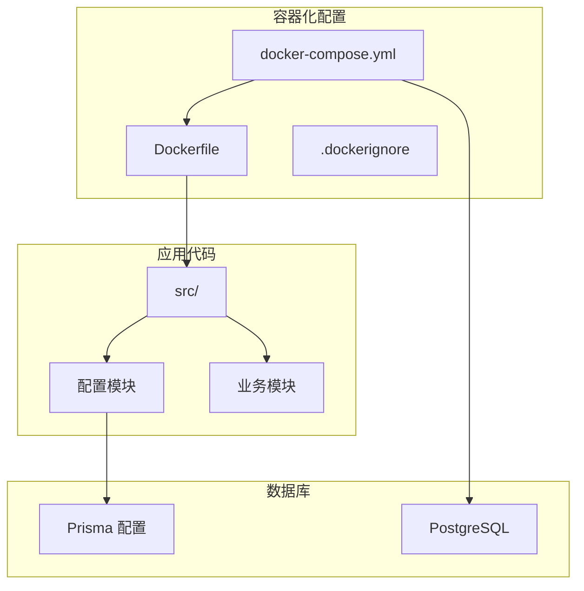
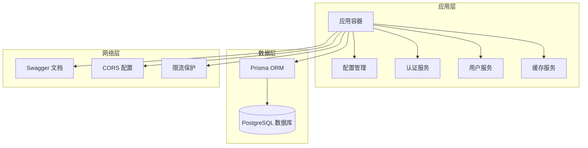
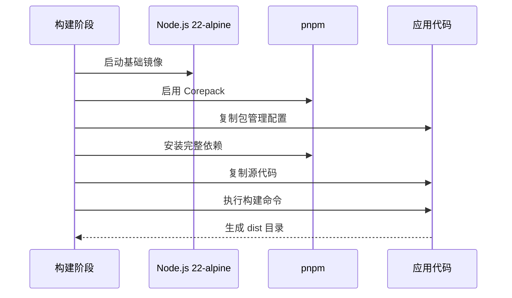
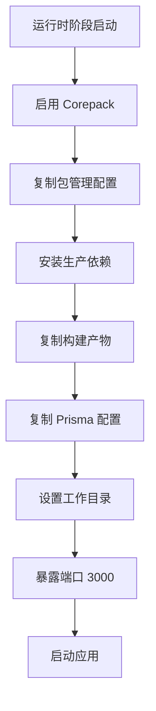
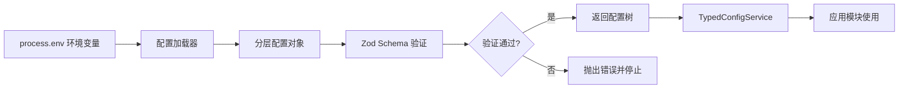
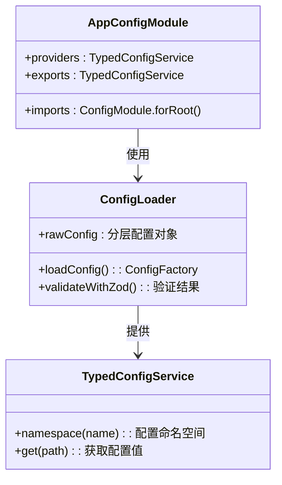
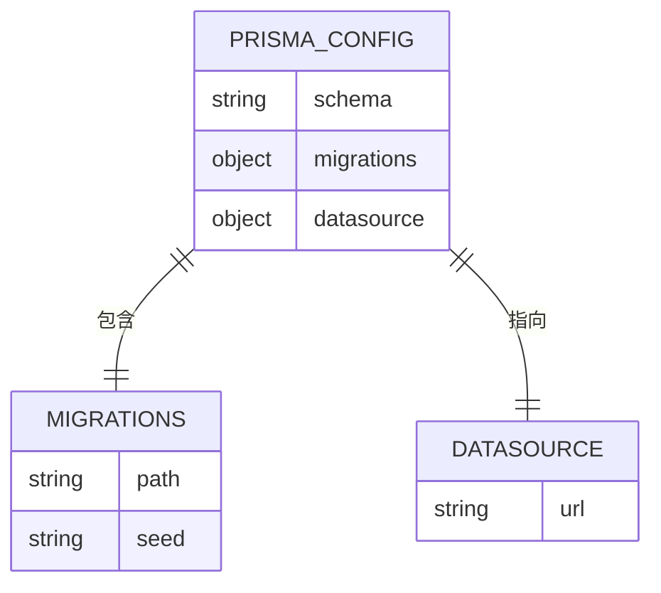
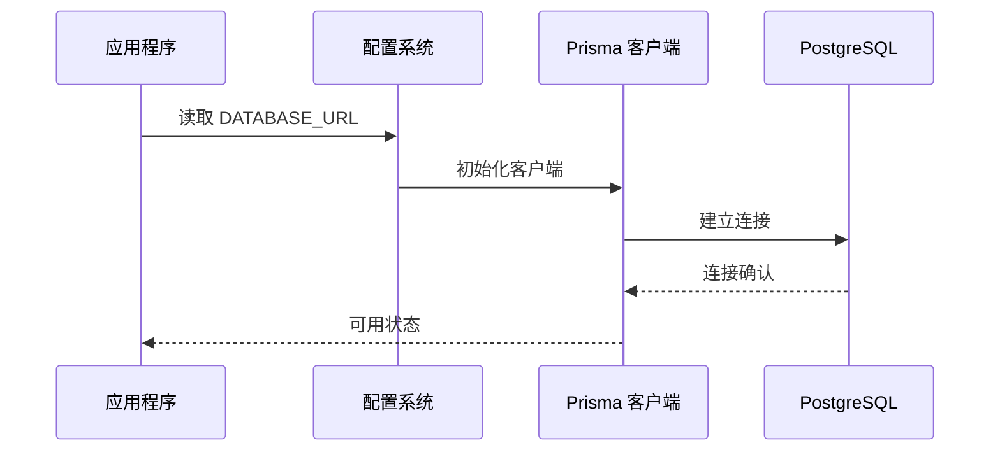
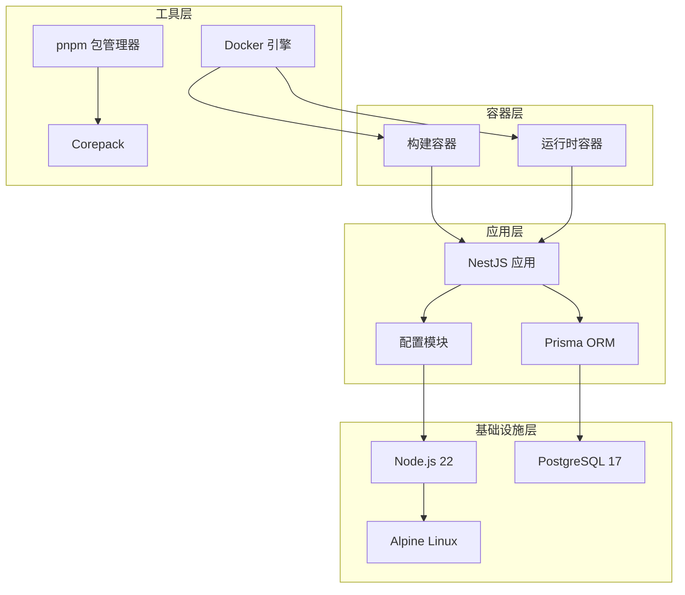

# Docker 容器化

<cite>
**本文引用的文件**
- [Dockerfile](file://Dockerfile)
- [.dockerignore](file://.dockerignore)
- [docker-compose.yml](file://docker-compose.yml)
- [package.json](file://package.json)
- [pnpm-workspace.yaml](file://pnpm-workspace.yaml)
- [prisma/schema.prisma](file://prisma/schema.prisma)
- [prisma.config.ts](file://prisma.config.ts)
- [src/config/config.module.ts](file://src/config/config.module.ts)
- [src/config/config-loader.ts](file://src/config/config-loader.ts)
- [src/config/schemas/root.schema.ts](file://src/config/schemas/root.schema.ts)
- [src/config/types.ts](file://src/config/types.ts)
- [src/app.module.ts](file://src/app.module.ts)
- [src/main.ts](file://src/main.ts)
</cite>

## 目录

1. [简介](#简介)
2. [项目结构](#项目结构)
3. [核心组件](#核心组件)
4. [架构概览](#架构概览)
5. [详细组件分析](#详细组件分析)
6. [依赖关系分析](#依赖关系分析)
7. [性能考虑](#性能考虑)
8. [故障排除指南](#故障排除指南)
9. [结论](#结论)
10. [附录](#附录)

## 简介

本项目采用 Docker 容器化技术实现微服务架构部署，基于多阶段构建策略优化镜像体积和安全性。该容器化方案包含以下关键特性：

- **多阶段构建**：使用 Node.js 22-alpine 作为基础镜像，分离构建阶段和运行时阶段
- **包管理优化**：集成 pnpm 包管理器，支持工作区管理和依赖锁定
- **数据库集成**：内置 PostgreSQL 数据库服务，支持健康检查和持久化存储
- **配置管理**：基于环境变量的类型安全配置系统，支持运行时验证
- **安全扫描**：内置安全最佳实践，最小化攻击面

## 项目结构

项目采用标准的 NestJS 项目结构，容器化配置集中在根目录的 Docker 相关文件中：



**图表来源**

- [Dockerfile:1-20](file://Dockerfile#L1-L20)
- [docker-compose.yml:1-37](file://docker-compose.yml#L1-L37)

**章节来源**

- [Dockerfile:1-20](file://Dockerfile#L1-L20)
- [.dockerignore:1-8](file://.dockerignore#L1-L8)
- [docker-compose.yml:1-37](file://docker-compose.yml#L1-L37)

## 核心组件

### 多阶段构建策略

项目采用双阶段构建策略，有效分离开发依赖和运行时环境：

**构建阶段 (build)**

- 基础镜像：node:22-alpine
- 功能：编译 TypeScript 源码为 JavaScript
- 依赖：完整开发工具链和构建依赖

**运行时阶段 (runtime)**

- 基础镜像：node:22-alpine
- 功能：仅包含运行时必需的依赖
- 优化：移除开发依赖，减少镜像体积


**图表来源**

- [Dockerfile:1-20](file://Dockerfile#L1-L20)

### 包管理器配置

项目使用 pnpm 作为包管理器，配合工作区配置实现高效的依赖管理：

**pnpm 工作区配置特点**：

- 支持本地包引用和版本锁定
- 优化依赖树结构，避免重复安装
- 支持条件构建特定包（如 Prisma 引擎）

**依赖安装策略**：

- 构建阶段：安装完整依赖集
- 运行时阶段：仅安装生产依赖 (--prod)
- 使用锁定文件确保构建一致性 (--frozen-lockfile)

**章节来源**

- [Dockerfile:3-5](file://Dockerfile#L3-L5)
- [Dockerfile:11-13](file://Dockerfile#L11-L13)
- [pnpm-workspace.yaml:1-16](file://pnpm-workspace.yaml#L1-L16)

### 容器运行时配置

容器运行时配置包含端口暴露、环境变量传递和文件系统挂载：

**端口配置**：

- 应用服务：3000/tcp
- 数据库服务：5432/tcp
- 自动映射：主机端口与容器端口一致

**环境变量配置**：

- NODE_ENV: production
- 数据库连接：DATABASE_URL
- JWT 配置：JWT_SECRET, JWT_ACCESS_TTL, JWT_REFRESH_SECRET
- CORS 设置：CORS_ORIGIN
- 数据库凭据：POSTGRES_USER, POSTGRES_PASSWORD, POSTGRES_DB

**数据持久化**：

- PostgreSQL 数据卷：pgdata
- 自动健康检查：每5秒检查一次数据库状态

**章节来源**

- [Dockerfile:18](file://Dockerfile#L18)
- [docker-compose.yml:4-17](file://docker-compose.yml#L4-L17)
- [docker-compose.yml:21-33](file://docker-compose.yml#L21-L33)

## 架构概览

项目采用微服务架构，包含应用服务和数据库服务两个主要组件：



**图表来源**

- [docker-compose.yml:1-37](file://docker-compose.yml#L1-L37)
- [src/app.module.ts:18-61](file://src/app.module.ts#L18-L61)

## 详细组件分析

### Dockerfile 分析

Dockerfile 实现了完整的多阶段构建流程：

#### 构建阶段配置



**图表来源**

- [Dockerfile:1-7](file://Dockerfile#L1-L7)

#### 运行时阶段配置



**图表来源**

- [Dockerfile:9-19](file://Dockerfile#L9-L19)

**章节来源**

- [Dockerfile:1-20](file://Dockerfile#L1-L20)

### 配置管理系统

项目实现了类型安全的配置管理系统，确保运行时配置的正确性：

#### 配置加载流程



**图表来源**

- [src/config/config-loader.ts:5-52](file://src/config/config-loader.ts#L5-L52)
- [src/config/schemas/root.schema.ts:10-15](file://src/config/schemas/root.schema.ts#L10-L15)

#### 配置模块设计



**图表来源**

- [src/config/config.module.ts:1-20](file://src/config/config.module.ts#L1-L20)
- [src/config/config-loader.ts:1-53](file://src/config/config-loader.ts#L1-L53)

**章节来源**

- [src/config/config.module.ts:1-20](file://src/config/config.module.ts#L1-L20)
- [src/config/config-loader.ts:1-53](file://src/config/config-loader.ts#L1-L53)
- [src/config/schemas/root.schema.ts:1-21](file://src/config/schemas/root.schema.ts#L1-L21)
- [src/config/types.ts:1-35](file://src/config/types.ts#L1-L35)

### 数据库集成配置

项目集成了 Prisma ORM 和 PostgreSQL 数据库，支持多种数据源配置：

#### Prisma 配置结构



**图表来源**

- [prisma.config.ts:4-13](file://prisma.config.ts#L4-L13)

#### 数据库连接配置



**图表来源**

- [docker-compose.yml:9](file://docker-compose.yml#L9)
- [prisma.config.ts:10-12](file://prisma.config.ts#L10-L12)

**章节来源**

- [prisma/schema.prisma:1-13](file://prisma/schema.prisma#L1-L13)
- [prisma.config.ts:1-14](file://prisma.config.ts#L1-L14)
- [docker-compose.yml:19-33](file://docker-compose.yml#L19-L33)

## 依赖关系分析

容器化系统的依赖关系呈现层次化结构：



**图表来源**

- [Dockerfile:1-20](file://Dockerfile#L1-L20)
- [docker-compose.yml:1-37](file://docker-compose.yml#L1-L37)

**章节来源**

- [Dockerfile:1-20](file://Dockerfile#L1-L20)
- [docker-compose.yml:1-37](file://docker-compose.yml#L1-L37)

## 性能考虑

### 镜像优化策略

项目采用了多项镜像优化技术：

**多阶段构建优势**：

- 构建阶段包含完整开发工具链，运行时阶段仅保留必要组件
- 大幅减少最终镜像体积，提高拉取速度
- 降低安全风险，移除不必要的系统工具

**包管理优化**：

- 使用 pnpm 替代 npm/yarn，提供更好的性能和磁盘利用率
- 工作区配置避免重复安装相同依赖
- 条件构建特定包，减少编译时间

**文件系统优化**：

- .dockerignore 配置排除不必要的文件和目录
- 避免复制 node_modules、dist 等临时文件
- 最小化构建上下文大小

### 运行时性能优化

**内存管理**：

- Alpine Linux 基础镜像提供更小的内存占用
- Node.js 22 的性能改进和垃圾回收优化
- 合理的进程管理和并发控制

**网络优化**：

- CORS 配置支持跨域请求
- Swagger 文档按需启用，减少不必要的资源消耗
- 数据库连接池配置优化

## 故障排除指南

### 常见问题诊断

#### 构建阶段问题

**问题症状**：构建过程中出现依赖安装失败
**可能原因**：

- 网络连接不稳定
- 锁定文件版本冲突
- 包管理器缓存损坏

**解决方案**：

- 清理 pnpm 缓存并重新安装
- 检查网络连接和代理设置
- 更新锁定文件或降级到兼容版本

#### 运行时问题

**问题症状**：容器启动后立即退出
**可能原因**：

- 环境变量配置错误
- 数据库连接失败
- 端口被占用

**解决方案**：

- 检查 .env 文件和 docker-compose.yml 配置
- 验证数据库服务状态和连接字符串
- 确认端口映射配置正确

#### 配置验证错误

**问题症状**：应用启动时报配置验证失败
**可能原因**：

- 环境变量类型不匹配
- 必填字段缺失
- 值范围超出允许范围

**解决方案**：

- 检查环境变量格式和类型
- 参考配置 Schema 定义
- 使用默认值或提供正确的配置

**章节来源**

- [src/config/config-loader.ts:39-46](file://src/config/config-loader.ts#L39-L46)
- [docker-compose.yml:6-17](file://docker-compose.yml#L6-L17)

### 调试技巧

**日志分析**：

- 使用 `docker logs <container-id>` 查看容器输出
- 检查应用启动日志和错误堆栈
- 监控数据库连接状态

**交互式调试**：

- 使用 `docker exec -it <container-id> /bin/sh` 进入容器
- 检查文件系统和进程状态
- 测试网络连接和服务可用性

**性能监控**：

- 监控容器资源使用情况
- 分析应用响应时间和错误率
- 优化数据库查询和缓存策略

## 结论

本项目的 Docker 容器化方案展现了现代微服务架构的最佳实践：

**技术优势**：

- 多阶段构建确保了镜像的安全性和效率
- 类型安全的配置系统提供了可靠的运行时保障
- 完整的开发和生产环境分离
- 内置的数据库和健康检查机制

**实施效果**：

- 镜像体积显著减小，启动速度快
- 配置管理更加规范和安全
- 开发和运维效率提升
- 系统可维护性和可扩展性增强

**建议改进方向**：

- 添加容器编排和自动扩缩容配置
- 集成 APM 监控和日志聚合
- 实施更细粒度的健康检查策略
- 优化 CI/CD 流程和自动化测试

## 附录

### 构建和运行命令

**构建镜像**：

```bash
docker build -t nest-server .
```

**运行容器**：

```bash
docker-compose up -d
```

**查看日志**：

```bash
docker-compose logs -f app
```

**进入容器**：

```bash
docker-compose exec app /bin/sh
```

### 环境变量参考

| 变量名             | 默认值           | 描述             |
| ------------------ | ---------------- | ---------------- |
| NODE_ENV           | production       | 应用环境         |
| PORT               | 3000             | 应用监听端口     |
| DATABASE_PROVIDER  | postgresql       | 数据库提供商     |
| DATABASE_URL       | postgresql://... | 数据库连接字符串 |
| JWT_SECRET         | change-this      | JWT 密钥         |
| JWT_ACCESS_TTL     | 15m              | 访问令牌过期时间 |
| JWT_REFRESH_SECRET | change-this      | 刷新令牌密钥     |
| JWT_REFRESH_TTL    | 7d               | 刷新令牌过期时间 |
| CORS_ORIGIN        | \*               | CORS 允许的来源  |

### 安全最佳实践

**镜像安全**：

- 使用官方 Node.js 镜像
- 定期更新基础镜像版本
- 扫描镜像漏洞并及时修复

**配置安全**：

- 不在代码中硬编码敏感信息
- 使用环境变量管理配置
- 实施最小权限原则

**网络安全**：

- 限制暴露的端口
- 配置防火墙规则
- 启用 HTTPS 和安全头
