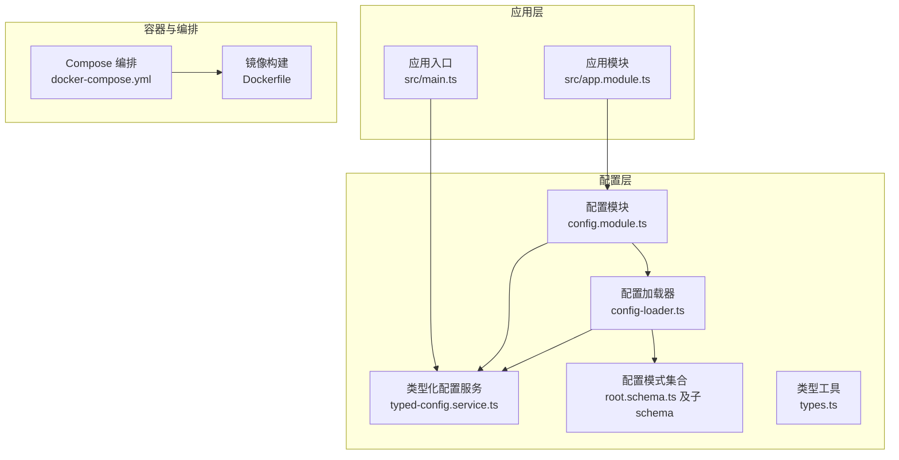
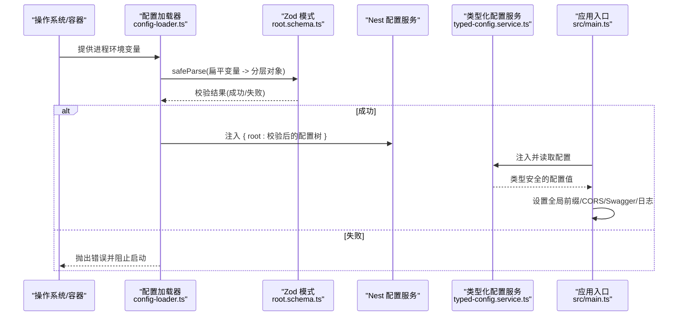
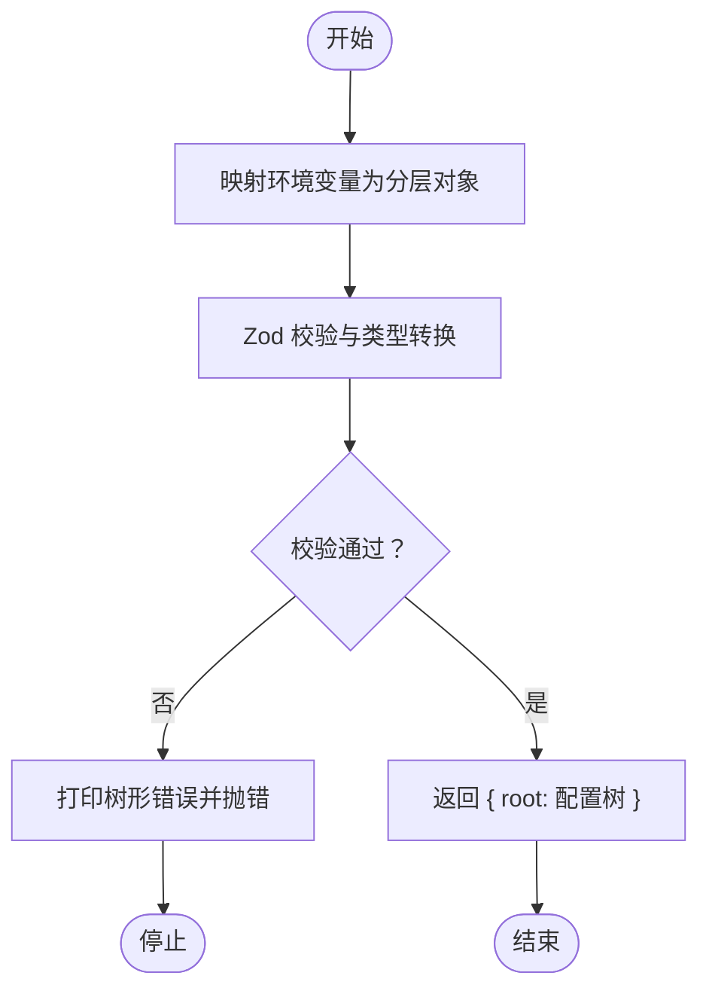
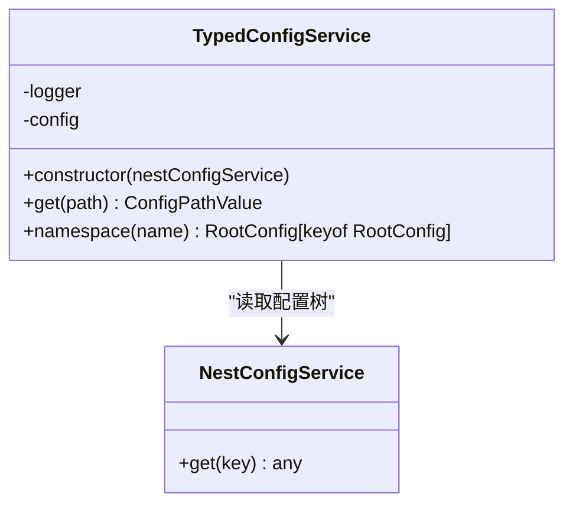
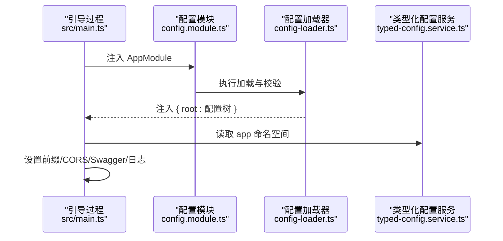
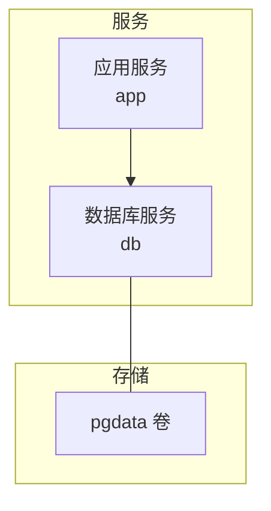
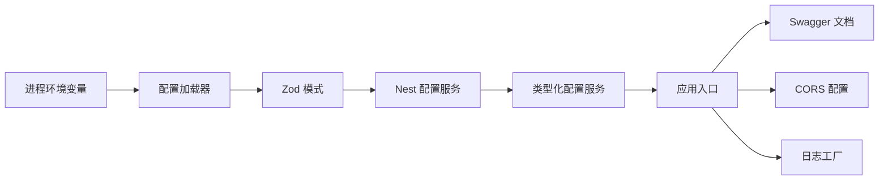

# 环境配置管理

<cite>
**本文引用的文件**
- [src/config/config-loader.ts](file://src/config/config-loader.ts)
- [src/config/config.module.ts](file://src/config/config.module.ts)
- [src/config/typed-config.service.ts](file://src/config/typed-config.service.ts)
- [src/config/types.ts](file://src/config/types.ts)
- [src/config/schemas/root.schema.ts](file://src/config/schemas/root.schema.ts)
- [src/config/schemas/app.schema.ts](file://src/config/schemas/app.schema.ts)
- [src/config/schemas/database.schema.ts](file://src/config/schemas/database.schema.ts)
- [src/config/schemas/jwt.schema.ts](file://src/config/schemas/jwt.schema.ts)
- [src/config/schemas/logger.schema.ts](file://src/config/schemas/logger.schema.ts)
- [docker-compose.yml](file://docker-compose.yml)
- [Dockerfile](file://Dockerfile)
- [src/main.ts](file://src/main.ts)
- [src/app.module.ts](file://src/app.module.ts)
- [package.json](file://package.json)
</cite>

## 目录
1. [引言](#引言)
2. [项目结构](#项目结构)
3. [核心组件](#核心组件)
4. [架构总览](#架构总览)
5. [详细组件分析](#详细组件分析)
6. [依赖分析](#依赖分析)
7. [性能考虑](#性能考虑)
8. [故障排查指南](#故障排查指南)
9. [结论](#结论)
10. [附录](#附录)

## 引言
本指南围绕该 NestJS 项目的环境配置管理进行系统化梳理，覆盖多环境配置策略、环境变量与配置文件组织、敏感信息保护、配置验证、服务编排与依赖管理、配置加载顺序、配置热更新可行性评估、配置审计与故障排查等主题。目标是帮助开发者在开发、测试与生产环境中高效、安全地管理配置。

## 项目结构
该项目采用“按功能域划分”的模块化组织方式，配置相关代码集中在 src/config 目录下，包含：
- 配置加载器：负责从进程环境变量映射到分层配置树，并进行严格校验
- 类型化配置服务：提供类型安全的配置读取能力
- 配置模式（Zod Schema）：对各命名空间（app、database、jwt、logger）进行强类型约束
- 配置模块：注册全局配置模块与类型化配置服务
- 应用入口：在引导阶段读取配置并初始化应用行为（如 Swagger、CORS、日志）

图表来源
- [src/config/config-loader.ts:1-53](file://src/config/config-loader.ts#L1-L53)
- [src/config/typed-config.service.ts:1-48](file://src/config/typed-config.service.ts#L1-L48)
- [src/config/schemas/root.schema.ts:1-21](file://src/config/schemas/root.schema.ts#L1-L21)
- [src/config/config.module.ts:1-20](file://src/config/config.module.ts#L1-L20)
- [src/main.ts:1-50](file://src/main.ts#L1-L50)
- [src/app.module.ts:1-61](file://src/app.module.ts#L1-L61)
- [docker-compose.yml:1-37](file://docker-compose.yml#L1-L37)
- [Dockerfile:1-20](file://Dockerfile#L1-L20)

章节来源
- [src/config/config-loader.ts:1-53](file://src/config/config-loader.ts#L1-L53)
- [src/config/config.module.ts:1-20](file://src/config/config.module.ts#L1-L20)
- [src/config/typed-config.service.ts:1-48](file://src/config/typed-config.service.ts#L1-L48)
- [src/config/schemas/root.schema.ts:1-21](file://src/config/schemas/root.schema.ts#L1-L21)
- [src/main.ts:1-50](file://src/main.ts#L1-L50)
- [src/app.module.ts:1-61](file://src/app.module.ts#L1-L61)
- [docker-compose.yml:1-37](file://docker-compose.yml#L1-L37)
- [Dockerfile:1-20](file://Dockerfile#L1-L20)

## 核心组件
- 配置加载器：将扁平的进程环境变量映射为分层配置树，并通过 Zod 模式进行严格校验；校验失败会阻断启动并输出详细错误
- 类型化配置服务：提供类型安全的点语法读取与命名空间读取能力，缺失根配置时会记录错误并终止进程
- 配置模式：以 Zod Schema 定义 app、database、jwt、logger 四个命名空间的字段类型、默认值与约束
- 配置模块：注册全局配置模块，控制是否忽略 .env 文件（生产环境默认忽略），并导出类型化配置服务
- 应用入口：在引导阶段读取配置，设置全局前缀、CORS、Swagger 开关与日志工厂

章节来源
- [src/config/config-loader.ts:1-53](file://src/config/config-loader.ts#L1-L53)
- [src/config/typed-config.service.ts:1-48](file://src/config/typed-config.service.ts#L1-L48)
- [src/config/schemas/app.schema.ts:1-12](file://src/config/schemas/app.schema.ts#L1-L12)
- [src/config/schemas/database.schema.ts:1-11](file://src/config/schemas/database.schema.ts#L1-L11)
- [src/config/schemas/jwt.schema.ts:1-11](file://src/config/schemas/jwt.schema.ts#L1-L11)
- [src/config/schemas/logger.schema.ts:1-13](file://src/config/schemas/logger.schema.ts#L1-L13)
- [src/config/config.module.ts:1-20](file://src/config/config.module.ts#L1-L20)
- [src/main.ts:1-50](file://src/main.ts#L1-L50)

## 架构总览
下图展示了配置从环境变量到应用使用的端到端流程，以及与 Docker Compose 的集成关系。

图表来源
- [src/config/config-loader.ts:1-53](file://src/config/config-loader.ts#L1-L53)
- [src/config/schemas/root.schema.ts:1-21](file://src/config/schemas/root.schema.ts#L1-L21)
- [src/config/typed-config.service.ts:1-48](file://src/config/typed-config.service.ts#L1-L48)
- [src/main.ts:1-50](file://src/main.ts#L1-L50)

## 详细组件分析

### 组件一：配置加载与校验（config-loader.ts）
- 功能要点
  - 将扁平的 process.env 映射为分层的命名空间结构（app、database、jwt、logger）
  - 使用 Zod 对分层配置进行严格校验与类型转换（如字符串转数字、布尔）
  - 校验失败时输出树形错误并抛出异常，阻止应用启动
  - 校验成功后返回带 root 键的对象，供类型化配置服务读取
- 关键行为
  - 支持默认值与最小长度等约束
  - 对数据库 URL、JWT 密钥长度等关键字段进行强制校验
- 典型调用链
  - 配置模块注册 -> 加载器执行 -> Nest 配置服务注入 -> 类型化服务读取

图表来源
- [src/config/config-loader.ts:1-53](file://src/config/config-loader.ts#L1-L53)
- [src/config/schemas/root.schema.ts:1-21](file://src/config/schemas/root.schema.ts#L1-L21)

章节来源
- [src/config/config-loader.ts:1-53](file://src/config/config-loader.ts#L1-L53)
- [src/config/schemas/root.schema.ts:1-21](file://src/config/schemas/root.schema.ts#L1-L21)

### 组件二：类型化配置服务（typed-config.service.ts）
- 功能要点
  - 在构造函数中从 Nest 配置服务读取 root 配置树
  - 若缺失根配置则记录错误并终止进程
  - 提供 get(path) 支持点语法读取任意层级配置
  - 提供 namespace(name) 读取完整命名空间对象
- 类型安全
  - 通过 ConfigPath 与 ConfigPathValue 递归推导路径与值类型，避免运行期类型错误
- 使用场景
  - 应用入口读取 app 命名空间用于设置全局前缀、CORS、Swagger
  - 各模块按需读取对应命名空间配置

图表来源
- [src/config/typed-config.service.ts:1-48](file://src/config/typed-config.service.ts#L1-L48)
- [src/config/types.ts:1-35](file://src/config/types.ts#L1-L35)

章节来源
- [src/config/typed-config.service.ts:1-48](file://src/config/typed-config.service.ts#L1-L48)
- [src/config/types.ts:1-35](file://src/config/types.ts#L1-L35)

### 组件三：配置模式与类型（schemas/* 与 types.ts）
- 命名空间与约束
  - app：环境、端口、API 前缀、CORS、Swagger 开关等
  - database：提供者、连接串、最大连接数、日志开关等
  - jwt：密钥、访问令牌 TTL、刷新密钥、刷新令牌 TTL 等
  - logger：日志目录、级别、文件开关、最大文件数、最大尺寸等
- 类型工具
  - ConfigPath：递归提取最多三层的合法路径，防止 TS 性能问题
  - ConfigPathValue：根据路径推导最终值类型

章节来源
- [src/config/schemas/app.schema.ts:1-12](file://src/config/schemas/app.schema.ts#L1-L12)
- [src/config/schemas/database.schema.ts:1-11](file://src/config/schemas/database.schema.ts#L1-L11)
- [src/config/schemas/jwt.schema.ts:1-11](file://src/config/schemas/jwt.schema.ts#L1-L11)
- [src/config/schemas/logger.schema.ts:1-13](file://src/config/schemas/logger.schema.ts#L1-L13)
- [src/config/schemas/root.schema.ts:1-21](file://src/config/schemas/root.schema.ts#L1-L21)
- [src/config/types.ts:1-35](file://src/config/types.ts#L1-L35)

### 组件四：配置模块与应用入口（config.module.ts 与 main.ts）
- 配置模块
  - 注册全局配置模块，控制是否忽略 .env 文件（生产环境默认忽略）
  - 导入自定义加载器，确保配置树在应用启动前完成校验与注入
- 应用入口
  - 获取类型化配置服务，读取 app 命名空间
  - 设置全局前缀、CORS、Swagger 文档路由
  - 初始化日志工厂并注入应用日志器

图表来源
- [src/config/config.module.ts:1-20](file://src/config/config.module.ts#L1-L20)
- [src/config/config-loader.ts:1-53](file://src/config/config-loader.ts#L1-L53)
- [src/config/typed-config.service.ts:1-48](file://src/config/typed-config.service.ts#L1-L48)
- [src/main.ts:1-50](file://src/main.ts#L1-L50)

章节来源
- [src/config/config.module.ts:1-20](file://src/config/config.module.ts#L1-L20)
- [src/main.ts:1-50](file://src/main.ts#L1-L50)

### 组件五：Docker 编排与依赖管理（docker-compose.yml 与 Dockerfile）
- Compose 服务
  - app：构建镜像、端口映射、环境变量（含数据库连接串、JWT 密钥、CORS 等）、依赖 db 并等待健康
  - db：Postgres 镜像、初始化用户/库、持久化卷、健康检查
- Dockerfile
  - 多阶段构建：构建阶段安装依赖并编译，运行阶段仅保留生产依赖与产物
  - 暴露 3000 端口，CMD 启动 dist/main

图表来源
- [docker-compose.yml:1-37](file://docker-compose.yml#L1-L37)
- [Dockerfile:1-20](file://Dockerfile#L1-L20)

章节来源
- [docker-compose.yml:1-37](file://docker-compose.yml#L1-L37)
- [Dockerfile:1-20](file://Dockerfile#L1-L20)

## 依赖分析
- 内部耦合
  - 配置模块导入加载器与类型化服务，形成“加载-注入-读取”的闭环
  - 应用入口依赖类型化配置服务，实现配置驱动的应用行为
- 外部依赖
  - NestJS 配置模块：提供配置注入与读取能力
  - Zod：提供强类型校验与转换
  - Winston 日志：结合配置决定日志级别与文件输出
- 潜在风险
  - 若 .env 文件未被忽略且存在未定义变量，可能污染配置树
  - 生产环境若缺少必要环境变量，会在启动阶段被严格拦截

图表来源
- [src/config/config-loader.ts:1-53](file://src/config/config-loader.ts#L1-L53)
- [src/config/schemas/root.schema.ts:1-21](file://src/config/schemas/root.schema.ts#L1-L21)
- [src/config/typed-config.service.ts:1-48](file://src/config/typed-config.service.ts#L1-L48)
- [src/main.ts:1-50](file://src/main.ts#L1-L50)

章节来源
- [src/config/config.module.ts:1-20](file://src/config/config.module.ts#L1-L20)
- [src/config/typed-config.service.ts:1-48](file://src/config/typed-config.service.ts#L1-L48)
- [src/main.ts:1-50](file://src/main.ts#L1-L50)
- [package.json:1-88](file://package.json#L1-L88)

## 性能考虑
- 配置读取
  - 类型化服务在构造时一次性读取根配置树，后续读取为常量时间复杂度
  - 点语法解析为 O(k)（k 为路径层级），建议避免深层嵌套
- 校验成本
  - Zod 校验发生在启动阶段，属于一次性开销；生产环境忽略 .env 文件可减少潜在污染
- 日志与数据库
  - 日志文件大小与轮转参数可通过配置调整；数据库连接数与日志开关影响资源占用

## 故障排查指南
- 启动时报错“环境变量校验失败”
  - 检查对应字段是否满足最小长度、枚举值或类型转换要求
  - 关注错误输出中的树形结构，定位具体字段
- 根配置缺失导致进程退出
  - 确认加载器已正确注入 root 配置树
  - 检查配置模块是否在引导阶段执行
- Swagger 未生效
  - 检查 app.enableSwagger 是否开启，以及全局前缀与文档路由拼接
- CORS 不生效
  - 检查 app.corsOrigin 是否包含允许的源，以及是否正确拆分为数组
- 数据库连接失败
  - 检查 DATABASE_URL 是否正确，数据库服务是否健康（Compose 健康检查）
- 生产环境配置污染
  - 确认配置模块已忽略 .env 文件（生产环境默认启用）

章节来源
- [src/config/config-loader.ts:1-53](file://src/config/config-loader.ts#L1-L53)
- [src/config/typed-config.service.ts:1-48](file://src/config/typed-config.service.ts#L1-L48)
- [src/main.ts:1-50](file://src/main.ts#L1-L50)
- [docker-compose.yml:1-37](file://docker-compose.yml#L1-L37)

## 结论
该配置体系通过“扁平变量 -> 分层树 -> Zod 校验 -> 类型化读取”的流程，实现了强类型、可维护、可审计的环境配置管理。配合 Docker Compose 的服务编排与健康检查，能够在多环境中稳定运行。建议在生产环境坚持忽略 .env 文件、强化敏感信息保护，并通过配置审计与日志监控持续优化。

## 附录

### 多环境配置策略与差异
- 开发环境
  - 默认端口、Swagger 开启、日志级别较低、数据库可使用 sqlite 或本地 Postgres
- 测试环境
  - 使用独立数据库实例与测试专用密钥，关闭不必要的日志文件输出
- 生产环境
  - 忽略 .env 文件，使用容器注入的环境变量；严格校验密钥长度与数据库 URL；启用健康检查与日志轮转

章节来源
- [src/config/schemas/app.schema.ts:1-12](file://src/config/schemas/app.schema.ts#L1-L12)
- [src/config/schemas/database.schema.ts:1-11](file://src/config/schemas/database.schema.ts#L1-L11)
- [src/config/schemas/jwt.schema.ts:1-11](file://src/config/schemas/jwt.schema.ts#L1-L11)
- [src/config/schemas/logger.schema.ts:1-13](file://src/config/schemas/logger.schema.ts#L1-L13)
- [src/config/config.module.ts:1-20](file://src/config/config.module.ts#L1-L20)
- [docker-compose.yml:1-37](file://docker-compose.yml#L1-L37)

### 敏感信息保护
- 禁止将密钥写入 .env 文件（生产环境默认忽略 .env）
- 使用容器编排注入密钥与数据库连接串
- 对关键字段（如 JWT 密钥）设置最小长度约束

章节来源
- [src/config/config.module.ts:1-20](file://src/config/config.module.ts#L1-L20)
- [src/config/schemas/jwt.schema.ts:1-11](file://src/config/schemas/jwt.schema.ts#L1-L11)
- [docker-compose.yml:1-37](file://docker-compose.yml#L1-L37)

### 配置文件组织与加载顺序
- 加载顺序
  - 自定义加载器 -> Nest 配置服务 -> 类型化配置服务 -> 应用入口
- 文件组织
  - 配置模式集中于 schemas 目录，类型工具位于 types.ts
  - 配置模块与加载器位于 config 目录，应用入口位于 src/main.ts

章节来源
- [src/config/config-loader.ts:1-53](file://src/config/config-loader.ts#L1-L53)
- [src/config/config.module.ts:1-20](file://src/config/config.module.ts#L1-L20)
- [src/config/typed-config.service.ts:1-48](file://src/config/typed-config.service.ts#L1-L48)
- [src/config/schemas/root.schema.ts:1-21](file://src/config/schemas/root.schema.ts#L1-L21)
- [src/main.ts:1-50](file://src/main.ts#L1-L50)

### docker-compose.yml 配置要点
- app 服务
  - 环境变量：NODE_ENV、DATABASE_PROVIDER、DATABASE_URL、JWT_*、CORS_ORIGIN
  - 依赖 db，等待健康后再启动
- db 服务
  - Postgres 镜像、初始化凭据、持久化卷、健康检查命令

章节来源
- [docker-compose.yml:1-37](file://docker-compose.yml#L1-L37)

### 配置验证与命名规范
- 命名规范
  - 使用全大写与下划线风格（如 DATABASE_URL、JWT_SECRET）
  - 命名空间与字段遵循 schemas/* 中的定义
- 验证规则
  - 枚举值、最小长度、类型转换（如数字、布尔）
  - 根配置缺失时立即终止

章节来源
- [src/config/schemas/root.schema.ts:1-21](file://src/config/schemas/root.schema.ts#L1-L21)
- [src/config/schemas/app.schema.ts:1-12](file://src/config/schemas/app.schema.ts#L1-L12)
- [src/config/schemas/database.schema.ts:1-11](file://src/config/schemas/database.schema.ts#L1-L11)
- [src/config/schemas/jwt.schema.ts:1-11](file://src/config/schemas/jwt.schema.ts#L1-L11)
- [src/config/schemas/logger.schema.ts:1-13](file://src/config/schemas/logger.schema.ts#L1-L13)

### 配置热更新与审计
- 热更新
  - 当前实现为启动阶段一次性加载并注入，不支持运行时热更新
  - 如需热更新，可在业务层引入事件监听与重新加载逻辑，并对关键配置变更进行灰度与回滚策略
- 审计
  - 建议在应用启动时输出当前生效的配置摘要（脱敏敏感字段）
  - 结合日志轮转与集中化日志收集，便于追踪配置变更与异常

章节来源
- [src/config/config-loader.ts:1-53](file://src/config/config-loader.ts#L1-L53)
- [src/config/typed-config.service.ts:1-48](file://src/config/typed-config.service.ts#L1-L48)
- [src/main.ts:1-50](file://src/main.ts#L1-L50)