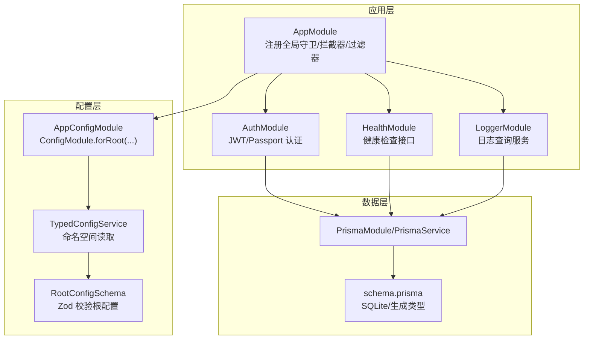
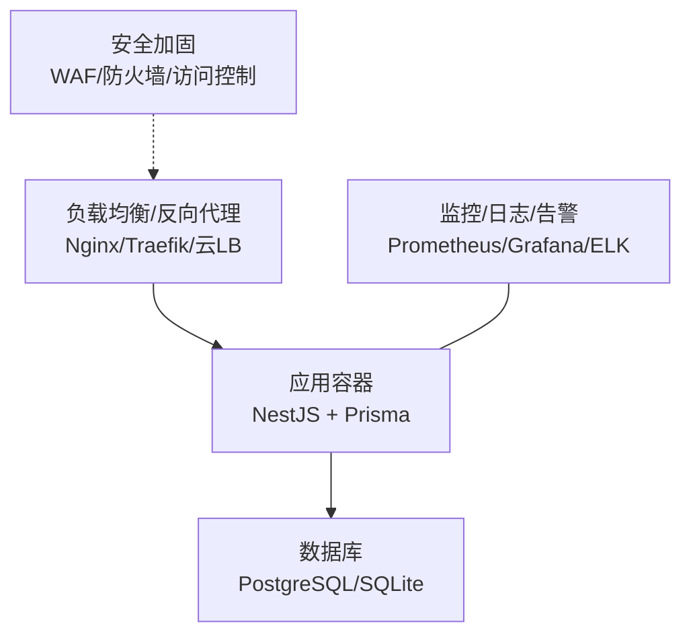
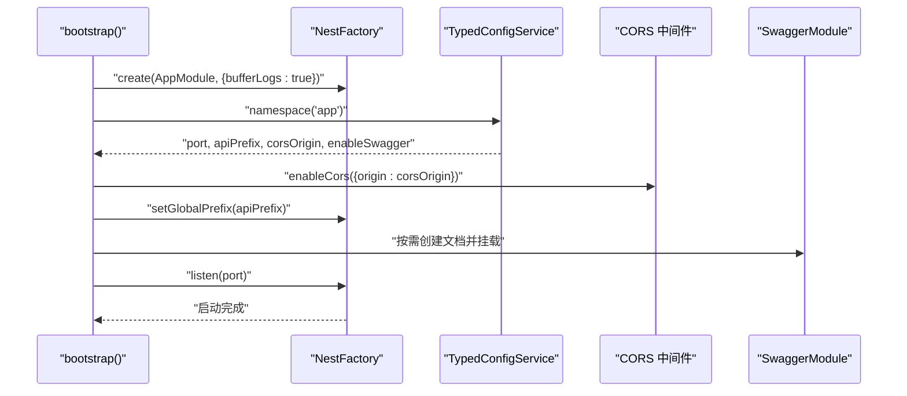
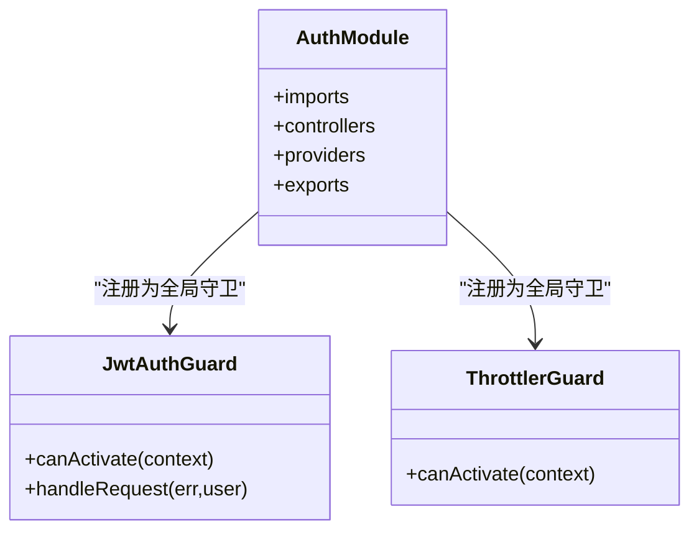
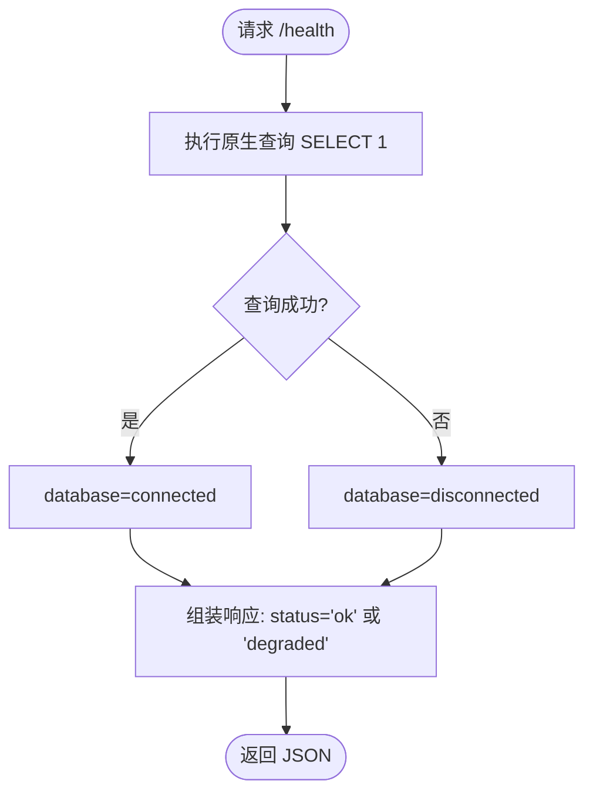
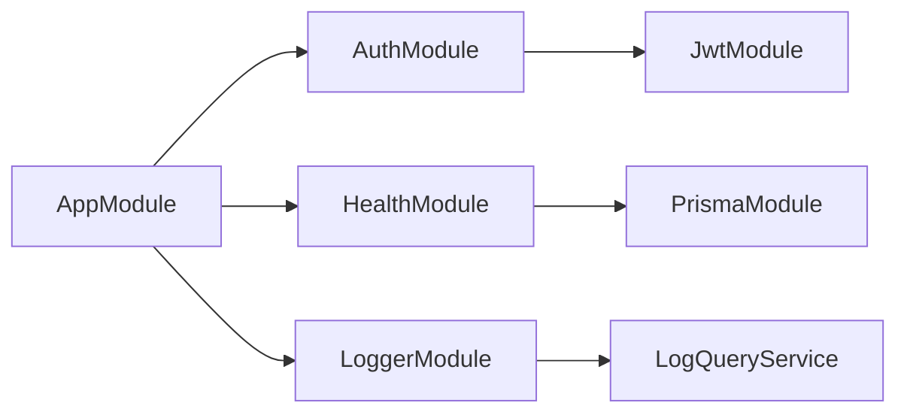

# 生产环境部署

<cite>
**本文引用的文件**
- [package.json](file://package.json)
- [Dockerfile](file://Dockerfile)
- [docker-compose.yml](file://docker-compose.yml)
- [src/main.ts](file://src/main.ts)
- [src/app.module.ts](file://src/app.module.ts)
- [src/config/config.module.ts](file://src/config/config.module.ts)
- [src/config/typed-config.service.ts](file://src/config/typed-config.service.ts)
- [src/config/schemas/root.schema.ts](file://src/config/schemas/root.schema.ts)
- [src/config/schemas/app.schema.ts](file://src/config/schemas/app.schema.ts)
- [src/config/schemas/database.schema.ts](file://src/config/schemas/database.schema.ts)
- [src/config/schemas/jwt.schema.ts](file://src/config/schemas/jwt.schema.ts)
- [src/modules/auth/auth.module.ts](file://src/modules/auth/auth.module.ts)
- [src/modules/health/health.module.ts](file://src/modules/health/health.module.ts)
- [src/modules/health/health.controller.ts](file://src/modules/health/health.controller.ts)
- [src/common/guards/jwt-auth.guard.ts](file://src/common/guards/jwt-auth.guard.ts)
- [src/common/guards/throttler.guard.ts](file://src/common/guards/throttler.guard.ts)
- [prisma/schema.prisma](file://prisma/schema.prisma)
</cite>

## 目录

1. [简介](#简介)
2. [项目结构](#项目结构)
3. [核心组件](#核心组件)
4. [架构总览](#架构总览)
5. [详细组件分析](#详细组件分析)
6. [依赖关系分析](#依赖关系分析)
7. [性能考虑](#性能考虑)
8. [故障排查指南](#故障排查指南)
9. [结论](#结论)
10. [附录](#附录)

## 简介

本指南面向生产环境部署，覆盖服务器环境要求、依赖安装、数据库初始化与应用启动；详细说明负载均衡、SSL 证书、反向代理与域名绑定；提供部署脚本、回滚策略与蓝绿部署方案；包含性能监控、日志收集与告警配置；以及安全加固、防火墙与访问控制建议。文档基于仓库现有配置与代码进行梳理，确保可操作性与可追溯性。

## 项目结构

该仓库采用 NestJS 11 标准工程结构，使用 Prisma 作为 ORM，Docker 与 docker-compose 提供容器化能力，配置通过 ConfigModule 与 Zod Schema 进行强类型校验，模块化组织认证、缓存、健康检查与日志等子系统。

图表来源

- [src/app.module.ts:18-60](file://src/app.module.ts#L18-L60)
- [src/config/config.module.ts:6-19](file://src/config/config.module.ts#L6-L19)
- [src/config/typed-config.service.ts:6-47](file://src/config/typed-config.service.ts#L6-L47)
- [src/config/schemas/root.schema.ts:10-21](file://src/config/schemas/root.schema.ts#L10-L21)
- [prisma/schema.prisma:1-13](file://prisma/schema.prisma#L1-L13)

章节来源

- [src/app.module.ts:1-61](file://src/app.module.ts#L1-L61)
- [src/config/config.module.ts:1-20](file://src/config/config.module.ts#L1-L20)
- [src/config/typed-config.service.ts:1-48](file://src/config/typed-config.service.ts#L1-L48)
- [src/config/schemas/root.schema.ts:1-21](file://src/config/schemas/root.schema.ts#L1-L21)
- [prisma/schema.prisma:1-13](file://prisma/schema.prisma#L1-L13)

## 核心组件

- 应用引导与中间件
  - 启动时启用关闭钩子、设置全局前缀、CORS、Swagger（按配置开关），并记录监听地址与文档地址。
- 全局配置体系
  - 使用 ConfigModule 加载配置，TypedConfigService 提供命名空间读取与点语法路径访问，RootConfigSchema 统一校验 app、database、jwt、logger 四个命名空间。
- 安全与限流
  - 全局 JwtAuthGuard 与自定义 ThrottlerGuard，支持公开路由与跳过限流装饰器。
- 数据访问
  - Prisma 作为客户端，schema.prisma 当前配置为 sqlite，可通过环境变量切换至 postgresql。
- 健康检查
  - HealthController 提供 /health 与 /health/ping，数据库连通性通过原生查询判断。

章节来源

- [src/main.ts:8-47](file://src/main.ts#L8-L47)
- [src/app.module.ts:18-60](file://src/app.module.ts#L18-L60)
- [src/config/config.module.ts:6-19](file://src/config/config.module.ts#L6-L19)
- [src/config/typed-config.service.ts:20-47](file://src/config/typed-config.service.ts#L20-L47)
- [src/config/schemas/root.schema.ts:10-21](file://src/config/schemas/root.schema.ts#L10-L21)
- [src/common/guards/jwt-auth.guard.ts:17-45](file://src/common/guards/jwt-auth.guard.ts#L17-L45)
- [src/common/guards/throttler.guard.ts:10-32](file://src/common/guards/throttler.guard.ts#L10-L32)
- [src/modules/health/health.controller.ts:48-85](file://src/modules/health/health.controller.ts#L48-L85)
- [prisma/schema.prisma:10-12](file://prisma/schema.prisma#L10-L12)

## 架构总览

下图展示生产部署的关键交互：反向代理/负载均衡接入应用，应用通过 Prisma 访问数据库，健康检查用于探活与运维编排。

图表来源

- [src/main.ts:14-35](file://src/main.ts#L14-L35)
- [docker-compose.yml:19-33](file://docker-compose.yml#L19-L33)
- [prisma/schema.prisma:10-12](file://prisma/schema.prisma#L10-L12)

## 详细组件分析

### 应用启动与配置加载

- 启动流程要点
  - 创建 NestFactory 实例，启用关闭钩子，注入 TypedConfigService 读取 app 命名空间配置（端口、前缀、CORS、Swagger 开关）。
  - 设置全局 CORS（支持多源）、全局前缀、Swagger 文档路径（当开启时）。
  - 启动监听并输出日志。
- 配置加载机制
  - AppConfigModule 使用 ConfigModule.forRoot，忽略 .env 文件以避免污染生产环境变量。
  - TypedConfigService 支持命名空间读取与点语法路径访问，缺失根配置会直接退出进程。
  - RootConfigSchema 聚合 app、database、jwt、logger 的 Zod 校验规则。

图表来源

- [src/main.ts:8-47](file://src/main.ts#L8-L47)
- [src/config/config.module.ts:9-14](file://src/config/config.module.ts#L9-L14)
- [src/config/typed-config.service.ts:44-46](file://src/config/typed-config.service.ts#L44-L46)

章节来源

- [src/main.ts:8-47](file://src/main.ts#L8-L47)
- [src/config/config.module.ts:6-19](file://src/config/config.module.ts#L6-L19)
- [src/config/typed-config.service.ts:6-47](file://src/config/typed-config.service.ts#L6-L47)
- [src/config/schemas/root.schema.ts:10-21](file://src/config/schemas/root.schema.ts#L10-L21)

### 认证与授权

- JwtModule 异步注册，从 jwt 命名空间读取密钥与过期时间。
- JwtAuthGuard 基于 Passport 的 jwt 策略，结合 Reflector 判断公开路由与业务异常处理。
- 自定义 ThrottlerGuard 支持通过装饰器跳过限流。

图表来源

- [src/modules/auth/auth.module.ts:11-33](file://src/modules/auth/auth.module.ts#L11-L33)
- [src/common/guards/jwt-auth.guard.ts:17-45](file://src/common/guards/jwt-auth.guard.ts#L17-L45)
- [src/common/guards/throttler.guard.ts:10-32](file://src/common/guards/throttler.guard.ts#L10-L32)

章节来源

- [src/modules/auth/auth.module.ts:1-34](file://src/modules/auth/auth.module.ts#L1-L34)
- [src/common/guards/jwt-auth.guard.ts:1-46](file://src/common/guards/jwt-auth.guard.ts#L1-L46)
- [src/common/guards/throttler.guard.ts:1-33](file://src/common/guards/throttler.guard.ts#L1-L33)

### 健康检查与数据库连通性

- 健康检查接口
  - GET /health：返回状态、时间戳、运行时长与数据库连通性。
  - GET /health/ping：简单响应。
- 数据库连通性
  - 使用原生查询 SELECT 1 判断连接状态，异常则标记为断开。

图表来源

- [src/modules/health/health.controller.ts:48-63](file://src/modules/health/health.controller.ts#L48-L63)

章节来源

- [src/modules/health/health.controller.ts:1-86](file://src/modules/health/health.controller.ts#L1-L86)

### 部署与运行时配置

- 容器镜像与运行命令
  - 多阶段构建，最终运行 CMD ["node", "dist/src/main.js"]。
  - Dockerfile 显式暴露 3000 端口。
- Compose 服务
  - app 服务映射 3000:3000，设置 NODE_ENV=production，并注入数据库、JWT、CORS 等环境变量。
  - db 服务使用 postgres:17-alpine，持久化卷 pgdata，健康检查基于 pg_isready。
- 数据库切换
  - schema.prisma 默认 sqlite；compose 中 DATABASE_PROVIDER=postgresql，可通过 DATABASE_URL 指定目标数据库。

章节来源

- [Dockerfile:1-20](file://Dockerfile#L1-L20)
- [docker-compose.yml:1-37](file://docker-compose.yml#L1-L37)
- [prisma/schema.prisma:10-12](file://prisma/schema.prisma#L10-L12)

## 依赖关系分析

- 模块耦合
  - AppModule 作为根模块，集中注册全局守卫、拦截器、管道与过滤器，降低控制器层重复配置。
  - AuthModule 依赖 UserModule 与 JwtModule，形成认证闭环。
  - HealthModule 仅依赖 PrismaModule，职责单一。
- 外部依赖
  - Prisma 客户端与 zod-prisma-types 生成类型，提升数据层安全性。
  - Swagger 仅在开发/测试中默认开启，生产环境建议关闭或限制访问。

图表来源

- [src/app.module.ts:18-32](file://src/app.module.ts#L18-L32)
- [src/modules/auth/auth.module.ts:11-33](file://src/modules/auth/auth.module.ts#L11-L33)
- [src/modules/health/health.module.ts:5-9](file://src/modules/health/health.module.ts#L5-L9)

章节来源

- [src/app.module.ts:1-61](file://src/app.module.ts#L1-L61)
- [src/modules/auth/auth.module.ts:1-34](file://src/modules/auth/auth.module.ts#L1-L34)
- [src/modules/health/health.module.ts:1-10](file://src/modules/health/health.module.ts#L1-L10)

## 性能考虑

- 连接池与并发
  - database.maxConnections 默认 10，生产环境可根据实例规格与数据库性能调优。
- 缓存与限流
  - 全局缓存模块已注册；ThrottlerGuard 已启用短/中/长三档限流，可结合装饰器跳过特定路由。
- 日志与监控
  - 建议启用结构化日志与日志轮转，配合 Prometheus/Grafana 监控 CPU、内存、QPS、P95/P99 延迟与错误率。
- 数据库选择
  - 当前 schema.prisma 为 sqlite；生产建议使用 PostgreSQL 并开启连接池与只读副本。

章节来源

- [src/config/schemas/database.schema.ts:6](file://src/config/schemas/database.schema.ts#L6)
- [src/app.module.ts:21-25](file://src/app.module.ts#L21-L25)
- [prisma/schema.prisma:10-12](file://prisma/schema.prisma#L10-L12)

## 故障排查指南

- 启动失败
  - 若根配置缺失，TypedConfigService 将记录错误并退出进程。请检查配置加载与命名空间。
- 认证相关
  - JwtAuthGuard 在鉴权失败时抛出业务异常，确认 JWT 密钥长度与过期时间配置正确。
- 限流触发
  - ThrottlerGuard 可被装饰器跳过，若出现误伤，检查对应路由是否标注了跳过限流。
- 健康检查
  - /health 无法连接数据库时返回 degraded，检查数据库连接字符串与网络连通性。
- Swagger
  - 生产环境建议关闭或限制访问，避免泄露接口细节。

章节来源

- [src/config/typed-config.service.ts:14-18](file://src/config/typed-config.service.ts#L14-L18)
- [src/common/guards/jwt-auth.guard.ts:40-44](file://src/common/guards/jwt-auth.guard.ts#L40-L44)
- [src/common/guards/throttler.guard.ts:20-31](file://src/common/guards/throttler.guard.ts#L20-L31)
- [src/modules/health/health.controller.ts:48-63](file://src/modules/health/health.controller.ts#L48-L63)

## 结论

本指南基于仓库现有配置与代码，给出了生产环境部署的完整路径：容器化打包、配置加载、数据库初始化、应用启动、负载均衡与 SSL、反向代理与域名绑定、部署脚本与回滚/蓝绿方案、监控与告警、安全加固与访问控制。建议在生产环境中严格管理密钥与环境变量，启用健康检查与可观测性，并根据业务流量调整限流与数据库连接参数。

## 附录

### 服务器环境要求

- 操作系统：Linux（推荐 Ubuntu/CentOS）
- 容器运行时：Docker Engine 与 docker-compose
- 节点资源：CPU/内存依据业务峰值评估，建议预留 20% 缓冲
- 存储：数据库持久化卷（如 compose 中 pgdata）

章节来源

- [docker-compose.yml:27-36](file://docker-compose.yml#L27-L36)

### 依赖安装与数据库初始化

- 依赖安装
  - 使用 pnpm（Corepack 已启用），安装生产依赖后构建镜像。
- 数据库初始化
  - 若使用 SQLite（默认），首次启动会自动创建文件。
  - 若使用 PostgreSQL（建议），先确保数据库可达，再执行 Prisma 初始化与迁移（仓库包含 prisma 目录与 schema，可按 Prisma 官方流程执行迁移）。

章节来源

- [Dockerfile:3-16](file://Dockerfile#L3-L16)
- [prisma/schema.prisma:10-12](file://prisma/schema.prisma#L10-L12)

### 应用启动与验证

- 启动命令
  - 使用 docker-compose 启动服务栈，或直接运行容器（注意环境变量与网络）。
- 健康检查
  - 访问 /health 与 /health/ping，确认服务与数据库连通性。

章节来源

- [docker-compose.yml:1-17](file://docker-compose.yml#L1-L17)
- [src/modules/health/health.controller.ts:48-85](file://src/modules/health/health.controller.ts#L48-L85)

### 负载均衡、SSL 与反向代理

- 负载均衡
  - 使用 Nginx/Traefik/云厂商负载均衡，监听 80/443，转发到应用容器 3000 端口。
- SSL 证书
  - 使用 Let’s Encrypt 或自有证书，配置 HTTPS 与强制跳转。
- 反向代理
  - 设置超时、缓冲区大小、头部大小限制，开启 gzip/HTTP/2。
- 域名绑定
  - 将域名指向负载均衡器 IP，确保 DNS 生效。

[本节为通用实践说明，不直接分析具体文件，故无“章节来源”]

### 部署脚本、回滚与蓝绿部署

- 部署脚本
  - 建议使用 shell 脚本封装：拉取镜像、停止旧容器、清理网络、启动新容器、健康检查、切换 DNS/负载均衡权重。
- 回滚策略
  - 保留最近 2-3 个版本镜像；回滚时停止当前容器，启动上一个版本容器。
- 蓝绿部署
  - 准备两套相同规模的容器组，先部署新版本到绿组，健康检查通过后切换流量至绿组，旧组作为蓝组保留。

[本节为通用实践说明，不直接分析具体文件，故无“章节来源”]

### 性能监控、日志收集与告警

- 监控
  - 指标：QPS、延迟、错误率、连接数、GC 指标；使用 Prometheus 抓取与 Grafana 展示。
- 日志
  - 结构化日志与日志轮转，集中存储于 ELK 或 Loki；区分访问日志与应用日志。
- 告警
  - 阈值：错误率 > 1%、P95 延迟 > 2s、连接池耗尽、数据库不可用、健康检查失败。

[本节为通用实践说明，不直接分析具体文件，故无“章节来源”]

### 安全加固、防火墙与访问控制

- 密钥管理
  - JWT_SECRET/JWT_REFRESH_SECRET 至少 32 字符，定期轮换；使用密钥管理服务（如 KMS/Vault）。
- 防火墙
  - 仅开放 80/443/22（运维）端口，内网访问数据库。
- 访问控制
  - Swagger 生产关闭或仅对内网开放；CORS 限定可信域名；启用 WAF 与速率限制。
- 审计与合规
  - 记录关键操作审计日志，定期巡检配置与权限。

[本节为通用实践说明，不直接分析具体文件，故无“章节来源”]
