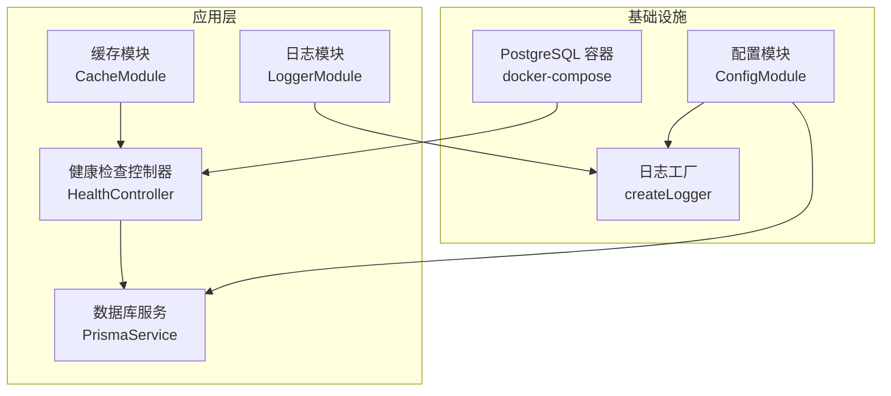
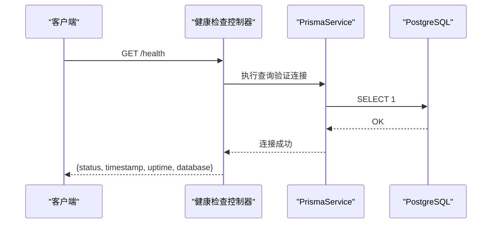
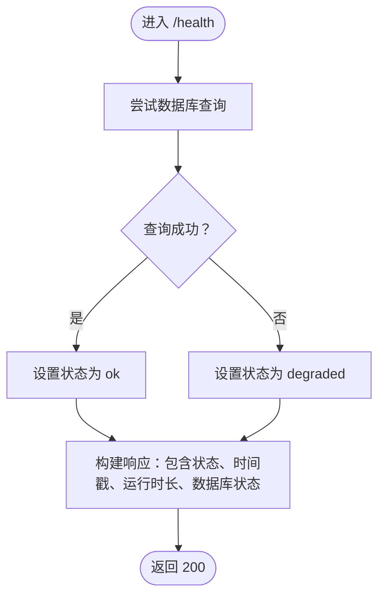
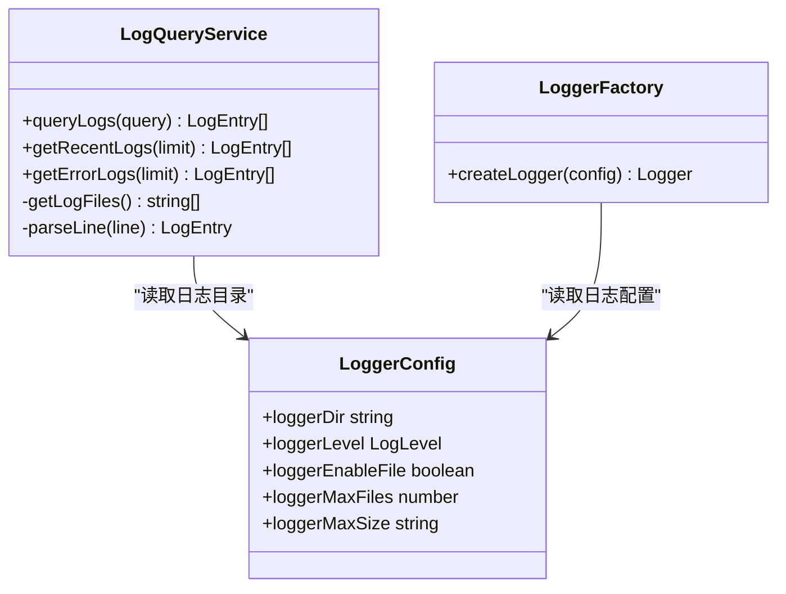
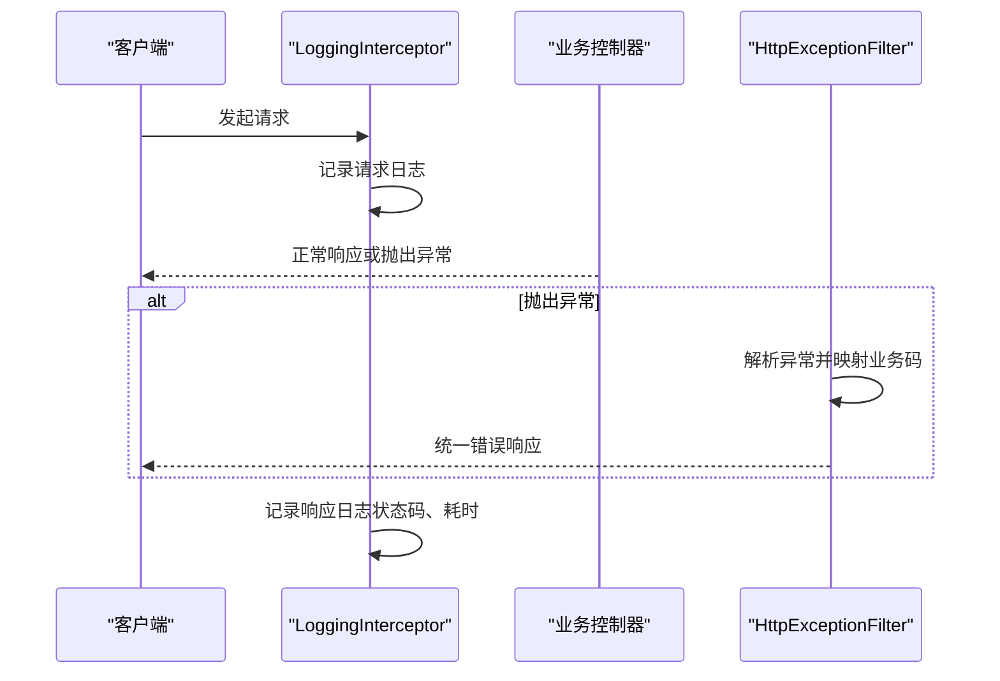
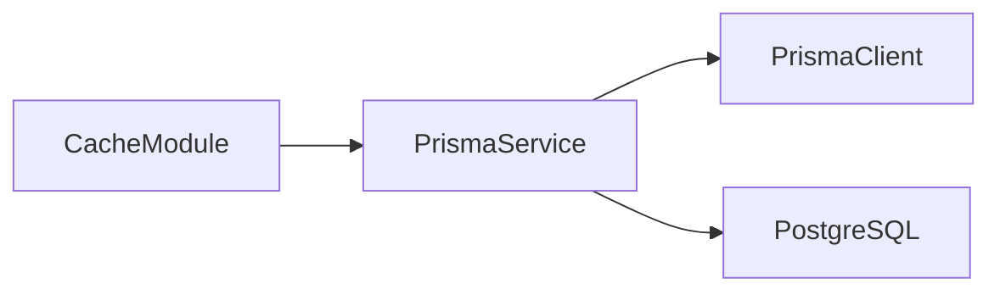
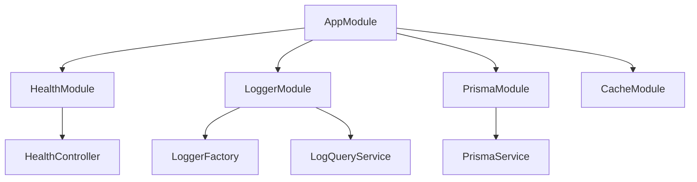

# 监控和维护

<cite>
**本文引用的文件**
- [src/modules/health/health.controller.ts](file://src/modules/health/health.controller.ts)
- [src/modules/logger/logger.module.ts](file://src/modules/logger/logger.module.ts)
- [src/modules/logger/log-query.service.ts](file://src/modules/logger/log-query.service.ts)
- [src/modules/logger/logger.factory.ts](file://src/modules/logger/logger.factory.ts)
- [src/common/constants/log-level.constants.ts](file://src/common/constants/log-level.constants.ts)
- [src/common/interceptors/logging.interceptor.ts](file://src/common/interceptors/logging.interceptor.ts)
- [src/common/filters/http-exception.filter.ts](file://src/common/filters/http-exception.filter.ts)
- [src/common/guards/throttler.guard.ts](file://src/common/guards/throttler.guard.ts)
- [src/config/schemas/logger.schema.ts](file://src/config/schemas/logger.schema.ts)
- [src/config/schemas/database.schema.ts](file://src/config/schemas/database.schema.ts)
- [src/config/config.module.ts](file://src/config/config.module.ts)
- [src/config/typed-config.service.ts](file://src/config/typed-config.service.ts)
- [src/app.module.ts](file://src/app.module.ts)
- [src/prisma/prisma.service.ts](file://src/prisma/prisma.service.ts)
- [docker-compose.yml](file://docker-compose.yml)
- [Dockerfile](file://Dockerfile)
- [package.json](file://package.json)
</cite>

## 目录
1. [简介](#简介)
2. [项目结构](#项目结构)
3. [核心组件](#核心组件)
4. [架构总览](#架构总览)
5. [详细组件分析](#详细组件分析)
6. [依赖关系分析](#依赖关系分析)
7. [性能考量](#性能考量)
8. [故障排查指南](#故障排查指南)
9. [结论](#结论)
10. [附录](#附录)

## 简介
本指南面向运维与开发团队，系统化阐述本项目的监控与维护策略，覆盖健康检查接口、日志管理、错误追踪、数据库与缓存监控、第三方服务监控、监控仪表板与告警、故障自动恢复、定期维护与备份、灾难恢复演练等。文档以仓库现有实现为基础，结合最佳实践给出可操作的配置建议与流程规范。

## 项目结构
项目采用 NestJS 标准分层与模块化组织，监控与维护相关能力主要分布在以下模块与配置：
- 健康检查：独立的健康模块，提供服务状态与数据库连通性检查。
- 日志系统：基于 winston 的多传输器日志工厂，支持控制台与文件输出、按日期轮转、敏感信息脱敏。
- 配置系统：类型安全的配置加载与访问，统一管理日志、数据库等配置项。
- 异常过滤与拦截：统一异常处理与请求日志记录，便于集中观测与追踪。
- 缓存与数据库：集成缓存模块与 Prisma 数据库客户端，支持连接生命周期管理。
- 容器编排：提供 Dockerfile 与 docker-compose，包含数据库健康检查与端口暴露。

图表来源
- [src/modules/health/health.controller.ts:1-86](file://src/modules/health/health.controller.ts#L1-L86)
- [src/modules/logger/logger.module.ts:1-9](file://src/modules/logger/logger.module.ts#L1-L9)
- [src/modules/logger/logger.factory.ts:114-156](file://src/modules/logger/logger.factory.ts#L114-L156)
- [src/prisma/prisma.service.ts:1-44](file://src/prisma/prisma.service.ts#L1-L44)
- [docker-compose.yml:1-37](file://docker-compose.yml#L1-L37)

章节来源
- [src/app.module.ts:1-61](file://src/app.module.ts#L1-L61)
- [src/config/config.module.ts:1-20](file://src/config/config.module.ts#L1-L20)
- [docker-compose.yml:1-37](file://docker-compose.yml#L1-L37)

## 核心组件
- 健康检查接口：提供服务状态、运行时长、数据库连通性与基础 Ping 探测，便于容器编排与外部监控系统拉取。
- 日志系统：统一日志格式、级别、文件轮转与敏感信息脱敏；支持查询最近日志与错误日志。
- 配置系统：类型安全读取配置，支持日志目录、级别、文件开关、最大文件数与大小等。
- 异常过滤与拦截：统一异常响应与请求访问日志，便于集中追踪与审计。
- 缓存与数据库：集成缓存模块与 Prisma 客户端，支持连接生命周期管理与数据库配置。

章节来源
- [src/modules/health/health.controller.ts:1-86](file://src/modules/health/health.controller.ts#L1-L86)
- [src/modules/logger/log-query.service.ts:1-129](file://src/modules/logger/log-query.service.ts#L1-L129)
- [src/modules/logger/logger.factory.ts:114-156](file://src/modules/logger/logger.factory.ts#L114-L156)
- [src/config/schemas/logger.schema.ts:1-13](file://src/config/schemas/logger.schema.ts#L1-L13)
- [src/common/filters/http-exception.filter.ts:1-173](file://src/common/filters/http-exception.filter.ts#L1-L173)
- [src/common/interceptors/logging.interceptor.ts:1-40](file://src/common/interceptors/logging.interceptor.ts#L1-L40)
- [src/prisma/prisma.service.ts:1-44](file://src/prisma/prisma.service.ts#L1-L44)

## 架构总览
下图展示监控与维护相关组件在运行时的交互关系，以及与外部系统的对接点（如数据库、容器编排）：

图表来源
- [src/modules/health/health.controller.ts:48-63](file://src/modules/health/health.controller.ts#L48-L63)
- [src/prisma/prisma.service.ts:36-42](file://src/prisma/prisma.service.ts#L36-L42)

章节来源
- [src/modules/health/health.controller.ts:1-86](file://src/modules/health/health.controller.ts#L1-L86)
- [src/prisma/prisma.service.ts:1-44](file://src/prisma/prisma.service.ts#L1-L44)

## 详细组件分析

### 健康检查组件
- 能力概述
  - 提供根路径健康检查与 Ping 探针，返回服务状态、当前时间、运行时长与数据库连通性。
  - 使用数据库查询进行连通性验证，异常时返回降级状态。
- 关键行为
  - 连接测试：执行一次简单查询以判断数据库可用性。
  - 状态映射：根据连通性映射为 ok 或 degraded。
  - 访问控制：开放接口，跳过节流保护以便外部探测。
- 集成建议
  - 在容器编排中配置健康探针，结合数据库健康检查共同判定整体健康。
  - 将 /health 与 /health/ping 作为外部监控系统与负载均衡器的探测端点。

图表来源
- [src/modules/health/health.controller.ts:48-63](file://src/modules/health/health.controller.ts#L48-L63)

章节来源
- [src/modules/health/health.controller.ts:1-86](file://src/modules/health/health.controller.ts#L1-L86)
- [docker-compose.yml:29-33](file://docker-compose.yml#L29-L33)

### 日志系统组件
- 能力概述
  - 统一日志格式与级别，支持控制台与文件双通道输出。
  - 按日期轮转日志文件，区分普通日志与错误日志，限制最大文件数与单文件大小。
  - 敏感字段自动脱敏，避免泄露。
  - 提供日志查询服务，支持按级别、关键词、模块、时间范围与上限限制检索。
- 关键行为
  - 日志工厂：根据配置动态启用文件输出，构造控制台与文件传输器。
  - 查询服务：扫描日志目录，解析日志行，支持多条件过滤与排序。
  - 级别常量：统一定义日志级别枚举，便于配置校验与一致性。
- 配置要点
  - 日志目录、级别、是否启用文件、最大文件数、最大尺寸等均来自类型化配置。
- 运维建议
  - 生产环境建议开启文件输出，并配合外部日志收集系统（如 ELK、Loki）采集。
  - 定期清理旧日志，确保磁盘空间可控。

图表来源
- [src/modules/logger/log-query.service.ts:24-129](file://src/modules/logger/log-query.service.ts#L24-L129)
- [src/modules/logger/logger.factory.ts:114-156](file://src/modules/logger/logger.factory.ts#L114-L156)
- [src/config/schemas/logger.schema.ts:4-10](file://src/config/schemas/logger.schema.ts#L4-L10)

章节来源
- [src/modules/logger/log-query.service.ts:1-129](file://src/modules/logger/log-query.service.ts#L1-L129)
- [src/modules/logger/logger.factory.ts:1-156](file://src/modules/logger/logger.factory.ts#L1-L156)
- [src/common/constants/log-level.constants.ts:1-10](file://src/common/constants/log-level.constants.ts#L1-L10)
- [src/config/schemas/logger.schema.ts:1-13](file://src/config/schemas/logger.schema.ts#L1-L13)

### 请求日志与异常追踪
- 请求日志拦截器
  - 记录请求方法、URL、用户标识、IP、UA、耗时与状态码，便于审计与问题定位。
- 异常过滤器
  - 将业务异常与通用 HTTP 异常映射为统一的业务码与消息，记录警告日志并返回标准化错误响应。
  - 支持 Zod 校验异常与 class-validator 校验错误的格式化输出。
- 节流守卫
  - 可通过装饰器跳过节流，健康检查等内部接口可绕过限流保护。

图表来源
- [src/common/interceptors/logging.interceptor.ts:16-38](file://src/common/interceptors/logging.interceptor.ts#L16-L38)
- [src/common/filters/http-exception.filter.ts:28-78](file://src/common/filters/http-exception.filter.ts#L28-L78)
- [src/common/guards/throttler.guard.ts:20-31](file://src/common/guards/throttler.guard.ts#L20-L31)

章节来源
- [src/common/interceptors/logging.interceptor.ts:1-40](file://src/common/interceptors/logging.interceptor.ts#L1-L40)
- [src/common/filters/http-exception.filter.ts:1-173](file://src/common/filters/http-exception.filter.ts#L1-L173)
- [src/common/guards/throttler.guard.ts:1-33](file://src/common/guards/throttler.guard.ts#L1-L33)

### 数据库与缓存监控
- 数据库
  - Prisma 客户端在模块初始化时建立连接，在销毁时断开，便于统一生命周期管理。
  - 数据库配置支持提供者类型、URL、最大连接数与日志开关。
- 缓存
  - 应用模块已引入缓存模块，可用于缓存热点数据与会话存储，降低数据库压力。
- 监控建议
  - 结合健康检查接口与数据库连接状态，形成数据库可用性监控。
  - 在生产环境开启数据库日志（若需要）以辅助诊断慢查询与连接问题。

图表来源
- [src/prisma/prisma.service.ts:18-42](file://src/prisma/prisma.service.ts#L18-L42)
- [src/config/schemas/database.schema.ts:3-8](file://src/config/schemas/database.schema.ts#L3-L8)
- [src/app.module.ts:9-31](file://src/app.module.ts#L9-L31)

章节来源
- [src/prisma/prisma.service.ts:1-44](file://src/prisma/prisma.service.ts#L1-L44)
- [src/config/schemas/database.schema.ts:1-11](file://src/config/schemas/database.schema.ts#L1-L11)
- [src/app.module.ts:1-61](file://src/app.module.ts#L1-L61)

### 第三方服务监控
- 当前项目未内置对第三方服务的专用监控组件，建议通过以下方式扩展：
  - 在业务模块中增加对外部服务的健康检查接口与超时重试策略。
  - 使用统一异常过滤器捕获网络异常并记录上下文信息。
  - 通过日志与指标系统（如 Prometheus/OpenTelemetry）采集调用链路与错误率。

[本节为概念性内容，不直接分析具体文件，故无章节来源]

## 依赖关系分析
- 组件耦合
  - 健康检查依赖数据库服务进行连通性验证。
  - 日志工厂依赖类型化配置读取日志参数。
  - 请求拦截器与异常过滤器分别作用于请求生命周期与异常处理阶段。
- 外部依赖
  - winston 与 daily rotate file 用于日志输出与轮转。
  - Prisma 与数据库适配器用于数据库访问。
  - Docker 与 docker-compose 用于容器化部署与数据库健康检查。

图表来源
- [src/app.module.ts:18-32](file://src/app.module.ts#L18-L32)
- [src/modules/health/health.controller.ts:11-12](file://src/modules/health/health.controller.ts#L11-L12)
- [src/modules/logger/logger.module.ts:4-7](file://src/modules/logger/logger.module.ts#L4-L7)
- [src/modules/logger/log-query.service.ts:24-29](file://src/modules/logger/log-query.service.ts#L24-L29)
- [src/prisma/prisma.service.ts:18-34](file://src/prisma/prisma.service.ts#L18-L34)

章节来源
- [src/app.module.ts:1-61](file://src/app.module.ts#L1-L61)
- [package.json:26-54](file://package.json#L26-L54)

## 性能考量
- 日志性能
  - 控制台输出默认开启，文件输出需显式启用；生产环境建议开启文件输出并合理设置轮转参数，避免频繁 IO。
  - 合理选择日志级别，避免在高并发场景输出过多调试信息。
- 数据库性能
  - 合理设置最大连接数，避免连接池耗尽。
  - 在生产环境谨慎开启数据库日志，避免对性能造成影响。
- 缓存命中
  - 利用缓存模块提升热点数据访问性能，减少数据库压力。
- 请求处理
  - 通过拦截器记录请求耗时，结合异常过滤器统计错误率，识别性能瓶颈。

[本节提供一般性指导，不直接分析具体文件，故无章节来源]

## 故障排查指南
- 健康检查失败
  - 检查数据库连接字符串与网络连通性；确认数据库服务健康状态。
  - 观察健康检查返回的数据库状态与服务运行时长，判断是否为降级状态。
- 日志无法写入或缺失
  - 确认日志目录存在且具备写权限；检查文件输出开关与轮转参数。
  - 使用日志查询服务检索最近日志与错误日志，定位异常上下文。
- 异常响应不一致
  - 检查异常过滤器对业务异常与通用异常的映射逻辑，确保错误码与消息符合预期。
- 数据库连接问题
  - 查看 Prisma 客户端连接与断开日志，确认连接生命周期管理正常。
- 容器健康
  - 确认数据库健康检查配置与端口暴露，确保容器编排能够正确识别服务状态。

章节来源
- [src/modules/health/health.controller.ts:48-63](file://src/modules/health/health.controller.ts#L48-L63)
- [src/modules/logger/log-query.service.ts:31-90](file://src/modules/logger/log-query.service.ts#L31-L90)
- [src/common/filters/http-exception.filter.ts:28-78](file://src/common/filters/http-exception.filter.ts#L28-L78)
- [src/prisma/prisma.service.ts:36-42](file://src/prisma/prisma.service.ts#L36-L42)
- [docker-compose.yml:29-33](file://docker-compose.yml#L29-L33)

## 结论
本项目已具备完善的健康检查、日志管理与异常处理基础能力，结合容器化部署与类型化配置，可快速落地监控与维护体系。建议在现有基础上扩展指标采集、告警规则与自动化恢复机制，并制定定期维护与备份演练计划，持续提升系统的可观测性与韧性。

[本节为总结性内容，不直接分析具体文件，故无章节来源]

## 附录

### 监控仪表板与告警配置建议
- 仪表板
  - 服务健康状态、数据库连通性、请求量与错误率、响应时间分布、日志级别占比。
- 告警规则
  - 健康检查连续失败阈值、数据库连接断开、错误率突增、响应时间超阈、磁盘空间不足。
- 自动恢复
  - 结合容器编排的重启策略与健康检查，实现数据库不可用时的自动重启与切换。

[本节为概念性内容，不直接分析具体文件，故无章节来源]

### 定期维护与备份策略
- 维护任务
  - 清理过期日志文件、检查磁盘空间、更新依赖与补丁。
- 数据备份
  - 定期导出数据库快照，验证备份完整性与恢复流程。
- 灾难恢复演练
  - 定期进行数据库与应用服务的故障切换演练，评估 RTO/RPO 指标。

[本节为概念性内容，不直接分析具体文件，故无章节来源]