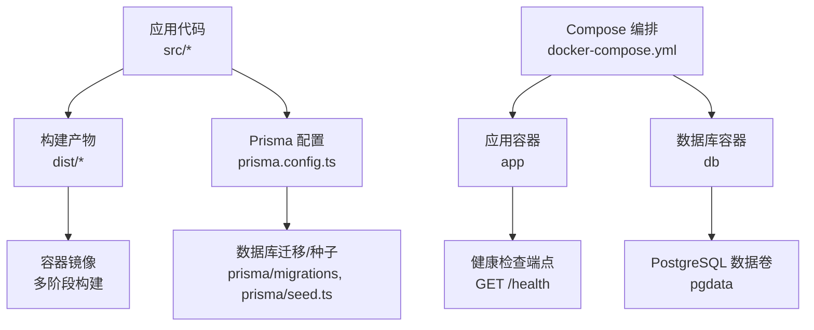
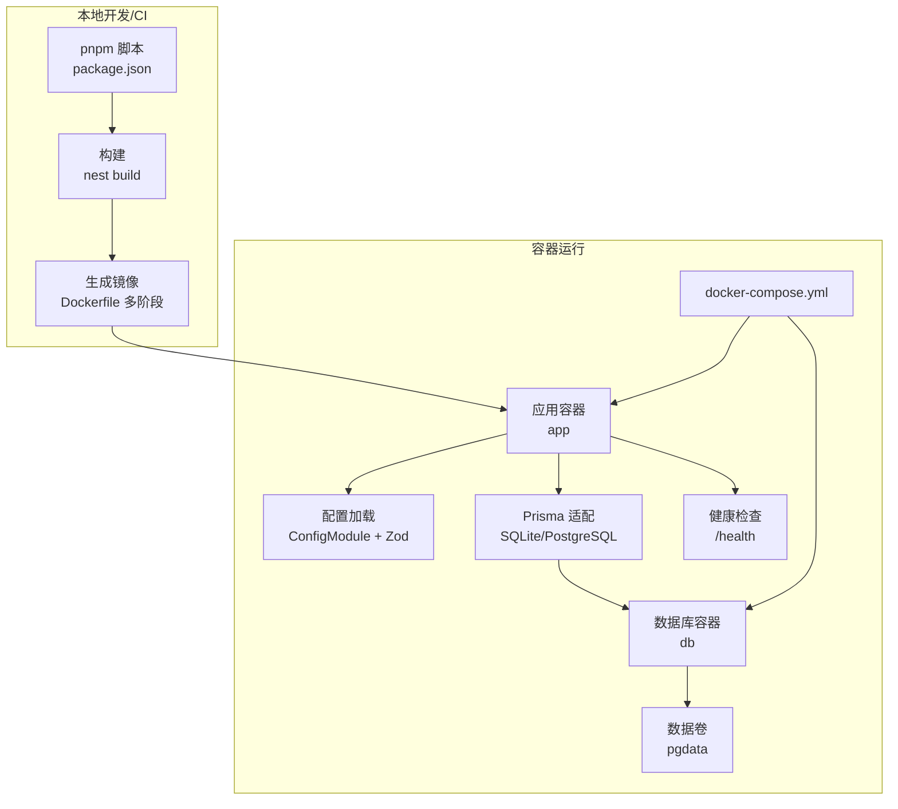
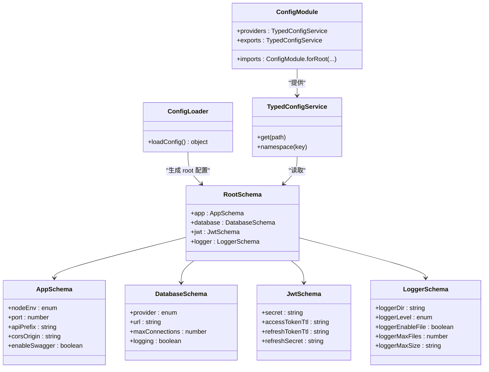
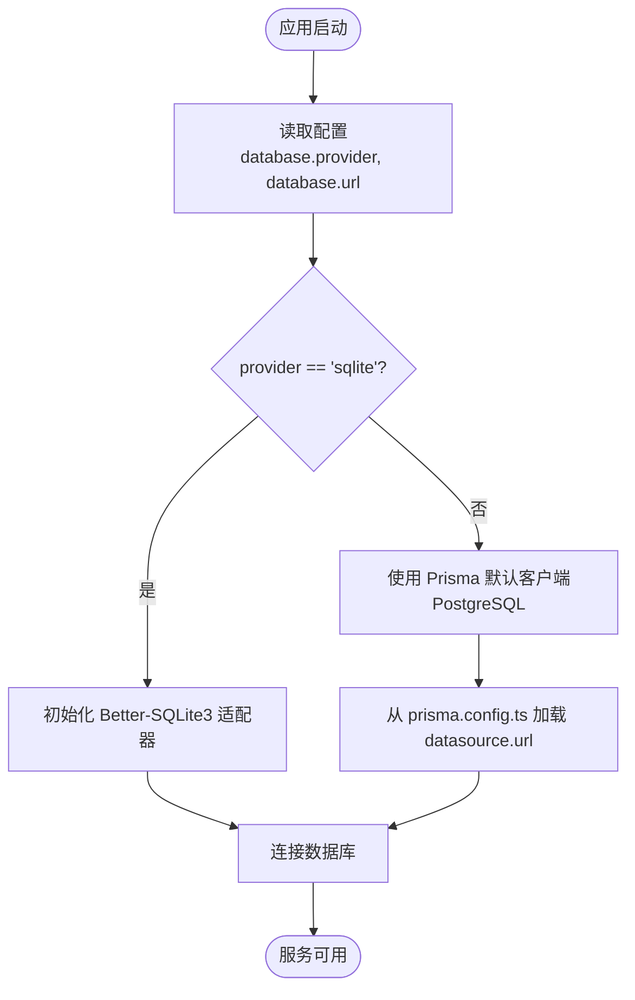
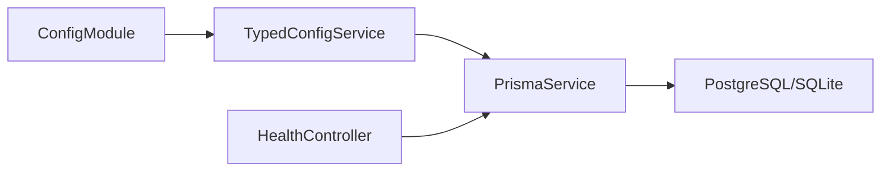

# 部署和运维

<cite>
**本文引用的文件**
- [Dockerfile](file://Dockerfile)
- [docker-compose.yml](file://docker-compose.yml)
- [package.json](file://package.json)
- [prisma.config.ts](file://prisma.config.ts)
- [src/config/config-loader.ts](file://src/config/config-loader.ts)
- [src/config/config.module.ts](file://src/config/config.module.ts)
- [src/config/typed-config.service.ts](file://src/config/typed-config.service.ts)
- [src/config/schemas/root.schema.ts](file://src/config/schemas/root.schema.ts)
- [src/config/schemas/app.schema.ts](file://src/config/schemas/app.schema.ts)
- [src/config/schemas/database.schema.ts](file://src/config/schemas/database.schema.ts)
- [src/config/schemas/jwt.schema.ts](file://src/config/schemas/jwt.schema.ts)
- [src/config/schemas/logger.schema.ts](file://src/config/schemas/logger.schema.ts)
- [src/prisma/prisma.service.ts](file://src/prisma/prisma.service.ts)
- [src/modules/health/health.controller.ts](file://src/modules/health/health.controller.ts)
- [.dockerignore](file://.dockerignore)
- [README.md](file://README.md)
</cite>

## 目录
1. [简介](#简介)
2. [项目结构](#项目结构)
3. [核心组件](#核心组件)
4. [架构总览](#架构总览)
5. [详细组件分析](#详细组件分析)
6. [依赖分析](#依赖分析)
7. [性能考虑](#性能考虑)
8. [故障排除指南](#故障排除指南)
9. [结论](#结论)
10. [附录](#附录)

## 简介
本指南面向部署与运维团队，围绕该 NestJS 项目的容器化部署、环境配置管理与生产优化展开，覆盖以下主题：
- Docker 多阶段构建与镜像打包
- 环境变量与配置校验体系
- 生产部署步骤与健康检查
- 性能调优与监控建议
- 故障排除与常见问题
- CI/CD 流水线与版本管理策略
- 安全加固、备份与灾备建议

## 项目结构
该项目采用 NestJS 11 + Prisma 7 的技术栈，使用 pnpm 管理依赖，并通过多阶段 Docker 构建进行打包。配置系统基于 @nestjs/config 与 Zod Schema 实现强类型与运行时校验。

图表来源
- [Dockerfile:1-20](file://Dockerfile#L1-L20)
- [docker-compose.yml:1-37](file://docker-compose.yml#L1-L37)
- [prisma.config.ts:1-14](file://prisma.config.ts#L1-L14)

章节来源
- [Dockerfile:1-20](file://Dockerfile#L1-L20)
- [docker-compose.yml:1-37](file://docker-compose.yml#L1-L37)
- [package.json:1-88](file://package.json#L1-L88)

## 核心组件
- 容器镜像与多阶段构建：使用 Node.js 22 Alpine 作为基础镜像，分别在 build 阶段安装依赖与编译，在 runtime 阶段仅包含运行时依赖与构建产物，减少镜像体积与攻击面。
- 环境变量与配置加载：通过自定义配置加载器与 Zod Schema 对环境变量进行严格校验与类型推断，确保启动前发现配置错误。
- 数据库适配：根据配置选择 SQLite 或 PostgreSQL；PostgreSQL 通过 Prisma 配置文件集中管理数据源 URL。
- 健康检查：提供 /health 与 /health/ping 端点，用于容器编排与平台健康探测。
- 日志与监控：日志级别、文件轮转等参数通过配置项控制，便于生产环境落地。

章节来源
- [Dockerfile:1-20](file://Dockerfile#L1-L20)
- [src/config/config-loader.ts:1-53](file://src/config/config-loader.ts#L1-L53)
- [src/config/schemas/root.schema.ts:1-21](file://src/config/schemas/root.schema.ts#L1-L21)
- [src/prisma/prisma.service.ts:1-44](file://src/prisma/prisma.service.ts#L1-L44)
- [src/modules/health/health.controller.ts:1-86](file://src/modules/health/health.controller.ts#L1-L86)

## 架构总览
下图展示从本地构建到容器运行的整体流程，以及关键配置与依赖关系。

图表来源
- [package.json:8-25](file://package.json#L8-L25)
- [Dockerfile:1-20](file://Dockerfile#L1-L20)
- [docker-compose.yml:1-37](file://docker-compose.yml#L1-L37)
- [src/config/config.module.ts:1-20](file://src/config/config.module.ts#L1-L20)
- [src/prisma/prisma.service.ts:1-44](file://src/prisma/prisma.service.ts#L1-L44)
- [src/modules/health/health.controller.ts:1-86](file://src/modules/health/health.controller.ts#L1-L86)

## 详细组件分析

### Dockerfile 与多阶段构建
- 基础镜像：使用 Node.js 22 Alpine，启用 Corepack 以固定 pnpm 版本。
- 构建阶段：复制包清单 → 安装依赖（锁定文件）→ 复制源码 → 执行构建。
- 运行阶段：仅安装生产依赖，拷贝构建产物与 Prisma 相关文件，暴露 3000 端口，使用 node 启动入口。
- 最佳实践要点：
  - 使用 --frozen-lockfile 保证依赖一致性。
  - 仅拷贝必要文件，避免无关目录进入镜像。
  - 运行时镜像不包含开发依赖，降低攻击面。

章节来源
- [Dockerfile:1-20](file://Dockerfile#L1-L20)
- [package.json:8-25](file://package.json#L8-L25)

### docker-compose 编排与环境变量
- 应用服务：
  - 端口映射：3000:3000
  - 环境变量：NODE_ENV、DATABASE_PROVIDER、DATABASE_URL、JWT_*、CORS_ORIGIN 等
  - 依赖：db 健康后再启动
- 数据库服务：
  - 镜像：postgres:17-alpine
  - 用户/密码/库名：通过环境变量配置
  - 数据卷：pgdata
  - 健康检查：使用 pg_isready

章节来源
- [docker-compose.yml:1-37](file://docker-compose.yml#L1-L37)

### 配置加载与 Zod 校验
- 自定义加载器：
  - 将扁平的 process.env 转换为分层命名空间（app、database、jwt、logger）
  - 使用 Zod Schema 进行类型转换与约束校验
  - 校验失败时输出详细错误并阻止启动
- 全局配置模块：
  - 注册 ConfigModule.forRoot，加载自定义配置工厂
  - 在生产环境忽略 .env 文件，避免污染
- 类型化访问：
  - TypedConfigService 提供 get(path) 与 namespace(namespace) 访问方式

图表来源
- [src/config/config-loader.ts:1-53](file://src/config/config-loader.ts#L1-L53)
- [src/config/schemas/root.schema.ts:1-21](file://src/config/schemas/root.schema.ts#L1-L21)
- [src/config/schemas/app.schema.ts:1-12](file://src/config/schemas/app.schema.ts#L1-L12)
- [src/config/schemas/database.schema.ts:1-11](file://src/config/schemas/database.schema.ts#L1-L11)
- [src/config/schemas/jwt.schema.ts:1-11](file://src/config/schemas/jwt.schema.ts#L1-L11)
- [src/config/schemas/logger.schema.ts:1-13](file://src/config/schemas/logger.schema.ts#L1-L13)
- [src/config/config.module.ts:1-20](file://src/config/config.module.ts#L1-L20)
- [src/config/typed-config.service.ts:1-48](file://src/config/typed-config.service.ts#L1-L48)

章节来源
- [src/config/config-loader.ts:1-53](file://src/config/config-loader.ts#L1-L53)
- [src/config/config.module.ts:1-20](file://src/config/config.module.ts#L1-L20)
- [src/config/typed-config.service.ts:1-48](file://src/config/typed-config.service.ts#L1-L48)
- [src/config/schemas/root.schema.ts:1-21](file://src/config/schemas/root.schema.ts#L1-L21)
- [src/config/schemas/app.schema.ts:1-12](file://src/config/schemas/app.schema.ts#L1-L12)
- [src/config/schemas/database.schema.ts:1-11](file://src/config/schemas/database.schema.ts#L1-L11)
- [src/config/schemas/jwt.schema.ts:1-11](file://src/config/schemas/jwt.schema.ts#L1-L11)
- [src/config/schemas/logger.schema.ts:1-13](file://src/config/schemas/logger.schema.ts#L1-L13)

### 数据库适配与 Prisma 配置
- 适配逻辑：
  - 若 provider 为 sqlite，则使用 Better-SQLite3 适配器并可指定文件路径
  - 若 provider 为 postgresql，则通过 Prisma 配置文件集中管理数据源 URL
- Prisma 配置：
  - 使用 prisma/config 的 defineConfig，集中定义 schema、migrations、datasource.url
  - datasource.url 来源于环境变量 DATABASE_URL

图表来源
- [src/prisma/prisma.service.ts:1-44](file://src/prisma/prisma.service.ts#L1-L44)
- [prisma.config.ts:1-14](file://prisma.config.ts#L1-L14)

章节来源
- [src/prisma/prisma.service.ts:1-44](file://src/prisma/prisma.service.ts#L1-L44)
- [prisma.config.ts:1-14](file://prisma.config.ts#L1-L14)

### 健康检查与可观测性
- 健康检查端点：
  - GET /health：返回服务状态、时间戳、运行时长与数据库连接状态
  - GET /health/ping：简单响应，便于快速探测
- 建议：
  - 在容器编排中配置 readiness/liveness 探针，结合 /health
  - 将日志级别与文件轮转参数纳入配置，便于生产采集

章节来源
- [src/modules/health/health.controller.ts:1-86](file://src/modules/health/health.controller.ts#L1-L86)

## 依赖分析
- 组件耦合：
  - AppModule 通过 ConfigModule 注入 TypedConfigService，PrismaService 依赖 TypedConfigService 获取数据库配置
  - HealthController 依赖 PrismaService 执行数据库连通性检测
- 外部依赖：
  - PostgreSQL 数据库（通过 docker-compose）
  - Prisma 适配器（SQLite 或 PostgreSQL）

图表来源
- [src/config/config.module.ts:1-20](file://src/config/config.module.ts#L1-L20)
- [src/config/typed-config.service.ts:1-48](file://src/config/typed-config.service.ts#L1-L48)
- [src/prisma/prisma.service.ts:1-44](file://src/prisma/prisma.service.ts#L1-L44)
- [src/modules/health/health.controller.ts:1-86](file://src/modules/health/health.controller.ts#L1-L86)

章节来源
- [src/config/config.module.ts:1-20](file://src/config/config.module.ts#L1-L20)
- [src/config/typed-config.service.ts:1-48](file://src/config/typed-config.service.ts#L1-L48)
- [src/prisma/prisma.service.ts:1-44](file://src/prisma/prisma.service.ts#L1-L44)
- [src/modules/health/health.controller.ts:1-86](file://src/modules/health/health.controller.ts#L1-L86)

## 性能考虑
- 构建与镜像：
  - 多阶段构建减少运行时镜像体积，提升拉取与启动速度
  - 使用 --frozen-lockfile 与生产依赖安装，避免不必要的层变化
- 运行时：
  - 合理设置数据库最大连接数与日志级别，避免 I/O 抖动
  - 在容器编排中限制 CPU/内存资源，配合健康检查实现弹性伸缩
- 数据库：
  - PostgreSQL 建议开启连接池与慢查询日志，结合监控指标进行优化
  - SQLite 适合小规模或开发测试，生产建议使用 PostgreSQL

## 故障排除指南
- 启动失败（配置校验错误）：
  - 现象：启动即退出并输出环境变量校验失败
  - 排查：核对 NODE_ENV、DATABASE_URL、JWT_SECRET、JWT_REFRESH_SECRET 等是否满足最小长度与格式要求
- 数据库连接异常：
  - 现象：/health 返回 degraded，数据库字段为 disconnected
  - 排查：确认 DATABASE_PROVIDER 与 DATABASE_URL 是否正确；PostgreSQL 场景检查网络连通与凭据
- 健康检查失败：
  - 现象：容器被反复重启
  - 排查：查看容器日志；确认 db 服务已健康；检查 /health 与 /health/ping 可达性
- 日志问题：
  - 现象：日志缺失或过大
  - 排查：调整 LOGGER_LEVEL、LOGGER_ENABLE_FILE、LOGGER_MAX_SIZE、LOGGER_MAX_FILES 等参数

章节来源
- [src/config/config-loader.ts:39-46](file://src/config/config-loader.ts#L39-L46)
- [src/modules/health/health.controller.ts:48-63](file://src/modules/health/health.controller.ts#L48-L63)
- [src/config/schemas/jwt.schema.ts:4,7](file://src/config/schemas/jwt.schema.ts#L4,L7)
- [src/config/schemas/database.schema.ts:5](file://src/config/schemas/database.schema.ts#L5)
- [src/config/schemas/logger.schema.ts:6,7,9](file://src/config/schemas/logger.schema.ts#L6,L7,L9)

## 结论
本项目提供了完善的容器化与配置体系，具备良好的可运维性。建议在生产环境中进一步完善 CI/CD、监控告警、备份与灾备策略，持续优化数据库与日志配置，确保高可用与可观察性。

## 附录

### 生产部署步骤（建议流程）
- 准备环境：
  - 准备 PostgreSQL 实例与网络连通
  - 生成并妥善保管 JWT 密钥（长度≥32），设置 CORS_ORIGIN
- 构建镜像：
  - 使用多阶段 Dockerfile 构建镜像
- 编排与启动：
  - 使用 docker-compose 启动，确保 db 健康后再启动 app
- 健康检查：
  - 在编排平台配置 liveness/readiness 探针，指向 /health
- 监控与日志：
  - 配置日志级别与文件轮转，接入统一日志平台
- 安全加固：
  - 限制容器权限与网络；使用只读根文件系统；定期更新基础镜像
- 备份与灾备：
  - PostgreSQL 数据卷定期快照；制定恢复演练计划

### CI/CD 流水线与版本管理（建议）
- 触发条件：
  - push 到主分支或打标签
- 步骤建议：
  - 代码检查（ESLint、TypeCheck）
  - 单元测试与端到端测试
  - 构建镜像并推送至镜像仓库
  - 应用 docker-compose 部署（或对接编排平台）
  - 健康检查验证
  - 发布制品与版本标签
- 版本管理：
  - 使用语义化版本（SemVer），以标签区分发布版本

### 安全加固、备份与灾备
- 安全加固：
  - 使用非 root 用户运行容器；最小权限原则
  - 禁止明文传输，强制 HTTPS；合理设置 CORS
  - 定期轮换 JWT 密钥；限制请求频率与并发
- 备份策略：
  - PostgreSQL 数据卷定期快照；导出 SQL 作为补充
- 灾难恢复：
  - 制定恢复时间目标（RTO）与恢复点目标（RPO）
  - 定期演练恢复流程，验证备份数据可用性