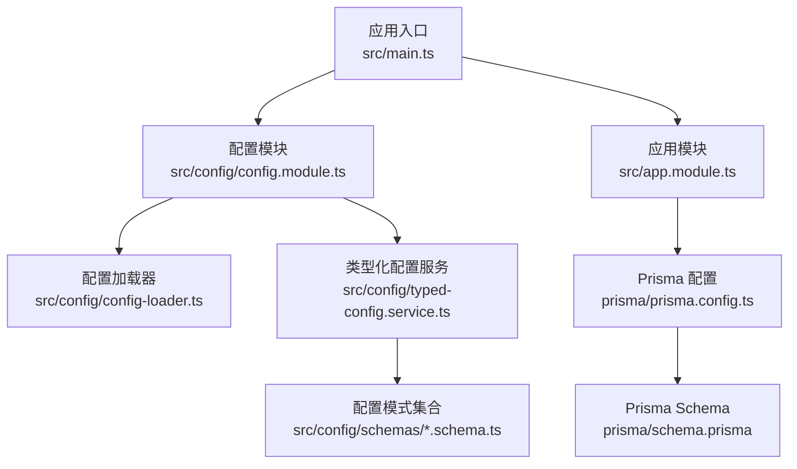
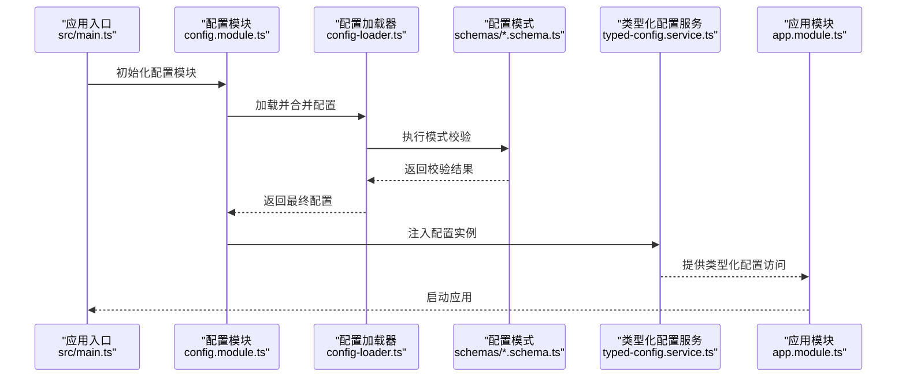
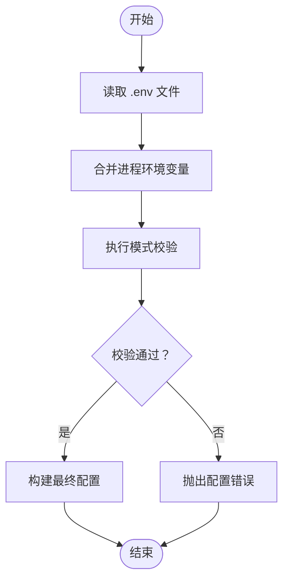
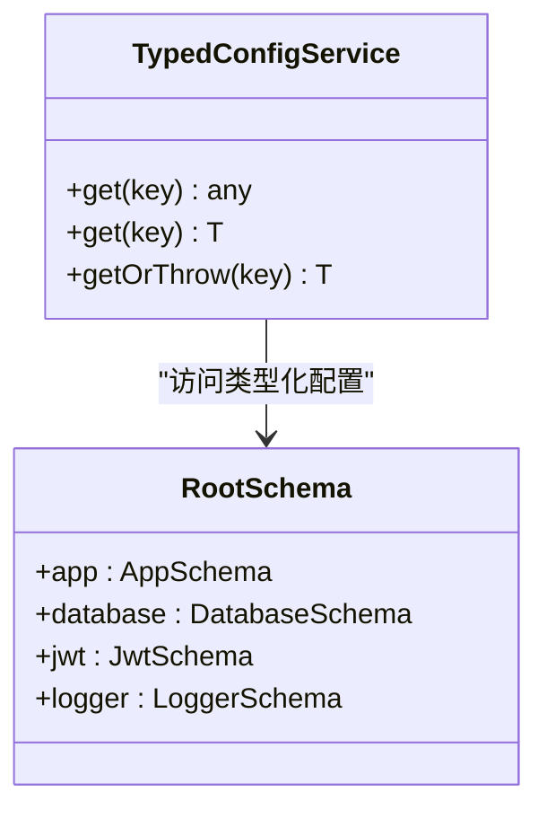
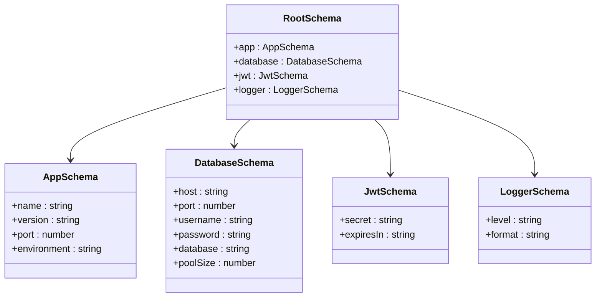
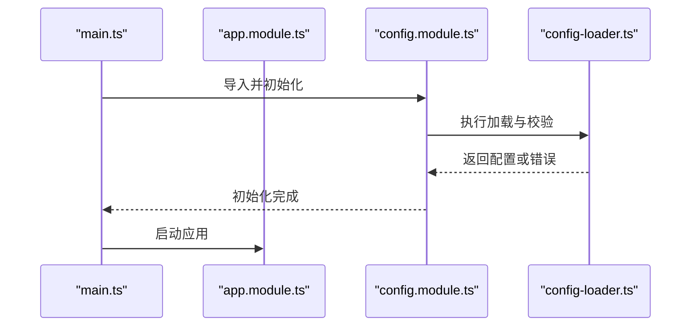
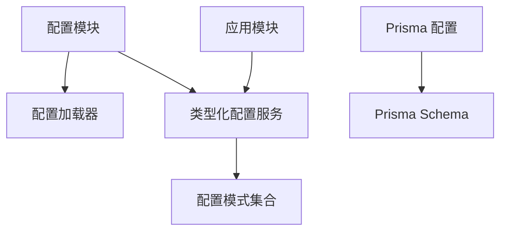

# 环境变量管理

<cite>
**本文档引用的文件**
- [package.json](file://package.json)
- [src/main.ts](file://src/main.ts)
- [src/app.module.ts](file://src/app.module.ts)
- [src/config/config.module.ts](file://src/config/config.module.ts)
- [src/config/config-loader.ts](file://src/config/config-loader.ts)
- [src/config/typed-config.service.ts](file://src/config/typed-config.service.ts)
- [src/config/types.ts](file://src/config/types.ts)
- [src/config/schemas/root.schema.ts](file://src/config/schemas/root.schema.ts)
- [src/config/schemas/app.schema.ts](file://src/config/schemas/app.schema.ts)
- [src/config/schemas/database.schema.ts](file://src/config/schemas/database.schema.ts)
- [src/config/schemas/jwt.schema.ts](file://src/config/schemas/jwt.schema.ts)
- [src/config/schemas/logger.schema.ts](file://src/config/schemas/logger.schema.ts)
- [prisma/schema.prisma](file://prisma/schema.prisma)
- [prisma/prisma.config.ts](file://prisma/prisma.config.ts)
- [docker-compose.yml](file://docker-compose.yml)
- [Dockerfile](file://Dockerfile)
- [.dockerignore](file://.dockerignore)
- [README.md](file://README.md)
</cite>

## 目录

1. [简介](#简介)
2. [项目结构](#项目结构)
3. [核心组件](#核心组件)
4. [架构总览](#架构总览)
5. [详细组件分析](#详细组件分析)
6. [依赖关系分析](#依赖关系分析)
7. [性能考虑](#性能考虑)
8. [故障排除指南](#故障排除指南)
9. [结论](#结论)
10. [附录](#附录)

## 简介

本文件系统性阐述该 NestJS 项目的环境变量管理机制与最佳实践，重点覆盖以下方面：

- 环境变量的加载流程与处理策略
- .env 文件的使用方式与优先级覆盖规则
- 开发、测试、生产环境的差异化配置管理
- ignoreEnvFile 选项在不同环境下的行为
- 敏感信息处理、配置模板与环境切换方法
- 配置验证失败的故障排除与调试技巧

## 项目结构

该项目采用模块化架构，环境变量管理集中在 config 子系统中，并通过类型化配置服务统一暴露给应用模块。关键文件与职责如下：

- 配置加载器：负责从 .env 文件与进程环境变量中合并配置
- 类型化配置服务：提供强类型访问接口，确保编译期与运行期安全
- 配置模式（Schema）：定义各子系统的配置键、默认值与校验规则
- 应用入口：在启动时初始化配置模块并进行验证

**图表来源**

- [src/main.ts](file://src/main.ts)
- [src/config/config.module.ts](file://src/config/config.module.ts)
- [src/config/config-loader.ts](file://src/config/config-loader.ts)
- [src/config/typed-config.service.ts](file://src/config/typed-config.service.ts)
- [src/config/schemas/root.schema.ts](file://src/config/schemas/root.schema.ts)
- [prisma/prisma.config.ts](file://prisma/prisma.config.ts)
- [prisma/schema.prisma](file://prisma/schema.prisma)

**章节来源**

- [src/main.ts](file://src/main.ts)
- [src/config/config.module.ts](file://src/config/config.module.ts)
- [src/config/config-loader.ts](file://src/config/config-loader.ts)
- [src/config/typed-config.service.ts](file://src/config/typed-config.service.ts)
- [src/config/schemas/root.schema.ts](file://src/config/schemas/root.schema.ts)
- [prisma/prisma.config.ts](file://prisma/prisma.config.ts)
- [prisma/schema.prisma](file://prisma/schema.prisma)

## 核心组件

- 配置加载器：负责读取 .env 文件、合并进程环境变量、执行模式校验并生成最终配置对象
- 类型化配置服务：封装配置访问，提供类型安全的 getter 方法与默认值处理
- 配置模式（Schema）：按功能域拆分（如 app、database、jwt、logger），每个模式定义键名、类型、是否必需及默认值
- 应用入口：在应用启动前完成配置初始化与验证，确保应用在错误配置下无法启动

**章节来源**

- [src/config/config-loader.ts](file://src/config/config-loader.ts)
- [src/config/typed-config.service.ts](file://src/config/typed-config.service.ts)
- [src/config/schemas/root.schema.ts](file://src/config/schemas/root.schema.ts)
- [src/config/schemas/app.schema.ts](file://src/config/schemas/app.schema.ts)
- [src/config/schemas/database.schema.ts](file://src/config/schemas/database.schema.ts)
- [src/config/schemas/jwt.schema.ts](file://src/config/schemas/jwt.schema.ts)
- [src/config/schemas/logger.schema.ts](file://src/config/schemas/logger.schema.ts)

## 架构总览

下图展示了环境变量从加载到应用的完整流程，包括 .env 与进程环境变量的合并、模式校验以及类型化访问。

**图表来源**

- [src/main.ts](file://src/main.ts)
- [src/config/config.module.ts](file://src/config/config.module.ts)
- [src/config/config-loader.ts](file://src/config/config-loader.ts)
- [src/config/typed-config.service.ts](file://src/config/typed-config.service.ts)
- [src/config/schemas/root.schema.ts](file://src/config/schemas/root.schema.ts)

## 详细组件分析

### 配置加载器（ConfigLoader）

- 职责：读取 .env 文件、合并进程环境变量、执行模式校验、生成最终配置
- 关键点：
  - 支持从 .env 文件加载键值对
  - 进程环境变量可覆盖 .env 中的同名键
  - 模式校验失败时抛出异常，阻止应用启动
  - 输出最终配置对象供类型化服务使用

**图表来源**

- [src/config/config-loader.ts](file://src/config/config-loader.ts)
- [src/config/schemas/root.schema.ts](file://src/config/schemas/root.schema.ts)

**章节来源**

- [src/config/config-loader.ts](file://src/config/config-loader.ts)
- [src/config/schemas/root.schema.ts](file://src/config/schemas/root.schema.ts)

### 类型化配置服务（TypedConfigService）

- 职责：提供类型安全的配置访问接口，支持默认值与嵌套键访问
- 关键点：
  - 将配置对象转换为强类型接口
  - 在访问不存在的键时返回默认值或抛出明确错误
  - 与各模式（app、database、jwt、logger）协同工作

**图表来源**

- [src/config/typed-config.service.ts](file://src/config/typed-config.service.ts)
- [src/config/schemas/root.schema.ts](file://src/config/schemas/root.schema.ts)

**章节来源**

- [src/config/typed-config.service.ts](file://src/config/typed-config.service.ts)
- [src/config/schemas/root.schema.ts](file://src/config/schemas/root.schema.ts)

### 配置模式（Schemas）

- 根模式（root.schema.ts）：聚合所有子模式，定义顶层键空间
- 应用模式（app.schema.ts）：应用基本信息、端口、环境等
- 数据库模式（database.schema.ts）：数据库连接参数、池配置等
- JWT 模式（jwt.schema.ts）：令牌密钥、过期时间等
- 日志模式（logger.schema.ts）：日志级别、输出格式等

**图表来源**

- [src/config/schemas/root.schema.ts](file://src/config/schemas/root.schema.ts)
- [src/config/schemas/app.schema.ts](file://src/config/schemas/app.schema.ts)
- [src/config/schemas/database.schema.ts](file://src/config/schemas/database.schema.ts)
- [src/config/schemas/jwt.schema.ts](file://src/config/schemas/jwt.schema.ts)
- [src/config/schemas/logger.schema.ts](file://src/config/schemas/logger.schema.ts)

**章节来源**

- [src/config/schemas/root.schema.ts](file://src/config/schemas/root.schema.ts)
- [src/config/schemas/app.schema.ts](file://src/config/schemas/app.schema.ts)
- [src/config/schemas/database.schema.ts](file://src/config/schemas/database.schema.ts)
- [src/config/schemas/jwt.schema.ts](file://src/config/schemas/jwt.schema.ts)
- [src/config/schemas/logger.schema.ts](file://src/config/schemas/logger.schema.ts)

### 应用入口与配置初始化

- 应用入口在启动时初始化配置模块，确保在应用其他部分使用配置之前完成加载与校验
- 若配置加载失败或校验失败，应用不会启动，从而避免运行时错误

**图表来源**

- [src/main.ts](file://src/main.ts)
- [src/app.module.ts](file://src/app.module.ts)
- [src/config/config.module.ts](file://src/config/config.module.ts)
- [src/config/config-loader.ts](file://src/config/config-loader.ts)

**章节来源**

- [src/main.ts](file://src/main.ts)
- [src/app.module.ts](file://src/app.module.ts)
- [src/config/config.module.ts](file://src/config/config.module.ts)
- [src/config/config-loader.ts](file://src/config/config-loader.ts)

## 依赖关系分析

- 配置模块依赖配置加载器与类型化配置服务
- 类型化配置服务依赖各配置模式
- 应用模块通过类型化配置服务访问配置
- Prisma 配置与 Prisma Schema 独立于主配置系统，但同样受环境变量影响

**图表来源**

- [src/config/config.module.ts](file://src/config/config.module.ts)
- [src/config/config-loader.ts](file://src/config/config-loader.ts)
- [src/config/typed-config.service.ts](file://src/config/typed-config.service.ts)
- [src/config/schemas/root.schema.ts](file://src/config/schemas/root.schema.ts)
- [src/app.module.ts](file://src/app.module.ts)
- [prisma/prisma.config.ts](file://prisma/prisma.config.ts)
- [prisma/schema.prisma](file://prisma/schema.prisma)

**章节来源**

- [src/config/config.module.ts](file://src/config/config.module.ts)
- [src/config/config-loader.ts](file://src/config/config-loader.ts)
- [src/config/typed-config.service.ts](file://src/config/typed-config.service.ts)
- [src/config/schemas/root.schema.ts](file://src/config/schemas/root.schema.ts)
- [src/app.module.ts](file://src/app.module.ts)
- [prisma/prisma.config.ts](file://prisma/prisma.config.ts)
- [prisma/schema.prisma](file://prisma/schema.prisma)

## 性能考虑

- 配置加载仅在应用启动阶段执行一次，对运行时性能影响可忽略
- 建议将敏感配置放入进程环境变量而非 .env 文件，减少磁盘读取与解析开销
- 使用类型化配置服务进行缓存式访问，避免重复解析路径

## 故障排除指南

- 配置验证失败
  - 症状：应用启动时报错，提示配置项缺失或类型不匹配
  - 排查步骤：
    - 检查 .env 文件中的键名与大小写是否正确
    - 确认进程环境变量是否覆盖了 .env 中的同名键
    - 对照各模式定义检查数据类型与必填项
    - 查看 Prisma 配置是否与数据库实际状态一致
- 环境变量未生效
  - 症状：读取到默认值而非期望值
  - 排查步骤：
    - 确认 .env 文件路径与命名是否符合预期
    - 检查进程环境变量是否被容器或系统覆盖
    - 验证 ignoreEnvFile 选项在当前环境下的行为
- 调试技巧
  - 在启动前打印关键配置键的来源（来自 .env 或进程环境变量）
  - 使用类型化配置服务的 getOrThrow 方法快速定位缺失键
  - 在 CI/CD 环境中启用详细日志以捕获配置加载过程

**章节来源**

- [src/config/config-loader.ts](file://src/config/config-loader.ts)
- [src/config/typed-config.service.ts](file://src/config/typed-config.service.ts)
- [src/config/schemas/root.schema.ts](file://src/config/schemas/root.schema.ts)
- [prisma/prisma.config.ts](file://prisma/prisma.config.ts)

## 结论

该配置体系通过“配置加载器 + 类型化配置服务 + 分层模式”的设计，实现了环境变量的可靠加载、严格的类型校验与清晰的访问接口。结合 .env 与进程环境变量的优先级策略，能够灵活适配开发、测试与生产环境；同时通过 ignoreEnvFile 等选项控制 .env 的加载行为，满足不同部署场景的需求。

## 附录

### 环境变量优先级与覆盖规则

- 加载顺序：.env 文件 → 进程环境变量
- 覆盖规则：进程环境变量优先于 .env 中的同名键
- 忽略 .env：可通过 ignoreEnvFile 选项在特定环境下禁用 .env 加载

**章节来源**

- [src/config/config-loader.ts](file://src/config/config-loader.ts)
- [src/config/typed-config.service.ts](file://src/config/typed-config.service.ts)

### 开发、测试、生产环境的差异化管理

- 开发环境：建议启用 .env 文件，便于本地调试与快速迭代
- 测试环境：可通过进程环境变量注入测试专用配置，避免污染 .env
- 生产环境：建议完全依赖进程环境变量（如容器环境变量或平台配置），禁用 .env 文件

**章节来源**

- [src/config/config-loader.ts](file://src/config/config-loader.ts)
- [docker-compose.yml](file://docker-compose.yml)
- [Dockerfile](file://Dockerfile)

### ignoreEnvFile 选项的作用

- 在开发与测试环境中，允许禁用 .env 文件加载，强制使用进程环境变量
- 在生产环境中，通常建议启用该选项以确保配置来源可控且可审计

**章节来源**

- [src/config/config-loader.ts](file://src/config/config-loader.ts)
- [src/config/typed-config.service.ts](file://src/config/typed-config.service.ts)

### 最佳实践

- 敏感信息：始终放入进程环境变量，不在 .env 中存储
- 配置模板：提供示例文件（如 .env.example），在仓库中保留模板而非真实值
- 环境切换：通过 CI/CD 平台或容器编排工具设置环境变量，避免手动修改 .env
- 验证与回滚：在部署前进行配置校验，失败即刻回滚

**章节来源**

- [src/config/config-loader.ts](file://src/config/config-loader.ts)
- [src/config/schemas/root.schema.ts](file://src/config/schemas/root.schema.ts)
- [README.md](file://README.md)
