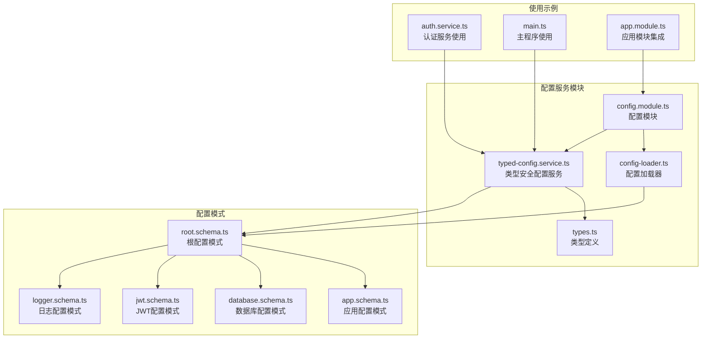
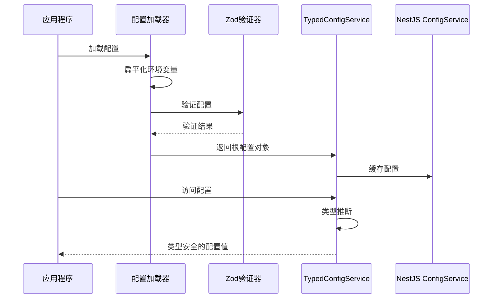
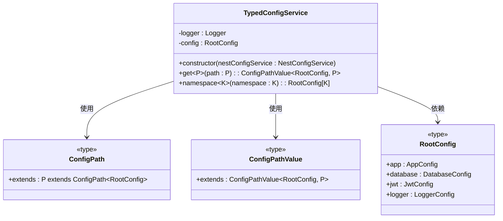
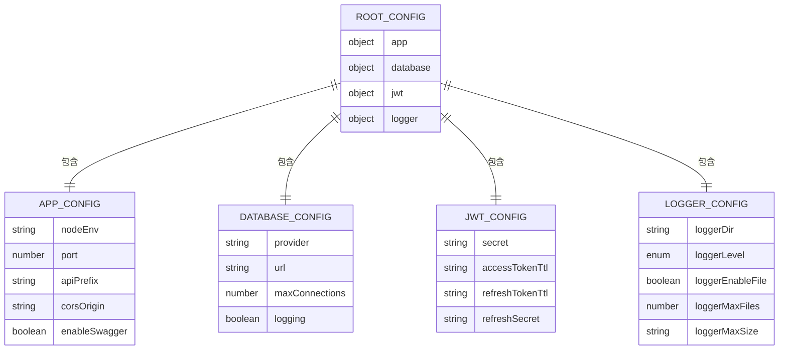
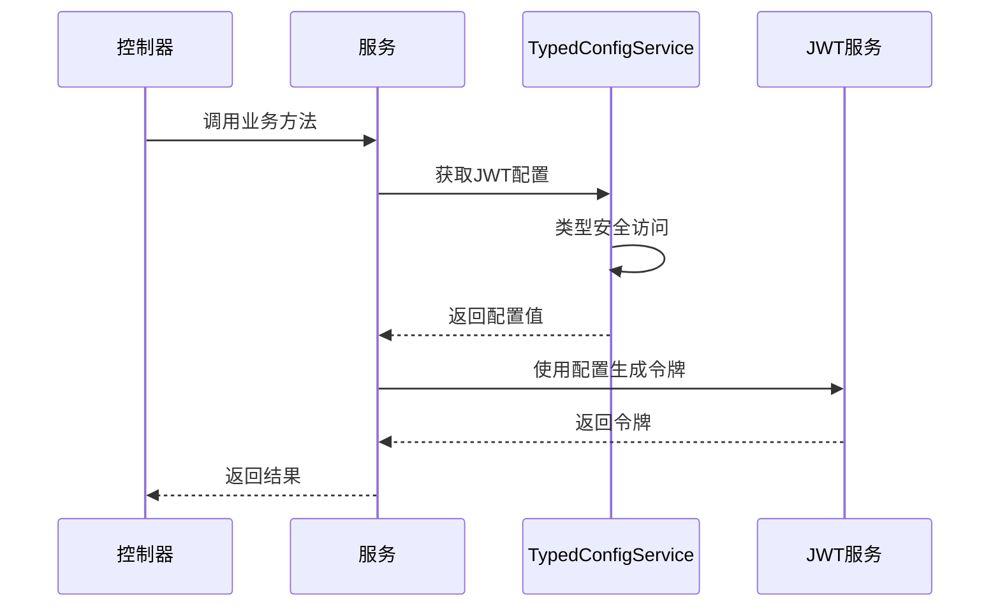

# 类型安全配置服务

<cite>
**本文档引用的文件**
- [typed-config.service.ts](file://src/config/typed-config.service.ts)
- [types.ts](file://src/config/types.ts)
- [config.module.ts](file://src/config/config.module.ts)
- [config-loader.ts](file://src/config/config-loader.ts)
- [root.schema.ts](file://src/config/schemas/root.schema.ts)
- [app.schema.ts](file://src/config/schemas/app.schema.ts)
- [database.schema.ts](file://src/config/schemas/database.schema.ts)
- [jwt.schema.ts](file://src/config/schemas/jwt.schema.ts)
- [logger.schema.ts](file://src/config/schemas/logger.schema.ts)
- [auth.service.ts](file://src/modules/auth/auth.service.ts)
- [main.ts](file://src/main.ts)
- [app.module.ts](file://src/app.module.ts)
</cite>

## 目录
1. [简介](#简介)
2. [项目结构](#项目结构)
3. [核心组件](#核心组件)
4. [架构概览](#架构概览)
5. [详细组件分析](#详细组件分析)
6. [依赖关系分析](#依赖关系分析)
7. [性能考虑](#性能考虑)
8. [故障排除指南](#故障排除指南)
9. [结论](#结论)

## 简介

类型安全配置服务是本项目中一个关键的基础设施组件，它通过泛型约束和编译时类型检查确保配置访问的安全性和正确性。该服务基于 NestJS 的 ConfigService 构建，结合 Zod 运行时验证，提供了完整的配置管理解决方案。

本服务的核心设计目标是：
- 实现编译时类型安全的配置访问
- 提供运行时类型验证和错误处理
- 支持命名空间配置的类型推断
- 确保配置键名的类型约束和默认值处理
- 提供配置变更通知机制和热重载支持

## 项目结构

类型安全配置服务位于 `src/config` 目录下，采用模块化设计，包含以下核心文件：



**图表来源**
- [typed-config.service.ts:1-48](file://src/config/typed-config.service.ts#L1-L48)
- [config.module.ts:1-20](file://src/config/config.module.ts#L1-L20)
- [config-loader.ts:1-53](file://src/config/config-loader.ts#L1-L53)

**章节来源**
- [typed-config.service.ts:1-48](file://src/config/typed-config.service.ts#L1-L48)
- [config.module.ts:1-20](file://src/config/config.module.ts#L1-L20)
- [config-loader.ts:1-53](file://src/config/config-loader.ts#L1-L53)

## 核心组件

### TypedConfigService 类

TypedConfigService 是类型安全配置服务的核心实现，它继承自 NestJS 的 ConfigService 并添加了类型安全功能。

#### 主要特性

1. **编译时类型检查**：通过泛型约束确保配置访问的类型安全性
2. **运行时类型验证**：使用 Zod 进行严格的配置验证
3. **点语法支持**：支持复杂的嵌套配置路径访问
4. **命名空间访问**：提供 namespace() 方法访问完整配置对象

#### 关键方法

- `get<P extends ConfigPath<RootConfig>>(path: P): ConfigPathValue<RootConfig, P>`
- `namespace<K extends keyof RootConfig>(namespace: K): RootConfig[K]`

**章节来源**
- [typed-config.service.ts:6-47](file://src/config/typed-config.service.ts#L6-L47)

### 类型系统设计

类型系统通过两个核心类型定义实现编译时类型检查：

#### ConfigPath 类型
```typescript
export type ConfigPath<T, Depth extends number[] = []> = 
  Depth['length'] extends 3
    ? never
    : T extends Primitive
      ? never
      : T extends Array<any>
        ? never
        : {
            [K in keyof T & string]: T[K] extends Primitive
              ? K
              : K | `${K}.${ConfigPath<T[K], [...Depth, 1]>}`;
          }[keyof T & string];
```

#### ConfigPathValue 类型
```typescript
export type ConfigPathValue<T, P extends ConfigPath<T>> = 
  P extends `${infer Key}.${infer Rest}`
    ? Key extends keyof T
      ? Rest extends ConfigPath<T[Key]>
        ? ConfigPathValue<T[Key], Rest>
        : never
      : never
    : P extends keyof T
      ? T[P]
      : never;
```

**章节来源**
- [types.ts:7-34](file://src/config/types.ts#L7-L34)

## 架构概览

类型安全配置服务采用分层架构设计，确保配置管理的完整性和安全性：



**图表来源**
- [config-loader.ts:5-52](file://src/config/config-loader.ts#L5-L52)
- [typed-config.service.ts:11-18](file://src/config/typed-config.service.ts#L11-L18)

### 配置加载流程

配置加载过程包含四个关键步骤：

1. **扁平化映射**：将环境变量映射到分层的命名空间结构
2. **严格验证**：使用 Zod 模式进行运行时验证和类型转换
3. **错误处理**：验证失败时提供详细的错误信息并阻止应用启动
4. **配置缓存**：将验证后的配置存储在内存中供后续访问

**章节来源**
- [config-loader.ts:5-52](file://src/config/config-loader.ts#L5-L52)

## 详细组件分析

### 类型安全实现机制

#### 泛型约束设计

TypedConfigService 通过泛型约束实现编译时类型检查：



**图表来源**
- [typed-config.service.ts:7-46](file://src/config/typed-config.service.ts#L7-L46)
- [types.ts:7-34](file://src/config/types.ts#L7-L34)

#### 类型推断机制

get() 方法的类型推断机制基于以下原则：

1. **路径约束**：P 必须是 ConfigPath<RootConfig> 的子类型
2. **值类型推断**：根据路径推断返回值的精确类型
3. **深度限制**：通过 Depth 参数限制递归深度防止 TypeScript 性能问题

**章节来源**
- [typed-config.service.ts:23-38](file://src/config/typed-config.service.ts#L23-L38)
- [types.ts:6-20](file://src/config/types.ts#L6-L20)

### 配置模式设计

#### 根配置模式

根配置模式聚合了所有子配置模式，形成完整的配置树结构：



**图表来源**
- [root.schema.ts:10-20](file://src/config/schemas/root.schema.ts#L10-L20)
- [app.schema.ts:3-9](file://src/config/schemas/app.schema.ts#L3-L9)
- [database.schema.ts:3-8](file://src/config/schemas/database.schema.ts#L3-L8)
- [jwt.schema.ts:3-8](file://src/config/schemas/jwt.schema.ts#L3-L8)
- [logger.schema.ts:4-10](file://src/config/schemas/logger.schema.ts#L4-L10)

#### 默认值处理

每个配置模式都定义了适当的默认值：

- **应用配置**：端口默认 3000，API 前缀默认 'api/v1'
- **数据库配置**：SQLite 作为默认提供者，连接数默认 10
- **JWT 配置**：访问令牌 15 分钟，刷新令牌 7 天
- **日志配置**：日志目录 logs，默认 Info 级别

**章节来源**
- [app.schema.ts:4-8](file://src/config/schemas/app.schema.ts#L4-L8)
- [database.schema.ts:4-7](file://src/config/schemas/database.schema.ts#L4-L7)
- [jwt.schema.ts:5-7](file://src/config/schemas/jwt.schema.ts#L5-L7)
- [logger.schema.ts:5-9](file://src/config/schemas/logger.schema.ts#L5-L9)

### 实际使用示例

#### 在控制器中使用

虽然当前项目中没有直接展示控制器使用示例，但可以参考认证服务中的使用模式：



**图表来源**
- [auth.service.ts:122-125](file://src/modules/auth/auth.service.ts#L122-L125)

#### 在主程序中使用

主程序展示了如何使用 namespace() 方法访问完整配置对象：

```mermaid
flowchart TD
A[应用程序启动] --> B[获取配置服务]
B --> C[调用 namespace('app')]
C --> D[解构配置对象]
D --> E[设置 CORS]
D --> F[设置全局前缀]
D --> G[条件启用 Swagger]
E --> H[应用启动]
F --> H
G --> H
```

**图表来源**
- [main.ts:13-35](file://src/main.ts#L13-L35)

**章节来源**
- [auth.service.ts:122-125](file://src/modules/auth/auth.service.ts#L122-L125)
- [main.ts:13-35](file://src/main.ts#L13-L35)

## 依赖关系分析

### 组件依赖图

```mermaid
graph TB
subgraph "外部依赖"
A[@nestjs/config]
B[Zod]
C[@nestjs/common]
end
subgraph "内部组件"
D[TypedConfigService]
E[ConfigLoader]
F[ConfigModule]
G[RootConfigSchema]
end
subgraph "使用组件"
H[AuthService]
I[Main Application]
J[Other Services]
end
A --> D
B --> E
C --> D
D --> F
E --> G
F --> H
F --> I
F --> J
```

**图表来源**
- [typed-config.service.ts:1-3](file://src/config/typed-config.service.ts#L1-L3)
- [config-loader.ts:2-3](file://src/config/config-loader.ts#L2-L3)
- [config.module.ts:2-4](file://src/config/config.module.ts#L2-L4)

### 依赖注入关系

配置服务通过依赖注入机制在整个应用中提供服务：

1. **全局注册**：ConfigModule 作为全局模块注册
2. **自动注入**：任何组件都可以直接注入 TypedConfigService
3. **懒加载**：配置在首次访问时才被加载和验证

**章节来源**
- [config.module.ts:6-18](file://src/config/config.module.ts#L6-L18)
- [app.module.ts:11](file://src/app.module.ts#L11)

## 性能考虑

### 内存优化

1. **单例模式**：TypedConfigService 作为单例实例，避免重复创建
2. **配置缓存**：验证后的配置存储在内存中，避免重复解析
3. **延迟初始化**：配置只在首次访问时加载，减少启动时间

### 类型系统性能

1. **深度限制**：ConfigPath 类型限制递归深度为 3 层，防止 TypeScript 性能问题
2. **条件类型**：使用条件类型避免不必要的类型计算
3. **泛型约束**：通过严格的泛型约束减少类型推断复杂度

### 运行时性能

1. **点语法解析**：运行时解析点语法，性能开销最小
2. **错误处理**：仅在访问不存在的配置路径时抛出错误
3. **类型转换**：Zod 验证在应用启动时完成，运行时无额外验证开销

## 故障排除指南

### 常见问题及解决方案

#### 配置验证失败

**问题**：应用启动时报错，显示环境变量验证失败

**原因**：
- 环境变量格式不正确
- 必填字段缺失
- 数据类型不匹配

**解决方案**：
1. 检查环境变量是否符合预期格式
2. 确认所有必需字段都已设置
3. 验证数据类型是否正确

#### 配置路径不存在

**问题**：访问配置时抛出 "undefined" 错误

**原因**：
- 配置路径拼写错误
- 配置键不存在
- 配置层级不正确

**解决方案**：
1. 使用 IDE 的智能提示确保路径正确
2. 检查配置模式定义
3. 确认配置层级结构

#### 类型推断错误

**问题**：TypeScript 报告类型错误

**原因**：
- 泛型参数不正确
- 类型约束不满足
- 配置模式定义错误

**解决方案**：
1. 确保使用正确的配置路径
2. 检查配置模式的类型定义
3. 验证配置值的类型

**章节来源**
- [config-loader.ts:39-46](file://src/config/config-loader.ts#L39-L46)
- [typed-config.service.ts:31-33](file://src/config/typed-config.service.ts#L31-L33)

### 调试技巧

1. **启用详细日志**：查看配置加载过程中的详细信息
2. **使用类型断言**：在开发环境中使用类型断言验证类型推断
3. **单元测试**：编写测试用例验证配置访问的正确性

## 结论

类型安全配置服务通过精心设计的类型系统和严格的验证机制，为 NestJS 应用提供了可靠的配置管理解决方案。其主要优势包括：

1. **编译时类型安全**：通过泛型约束确保配置访问的类型正确性
2. **运行时验证保障**：使用 Zod 进行严格的配置验证和类型转换
3. **灵活的访问方式**：支持点语法和命名空间两种访问模式
4. **良好的性能表现**：优化的类型系统和内存使用策略
5. **完善的错误处理**：提供详细的错误信息和优雅的降级机制

该服务的设计理念体现了现代 TypeScript 开发的最佳实践，为大型应用的配置管理提供了坚实的基础。通过合理的抽象和封装，开发者可以专注于业务逻辑，而无需担心配置访问的安全性和正确性问题。