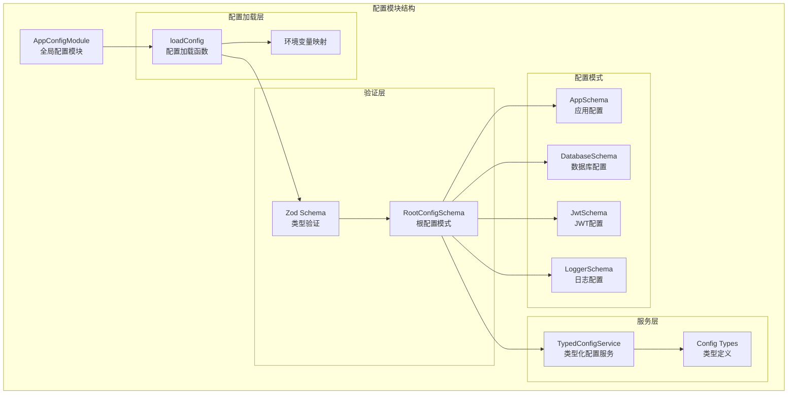
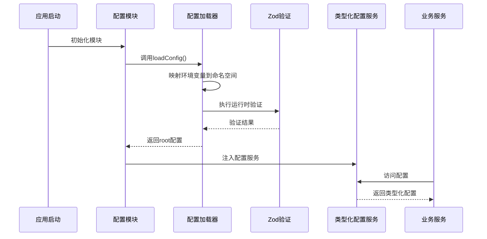
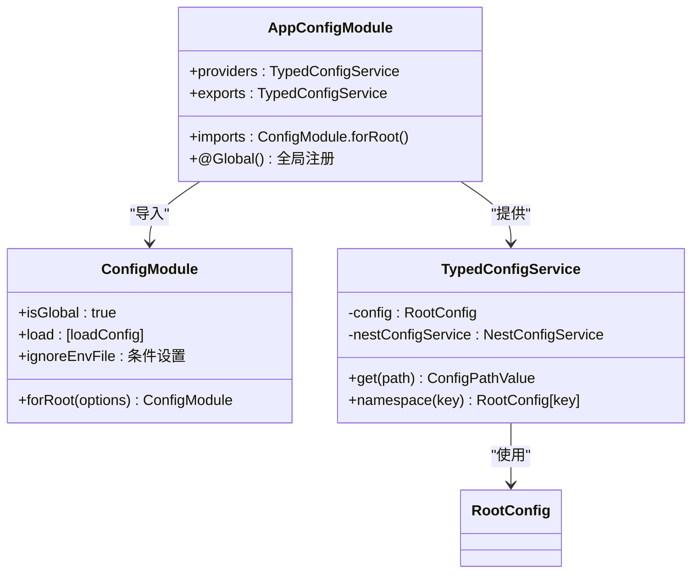
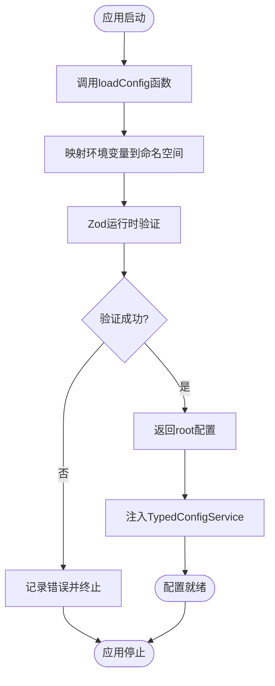
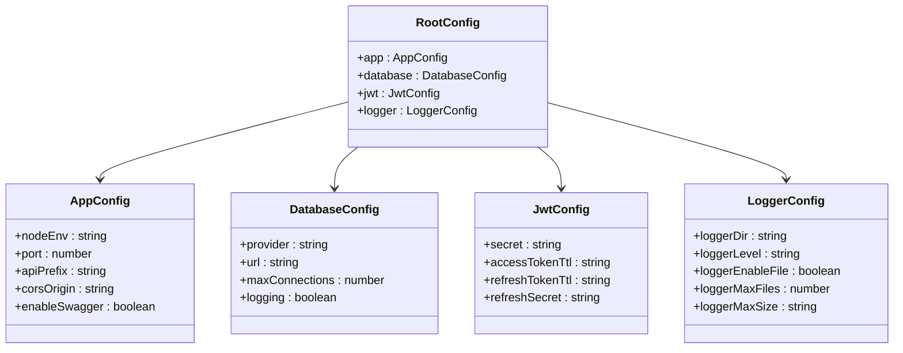
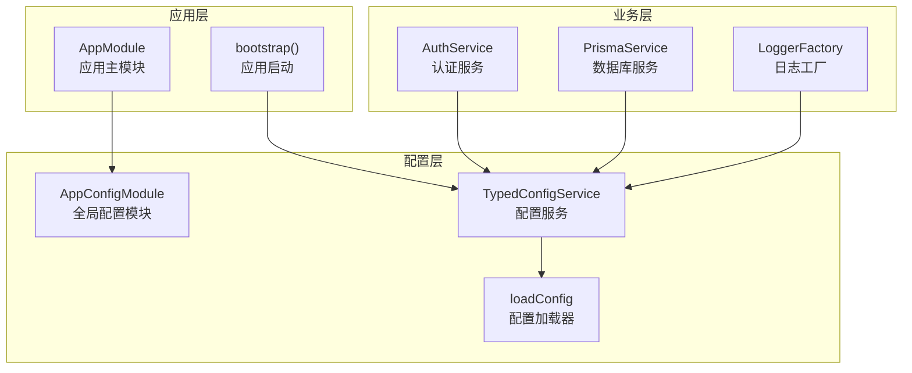
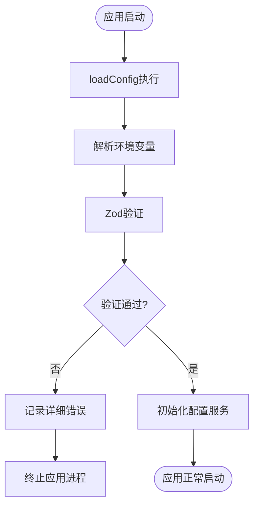

# 配置架构设计

<cite>
**本文档引用的文件**
- [config.module.ts](file://src/config/config.module.ts)
- [config-loader.ts](file://src/config/config-loader.ts)
- [typed-config.service.ts](file://src/config/typed-config.service.ts)
- [types.ts](file://src/config/types.ts)
- [root.schema.ts](file://src/config/schemas/root.schema.ts)
- [app.schema.ts](file://src/config/schemas/app.schema.ts)
- [database.schema.ts](file://src/config/schemas/database.schema.ts)
- [jwt.schema.ts](file://src/config/schemas/jwt.schema.ts)
- [logger.schema.ts](file://src/config/schemas/logger.schema.ts)
- [app.module.ts](file://src/app.module.ts)
- [main.ts](file://src/main.ts)
- [auth.service.ts](file://src/modules/auth/auth.service.ts)
</cite>

## 目录
1. [引言](#引言)
2. [项目结构](#项目结构)
3. [核心组件](#核心组件)
4. [架构概览](#架构概览)
5. [详细组件分析](#详细组件分析)
6. [依赖关系分析](#依赖关系分析)
7. [性能考虑](#性能考虑)
8. [故障排除指南](#故障排除指南)
9. [结论](#结论)

## 引言

本文件详细阐述了 NestJS 应用中的配置架构设计，重点分析全局配置模块的设计理念和实现方式。该架构通过类型化配置服务提供强类型的配置访问能力，结合 Zod 运行时验证确保配置的正确性和安全性。

## 项目结构

配置模块位于 `src/config/` 目录下，采用分层架构设计：



**图表来源**
- [config.module.ts:1-20](file://src/config/config.module.ts#L1-L20)
- [config-loader.ts:1-53](file://src/config/config-loader.ts#L1-L53)
- [root.schema.ts:1-21](file://src/config/schemas/root.schema.ts#L1-L21)

**章节来源**
- [config.module.ts:1-20](file://src/config/config.module.ts#L1-L20)
- [config-loader.ts:1-53](file://src/config/config-loader.ts#L1-L53)
- [root.schema.ts:1-21](file://src/config/schemas/root.schema.ts#L1-L21)

## 核心组件

### 全局配置模块

AppConfigModule 是一个全局配置模块，通过 `@Global()` 装饰器确保在整个应用中都可以直接注入配置服务。

**关键特性：**
- 全局注册：任何模块都可以直接使用配置服务
- 配置加载：集成 NestJS 内置的 ConfigModule
- 类型安全：提供强类型化的配置访问接口
- 内存缓存：配置数据在内存中缓存，避免重复解析

### 配置加载器

loadConfig 函数负责将环境变量转换为结构化的配置对象：

**处理流程：**
1. 环境变量扁平化映射到命名空间结构
2. 使用 Zod 进行运行时类型验证和转换
3. 返回带 `root` 键的对象供服务层访问
4. 严格验证失败时阻止应用启动

### 类型化配置服务

TypedConfigService 提供类型安全的配置访问方法：

**主要功能：**
- 点语法配置路径访问
- 命名空间对象获取
- 编译时类型推导
- 运行时错误处理

**章节来源**
- [config.module.ts:6-19](file://src/config/config.module.ts#L6-L19)
- [config-loader.ts:5-52](file://src/config/config-loader.ts#L5-L52)
- [typed-config.service.ts:6-47](file://src/config/typed-config.service.ts#L6-L47)

## 架构概览

配置架构采用分层设计，从底层的环境变量到顶层的类型化服务：



**图表来源**
- [config.module.ts:9-14](file://src/config/config.module.ts#L9-L14)
- [config-loader.ts:5-52](file://src/config/config-loader.ts#L5-L52)
- [typed-config.service.ts:11-18](file://src/config/typed-config.service.ts#L11-L18)

## 详细组件分析

### 配置模块设计

AppConfigModule 作为全局模块，其设计体现了以下原则：



**图表来源**
- [config.module.ts:6-19](file://src/config/config.module.ts#L6-L19)
- [typed-config.service.ts:6-47](file://src/config/typed-config.service.ts#L6-L47)

**配置选项详解：**

ConfigModule.forRoot() 的关键配置选项：

| 选项 | 值 | 作用 | 条件 |
|------|-----|------|------|
| isGlobal | true | 启用全局配置模块 | 始终 |
| load | [loadConfig] | 配置加载函数数组 | 始终 |
| ignoreEnvFile | NODE_ENV === 'production' | 生产环境忽略 .env 文件 | 条件 |

### 配置加载流程

配置加载过程包含四个关键步骤：



**图表来源**
- [config-loader.ts:5-52](file://src/config/config-loader.ts#L5-L52)

### 类型系统设计

配置架构的类型系统确保编译时的安全性：



**图表来源**
- [root.schema.ts:10-21](file://src/config/schemas/root.schema.ts#L10-L21)
- [app.schema.ts:3-12](file://src/config/schemas/app.schema.ts#L3-L12)
- [database.schema.ts:3-11](file://src/config/schemas/database.schema.ts#L3-L11)
- [jwt.schema.ts:3-11](file://src/config/schemas/jwt.schema.ts#L3-L11)
- [logger.schema.ts:4-13](file://src/config/schemas/logger.schema.ts#L4-L13)

### 配置访问模式

TypedConfigService 提供两种主要的配置访问方式：

**点语法访问：**
```typescript
// 编译时类型检查
const port = config.get('app.port'); // number
const enableSwagger = config.get('app.enableSwagger'); // boolean
```

**命名空间访问：**
```typescript
// 获取完整命名空间对象
const appConfig = config.namespace('app');
const dbConfig = config.namespace('database');
```

**章节来源**
- [typed-config.service.ts:20-47](file://src/config/typed-config.service.ts#L20-L47)
- [types.ts:6-35](file://src/config/types.ts#L6-L35)

## 依赖关系分析

配置模块与应用其他部分的集成关系：



**图表来源**
- [app.module.ts:18-32](file://src/app.module.ts#L18-L32)
- [main.ts:8-47](file://src/main.ts#L8-L47)
- [auth.service.ts:14-21](file://src/modules/auth/auth.service.ts#L14-L21)

**章节来源**
- [app.module.ts:18-32](file://src/app.module.ts#L18-L32)
- [main.ts:8-47](file://src/main.ts#L8-L47)
- [auth.service.ts:14-21](file://src/modules/auth/auth.service.ts#L14-L21)

## 性能考虑

### 内存缓存机制

配置架构采用单例模式和内存缓存：

- **单例实例**：TypedConfigService 在应用启动时创建一次
- **内存缓存**：配置数据存储在内存中，避免重复解析
- **延迟初始化**：仅在首次访问时进行配置解析

### 类型推导优化

类型系统设计考虑了 TypeScript 性能：

- **最大深度限制**：配置路径最大深度为3层，防止TS性能问题
- **条件类型推导**：编译时确定返回类型，运行时零开销
- **基础类型优化**：对原始类型进行特殊处理，避免不必要的递归

## 故障排除指南

### 常见配置错误

**环境变量验证失败：**
- 检查环境变量格式是否正确
- 验证必需的环境变量是否存在
- 查看控制台输出的详细错误信息

**配置访问异常：**
- 确认配置路径是否正确
- 验证命名空间是否存在
- 检查配置项的数据类型

### 启动时错误处理

配置模块在启动阶段提供完善的错误处理：



**图表来源**
- [config-loader.ts:39-46](file://src/config/config-loader.ts#L39-L46)
- [typed-config.service.ts:14-18](file://src/config/typed-config.service.ts#L14-L18)

**章节来源**
- [config-loader.ts:39-46](file://src/config/config-loader.ts#L39-L46)
- [typed-config.service.ts:14-18](file://src/config/typed-config.service.ts#L14-L18)

## 结论

该配置架构设计通过以下关键特性实现了高效、安全的配置管理：

1. **类型安全**：完整的编译时类型检查，防止配置访问错误
2. **运行时验证**：Zod 提供的严格运行时验证，确保配置正确性
3. **全局可用**：全局模块设计，简化配置访问
4. **性能优化**：内存缓存和单例模式，提升访问效率
5. **错误处理**：完善的错误处理机制，保障应用稳定性

该架构为 NestJS 应用提供了可靠的配置管理基础，支持复杂的企业级应用场景。