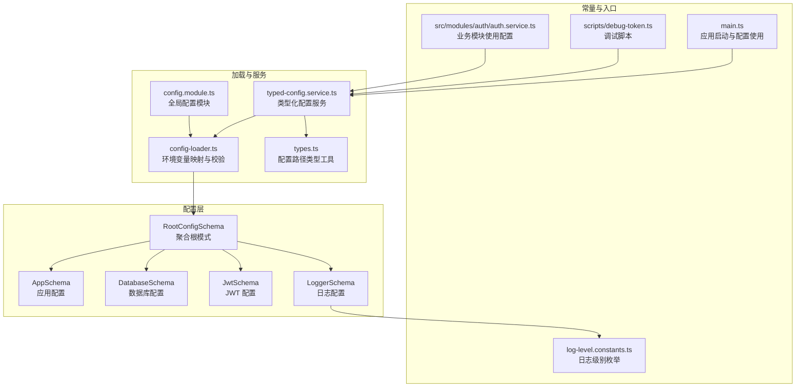
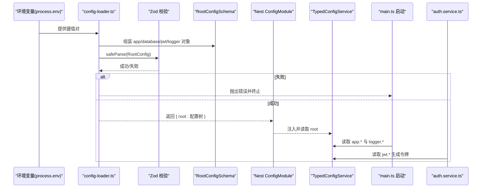
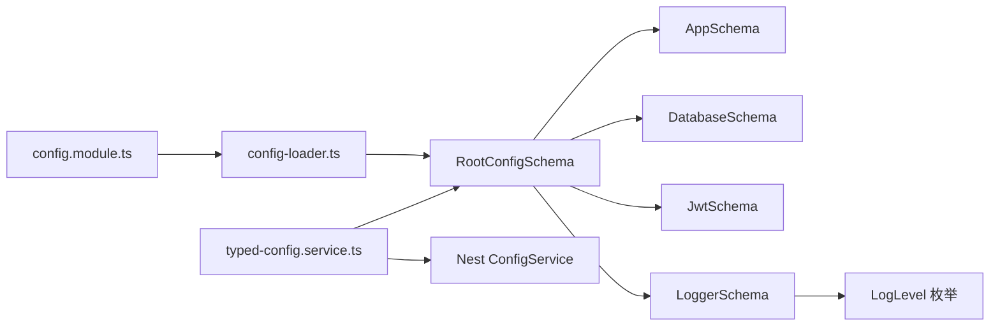

# 配置模式定义

<cite>
**本文引用的文件**
- [src/config/schemas/root.schema.ts](file://src/config/schemas/root.schema.ts)
- [src/config/schemas/app.schema.ts](file://src/config/schemas/app.schema.ts)
- [src/config/schemas/database.schema.ts](file://src/config/schemas/database.schema.ts)
- [src/config/schemas/jwt.schema.ts](file://src/config/schemas/jwt.schema.ts)
- [src/config/schemas/logger.schema.ts](file://src/config/schemas/logger.schema.ts)
- [src/config/config-loader.ts](file://src/config/config-loader.ts)
- [src/config/typed-config.service.ts](file://src/config/typed-config.service.ts)
- [src/config/config.module.ts](file://src/config/config.module.ts)
- [src/config/types.ts](file://src/config/types.ts)
- [src/common/constants/log-level.constants.ts](file://src/common/constants/log-level.constants.ts)
- [src/main.ts](file://src/main.ts)
- [scripts/debug-token.ts](file://scripts/debug-token.ts)
- [src/modules/auth/auth.service.ts](file://src/modules/auth/auth.service.ts)
</cite>

## 目录
1. [简介](#简介)
2. [项目结构](#项目结构)
3. [核心组件](#核心组件)
4. [架构总览](#架构总览)
5. [详细组件分析](#详细组件分析)
6. [依赖分析](#依赖分析)
7. [性能考虑](#性能考虑)
8. [故障排查指南](#故障排查指南)
9. [结论](#结论)
10. [附录](#附录)

## 简介
本文件系统性地阐述本项目的“配置模式定义”，围绕根配置模式与四大子配置模式（应用、数据库、JWT、日志）展开，解释其设计目的、字段定义、Zod 验证规则、类型约束与默认值，并给出继承与组合方式、扩展建议、错误处理与调试技巧。该体系通过分层 Schema 聚合形成命名空间式配置树，配合严格运行时校验与类型推导，确保配置在编译期与运行期均具备强一致性与可维护性。

## 项目结构
配置相关代码集中在 src/config 目录，采用“分层 Schema + 加载器 + 类型化服务”的架构：
- 分层 Schema：分别定义各命名空间的字段与约束
- 加载器：将环境变量映射为分层对象并进行 Zod 校验
- 类型化服务：提供类型安全的配置读取与命名空间访问
- 配置模块：注册全局配置模块，统一加载入口
- 类型工具：对配置路径进行类型推导，避免硬编码路径带来的风险

图表来源
- [src/config/schemas/root.schema.ts:1-21](file://src/config/schemas/root.schema.ts#L1-L21)
- [src/config/schemas/app.schema.ts:1-12](file://src/config/schemas/app.schema.ts#L1-L12)
- [src/config/schemas/database.schema.ts:1-11](file://src/config/schemas/database.schema.ts#L1-L11)
- [src/config/schemas/jwt.schema.ts:1-11](file://src/config/schemas/jwt.schema.ts#L1-L11)
- [src/config/schemas/logger.schema.ts:1-13](file://src/config/schemas/logger.schema.ts#L1-L13)
- [src/config/config-loader.ts:1-53](file://src/config/config-loader.ts#L1-L53)
- [src/config/typed-config.service.ts:1-48](file://src/config/typed-config.service.ts#L1-L48)
- [src/config/config.module.ts:1-20](file://src/config/config.module.ts#L1-L20)
- [src/config/types.ts:1-35](file://src/config/types.ts#L1-L35)
- [src/common/constants/log-level.constants.ts:1-10](file://src/common/constants/log-level.constants.ts#L1-L10)
- [src/main.ts:1-50](file://src/main.ts#L1-L50)
- [scripts/debug-token.ts:1-84](file://scripts/debug-token.ts#L1-L84)
- [src/modules/auth/auth.service.ts:115-162](file://src/modules/auth/auth.service.ts#L115-L162)

章节来源
- [src/config/schemas/root.schema.ts:1-21](file://src/config/schemas/root.schema.ts#L1-L21)
- [src/config/config-loader.ts:1-53](file://src/config/config-loader.ts#L1-L53)
- [src/config/typed-config.service.ts:1-48](file://src/config/typed-config.service.ts#L1-L48)
- [src/config/config.module.ts:1-20](file://src/config/config.module.ts#L1-L20)
- [src/config/types.ts:1-35](file://src/config/types.ts#L1-L35)
- [src/common/constants/log-level.constants.ts:1-10](file://src/common/constants/log-level.constants.ts#L1-L10)

## 核心组件
- 根配置模式（RootConfigSchema）：聚合四大子模式，形成命名空间式配置树，便于按域访问。
- 应用配置模式（AppSchema）：控制运行环境、端口、API 前缀、CORS 与 Swagger 开关等。
- 数据库配置模式（DatabaseSchema）：控制数据源提供商、连接串、连接池上限与日志开关。
- JWT 配置模式（JwtSchema）：控制密钥、访问令牌与刷新令牌的过期策略。
- 日志配置模式（LoggerSchema）：控制日志目录、级别、文件输出开关与轮转参数。
- 配置加载器（config-loader.ts）：将 process.env 映射为分层对象并执行 Zod 校验，失败则阻断启动。
- 类型化配置服务（typed-config.service.ts）：提供类型安全的点语法读取与命名空间访问。
- 配置模块（config.module.ts）：全局注册配置模块，暴露类型化服务。
- 类型工具（types.ts）：对配置路径进行类型推导，限制最大递归深度以保证 TS 性能。
- 日志级别常量（log-level.constants.ts）：提供受控的日志级别枚举，确保配置值合法。

章节来源
- [src/config/schemas/root.schema.ts:1-21](file://src/config/schemas/root.schema.ts#L1-L21)
- [src/config/schemas/app.schema.ts:1-12](file://src/config/schemas/app.schema.ts#L1-L12)
- [src/config/schemas/database.schema.ts:1-11](file://src/config/schemas/database.schema.ts#L1-L11)
- [src/config/schemas/jwt.schema.ts:1-11](file://src/config/schemas/jwt.schema.ts#L1-L11)
- [src/config/schemas/logger.schema.ts:1-13](file://src/config/schemas/logger.schema.ts#L1-L13)
- [src/config/config-loader.ts:1-53](file://src/config/config-loader.ts#L1-L53)
- [src/config/typed-config.service.ts:1-48](file://src/config/typed-config.service.ts#L1-L48)
- [src/config/config.module.ts:1-20](file://src/config/config.module.ts#L1-L20)
- [src/config/types.ts:1-35](file://src/config/types.ts#L1-L35)
- [src/common/constants/log-level.constants.ts:1-10](file://src/common/constants/log-level.constants.ts#L1-L10)

## 架构总览
下图展示了从环境变量到类型化配置的全链路流程，以及配置在应用启动与业务模块中的使用方式。

图表来源
- [src/config/config-loader.ts:1-53](file://src/config/config-loader.ts#L1-L53)
- [src/config/schemas/root.schema.ts:1-21](file://src/config/schemas/root.schema.ts#L1-L21)
- [src/config/typed-config.service.ts:1-48](file://src/config/typed-config.service.ts#L1-L48)
- [src/main.ts:1-50](file://src/main.ts#L1-L50)
- [src/modules/auth/auth.service.ts:115-162](file://src/modules/auth/auth.service.ts#L115-L162)

## 详细组件分析

### 根配置模式（RootConfigSchema）
- 设计目的：将应用配置按领域拆分为独立的命名空间，形成清晰的层次结构；通过 Zod 聚合校验，确保整体一致性。
- 字段与关系：
  - app: 应用配置命名空间
  - database: 数据库配置命名空间
  - jwt: JWT 配置命名空间
  - logger: 日志配置命名空间
- 验证规则：由各子模式负责各自域的约束，根模式仅做组合与类型推导。
- 默认值：根模式不直接设置默认值，具体默认值在子模式中定义。
- 类型推导：通过 z.infer 推导出 RootConfig 类型，作为 TypedConfigService 的配置树类型。

章节来源
- [src/config/schemas/root.schema.ts:1-21](file://src/config/schemas/root.schema.ts#L1-L21)

### 应用配置模式（AppSchema）
- 设计目的：集中管理应用运行参数，如环境、端口、API 前缀、CORS 与文档开关，便于统一运维与部署。
- 字段与约束：
  - nodeEnv: 枚举 ['development','production','test']，默认 development
  - port: 整数且大于 0，默认 3000
  - apiPrefix: 字符串，默认 'api/v1'
  - corsOrigin: 字符串，默认 '*'
  - enableSwagger: 布尔转换，默认 true
- 默认值与类型转换：通过 coerce 实现字符串到数字/布尔的自动转换，提升环境变量输入的容错性。
- 使用场景：启动阶段用于设置全局前缀、CORS 与 Swagger 文档路径。

章节来源
- [src/config/schemas/app.schema.ts:1-12](file://src/config/schemas/app.schema.ts#L1-L12)
- [src/main.ts:14-33](file://src/main.ts#L14-L33)

### 数据库配置模式（DatabaseSchema）
- 设计目的：抽象不同数据库提供商的连接参数，统一连接池与日志开关，降低迁移成本。
- 字段与约束：
  - provider: 枚举 ['sqlite','postgresql']，默认 sqlite
  - url: 非空字符串，必填项
  - maxConnections: 整数且大于 0，默认 10
  - logging: 布尔转换，默认 false
- 关键规则：url 必须提供，否则 safeParse 将失败。
- 扩展建议：新增提供商时，在枚举中添加新值并在加载器中映射对应环境变量。

章节来源
- [src/config/schemas/database.schema.ts:1-11](file://src/config/schemas/database.schema.ts#L1-L11)
- [src/config/config-loader.ts:15-20](file://src/config/config-loader.ts#L15-L20)

### JWT 配置模式（JwtSchema）
- 设计目的：集中管理令牌密钥与过期策略，确保安全策略的一致性与可审计性。
- 字段与约束：
  - secret: 非空字符串，最小长度 32
  - accessTokenTtl: 字符串，默认 '15m'
  - refreshTokenTtl: 字符串，默认 '7d'
  - refreshSecret: 非空字符串，最小长度 32
- 关键规则：secret 与 refreshSecret 至少 32 位，避免弱密钥。
- 使用场景：认证模块生成与验证令牌时读取配置。

章节来源
- [src/config/schemas/jwt.schema.ts:1-11](file://src/config/schemas/jwt.schema.ts#L1-L11)
- [src/modules/auth/auth.service.ts:121-125](file://src/modules/auth/auth.service.ts#L121-L125)
- [scripts/debug-token.ts:44-47](file://scripts/debug-token.ts#L44-L47)

### 日志配置模式（LoggerSchema）
- 设计目的：统一日志输出目录、级别、文件落盘与轮转策略，便于生产环境可观测性。
- 字段与约束：
  - loggerDir: 字符串，默认 'logs'
  - loggerLevel: 受控枚举（来自 LogLevel），默认 Info
  - loggerEnableFile: 布尔，默认 false
  - loggerMaxFiles: 数字，默认 7
  - loggerMaxSize: 字符串，默认 '20m'
- 关键规则：loggerLevel 来自受控枚举，避免非法值导致配置失效。
- 使用场景：启动阶段创建结构化日志器并注入应用。

章节来源
- [src/config/schemas/logger.schema.ts:1-13](file://src/config/schemas/logger.schema.ts#L1-L13)
- [src/common/constants/log-level.constants.ts:1-10](file://src/common/constants/log-level.constants.ts#L1-L10)
- [src/main.ts:16-17](file://src/main.ts#L16-L17)

### Zod 验证器与类型系统
- 验证器使用方法：
  - 在加载器中，先将扁平环境变量映射为分层对象，再调用 RootConfigSchema.safeParse 执行严格校验。
  - 若校验失败，使用 treeifyError 输出结构化错误，包含字段路径与原因，随后抛出错误阻断启动。
- 字段类型约束：
  - coerce.number/int/boolean：实现字符串到基本类型的自动转换，增强环境变量输入的灵活性。
  - enum/min/default：限定取值范围、最小长度与默认值，确保配置的合法性与可用性。
- 类型推导与路径工具：
  - 通过 z.infer 推导出 RootConfig、AppConfig、DatabaseConfig、JwtConfig、LoggerConfig 等类型。
  - ConfigPath 与 ConfigPathValue 限制最大递归深度为 3，避免 TS 类型计算膨胀；提供点语法路径的类型安全读取。

章节来源
- [src/config/config-loader.ts:37-52](file://src/config/config-loader.ts#L37-L52)
- [src/config/types.ts:1-35](file://src/config/types.ts#L1-L35)
- [src/config/schemas/root.schema.ts:20-21](file://src/config/schemas/root.schema.ts#L20-L21)
- [src/config/schemas/app.schema.ts:4-8](file://src/config/schemas/app.schema.ts#L4-L8)
- [src/config/schemas/database.schema.ts:4-7](file://src/config/schemas/database.schema.ts#L4-L7)
- [src/config/schemas/jwt.schema.ts:4-7](file://src/config/schemas/jwt.schema.ts#L4-L7)
- [src/config/schemas/logger.schema.ts:5-9](file://src/config/schemas/logger.schema.ts#L5-L9)

### 继承关系与组合模式
- 组合模式：RootConfigSchema 通过对象组合的方式聚合四个子模式，形成命名空间树。
- 继承关系：各子模式相互独立，无显式继承；可通过在子模式内部复用 Zod 类型或共享常量实现逻辑复用。
- 扩展建议：
  - 新增配置域：新建一个子模式文件，定义字段与约束，然后在 RootConfigSchema 中引入。
  - 修改现有域：保持向后兼容的默认值与枚举值，必要时在加载器中增加映射或兼容逻辑。
  - 共享约束：将通用的 Zod 规则抽取为可复用的 Zod 类型，减少重复定义。

章节来源
- [src/config/schemas/root.schema.ts:10-15](file://src/config/schemas/root.schema.ts#L10-L15)
- [src/config/schemas/app.schema.ts:1-12](file://src/config/schemas/app.schema.ts#L1-L12)
- [src/config/schemas/database.schema.ts:1-11](file://src/config/schemas/database.schema.ts#L1-L11)
- [src/config/schemas/jwt.schema.ts:1-11](file://src/config/schemas/jwt.schema.ts#L1-L11)
- [src/config/schemas/logger.schema.ts:1-13](file://src/config/schemas/logger.schema.ts#L1-L13)

### 配置读取与使用
- 类型化服务：
  - get(path)：支持点语法读取任意层级配置，返回类型安全的值。
  - namespace(key)：读取某个命名空间的完整对象，便于批量访问。
- 启动阶段使用：
  - main.ts 通过 TypedConfigService 读取 app 与 logger 命名空间，设置 CORS、全局前缀与 Swagger。
- 业务模块使用：
  - 认证模块读取 jwt 命名空间生成令牌；调试脚本读取 jwt 命名空间辅助排障。

章节来源
- [src/config/typed-config.service.ts:23-46](file://src/config/typed-config.service.ts#L23-L46)
- [src/main.ts:13-33](file://src/main.ts#L13-L33)
- [src/modules/auth/auth.service.ts:121-125](file://src/modules/auth/auth.service.ts#L121-L125)
- [scripts/debug-token.ts:44-47](file://scripts/debug-token.ts#L44-L47)

## 依赖分析
- 模块耦合：
  - RootConfigSchema 依赖四个子模式，构成稳定的聚合关系。
  - config-loader.ts 依赖 RootConfigSchema 与 Zod 的 treeifyError 工具。
  - typed-config.service.ts 依赖 Nest ConfigService 与 RootConfig 类型。
  - config.module.ts 依赖 ConfigModule 与加载器。
- 外部依赖：
  - Zod：提供运行时类型校验与错误格式化。
  - NestJS ConfigModule：提供配置加载与注入能力。
- 循环依赖：
  - 当前结构无循环导入；若新增共享类型，应避免双向依赖。

图表来源
- [src/config/schemas/root.schema.ts:1-21](file://src/config/schemas/root.schema.ts#L1-L21)
- [src/config/config-loader.ts:1-53](file://src/config/config-loader.ts#L1-L53)
- [src/config/typed-config.service.ts:1-48](file://src/config/typed-config.service.ts#L1-L48)
- [src/config/config.module.ts:1-20](file://src/config/config.module.ts#L1-L20)
- [src/common/constants/log-level.constants.ts:1-10](file://src/common/constants/log-level.constants.ts#L1-L10)

章节来源
- [src/config/schemas/root.schema.ts:1-21](file://src/config/schemas/root.schema.ts#L1-L21)
- [src/config/config-loader.ts:1-53](file://src/config/config-loader.ts#L1-L53)
- [src/config/typed-config.service.ts:1-48](file://src/config/typed-config.service.ts#L1-L48)
- [src/config/config.module.ts:1-20](file://src/config/config.module.ts#L1-L20)
- [src/common/constants/log-level.constants.ts:1-10](file://src/common/constants/log-level.constants.ts#L1-L10)

## 性能考虑
- 类型路径推导限制：ConfigPath 最大递归深度为 3，避免 TS 类型系统过度计算导致编译缓慢。
- 环境变量到配置的转换：通过 coerce 自动转换可减少手动解析开销，但需注意字符串到数值的边界情况。
- 配置读取：TypedConfigService 的 get 方法为 O(d)，d 为路径深度，通常远小于 3，性能可忽略。

章节来源
- [src/config/types.ts:10-20](file://src/config/types.ts#L10-L20)
- [src/config/schemas/app.schema.ts:5-5](file://src/config/schemas/app.schema.ts#L5-L5)
- [src/config/schemas/database.schema.ts:6-6](file://src/config/schemas/database.schema.ts#L6-L6)
- [src/config/schemas/jwt.schema.ts:5-6](file://src/config/schemas/jwt.schema.ts#L5-L6)
- [src/config/schemas/logger.schema.ts:8-9](file://src/config/schemas/logger.schema.ts#L8-L9)

## 故障排查指南
- 配置验证失败：
  - 现象：启动时报错并终止，控制台输出结构化错误列表。
  - 排查步骤：
    - 检查对应环境变量是否正确设置（大小写、拼写、空格）。
    - 针对枚举字段，确认取值在允许集合内。
    - 针对最小长度字段，确认非空且满足长度要求。
    - 针对数字字段，确认字符串可被 coerce 转换为有效数字。
- 启动阶段异常：
  - 现象：应用无法启动或提前退出。
  - 排查步骤：查看加载器抛出的错误信息，定位具体字段与原因；修正后再启动。
- 运行时读取异常：
  - 现象：业务模块读取配置时报“路径未定义”错误。
  - 排查步骤：确认路径拼写正确；检查命名空间是否存在；确认配置已在启动阶段加载完成。
- 调试技巧：
  - 使用调试脚本读取 jwt 配置快速验证密钥与过期策略。
  - 在 main.ts 中临时打印配置树，确认各命名空间均已正确加载。

章节来源
- [src/config/config-loader.ts:39-46](file://src/config/config-loader.ts#L39-L46)
- [src/config/typed-config.service.ts:30-37](file://src/config/typed-config.service.ts#L30-L37)
- [scripts/debug-token.ts:44-47](file://scripts/debug-token.ts#L44-L47)
- [src/main.ts:13-17](file://src/main.ts#L13-L17)

## 结论
本配置模式体系通过分层 Schema、严格的 Zod 校验与类型化服务，实现了配置的强约束、高可读性与易扩展性。根模式聚合四大命名空间，子模式聚焦各自域的约束与默认值；加载器负责从环境变量到配置树的转换与校验；类型工具保障路径读取的安全性。遵循本文的扩展与排障建议，可在不破坏一致性的前提下灵活适配新的配置需求。

## 附录
- 环境变量与字段映射概览（来自加载器）：
  - 应用：NODE_ENV、PORT、API_PREFIX、CORS_ORIGIN、ENABLE_SWAGGER
  - 数据库：DATABASE_PROVIDER、DATABASE_URL、DB_MAX_CONNECTIONS、DB_LOGGING
  - JWT：JWT_SECRET、JWT_ACCESS_TTL、JWT_REFRESH_TTL、JWT_REFRESH_SECRET
  - 日志：LOGGER_DIR、LOGGER_LEVEL、LOGGER_ENABLE_FILE、LOGGER_MAX_FILES、LOGGER_MAX_SIZE

章节来源
- [src/config/config-loader.ts:7-34](file://src/config/config-loader.ts#L7-L34)