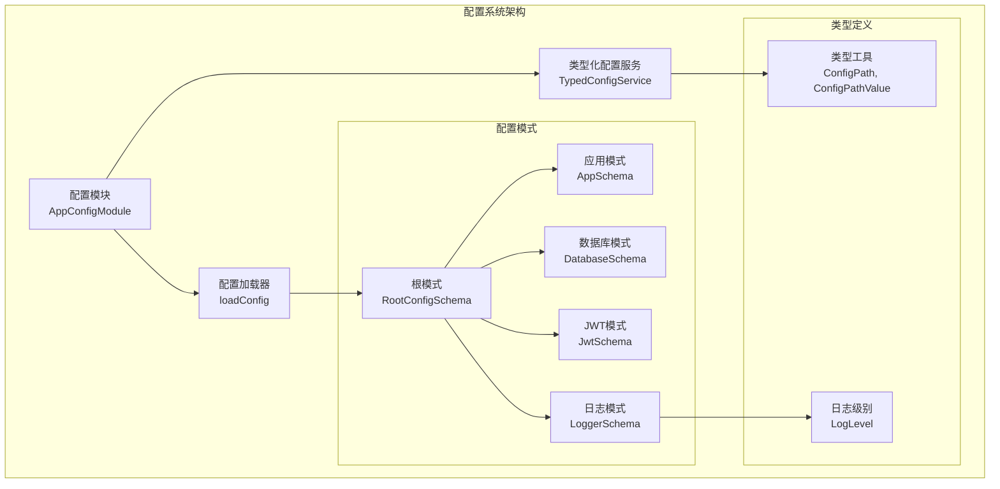
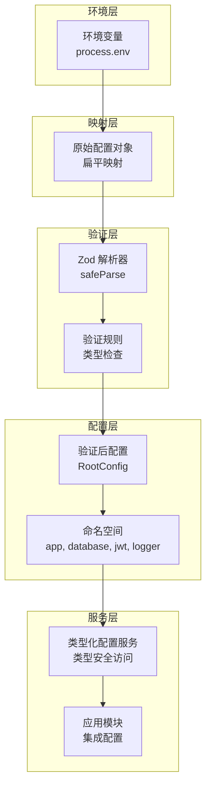
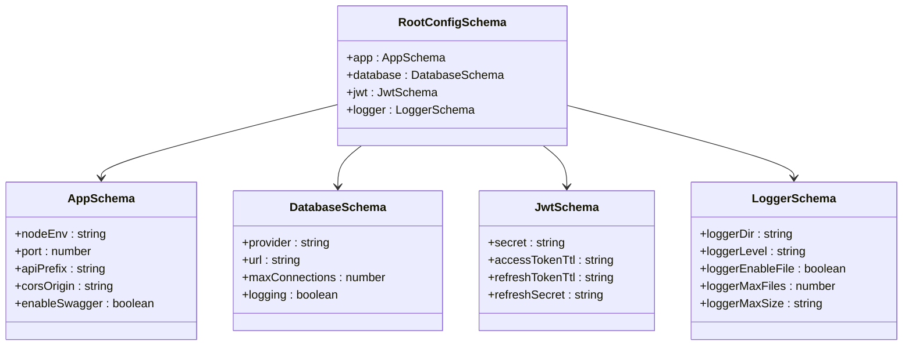
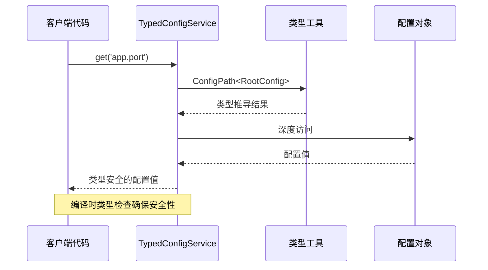

# 配置管理系统

<cite>
**本文档引用的文件**
- [config.module.ts](file://src/config/config.module.ts)
- [config-loader.ts](file://src/config/config-loader.ts)
- [typed-config.service.ts](file://src/config/typed-config.service.ts)
- [types.ts](file://src/config/types.ts)
- [root.schema.ts](file://src/config/schemas/root.schema.ts)
- [app.schema.ts](file://src/config/schemas/app.schema.ts)
- [database.schema.ts](file://src/config/schemas/database.schema.ts)
- [jwt.schema.ts](file://src/config/schemas/jwt.schema.ts)
- [logger.schema.ts](file://src/config/schemas/logger.schema.ts)
- [app.module.ts](file://src/app.module.ts)
- [main.ts](file://src/main.ts)
- [log-level.constants.ts](file://src/common/constants/log-level.constants.ts)
- [package.json](file://package.json)
</cite>

## 目录

1. [简介](#简介)
2. [项目结构](#项目结构)
3. [核心组件](#核心组件)
4. [架构概览](#架构概览)
5. [详细组件分析](#详细组件分析)
6. [依赖关系分析](#依赖关系分析)
7. [性能考虑](#性能考虑)
8. [故障排除指南](#故障排除指南)
9. [结论](#结论)
10. [附录](#附录)

## 简介

本配置管理系统采用类型安全的设计理念，结合 NestJS 配置模块与 Zod 验证库，实现了从环境变量到运行时配置的完整生命周期管理。系统通过分层架构将配置按功能域划分为独立的命名空间，每个命名空间都有对应的 Zod 验证模式，确保配置的类型安全性和数据完整性。

该系统的核心特性包括：

- **类型安全的配置访问**：通过 TypeScript 类型推导确保编译时的配置安全性
- **运行时验证**：使用 Zod 在应用启动时对环境变量进行严格验证
- **命名空间隔离**：按功能域划分配置，避免配置项之间的耦合
- **默认值处理**：为每个配置项提供合理的默认值，减少环境配置的复杂性
- **动态配置访问**：支持点语法访问深层配置对象，提供灵活的配置查询能力

## 项目结构

配置管理系统位于 `src/config` 目录下，采用模块化设计，包含以下核心组件：



**图表来源**

- [config.module.ts:1-20](file://src/config/config.module.ts#L1-L20)
- [config-loader.ts:1-53](file://src/config/config-loader.ts#L1-L53)
- [typed-config.service.ts:1-48](file://src/config/typed-config.service.ts#L1-L48)

**章节来源**

- [config.module.ts:1-20](file://src/config/config.module.ts#L1-L20)
- [config-loader.ts:1-53](file://src/config/config-loader.ts#L1-L53)
- [typed-config.service.ts:1-48](file://src/config/typed-config.service.ts#L1-L48)

## 核心组件

### 配置模块 (AppConfigModule)

配置模块是整个系统的核心入口，负责初始化 NestJS 配置模块并注册类型化配置服务。该模块采用全局注册模式，使得应用程序的任何地方都可以直接注入配置服务。

关键特性：

- **全局注册**：使用 `@Global()` 装饰器确保配置服务在整个应用中可用
- **懒加载配置**：通过 `loadConfig` 函数延迟加载配置，避免不必要的初始化
- **环境文件控制**：根据 NODE_ENV 动态决定是否忽略 .env 文件，生产环境默认忽略

### 类型化配置服务 (TypedConfigService)

类型化配置服务提供了类型安全的配置访问接口，支持两种主要的访问方式：

1. **点语法访问** (`get` 方法)：支持深层配置对象的动态访问
2. **命名空间访问** (`namespace` 方法)：返回完整的配置对象，语义更加清晰

该服务的核心优势在于编译时类型检查，确保开发者在编写代码时就能发现配置访问错误。

### 配置加载器 (loadConfig)

配置加载器负责将环境变量转换为结构化的配置对象，并进行运行时验证。其工作流程包括：

1. **扁平到分层映射**：将一维的环境变量映射到多层的命名空间结构
2. **Zod 验证**：使用预定义的验证模式对配置进行严格的数据类型和格式检查
3. **错误处理**：验证失败时提供详细的错误信息并阻止应用启动
4. **结果包装**：将验证后的配置包装在 `root` 键下，供其他组件访问

**章节来源**

- [config.module.ts:6-19](file://src/config/config.module.ts#L6-L19)
- [typed-config.service.ts:6-47](file://src/config/typed-config.service.ts#L6-L47)
- [config-loader.ts:5-52](file://src/config/config-loader.ts#L5-L52)

## 架构概览

配置系统采用分层架构设计，通过多个验证模式构建完整的配置体系：



**图表来源**

- [config-loader.ts:6-34](file://src/config/config-loader.ts#L6-L34)
- [root.schema.ts:10-15](file://src/config/schemas/root.schema.ts#L10-L15)
- [typed-config.service.ts:11-18](file://src/config/typed-config.service.ts#L11-L18)

系统的工作流程可以分为以下几个阶段：

1. **环境变量收集**：从 `process.env` 收集所有配置相关的环境变量
2. **结构化映射**：将扁平的环境变量转换为分层的配置对象
3. **严格验证**：使用 Zod 模式对配置进行类型和格式验证
4. **类型化输出**：生成强类型的配置对象，供应用程序使用

**章节来源**

- [config-loader.ts:36-46](file://src/config/config-loader.ts#L36-L46)
- [root.schema.ts:1-21](file://src/config/schemas/root.schema.ts#L1-L21)

## 详细组件分析

### 根配置模式 (RootConfigSchema)

根配置模式是整个配置系统的核心，它聚合了所有子配置模式，形成了完整的配置树结构。每个子模式代表一个功能域的配置：



**图表来源**

- [root.schema.ts:10-15](file://src/config/schemas/root.schema.ts#L10-L15)
- [app.schema.ts:3-9](file://src/config/schemas/app.schema.ts#L3-L9)
- [database.schema.ts:3-8](file://src/config/schemas/database.schema.ts#L3-L8)
- [jwt.schema.ts:3-7](file://src/config/schemas/jwt.schema.ts#L3-L7)
- [logger.schema.ts:4-10](file://src/config/schemas/logger.schema.ts#L4-L10)

### 应用配置模式 (AppSchema)

应用配置模式定义了应用程序的基本运行参数，包括环境配置、端口设置、API 前缀等：

| 配置项        | 类型    | 默认值      | 验证规则                    | 描述                  |
| ------------- | ------- | ----------- | --------------------------- | --------------------- |
| nodeEnv       | enum    | development | development/test/production | 应用程序运行环境      |
| port          | number  | 3000        | 正整数                      | 服务器监听端口        |
| apiPrefix     | string  | api/v1      | 字符串                      | API 路径前缀          |
| corsOrigin    | string  | \*          | 字符串                      | CORS 允许的源地址     |
| enableSwagger | boolean | true        | 布尔值                      | 是否启用 Swagger 文档 |

### 数据库配置模式 (DatabaseSchema)

数据库配置模式涵盖了数据存储的所有配置选项：

| 配置项         | 类型    | 默认值 | 验证规则          | 描述               |
| -------------- | ------- | ------ | ----------------- | ------------------ |
| provider       | enum    | sqlite | sqlite/postgresql | 数据库提供商       |
| url            | string  | 必填   | 非空字符串        | 数据库连接 URL     |
| maxConnections | number  | 10     | 正整数            | 最大连接数         |
| logging        | boolean | false  | 布尔值            | 是否启用数据库日志 |

### JWT 配置模式 (JwtSchema)

JWT 配置模式专门处理身份认证相关的配置：

| 配置项          | 类型   | 默认值 | 验证规则   | 描述             |
| --------------- | ------ | ------ | ---------- | ---------------- |
| secret          | string | 必填   | 至少 32 位 | 访问令牌密钥     |
| accessTokenTtl  | string | 15m    | 字符串格式 | 访问令牌过期时间 |
| refreshTokenTtl | string | 7d     | 字符串格式 | 刷新令牌过期时间 |
| refreshSecret   | string | 必填   | 至少 32 位 | 刷新令牌密钥     |

### 日志配置模式 (LoggerSchema)

日志配置模式管理应用程序的日志记录行为：

| 配置项           | 类型    | 默认值 | 验证规则   | 描述                 |
| ---------------- | ------- | ------ | ---------- | -------------------- |
| loggerDir        | string  | logs   | 字符串     | 日志文件目录         |
| loggerLevel      | enum    | info   | 预定义枚举 | 日志级别             |
| loggerEnableFile | boolean | false  | 布尔值     | 是否启用文件日志     |
| loggerMaxFiles   | number  | 7      | 数字       | 保留的日志文件数量   |
| loggerMaxSize    | string  | 20m    | 字符串格式 | 单个日志文件最大大小 |

**章节来源**

- [app.schema.ts:3-11](file://src/config/schemas/app.schema.ts#L3-L11)
- [database.schema.ts:3-10](file://src/config/schemas/database.schema.ts#L3-L10)
- [jwt.schema.ts:3-10](file://src/config/schemas/jwt.schema.ts#L3-L10)
- [logger.schema.ts:4-12](file://src/config/schemas/logger.schema.ts#L4-L12)

### 类型安全访问机制

系统通过自定义的类型工具实现了编译时的类型安全配置访问：



**图表来源**

- [typed-config.service.ts:23-38](file://src/config/typed-config.service.ts#L23-L38)
- [types.ts:7-35](file://src/config/types.ts#L7-L35)

类型系统的关键特性：

1. **深度路径推导**：支持最多 3 层嵌套的配置路径
2. **运行时解析**：在运行时解析点语法，提供灵活的访问方式
3. **类型约束**：防止访问不存在的配置路径
4. **值类型推导**：根据路径自动推导返回值的类型

**章节来源**

- [types.ts:1-35](file://src/config/types.ts#L1-L35)
- [typed-config.service.ts:20-38](file://src/config/typed-config.service.ts#L20-L38)

## 依赖关系分析

配置系统与应用程序的集成关系如下：

```mermaid
graph LR
subgraph "外部依赖"
NestConfig[@nestjs/config]
Zod[zod]
NestJs[nestjs]
end
subgraph "内部组件"
ConfigModule[AppConfigModule]
ConfigLoader[loadConfig]
TypedConfigService[TypedConfigService]
Schemas[配置模式]
end
subgraph "应用集成"
AppModule[AppModule]
Main[main.ts]
Services[业务服务]
end
NestConfig --> ConfigModule
Zod --> ConfigLoader
NestJs --> ConfigModule
ConfigModule --> ConfigLoader
ConfigModule --> TypedConfigService
ConfigLoader --> Schemas
ConfigModule --> AppModule
TypedConfigService --> Services
AppModule --> Main
```

**图表来源**

- [package.json:26-54](file://package.json#L26-L54)
- [app.module.ts:11-20](file://src/app.module.ts#L11-L20)
- [main.ts:5-16](file://src/main.ts#L5-L16)

系统的主要依赖关系：

1. **NestJS 配置模块**：提供基础的配置管理功能
2. **Zod 验证库**：实现运行时的类型验证和转换
3. **应用模块集成**：通过全局模块向整个应用提供配置服务

**章节来源**

- [package.json:26-54](file://package.json#L26-L54)
- [app.module.ts:18-32](file://src/app.module.ts#L18-L32)

## 性能考虑

配置系统的性能优化策略：

### 启动时验证

- **一次性验证**：配置在应用启动时进行验证，避免运行时重复验证开销
- **快速失败**：验证失败时立即停止应用启动，避免资源浪费

### 内存优化

- **单例模式**：配置服务采用单例模式，避免重复实例化
- **惰性加载**：配置只在首次访问时加载，减少内存占用

### 类型推导优化

- **深度限制**：配置路径的最大深度限制为 3 层，防止 TypeScript 性能问题
- **缓存机制**：编译时进行类型推导，运行时不重复计算

## 故障排除指南

### 常见配置错误及解决方案

#### 环境变量验证失败

**症状**：应用启动时报错，显示环境变量验证失败
**原因**：环境变量不符合 Zod 验证规则
**解决方案**：

1. 检查环境变量的类型和格式
2. 确认必填字段已正确设置
3. 验证数值范围和枚举值

#### 配置访问异常

**症状**：运行时抛出配置路径未定义错误
**原因**：访问了不存在的配置路径
**解决方案**：

1. 检查配置路径的正确性
2. 确认配置项的命名空间
3. 验证配置项的层级关系

#### 环境文件冲突

**症状**：配置值与预期不符
**原因**：.env 文件与环境变量冲突
**解决方案**：

1. 检查 NODE_ENV 设置
2. 确认 .env 文件的加载策略
3. 验证环境变量的优先级

**章节来源**

- [config-loader.ts:39-46](file://src/config/config-loader.ts#L39-L46)
- [typed-config.service.ts:31-33](file://src/config/typed-config.service.ts#L31-L33)

## 结论

本配置管理系统通过类型安全的设计理念，成功地将环境变量管理、运行时验证和类型推导有机结合，为 NestJS 应用程序提供了强大而可靠的配置管理能力。

系统的主要优势包括：

1. **类型安全保障**：编译时的类型检查确保配置访问的安全性
2. **严格的验证机制**：Zod 提供了全面的数据验证和转换能力
3. **灵活的访问方式**：支持多种配置访问模式，满足不同场景需求
4. **良好的扩展性**：模块化的架构设计便于添加新的配置项和验证规则

通过合理使用本系统，开发者可以显著提高应用程序的配置管理效率，减少配置相关的错误和维护成本。

## 附录

### 配置扩展指南

#### 添加新的配置项

1. **定义验证模式**：在相应的 schema 文件中添加新的配置项
2. **更新根模式**：将新配置项添加到 RootConfigSchema 中
3. **设置默认值**：为新配置项提供合理的默认值
4. **更新类型定义**：如果需要，更新相关的类型定义

#### 添加新的配置命名空间

1. **创建新的 schema 文件**：定义新命名空间的验证模式
2. **更新根模式**：将新命名空间添加到 RootConfigSchema
3. **更新配置加载器**：在 loadConfig 中添加新命名空间的映射
4. **集成到应用**：在需要的地方注入和使用新配置

#### 环境变量处理最佳实践

- **明确的命名规范**：使用清晰的环境变量命名，遵循 SCREAMING_SNAKE_CASE
- **合理的默认值**：为每个配置项提供合适的默认值
- **详细的错误信息**：在验证失败时提供有用的错误描述
- **环境隔离**：为不同环境准备独立的配置文件
