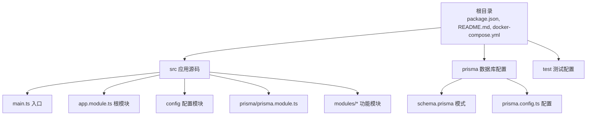
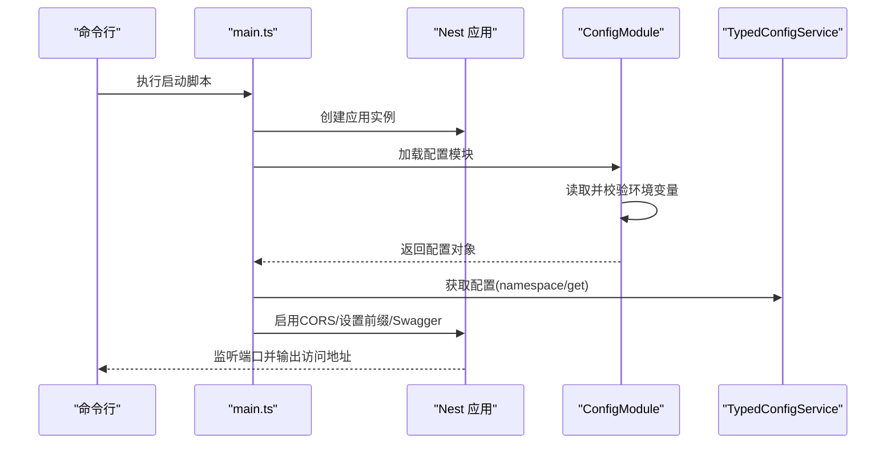
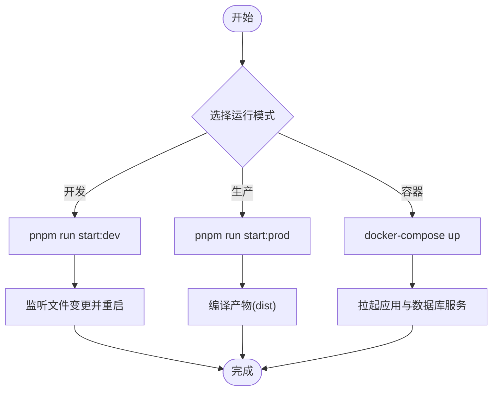
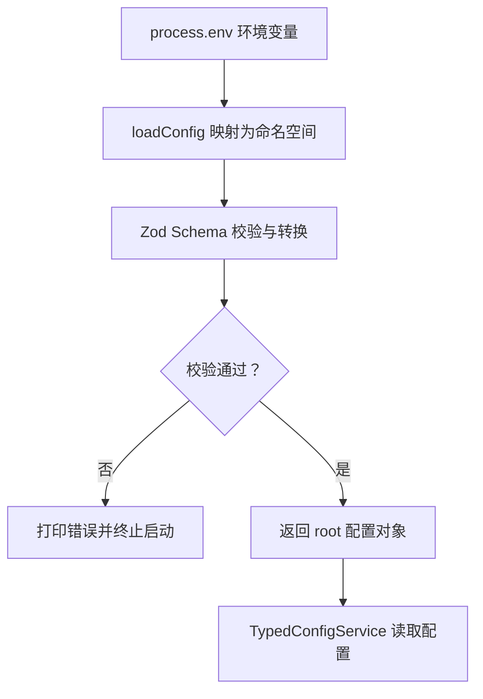
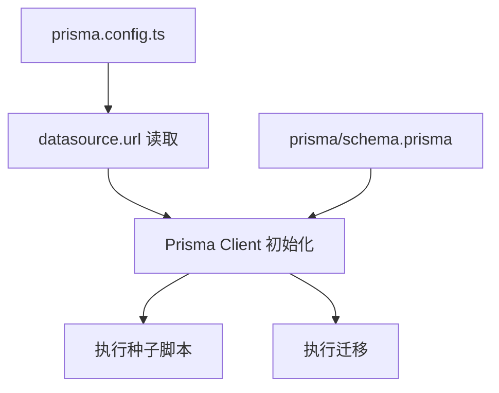
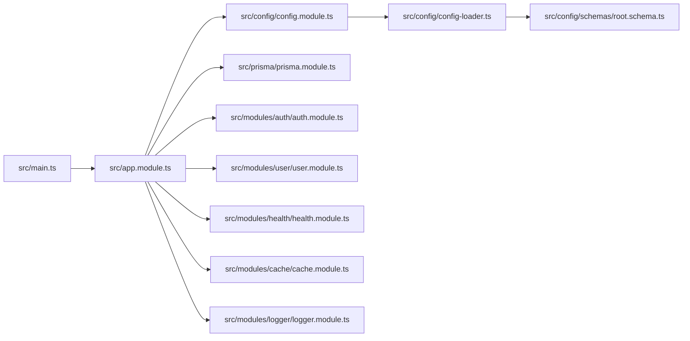

# 快速开始指南

<cite>
**本文引用的文件**
- [package.json](file://package.json)
- [README.md](file://README.md)
- [Dockerfile](file://Dockerfile)
- [docker-compose.yml](file://docker-compose.yml)
- [prisma.config.ts](file://prisma.config.ts)
- [prisma/schema.prisma](file://prisma/schema.prisma)
- [src/main.ts](file://src/main.ts)
- [src/app.module.ts](file://src/app.module.ts)
- [src/config/config.module.ts](file://src/config/config.module.ts)
- [src/config/config-loader.ts](file://src/config/config-loader.ts)
- [src/config/typed-config.service.ts](file://src/config/typed-config.service.ts)
- [src/config/types.ts](file://src/config/types.ts)
- [src/config/schemas/root.schema.ts](file://src/config/schemas/root.schema.ts)
- [src/config/schemas/app.schema.ts](file://src/config/schemas/app.schema.ts)
- [src/config/schemas/database.schema.ts](file://src/config/schemas/database.schema.ts)
</cite>

## 目录

1. [简介](#简介)
2. [项目结构](#项目结构)
3. [核心组件](#核心组件)
4. [架构总览](#架构总览)
5. [详细组件分析](#详细组件分析)
6. [依赖关系分析](#依赖关系分析)
7. [性能考虑](#性能考虑)
8. [故障排除指南](#故障排除指南)
9. [结论](#结论)
10. [附录](#附录)

## 简介

本指南面向初学者与开发者，帮助你在最短时间内完成项目搭建、环境配置与首次运行。你将学到：

- 系统要求与前置条件
- 依赖安装与环境准备
- 数据库初始化与 Prisma 配置
- 环境变量配置要点
- 多种运行模式（开发、生产、容器化）
- 常见启动问题排查与解决方案

## 项目结构

该项目基于 NestJS 框架，采用模块化组织方式，核心目录与职责如下：

- src：应用源码，包含模块、配置、Prisma 集成与入口文件
- prisma：数据库模式与迁移配置
- scripts：辅助脚本（如调试 Token）
- test：端到端测试配置
- 根目录：构建与运行脚本、Docker 配置、ESLint/Prettier 规则等

**图表来源**

- [src/main.ts:1-50](file://src/main.ts#L1-L50)
- [src/app.module.ts:1-61](file://src/app.module.ts#L1-L61)
- [prisma/schema.prisma:1-13](file://prisma/schema.prisma#L1-L13)
- [prisma.config.ts:1-14](file://prisma.config.ts#L1-L14)

**章节来源**

- [README.md:28-60](file://README.md#L28-L60)
- [package.json:8-25](file://package.json#L8-L25)

## 核心组件

- 应用入口与引导：在入口文件中创建 Nest 应用、加载配置、启用 CORS、设置全局前缀与可选 Swagger 文档，并监听端口。
- 根模块：注册配置模块、缓存、限流、Prisma、认证、用户、健康检查与日志模块；同时注册全局守卫、拦截器、管道与过滤器。
- 配置系统：通过全局配置模块加载与验证环境变量，使用 Zod Schema 进行严格校验，提供类型安全的配置读取服务。

**章节来源**

- [src/main.ts:8-47](file://src/main.ts#L8-L47)
- [src/app.module.ts:18-60](file://src/app.module.ts#L18-L60)
- [src/config/config.module.ts:6-19](file://src/config/config.module.ts#L6-L19)
- [src/config/config-loader.ts:5-52](file://src/config/config-loader.ts#L5-L52)
- [src/config/typed-config.service.ts:6-47](file://src/config/typed-config.service.ts#L6-L47)

## 架构总览

下图展示了从启动到服务可用的关键流程：入口文件引导应用，配置模块加载环境变量并通过 Zod 校验，随后按需启用 Swagger 并对外提供 API。

**图表来源**

- [src/main.ts:8-47](file://src/main.ts#L8-L47)
- [src/config/config.module.ts:8-15](file://src/config/config.module.ts#L8-L15)
- [src/config/config-loader.ts:36-51](file://src/config/config-loader.ts#L36-L51)
- [src/config/typed-config.service.ts:23-46](file://src/config/typed-config.service.ts#L23-L46)

## 详细组件分析

### 启动与运行模式

- 开发模式：热重载监听，适合本地开发与调试。
- 生产模式：编译后运行，适合部署。
- 容器化模式：通过 Dockerfile 与 docker-compose.yml 提供一键构建与运行。

**图表来源**

- [package.json:8-25](file://package.json#L8-L25)
- [docker-compose.yml:1-37](file://docker-compose.yml#L1-L37)

**章节来源**

- [README.md:34-58](file://README.md#L34-L58)
- [package.json:8-25](file://package.json#L8-L25)
- [Dockerfile:1-20](file://Dockerfile#L1-L20)
- [docker-compose.yml:1-37](file://docker-compose.yml#L1-L37)

### 环境变量与配置校验

- 配置来源：process.env 的扁平键映射到分层命名空间（app、database、jwt、logger）。
- 校验机制：使用 Zod Schema 对每类配置进行类型转换与校验，失败时输出详细错误并阻止启动。
- 类型安全：通过自定义工具类型推导配置路径与值类型，避免运行期错误。

**图表来源**

- [src/config/config-loader.ts:5-52](file://src/config/config-loader.ts#L5-L52)
- [src/config/schemas/root.schema.ts:10-15](file://src/config/schemas/root.schema.ts#L10-L15)
- [src/config/schemas/app.schema.ts:3-9](file://src/config/schemas/app.schema.ts#L3-L9)
- [src/config/schemas/database.schema.ts:3-8](file://src/config/schemas/database.schema.ts#L3-L8)
- [src/config/typed-config.service.ts:23-46](file://src/config/typed-config.service.ts#L23-L46)
- [src/config/types.ts:6-34](file://src/config/types.ts#L6-L34)

**章节来源**

- [src/config/config.module.ts:8-15](file://src/config/config.module.ts#L8-L15)
- [src/config/config-loader.ts:36-51](file://src/config/config-loader.ts#L36-L51)
- [src/config/typed-config.service.ts:11-18](file://src/config/typed-config.service.ts#L11-L18)

### 数据库与 Prisma 初始化

- Prisma 配置：通过 prisma.config.ts 指定 schema 目录、迁移与种子脚本，并从环境变量读取数据源 URL。
- 模式定义：schema.prisma 中声明 sqlite 作为默认 Provider，可在运行时切换为其他 Provider。
- 种子与迁移：可通过 Prisma CLI 执行迁移与种子脚本以初始化数据库。

**图表来源**

- [prisma.config.ts:4-13](file://prisma.config.ts#L4-L13)
- [prisma/schema.prisma:10-12](file://prisma/schema.prisma#L10-L12)

**章节来源**

- [prisma.config.ts:1-14](file://prisma.config.ts#L1-L14)
- [prisma/schema.prisma:1-13](file://prisma/schema.prisma#L1-L13)

### 安全与认证（JWT）

- 认证策略：项目集成 JWT 与 Passport，提供登录、令牌刷新与访问控制能力。
- 配置项：JWT 密钥、访问与刷新令牌有效期等通过环境变量配置。
- 守卫与拦截：全局注册 JWT 守卫与日志/响应拦截器，统一处理请求与响应。

**章节来源**

- [src/app.module.ts:12-16](file://src/app.module.ts#L12-L16)
- [src/config/config-loader.ts:21-26](file://src/config/config-loader.ts#L21-L26)

## 依赖关系分析

- 应用入口依赖配置模块与日志工厂，按配置启用 CORS、全局前缀与 Swagger。
- 根模块聚合多个业务模块与基础设施模块，并注册全局中间件（守卫、拦截器、管道、过滤器）。
- 配置模块依赖 Zod Schema 与 ConfigService，提供类型安全的配置读取。

**图表来源**

- [src/main.ts:1-50](file://src/main.ts#L1-L50)
- [src/app.module.ts:18-60](file://src/app.module.ts#L18-L60)
- [src/config/config.module.ts:6-19](file://src/config/config.module.ts#L6-L19)
- [src/config/config-loader.ts:1-52](file://src/config/config-loader.ts#L1-L52)
- [src/config/schemas/root.schema.ts:1-21](file://src/config/schemas/root.schema.ts#L1-L21)

**章节来源**

- [src/app.module.ts:18-60](file://src/app.module.ts#L18-L60)

## 性能考虑

- 限流策略：已内置多级限流配置，建议根据业务场景调整 TTL 与限制数。
- 缓存模块：建议结合业务场景启用缓存以降低数据库压力。
- 日志轮转：生产环境建议开启文件日志与轮转，避免日志过大影响性能。
- Swagger：仅在开发环境启用，生产关闭以减少开销。

**章节来源**

- [src/app.module.ts:21-25](file://src/app.module.ts#L21-L25)
- [src/config/config-loader.ts:27-33](file://src/config/config-loader.ts#L27-L33)

## 故障排除指南

- 环境变量校验失败
  - 现象：启动时报错并终止，提示环境变量校验失败。
  - 排查：检查 app、database、jwt、logger 命名空间下的必填项与格式是否正确。
  - 参考
    - [src/config/config-loader.ts:39-46](file://src/config/config-loader.ts#L39-L46)
    - [src/config/schemas/app.schema.ts:3-9](file://src/config/schemas/app.schema.ts#L3-L9)
    - [src/config/schemas/database.schema.ts:3-8](file://src/config/schemas/database.schema.ts#L3-L8)
- 数据库连接异常
  - 现象：应用启动后无法连接数据库或迁移失败。
  - 排查：确认 DATABASE_URL 是否正确；若使用 SQLite，请确保文件路径可写；若使用 PostgreSQL，请确认容器健康状态与网络连通性。
  - 参考
    - [prisma.config.ts:10-12](file://prisma.config.ts#L10-L12)
    - [docker-compose.yml:19-33](file://docker-compose.yml#L19-L33)
- Swagger 未显示
  - 现象：访问文档地址无响应。
  - 排查：确认 ENABLE_SWAGGER 与 API_PREFIX 设置；检查全局前缀与文档路由拼接。
  - 参考
    - [src/main.ts:24-33](file://src/main.ts#L24-L33)
    - [src/config/config-loader.ts:13-14](file://src/config/config-loader.ts#L13-L14)
- 端口占用或 CORS 问题
  - 现象：应用启动但无法访问或跨域失败。
  - 排查：确认 PORT 与 CORS_ORIGIN 设置；检查防火墙与代理配置。
  - 参考
    - [src/main.ts:19-22](file://src/main.ts#L19-L22)
    - [src/config/config-loader.ts:12-14](file://src/config/config-loader.ts#L12-L14)

**章节来源**

- [src/config/config-loader.ts:39-46](file://src/config/config-loader.ts#L39-L46)
- [prisma.config.ts:10-12](file://prisma.config.ts#L10-L12)
- [docker-compose.yml:19-33](file://docker-compose.yml#L19-L33)
- [src/main.ts:19-33](file://src/main.ts#L19-L33)

## 结论

通过本指南，你可以：

- 在本地快速安装依赖并启动项目
- 正确配置环境变量与数据库
- 选择合适的运行模式（开发/生产/容器化）
- 快速定位常见问题并解决

建议在首次运行后，逐步探索各模块与配置项，以便更好地理解系统的整体设计与扩展方式。

## 附录

### 系统要求与前置条件

- Node.js 版本：请参考 Dockerfile 中的基础镜像版本，确保本地 Node.js 版本兼容。
- 包管理器：推荐使用 pnpm，仓库已提供 pnpm 配置与锁定文件。
- 数据库：默认使用 sqlite，也可切换为 PostgreSQL；如使用 PostgreSQL，需准备数据库服务或使用 docker-compose。

**章节来源**

- [Dockerfile:1-20](file://Dockerfile#L1-L20)
- [prisma/schema.prisma:10-12](file://prisma/schema.prisma#L10-L12)

### 依赖安装与环境准备

- 安装依赖：使用 pnpm 安装项目依赖。
- 编译项目：生成 dist 构建产物。
- 运行项目：支持开发、生产与测试模式。

**章节来源**

- [README.md:28-58](file://README.md#L28-L58)
- [package.json:8-25](file://package.json#L8-L25)

### 数据库初始化步骤

- 初始化 Prisma：生成客户端与类型、执行迁移与种子脚本。
- 切换 Provider：如需使用 PostgreSQL，请在环境变量中设置 DATABASE_PROVIDER 与 DATABASE_URL。

**章节来源**

- [prisma.config.ts:4-13](file://prisma.config.ts#L4-L13)
- [prisma/schema.prisma:10-12](file://prisma/schema.prisma#L10-L12)
- [src/config/config-loader.ts:15-18](file://src/config/config-loader.ts#L15-L18)

### 环境变量配置清单

- 应用配置（app）
  - NODE_ENV：运行环境（development/production/test）
  - PORT：服务端口
  - API_PREFIX：全局 API 前缀
  - CORS_ORIGIN：允许的前端域名
  - ENABLE_SWAGGER：是否启用 Swagger
- 数据库配置（database）
  - DATABASE_PROVIDER：数据库提供商（sqlite/postgresql）
  - DATABASE_URL：数据库连接字符串
  - DB_MAX_CONNECTIONS：最大连接数
  - DB_LOGGING：是否开启数据库日志
- JWT 配置（jwt）
  - JWT_SECRET：访问令牌密钥
  - JWT_ACCESS_TTL：访问令牌过期时间
  - JWT_REFRESH_SECRET：刷新令牌密钥
  - JWT_REFRESH_TTL：刷新令牌过期时间
- 日志配置（logger）
  - LOGGER_DIR：日志目录
  - LOGGER_LEVEL：日志级别
  - LOGGER_ENABLE_FILE：是否启用文件日志
  - LOGGER_MAX_FILES：日志文件保留数量
  - LOGGER_MAX_SIZE：单文件最大大小

**章节来源**

- [src/config/config-loader.ts:7-34](file://src/config/config-loader.ts#L7-L34)
- [src/config/schemas/app.schema.ts:3-9](file://src/config/schemas/app.schema.ts#L3-L9)
- [src/config/schemas/database.schema.ts:3-8](file://src/config/schemas/database.schema.ts#L3-L8)

### 多种运行模式说明

- 开发模式：自动监听文件变更并重启，便于调试。
- 生产模式：编译后运行，适合部署。
- 容器化部署：使用 docker-compose 一键拉起应用与数据库服务。

**章节来源**

- [README.md:34-58](file://README.md#L34-L58)
- [package.json:8-25](file://package.json#L8-L25)
- [docker-compose.yml:1-37](file://docker-compose.yml#L1-L37)
