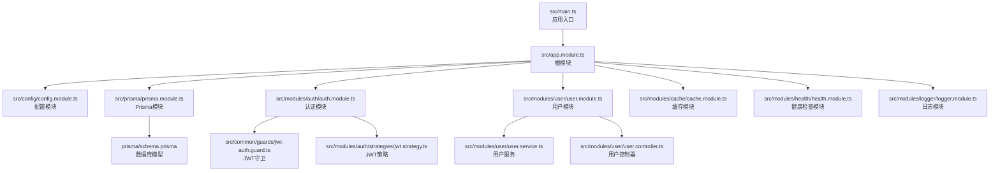
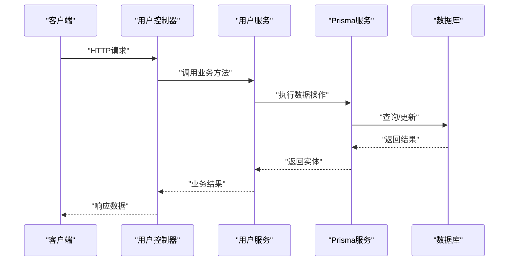
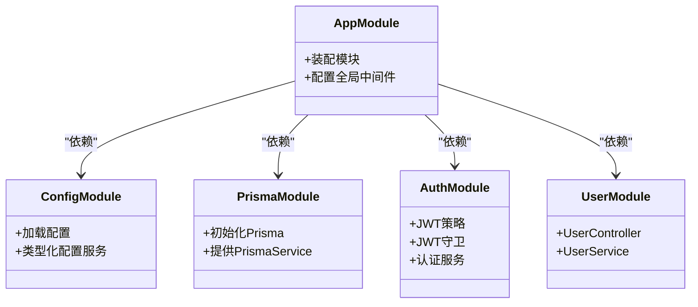
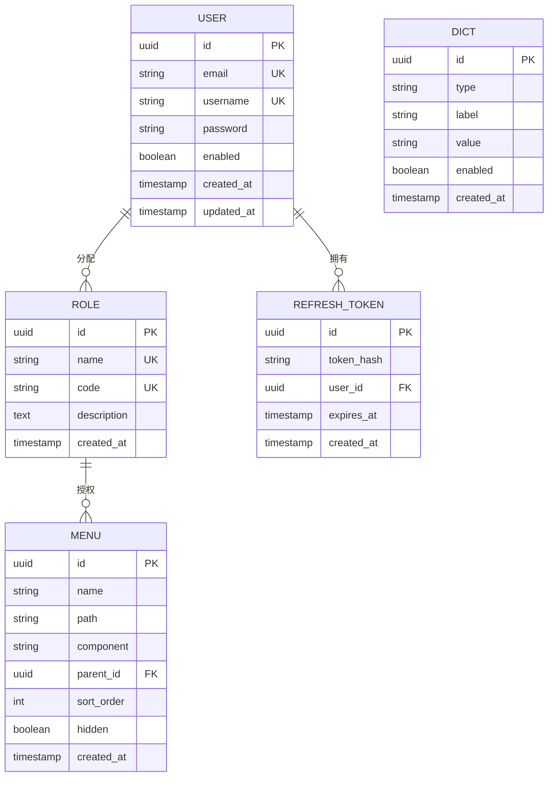
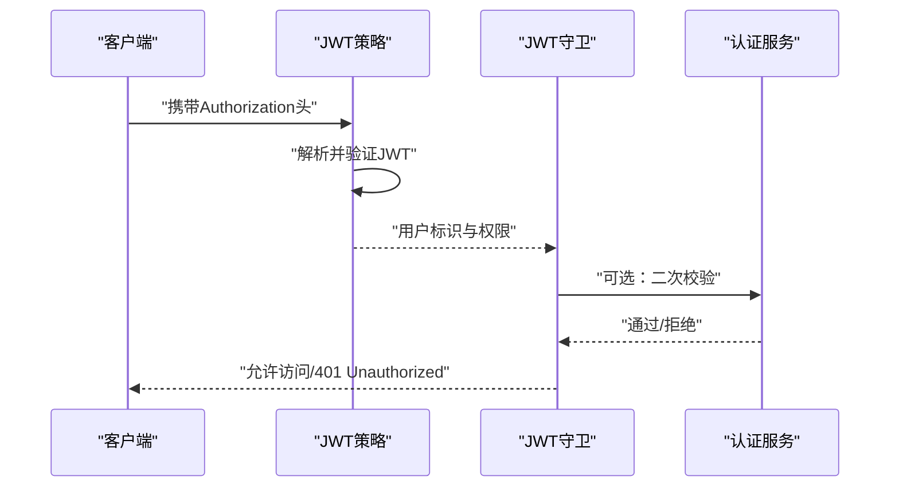
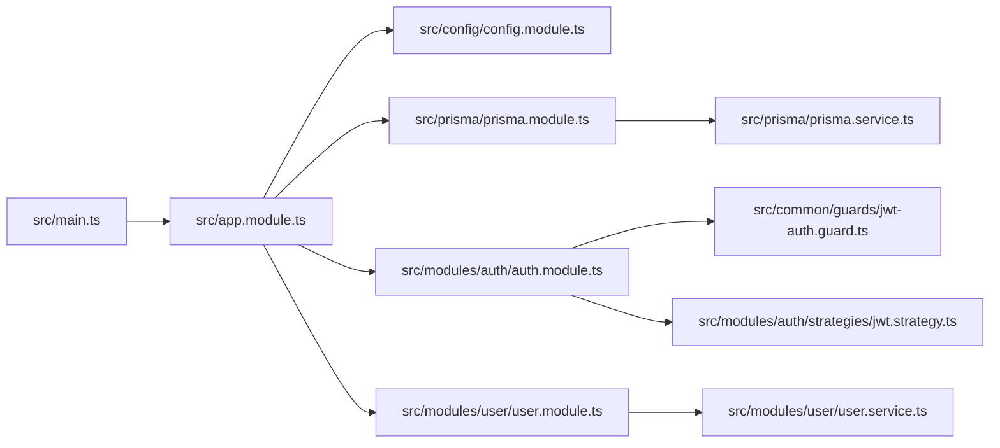

# 技术栈概览

<cite>
**本文档引用的文件**
- [package.json](file://package.json)
- [tsconfig.json](file://tsconfig.json)
- [src/main.ts](file://src/main.ts)
- [src/app.module.ts](file://src/app.module.ts)
- [src/config/config.module.ts](file://src/config/config.module.ts)
- [src/config/typed-config.service.ts](file://src/config/typed-config.service.ts)
- [src/modules/auth/auth.module.ts](file://src/modules/auth/auth.module.ts)
- [src/modules/auth/auth.service.ts](file://src/modules/auth/auth.service.ts)
- [src/modules/auth/strategies/jwt.strategy.ts](file://src/modules/auth/strategies/jwt.strategy.ts)
- [src/common/guards/jwt-auth.guard.ts](file://src/common/guards/jwt-auth.guard.ts)
- [src/prisma/prisma.module.ts](file://src/prisma/prisma.module.ts)
- [src/prisma/prisma.service.ts](file://src/prisma/prisma.service.ts)
- [prisma/schema.prisma](file://prisma/schema.prisma)
- [prisma/schema/User.prisma](file://prisma/schema/User.prisma)
- [prisma/schema/Role.prisma](file://prisma/schema/Role.prisma)
- [prisma/schema/Menu.prisma](file://prisma/schema/Menu.prisma)
- [prisma/schema/Dict.prisma](file://prisma/schema/Dict.prisma)
- [prisma/schema/RefreshToken.prisma](file://prisma/schema/RefreshToken.prisma)
- [src/common/decorators/public.decorator.ts](file://src/common/decorators/public.decorator.ts)
- [src/common/interceptors/logging.interceptor.ts](file://src/common/interceptors/logging.interceptor.ts)
- [src/common/interceptors/transform.interceptor.ts](file://src/common/interceptors/transform.interceptor.ts)
- [src/common/filters/http-exception.filter.ts](file://src/common/filters/http-exception.filter.ts)
- [src/common/enums/biz-code.enum.ts](file://src/common/enums/biz-code.enum.ts)
- [src/common/exceptions/business.exception.ts](file://src/common/exceptions/business.exception.ts)
- [src/common/utils/time.util.ts](file://src/common/utils/time.util.ts)
- [src/common/utils/sanitize.util.ts](file://src/common/utils/sanitize.util.ts)
- [src/modules/user/user.service.ts](file://src/modules/user/user.service.ts)
- [src/modules/user/user.controller.ts](file://src/modules/user/user.controller.ts)
- [src/modules/cache/cache.module.ts](file://src/modules/cache/cache.module.ts)
- [src/modules/health/health.controller.ts](file://src/modules/health/health.controller.ts)
- [src/modules/logger/logger.module.ts](file://src/modules/logger/logger.module.ts)
- [src/modules/logger/log-query.service.ts](file://src/modules/logger/log-query.service.ts)
- [src/modules/logger/logger.factory.ts](file://src/modules/logger/logger.factory.ts)
- [prisma.config.ts](file://prisma.config.ts)
- [src/config/schemas/root.schema.ts](file://src/config/schemas/root.schema.ts)
- [src/config/schemas/database.schema.ts](file://src/config/schemas/database.schema.ts)
- [src/common/dto/api-error-response.dto.ts](file://src/common/dto/api-error-response.dto.ts)
</cite>

## 更新摘要

**所做更改**

- 移除了关于 zod-prisma-types 包的依赖说明和相关配置内容
- 更新了依赖关系分析，反映当前实际的依赖配置
- 删除了与 zod-prisma-types 相关的配置示例和说明
- 维护了其他技术栈内容的完整性

## 目录

1. [引言](#引言)
2. [项目结构](#项目结构)
3. [核心组件](#核心组件)
4. [架构总览](#架构总览)
5. [详细组件分析](#详细组件分析)
6. [依赖关系分析](#依赖关系分析)
7. [性能考虑](#性能考虑)
8. [故障排除指南](#故障排除指南)
9. [结论](#结论)
10. [附录](#附录)

## 引言

本项目是一个基于 NestJS 的企业级后端服务，采用 TypeScript 构建，结合 Prisma ORM 实现数据库访问，通过 JWT 进行认证授权，并围绕模块化架构组织业务功能。该技术栈在类型安全、可维护性、开发效率和运行时性能方面形成良好平衡，适合构建中大型企业应用。

## 项目结构

项目采用标准的 NestJS 结构，按功能模块划分，配合通用层（common）提供跨模块复用的能力。核心目录与职责如下：

- src：应用源码
  - common：通用装饰器、守卫、拦截器、过滤器、异常、工具类等
  - config：配置加载与类型化配置服务
  - modules：业务模块（如 auth、user、cache、health、logger 等）
  - prisma：Prisma 模块与服务封装
  - app.module.ts：根模块
  - main.ts：应用入口
- prisma：数据库模型定义与种子数据
- 配置与工具：package.json、tsconfig.json、eslint.config.mjs、jest.config.js 等

**图表来源**

- [src/main.ts](file://src/main.ts)
- [src/app.module.ts](file://src/app.module.ts)
- [src/config/config.module.ts](file://src/config/config.module.ts)
- [src/prisma/prisma.module.ts](file://src/prisma/prisma.module.ts)
- [src/modules/auth/auth.module.ts](file://src/modules/auth/auth.module.ts)
- [src/modules/user/user.module.ts](file://src/modules/user/user.module.ts)
- [src/modules/cache/cache.module.ts](file://src/modules/cache/cache.module.ts)
- [src/modules/health/health.module.ts](file://src/modules/health/health.module.ts)
- [src/modules/logger/logger.module.ts](file://src/modules/logger/logger.module.ts)
- [src/common/guards/jwt-auth.guard.ts](file://src/common/guards/jwt-auth.guard.ts)
- [src/modules/auth/strategies/jwt.strategy.ts](file://src/modules/auth/strategies/jwt.strategy.ts)
- [src/modules/user/user.service.ts](file://src/modules/user/user.service.ts)
- [src/modules/user/user.controller.ts](file://src/modules/user/user.controller.ts)
- [prisma/schema.prisma](file://prisma/schema.prisma)

**章节来源**

- [src/main.ts](file://src/main.ts)
- [src/app.module.ts](file://src/app.module.ts)

## 核心组件

- NestJS 框架：提供模块化架构、依赖注入、生命周期管理、中间件与拦截器等能力，支撑企业级应用的可扩展性与可测试性。
- TypeScript：提供静态类型系统，增强代码可读性与可维护性，降低运行时错误风险。
- Prisma ORM：类型安全的数据库查询与迁移工具，支持多数据库，简化数据访问层。
- JWT 认证：基于策略的认证机制，结合守卫实现细粒度的权限控制。
- 配置系统：类型化配置加载，确保环境变量的正确性与一致性。
- 通用层：统一的装饰器、守卫、拦截器、过滤器与异常处理，提升代码复用与一致性。

**章节来源**

- [src/common/guards/jwt-auth.guard.ts](file://src/common/guards/jwt-auth.guard.ts)
- [src/common/interceptors/logging.interceptor.ts](file://src/common/interceptors/logging.interceptor.ts)
- [src/common/interceptors/transform.interceptor.ts](file://src/common/interceptors/transform.interceptor.ts)
- [src/common/filters/http-exception.filter.ts](file://src/common/filters/http-exception.filter.ts)
- [src/config/config.module.ts](file://src/config/config.module.ts)
- [src/config/typed-config.service.ts](file://src/config/typed-config.service.ts)
- [src/prisma/prisma.module.ts](file://src/prisma/prisma.module.ts)
- [src/prisma/prisma.service.ts](file://src/prisma/prisma.service.ts)

## 架构总览

系统采用分层与模块化设计，核心交互流程如下：

**图表来源**

- [src/modules/user/user.controller.ts](file://src/modules/user/user.controller.ts)
- [src/modules/user/user.service.ts](file://src/modules/user/user.service.ts)
- [src/prisma/prisma.service.ts](file://src/prisma/prisma.service.ts)
- [prisma/schema.prisma](file://prisma/schema.prisma)

## 详细组件分析

### NestJS 框架与模块化架构

- 根模块负责装配各子模块，形成清晰的边界与依赖关系。
- 控制器负责接收请求并委派给服务层；服务层封装业务逻辑；模块间通过依赖注入解耦。
- 通用层提供横切关注点（认证、日志、异常处理），减少重复代码。

**图表来源**

- [src/app.module.ts](file://src/app.module.ts)
- [src/config/config.module.ts](file://src/config/config.module.ts)
- [src/prisma/prisma.module.ts](file://src/prisma/prisma.module.ts)
- [src/modules/auth/auth.module.ts](file://src/modules/auth/auth.module.ts)
- [src/modules/user/user.module.ts](file://src/modules/user/user.module.ts)

**章节来源**

- [src/app.module.ts](file://src/app.module.ts)
- [src/modules/user/user.module.ts](file://src/modules/user/user.module.ts)

### TypeScript 类型系统

- 通过严格模式与类型声明，确保接口契约明确，便于 IDE 提示与重构。
- 在 DTO、接口、枚举与工具函数中广泛使用类型约束，降低运行时不确定性。

**章节来源**

- [tsconfig.json](file://tsconfig.json)
- [src/common/interfaces/user.interface.ts](file://src/common/interfaces/user.interface.ts)
- [src/common/enums/biz-code.enum.ts](file://src/common/enums/biz-code.enum.ts)

### Prisma ORM 数据访问层

- 使用 Prisma Schema 定义数据模型，支持关联、索引与校验规则。
- 通过 Prisma Module 与 Service 封装数据访问，提供类型安全的查询与事务支持。
- 支持多数据库后端，具备良好的可移植性与迁移能力。

**图表来源**

- [prisma/schema/User.prisma](file://prisma/schema/User.prisma)
- [prisma/schema/Role.prisma](file://prisma/schema/Role.prisma)
- [prisma/schema/Menu.prisma](file://prisma/schema/Menu.prisma)
- [prisma/schema/Dict.prisma](file://prisma/schema/Dict.prisma)
- [prisma/schema/RefreshToken.prisma](file://prisma/schema/RefreshToken.prisma)

**章节来源**

- [prisma/schema.prisma](file://prisma/schema.prisma)
- [src/prisma/prisma.module.ts](file://src/prisma/prisma.module.ts)
- [src/prisma/prisma.service.ts](file://src/prisma/prisma.service.ts)

### JWT 认证与授权

- 基于策略的认证：JWT 策略从请求中提取令牌并验证其有效性。
- 守卫用于保护路由或方法，未通过认证的请求被拒绝。
- 公共接口可通过装饰器豁免认证，实现灵活的权限控制。

**图表来源**

- [src/modules/auth/strategies/jwt.strategy.ts](file://src/modules/auth/strategies/jwt.strategy.ts)
- [src/common/guards/jwt-auth.guard.ts](file://src/common/guards/jwt-auth.guard.ts)
- [src/modules/auth/auth.service.ts](file://src/modules/auth/auth.service.ts)

**章节来源**

- [src/modules/auth/strategies/jwt.strategy.ts](file://src/modules/auth/strategies/jwt.strategy.ts)
- [src/common/guards/jwt-auth.guard.ts](file://src/common/guards/jwt-auth.guard.ts)
- [src/common/decorators/public.decorator.ts](file://src/common/decorators/public.decorator.ts)

### 配置系统与类型安全

- 通过配置模块加载环境变量，并结合类型化配置服务确保键值类型正确。
- 支持应用、数据库、JWT、日志等多维度配置的集中管理。

**章节来源**

- [src/config/config.module.ts](file://src/config/config.module.ts)
- [src/config/typed-config.service.ts](file://src/config/typed-config.service.ts)

### 通用横切能力

- 日志拦截器：统一记录请求与响应信息，便于调试与审计。
- 数据转换拦截器：标准化响应格式，统一业务状态码与消息。
- 异常过滤器：捕获并格式化异常，避免敏感信息泄露。
- 业务异常：针对业务场景抛出特定异常，便于上层统一处理。

**章节来源**

- [src/common/interceptors/logging.interceptor.ts](file://src/common/interceptors/logging.interceptor.ts)
- [src/common/interceptors/transform.interceptor.ts](file://src/common/interceptors/transform.interceptor.ts)
- [src/common/filters/http-exception.filter.ts](file://src/common/filters/http-exception.filter.ts)
- [src/common/exceptions/business.exception.ts](file://src/common/exceptions/business.exception.ts)
- [src/common/enums/biz-code.enum.ts](file://src/common/enums/biz-code.enum.ts)

## 依赖关系分析

- 应用启动：main.ts -> app.module.ts -> 各功能模块
- 认证链路：控制器 -> 服务 -> JWT 策略/守卫 -> 认证服务
- 数据访问：服务 -> Prisma 服务 -> 数据库
- 配置加载：配置模块 -> 类型化配置服务 -> 各模块读取

**图表来源**

- [src/main.ts](file://src/main.ts)
- [src/app.module.ts](file://src/app.module.ts)
- [src/config/config.module.ts](file://src/config/config.module.ts)
- [src/prisma/prisma.module.ts](file://src/prisma/prisma.module.ts)
- [src/modules/auth/auth.module.ts](file://src/modules/auth/auth.module.ts)
- [src/modules/user/user.module.ts](file://src/modules/user/user.module.ts)
- [src/common/guards/jwt-auth.guard.ts](file://src/common/guards/jwt-auth.guard.ts)
- [src/modules/auth/strategies/jwt.strategy.ts](file://src/modules/auth/strategies/jwt.strategy.ts)
- [src/modules/user/user.service.ts](file://src/modules/user/user.service.ts)
- [src/prisma/prisma.service.ts](file://src/prisma/prisma.service.ts)

**章节来源**

- [src/main.ts](file://src/main.ts)
- [src/app.module.ts](file://src/app.module.ts)

## 性能考虑

- 使用拦截器统一处理响应与日志，避免在控制器中重复逻辑，提高可维护性与一致性。
- Prisma 查询应尽量使用选择性字段与分页，避免 N+1 查询问题。
- JWT 策略与守卫应结合缓存与令牌刷新机制，降低频繁鉴权带来的开销。
- 配置系统采用类型化加载，减少运行时配置错误导致的性能损耗。

## 故障排除指南

- 认证失败：检查 JWT 策略是否正确解析令牌，守卫是否正确应用到受保护路由。
- 数据访问异常：确认 Prisma 服务初始化是否成功，数据库连接字符串是否正确。
- 响应格式异常：检查数据转换拦截器是否生效，业务状态码与消息是否符合约定。
- 配置错误：核对类型化配置服务中的键名与类型，确保与环境变量一致。

**章节来源**

- [src/common/guards/jwt-auth.guard.ts](file://src/common/guards/jwt-auth.guard.ts)
- [src/modules/auth/strategies/jwt.strategy.ts](file://src/modules/auth/strategies/jwt.strategy.ts)
- [src/prisma/prisma.service.ts](file://src/prisma/prisma.service.ts)
- [src/common/interceptors/transform.interceptor.ts](file://src/common/interceptors/transform.interceptor.ts)
- [src/common/exceptions/business.exception.ts](file://src/common/exceptions/business.exception.ts)
- [src/config/typed-config.service.ts](file://src/config/typed-config.service.ts)

## 结论

本项目以 NestJS 为核心，结合 TypeScript 的类型安全、Prisma 的数据访问能力与 JWT 的认证机制，构建了高内聚、低耦合的企业级应用骨架。通过模块化设计与通用横切能力，提升了系统的可维护性与扩展性。建议在后续迭代中持续完善测试覆盖、监控与可观测性，并根据业务增长优化缓存与异步任务处理。

## 附录

### 版本与兼容性要点

- 语言与编译：TypeScript 配置启用严格模式，确保类型安全与高质量输出。
- 包管理：使用 pnpm 工作区管理多包项目，提升安装与链接效率。
- 测试：Jest 配置与 e2e 测试模板，建议补充单元测试覆盖率。
- 代码风格：Prettier 与 ESLint 配置统一代码风格与质量标准。

**章节来源**

- [tsconfig.json](file://tsconfig.json)
- [package.json](file://package.json)
- [jest.config.js](file://jest.config.js)
- [.prettierrc](file://.prettierrc)
- [eslint.config.mjs](file://eslint.config.mjs)

### 学习路径建议

- NestJS 基础：模块、控制器、服务、守卫、拦截器、过滤器与异常管道
- TypeScript 进阶：接口、泛型、条件类型与严格模式配置
- Prisma 实战：Schema 设计、查询语法、事务与迁移
- JWT 认证：令牌生成、解析与策略实现
- 配置管理：环境变量加载、类型化配置与动态配置
- 最佳实践：日志、异常处理、DTO 规范与业务异常设计

### 依赖管理更新说明

**更新** 项目已移除 zod-prisma-types 包及其相关配置，当前依赖管理更加简洁直接。

**章节来源**

- [package.json](file://package.json)
- [prisma.config.ts](file://prisma.config.ts)
- [src/config/schemas/root.schema.ts](file://src/config/schemas/root.schema.ts)
- [src/config/schemas/database.schema.ts](file://src/config/schemas/database.schema.ts)
- [src/common/dto/api-error-response.dto.ts](file://src/common/dto/api-error-response.dto.ts)
