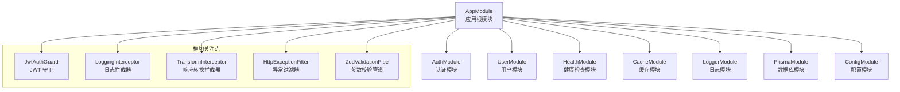
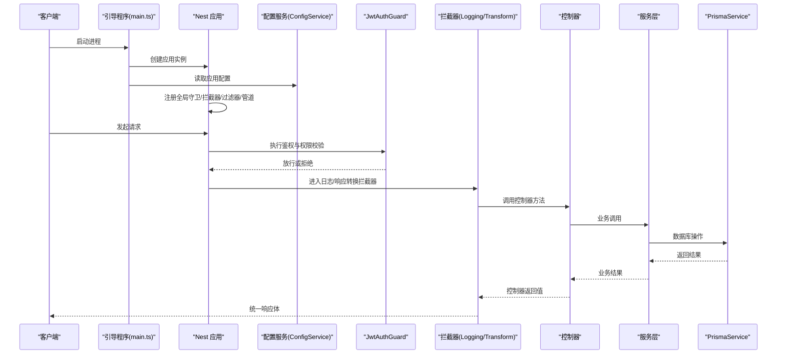
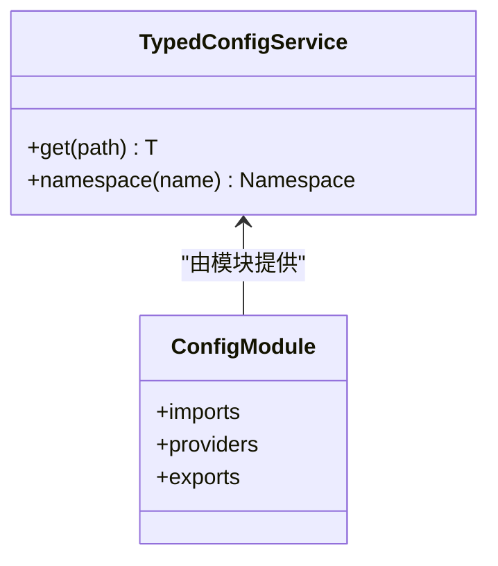
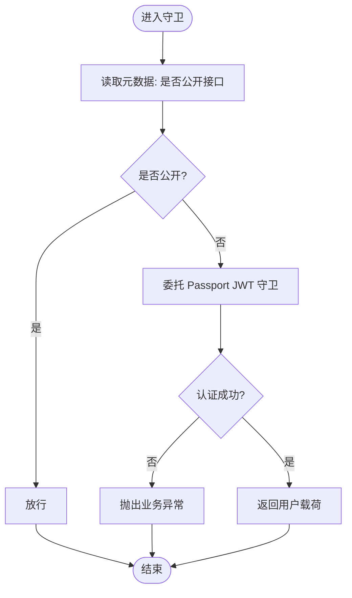
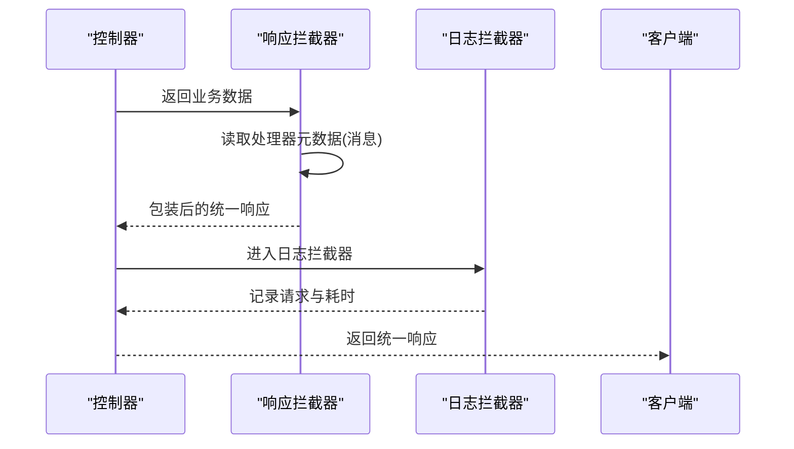
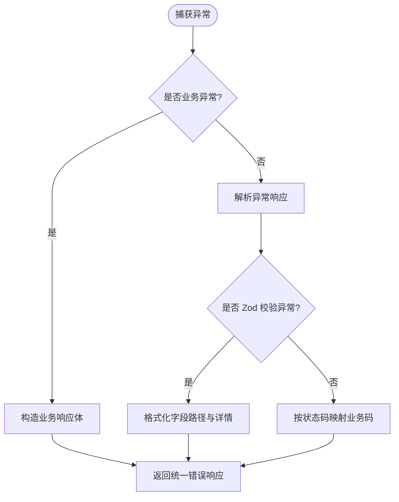
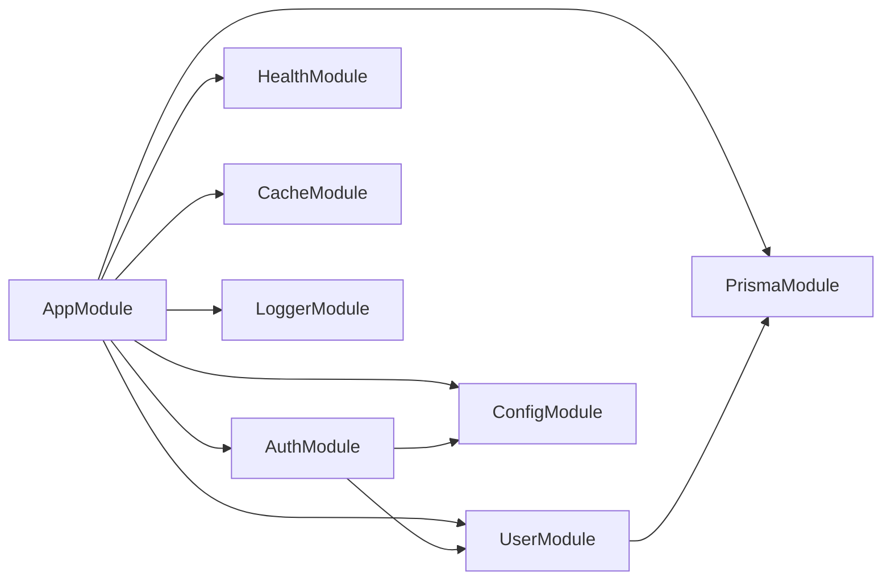

# 架构设计理念

<cite>
**本文引用的文件**
- [src/app.module.ts](file://src/app.module.ts)
- [src/main.ts](file://src/main.ts)
- [package.json](file://package.json)
- [src/config/config.module.ts](file://src/config/config.module.ts)
- [src/config/typed-config.service.ts](file://src/config/typed-config.service.ts)
- [src/modules/auth/auth.module.ts](file://src/modules/auth/auth.module.ts)
- [src/modules/user/user.module.ts](file://src/modules/user/user.module.ts)
- [src/common/guards/jwt-auth.guard.ts](file://src/common/guards/jwt-auth.guard.ts)
- [src/common/interceptors/logging.interceptor.ts](file://src/common/interceptors/logging.interceptor.ts)
- [src/common/interceptors/transform.interceptor.ts](file://src/common/interceptors/transform.interceptor.ts)
- [src/common/filters/http-exception.filter.ts](file://src/common/filters/http-exception.filter.ts)
- [src/common/decorators/public.decorator.ts](file://src/common/decorators/public.decorator.ts)
- [src/modules/logger/logger.module.ts](file://src/modules/logger/logger.module.ts)
- [src/prisma/prisma.module.ts](file://src/prisma/prisma.module.ts)
</cite>

## 目录

1. [引言](#引言)
2. [项目结构](#项目结构)
3. [核心组件](#核心组件)
4. [架构总览](#架构总览)
5. [详细组件分析](#详细组件分析)
6. [依赖关系分析](#依赖关系分析)
7. [性能考量](#性能考量)
8. [故障排查指南](#故障排查指南)
9. [结论](#结论)
10. [附录](#附录)

## 引言

本项目以 NestJS 为核心，采用模块化架构与依赖注入机制，结合中间件模式（拦截器、守卫、过滤器、管道）构建高内聚、低耦合的服务端应用。通过统一的配置中心、认证授权体系、日志与异常处理、以及数据库访问层抽象，形成可扩展、可维护且具备良好性能表现的整体架构。

## 项目结构

项目采用按功能域划分的模块化组织方式，根模块集中导入各子模块，并通过全局注册的守卫、拦截器、过滤器与验证管道，实现横切关注点的一致性与可复用性。主要模块包括认证、用户、健康检查、缓存、日志、配置与数据库访问等。

图表来源

- [src/app.module.ts:18-60](file://src/app.module.ts#L18-L60)
- [src/config/config.module.ts:6-19](file://src/config/config.module.ts#L6-L19)
- [src/prisma/prisma.module.ts:4-9](file://src/prisma/prisma.module.ts#L4-L9)

章节来源

- [src/app.module.ts:18-60](file://src/app.module.ts#L18-L60)
- [src/main.ts:8-47](file://src/main.ts#L8-L47)

## 核心组件

- 配置中心与类型化配置服务：通过全局配置模块加载与类型化访问，提供命名空间式读取能力，确保配置变更与类型安全。
- 认证与授权：基于 Passport/JWT 的守卫与策略，结合“公开接口”元数据控制访问策略。
- 统一响应与异常处理：拦截器统一包装响应；过滤器将各类异常映射为业务码与统一错误结构。
- 数据访问层：Prisma 服务封装数据库操作，模块化导出供业务模块使用。
- 日志与监控：拦截器记录请求链路与耗时；日志模块提供查询服务支撑。

章节来源

- [src/config/typed-config.service.ts:20-46](file://src/config/typed-config.service.ts#L20-L46)
- [src/common/guards/jwt-auth.guard.ts:23-44](file://src/common/guards/jwt-auth.guard.ts#L23-L44)
- [src/common/interceptors/transform.interceptor.ts:21-39](file://src/common/interceptors/transform.interceptor.ts#L21-L39)
- [src/common/filters/http-exception.filter.ts:28-78](file://src/common/filters/http-exception.filter.ts#L28-L78)
- [src/prisma/prisma.module.ts:4-9](file://src/prisma/prisma.module.ts#L4-L9)

## 架构总览

下图展示了启动流程、横切关注点与模块间的交互关系，体现依赖注入与中间件模式在请求生命周期中的作用。

图表来源

- [src/main.ts:8-47](file://src/main.ts#L8-L47)
- [src/app.module.ts:33-57](file://src/app.module.ts#L33-L57)
- [src/common/guards/jwt-auth.guard.ts:17-44](file://src/common/guards/jwt-auth.guard.ts#L17-L44)
- [src/common/interceptors/logging.interceptor.ts:16-37](file://src/common/interceptors/logging.interceptor.ts#L16-L37)
- [src/common/interceptors/transform.interceptor.ts:21-39](file://src/common/interceptors/transform.interceptor.ts#L21-L39)
- [src/prisma/prisma.module.ts:6-7](file://src/prisma/prisma.module.ts#L6-L7)

## 详细组件分析

### 配置中心与类型化访问

- 设计要点
  - 全局配置模块加载多源配置并导出类型化服务。
  - 提供点语法路径访问与命名空间读取，降低硬编码风险。
- 关键行为
  - 初始化失败时记录错误并终止进程，保证运行期配置可用性。
  - 命名空间读取用于模块内按域隔离配置（如 JWT、数据库）。
- 复杂度
  - 路径解析为 O(k)，k 为点分段数量；命名空间读取为 O(1)。

图表来源

- [src/config/typed-config.service.ts:6-47](file://src/config/typed-config.service.ts#L6-L47)
- [src/config/config.module.ts:6-19](file://src/config/config.module.ts#L6-L19)

章节来源

- [src/config/typed-config.service.ts:20-46](file://src/config/typed-config.service.ts#L20-L46)
- [src/config/config.module.ts:6-19](file://src/config/config.module.ts#L6-L19)

### 认证与授权（JWT 守卫）

- 设计要点
  - 基于 Passport 的 JWT 守卫，结合反射读取“公开接口”元数据决定是否放行。
  - 统一异常映射为业务异常，便于前端一致处理。
- 流程
  - 若标注为公开接口则直接放行；否则委托父类进行认证。
  - 认证失败或无用户信息时抛出业务异常。

图表来源

- [src/common/guards/jwt-auth.guard.ts:23-44](file://src/common/guards/jwt-auth.guard.ts#L23-L44)
- [src/common/decorators/public.decorator.ts:3-4](file://src/common/decorators/public.decorator.ts#L3-L4)

章节来源

- [src/common/guards/jwt-auth.guard.ts:17-44](file://src/common/guards/jwt-auth.guard.ts#L17-L44)
- [src/common/decorators/public.decorator.ts:3-4](file://src/common/decorators/public.decorator.ts#L3-L4)

### 统一响应与日志拦截器

- 设计要点
  - 响应拦截器统一包装响应体，注入业务码与消息，支持通过装饰器设置自定义消息。
  - 日志拦截器记录请求上下文、状态码与耗时，便于审计与排障。
- 行为特征
  - 使用 RxJS 管道组合，非侵入式增强控制器输出。
  - 日志包含用户标识、IP、UA 等上下文信息。

图表来源

- [src/common/interceptors/transform.interceptor.ts:21-39](file://src/common/interceptors/transform.interceptor.ts#L21-L39)
- [src/common/interceptors/logging.interceptor.ts:16-37](file://src/common/interceptors/logging.interceptor.ts#L16-L37)

章节来源

- [src/common/interceptors/transform.interceptor.ts:14-39](file://src/common/interceptors/transform.interceptor.ts#L14-L39)
- [src/common/interceptors/logging.interceptor.ts:12-38](file://src/common/interceptors/logging.interceptor.ts#L12-L38)

### 异常过滤与统一错误响应

- 设计要点
  - 捕获 HttpException 并映射为业务码与消息；对业务异常直接透传。
  - 对 Zod 校验异常格式化字段路径与错误详情。
- 映射规则
  - 将常见 HTTP 状态码映射为统一业务码，提升前后端一致性。
  - 未知异常降级为内部错误码，避免泄露细节。

图表来源

- [src/common/filters/http-exception.filter.ts:28-78](file://src/common/filters/http-exception.filter.ts#L28-L78)
- [src/common/filters/http-exception.filter.ts:107-134](file://src/common/filters/http-exception.filter.ts#L107-L134)
- [src/common/filters/http-exception.filter.ts:156-171](file://src/common/filters/http-exception.filter.ts#L156-L171)

章节来源

- [src/common/filters/http-exception.filter.ts:24-172](file://src/common/filters/http-exception.filter.ts#L24-L172)

### 数据访问层（Prisma）

- 设计要点
  - 全局模块导出 PrismaService，业务模块通过依赖注入使用。
  - 通过模块化拆分，避免跨模块直接耦合底层 ORM。
- 可扩展性
  - 新增实体与服务时，仅需在对应模块中引入 PrismaService 即可。

章节来源

- [src/prisma/prisma.module.ts:4-9](file://src/prisma/prisma.module.ts#L4-L9)

### 认证模块与 JWT 配置

- 设计要点
  - 使用 registerAsync 动态注入配置，从类型化配置服务读取密钥与过期时间。
  - 导出 AuthService 供其他模块使用，保持职责单一。
- 依赖关系
  - 依赖用户模块以复用用户相关能力；依赖 Passport 与 JwtModule 实现认证策略。

章节来源

- [src/modules/auth/auth.module.ts:11-33](file://src/modules/auth/auth.module.ts#L11-L33)

### 用户模块

- 设计要点
  - 聚焦用户资源的控制器与服务，遵循单一职责。
  - 通过导出 UserService，允许其他模块复用用户领域逻辑。

章节来源

- [src/modules/user/user.module.ts:5-10](file://src/modules/user/user.module.ts#L5-L10)

### 日志模块

- 设计要点
  - 提供日志查询服务，便于审计与问题定位。
  - 与拦截器配合，形成“记录+查询”的闭环。

章节来源

- [src/modules/logger/logger.module.ts:4-8](file://src/modules/logger/logger.module.ts#L4-L8)

## 依赖关系分析

- 模块耦合
  - AppModule 作为根模块，集中导入各功能模块并注册横切关注点，降低模块间耦合。
  - 认证模块依赖用户模块与配置模块；用户模块保持纯净，仅依赖服务层。
- 外部依赖
  - 通过包管理清单可见，项目使用 NestJS 生态与 Prisma、Winston、Swagger 等生态组件，形成稳定的技术栈。

图表来源

- [src/app.module.ts:18-32](file://src/app.module.ts#L18-L32)
- [src/modules/auth/auth.module.ts:11-33](file://src/modules/auth/auth.module.ts#L11-L33)
- [src/modules/user/user.module.ts:5-10](file://src/modules/user/user.module.ts#L5-L10)

章节来源

- [src/app.module.ts:18-60](file://src/app.module.ts#L18-L60)
- [package.json:26-54](file://package.json#L26-L54)

## 性能考量

- 中间件链路
  - 拦截器与守卫均采用非阻塞式实现，尽量减少同步阻塞与昂贵计算。
  - 日志记录仅在必要时输出，避免高频 I/O 影响吞吐。
- 缓存与限流
  - 通过全局限流模块配置多粒度速率限制，保护下游服务。
- 数据访问
  - Prisma 服务集中管理连接与事务，建议在服务层进行批量操作与索引优化，避免 N+1 查询。
- 配置与启动
  - 启动阶段完成配置加载与模块初始化，避免运行时动态装配带来的延迟。

## 故障排查指南

- 配置缺失
  - 类型化配置在缺少根配置时会记录错误并退出，需检查配置加载顺序与环境变量。
- 认证失败
  - 守卫会在认证失败或无用户信息时抛出业务异常，需确认令牌有效性与用户状态。
- 参数校验失败
  - Zod 校验异常会被格式化为字段路径与错误详情，优先检查请求体与 DTO 定义。
- 统一错误响应
  - 异常过滤器会将未知异常映射为内部错误码，便于前端统一处理与用户提示。

章节来源

- [src/config/typed-config.service.ts:14-18](file://src/config/typed-config.service.ts#L14-L18)
- [src/common/guards/jwt-auth.guard.ts:40-44](file://src/common/guards/jwt-auth.guard.ts#L40-L44)
- [src/common/filters/http-exception.filter.ts:107-134](file://src/common/filters/http-exception.filter.ts#L107-L134)
- [src/common/filters/http-exception.filter.ts:156-171](file://src/common/filters/http-exception.filter.ts#L156-L171)

## 结论

本项目通过 NestJS 的模块化与依赖注入，结合守卫、拦截器、过滤器与管道等中间件模式，实现了横切关注点的统一治理与高内聚低耦合的系统设计。配置中心提供类型化与命名空间访问，认证模块以策略与守卫解耦鉴权逻辑，Prisma 抽象数据库访问，日志与异常处理保障可观测性与稳定性。该架构在可扩展性、可维护性与性能之间取得平衡，适合中大型企业级后端服务演进。

## 附录

- 设计模式应用
  - 策略模式：认证模块通过不同策略（Passport/JWT）实现可插拔的认证机制。
  - 工厂模式：JWT 模块使用 registerAsync 工厂函数从配置服务动态生成模块配置。
  - 装饰器模式：通过元数据装饰器（如公开接口）与反射在运行时改变行为。
- 架构决策权衡
  - 横切关注点集中化：通过全局注册减少重复代码，但需注意拦截器链路长度与性能。
  - 配置类型化：提升开发体验与安全性，但需要维护配置 Schema 与类型映射。
  - 模块边界：按功能域划分模块，有利于团队协作与独立演进，需避免循环依赖。
