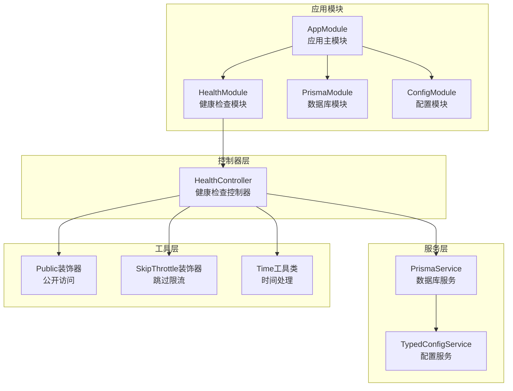
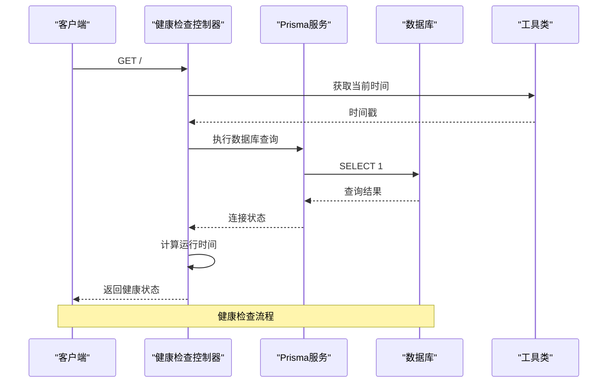
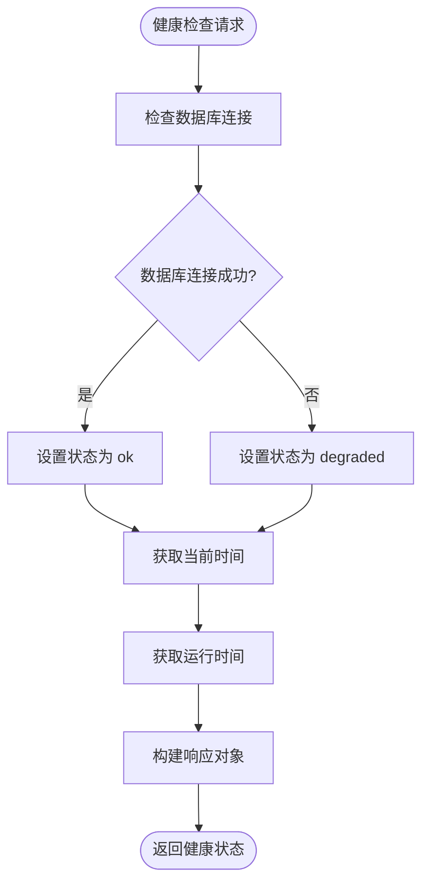
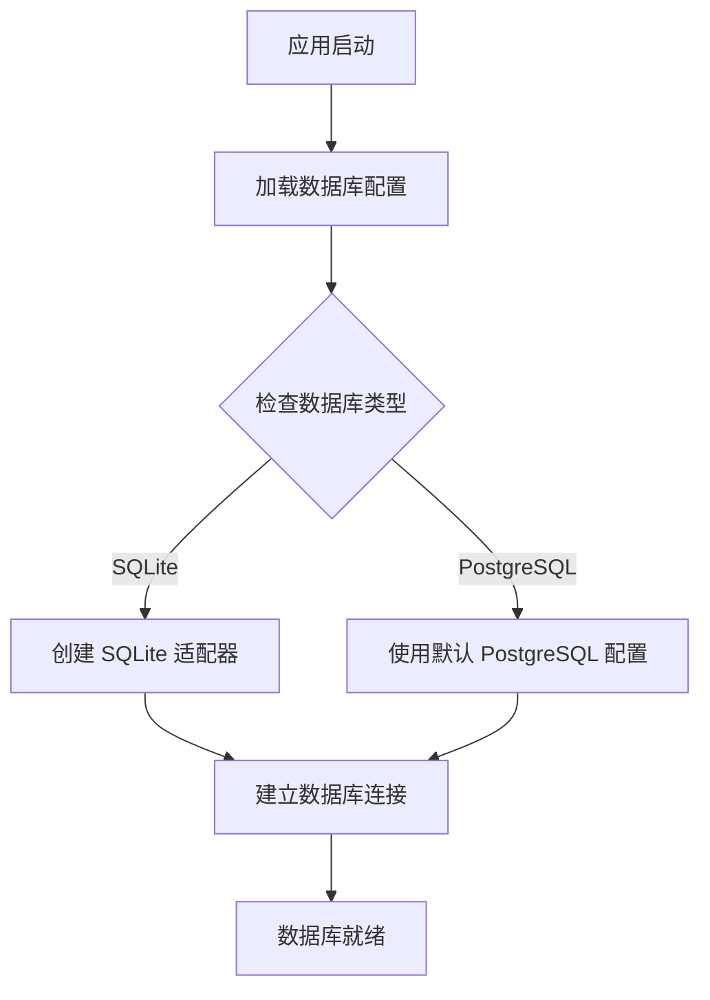
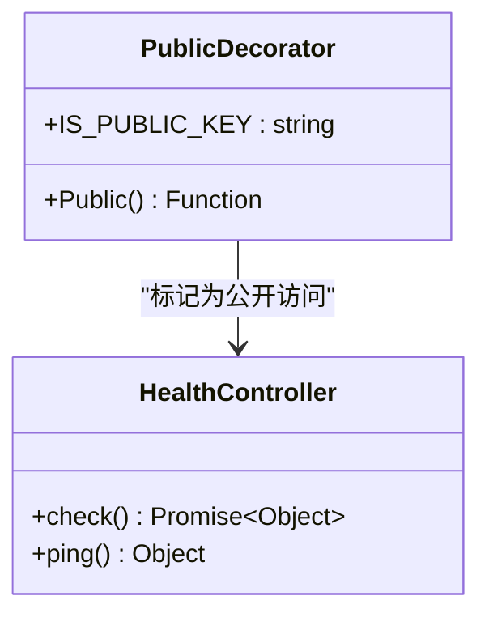
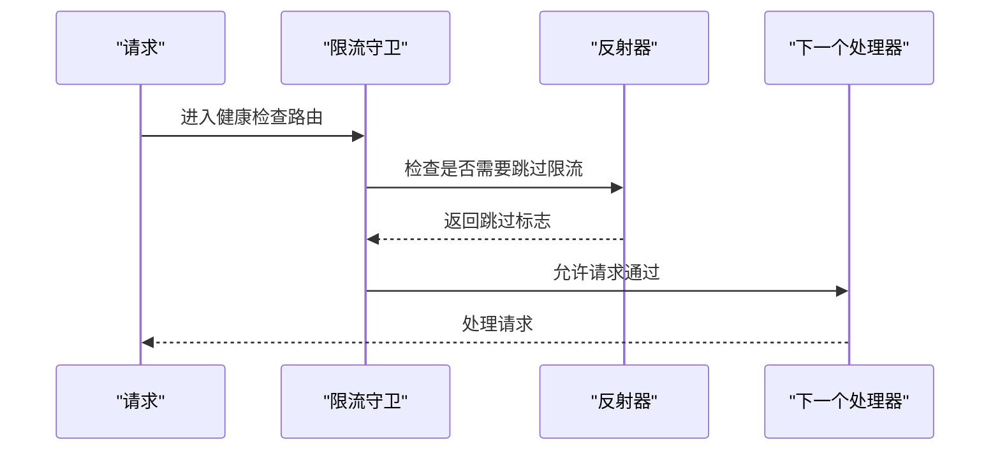
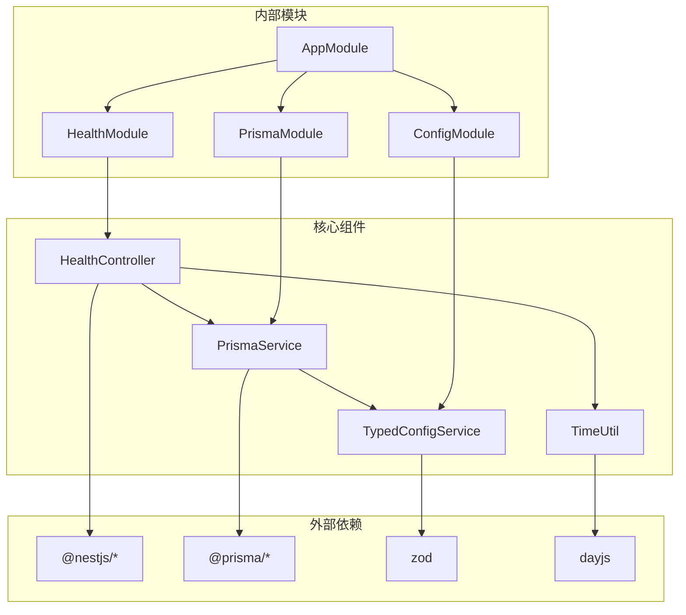

# 健康检查系统

<cite>
**本文档引用的文件**
- [health.controller.ts](file://src/modules/health/health.controller.ts)
- [health.module.ts](file://src/modules/health/health.module.ts)
- [prisma.service.ts](file://src/prisma/prisma.service.ts)
- [prisma.module.ts](file://src/prisma/prisma.module.ts)
- [app.module.ts](file://src/app.module.ts)
- [config.module.ts](file://src/config/config.module.ts)
- [config-loader.ts](file://src/config/config-loader.ts)
- [database.schema.ts](file://src/config/schemas/database.schema.ts)
- [public.decorator.ts](file://src/common/decorators/public.decorator.ts)
- [skip-throttle.decorator.ts](file://src/common/decorators/skip-throttle.decorator.ts)
- [throttler.guard.ts](file://src/common/guards/throttler.guard.ts)
- [time.util.ts](file://src/common/utils/time.util.ts)
- [Dockerfile](file://Dockerfile)
- [docker-compose.yml](file://docker-compose.yml)
</cite>

## 目录
1. [简介](#简介)
2. [项目结构](#项目结构)
3. [核心组件](#核心组件)
4. [架构概览](#架构概览)
5. [详细组件分析](#详细组件分析)
6. [依赖关系分析](#依赖关系分析)
7. [性能考虑](#性能考虑)
8. [故障排除指南](#故障排除指南)
9. [结论](#结论)
10. [附录](#附录)

## 简介

健康检查系统是现代微服务架构中的关键基础设施组件，用于监控应用程序的运行状态和依赖服务的可用性。本系统基于 NestJS 框架构建，提供了完整的健康检查功能，包括基础的 Ping 检查和深度的数据库连接状态检测。

该系统采用模块化设计，通过独立的 HealthModule 提供健康检查接口，与主业务逻辑完全解耦。健康检查接口支持两种模式：快速 Ping 检查和完整健康状态检查，能够有效区分服务的正常运行和降级状态。

## 项目结构

健康检查系统在项目中的组织结构清晰，遵循 NestJS 的模块化架构原则：



**图表来源**
- [app.module.ts:18-32](file://src/app.module.ts#L18-L32)
- [health.module.ts:5-8](file://src/modules/health/health.module.ts#L5-L8)
- [prisma.module.ts:4-7](file://src/prisma/prisma.module.ts#L4-L7)

**章节来源**
- [app.module.ts:1-61](file://src/app.module.ts#L1-L61)
- [health.module.ts:1-10](file://src/modules/health/health.module.ts#L1-L10)
- [prisma.module.ts:1-10](file://src/prisma/prisma.module.ts#L1-L10)

## 核心组件

健康检查系统由以下核心组件构成：

### 健康检查控制器
- **职责**：提供健康检查和 Ping 检查接口
- **暴露方法**：`GET /` 和 `GET /ping`
- **访问控制**：使用 Public 装饰器允许匿名访问
- **限流策略**：使用 SkipThrottle 装饰器跳过速率限制

### 数据库连接服务
- **职责**：管理数据库连接生命周期
- **初始化**：在模块初始化时自动连接数据库
- **销毁**：在应用关闭时优雅断开连接
- **适配器**：支持 SQLite 和 PostgreSQL 两种数据库

### 配置管理系统
- **职责**：提供类型安全的配置访问
- **验证**：使用 Zod 进行运行时配置验证
- **环境变量**：支持多种数据库配置选项

**章节来源**
- [health.controller.ts:11-85](file://src/modules/health/health.controller.ts#L11-L85)
- [prisma.service.ts:11-44](file://src/prisma/prisma.service.ts#L11-L44)
- [config-loader.ts:5-52](file://src/config/config-loader.ts#L5-L52)

## 架构概览

健康检查系统的整体架构采用分层设计，确保了良好的可维护性和扩展性：



**图表来源**
- [health.controller.ts:48-63](file://src/modules/health/health.controller.ts#L48-L63)
- [prisma.service.ts:36-42](file://src/prisma/prisma.service.ts#L36-L42)
- [time.util.ts:65-67](file://src/common/utils/time.util.ts#L65-L67)

系统架构的关键特点：

1. **模块化设计**：健康检查功能独立于主业务逻辑
2. **依赖注入**：通过 NestJS 的 DI 容器管理组件依赖
3. **类型安全**：使用 TypeScript 和 Zod 确保配置正确性
4. **异步处理**：数据库操作采用异步模式避免阻塞

## 详细组件分析

### 健康检查控制器详解

健康检查控制器实现了两个主要接口：

#### 主要健康检查接口 (`GET /`)
该接口提供完整的健康状态报告，包含以下关键信息：

| 字段名 | 类型 | 描述 | 示例值 |
|--------|------|------|--------|
| status | string | 服务状态 | "ok" 或 "degraded" |
| timestamp | string | 当前时间 | "2026-06-07 12:00:00" |
| uptime | number | 运行时间（秒） | 3600 |
| database | string | 数据库连接状态 | "connected" 或 "disconnected" |

状态计算逻辑：
- 当数据库连接正常时，status 为 "ok"
- 当数据库连接异常时，status 为 "degraded"

#### Ping 检查接口 (`GET /ping`)
这是一个轻量级的健康检查接口，仅返回简单的响应：

```json
{
  "message": "pong"
}
```

这种设计允许负载均衡器进行快速的心跳检测，而不会对数据库造成压力。



**图表来源**
- [health.controller.ts:48-63](file://src/modules/health/health.controller.ts#L48-L63)

**章节来源**
- [health.controller.ts:14-63](file://src/modules/health/health.controller.ts#L14-L63)
- [health.controller.ts:65-84](file://src/modules/health/health.controller.ts#L65-L84)

### 数据库连接管理

PrismaService 作为数据库连接的核心管理组件，负责以下关键功能：

#### 连接初始化流程


**图表来源**
- [prisma.service.ts:18-34](file://src/prisma/prisma.service.ts#L18-L34)
- [prisma.service.ts:36-42](file://src/prisma/prisma.service.ts#L36-L42)

#### 配置验证机制
系统使用 Zod 对数据库配置进行严格验证：

| 配置项 | 类型 | 必需 | 默认值 | 描述 |
|--------|------|------|--------|------|
| provider | enum | 是 | sqlite | 数据库类型选择 |
| url | string | 是 | - | 数据库连接字符串 |
| maxConnections | number | 否 | 10 | 最大连接数 |
| logging | boolean | 否 | false | 是否启用日志 |

**章节来源**
- [prisma.service.ts:11-44](file://src/prisma/prisma.service.ts#L11-L44)
- [database.schema.ts:3-10](file://src/config/schemas/database.schema.ts#L3-L10)

### 访问控制和限流机制

健康检查接口采用了特殊的访问控制策略：

#### 公开访问装饰器
Public 装饰器确保健康检查接口可以被任何用户访问，无需认证：



**图表来源**
- [public.decorator.ts:3-4](file://src/common/decorators/public.decorator.ts#L3-L4)
- [health.controller.ts:14](file://src/modules/health/health.controller.ts#L14)

#### 限流跳过机制
SkipThrottle 装饰器允许健康检查接口跳过系统的速率限制：



**图表来源**
- [skip-throttle.decorator.ts:11](file://src/common/decorators/skip-throttle.decorator.ts#L11)
- [throttler.guard.ts:20-31](file://src/common/guards/throttler.guard.ts#L20-L31)

**章节来源**
- [public.decorator.ts:1-5](file://src/common/decorators/public.decorator.ts#L1-L5)
- [skip-throttle.decorator.ts:1-12](file://src/common/decorators/skip-throttle.decorator.ts#L1-L12)
- [throttler.guard.ts:10-33](file://src/common/guards/throttler.guard.ts#L10-L33)

## 依赖关系分析

健康检查系统的依赖关系体现了清晰的分层架构：



**图表来源**
- [app.module.ts:8-31](file://src/app.module.ts#L8-L31)
- [health.controller.ts:1-6](file://src/modules/health/health.controller.ts#L1-L6)
- [prisma.service.ts:1-10](file://src/prisma/prisma.service.ts#L1-L10)

### 关键依赖链路

1. **应用启动链路**：AppModule → HealthModule → HealthController
2. **数据库访问链路**：HealthController → PrismaService → 数据库
3. **配置访问链路**：PrismaService → ConfigService → 环境变量

### 循环依赖检测

系统设计避免了循环依赖：
- HealthModule 不依赖其他业务模块
- PrismaModule 提供基础数据访问能力
- 配置模块为全局模块，不依赖具体业务

**章节来源**
- [app.module.ts:18-32](file://src/app.module.ts#L18-L32)
- [health.module.ts:5-8](file://src/modules/health/health.module.ts#L5-L8)
- [prisma.module.ts:4-7](file://src/prisma/prisma.module.ts#L4-L7)

## 性能考虑

健康检查系统的性能优化策略：

### 数据库查询优化
- **轻量查询**：使用 `SELECT 1` 进行最小成本的连接测试
- **连接复用**：PrismaClient 自动管理连接池
- **异步执行**：避免阻塞主线程

### 内存和资源管理
- **及时释放**：应用关闭时自动断开数据库连接
- **日志控制**：默认禁用数据库日志以减少开销
- **时间计算**：使用系统级进程时间函数

### 缓存策略
- **响应缓存**：健康检查结果不进行缓存，确保实时性
- **配置缓存**：配置服务在应用启动时加载并缓存

## 故障排除指南

### 常见问题诊断

#### 数据库连接失败
**症状**：健康检查返回 "degraded" 状态
**排查步骤**：
1. 检查数据库连接字符串配置
2. 验证数据库服务是否正常运行
3. 确认网络连接和防火墙设置

#### 配置验证错误
**症状**：应用启动时抛出配置验证异常
**解决方案**：
1. 检查环境变量设置
2. 验证配置格式和类型
3. 确认必需配置项已设置

#### 权限访问问题
**症状**：健康检查接口返回 401 或 403 错误
**原因分析**：
- 检查 Public 装饰器是否正确应用
- 确认 SkipThrottle 装饰器生效
- 验证全局守卫配置

**章节来源**
- [health.controller.ts:48-55](file://src/modules/health/health.controller.ts#L48-L55)
- [config-loader.ts:39-46](file://src/config/config-loader.ts#L39-L46)
- [throttler.guard.ts:20-31](file://src/common/guards/throttler.guard.ts#L20-L31)

## 结论

健康检查系统通过简洁而有效的设计，为应用程序提供了可靠的运行状态监控能力。系统的主要优势包括：

1. **模块化设计**：独立的健康检查模块便于维护和扩展
2. **类型安全**：完整的 TypeScript 类型定义和配置验证
3. **性能优化**：轻量级的数据库查询和高效的资源管理
4. **易于集成**：标准的 REST 接口和容器化支持

该系统为生产环境提供了必要的可观测性基础，支持自动化部署、负载均衡和故障恢复等关键运维场景。

## 附录

### API 使用示例

#### 基础健康检查
```bash
curl -X GET http://localhost:3000/ -H "Accept: application/json"
```

#### Ping 检查
```bash
curl -X GET http://localhost:3000/ping -H "Accept: application/json"
```

### 集成方案

#### Docker Compose 集成
```yaml
healthcheck:
  test: ["CMD", "curl", "-f", "http://localhost:3000/"]
  interval: 30s
  timeout: 10s
  retries: 3
```

#### Kubernetes 集成
```yaml
livenessProbe:
  httpGet:
    path: /
    port: 3000
  initialDelaySeconds: 30
  periodSeconds: 10

readinessProbe:
  httpGet:
    path: /
    port: 3000
  initialDelaySeconds: 5
  periodSeconds: 5
```

### 监控指标定义

| 指标名称 | 类型 | 描述 | 告警阈值 |
|----------|------|------|----------|
| health_status | enum | 服务健康状态 | "degraded" 触发告警 |
| database_connection | enum | 数据库连接状态 | "disconnected" 立即告警 |
| response_time | float | 健康检查响应时间 | > 5s 告警 |
| uptime_seconds | float | 服务运行时间 | 异常重启时记录 |