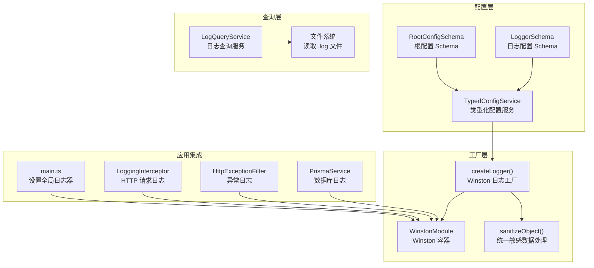
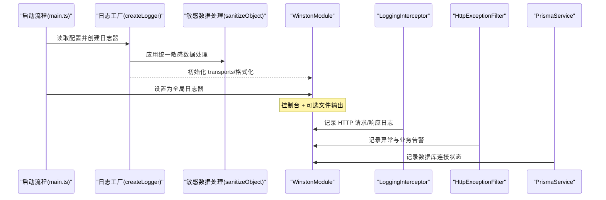
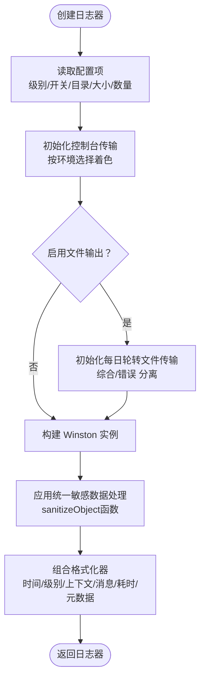
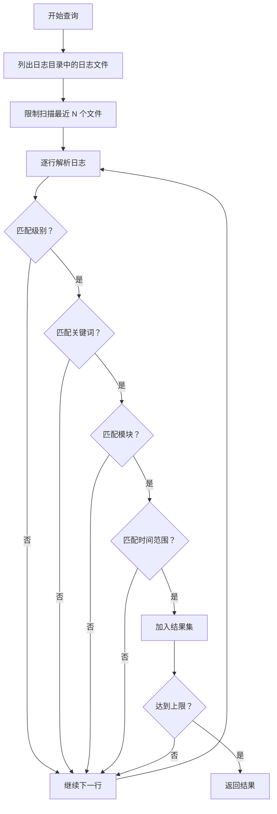
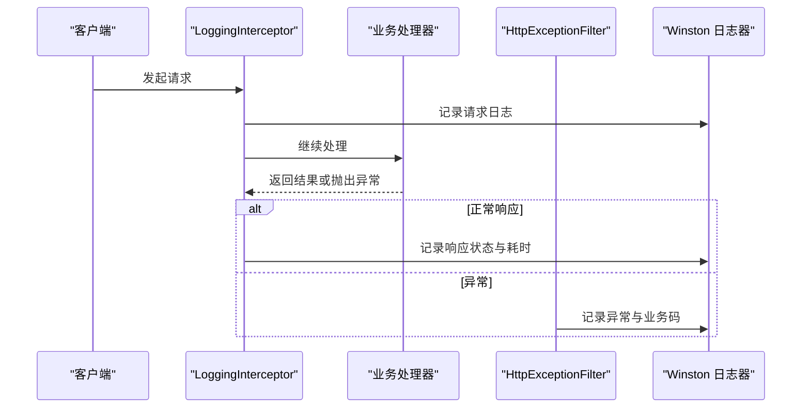
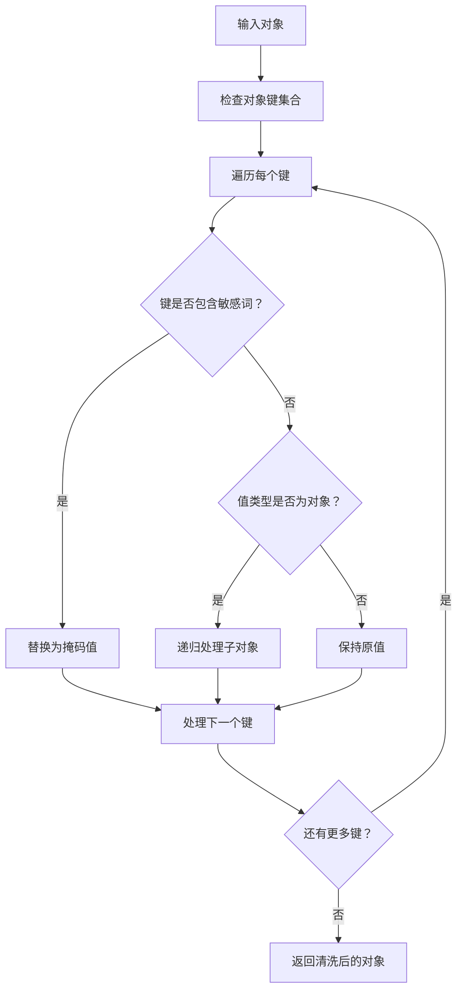
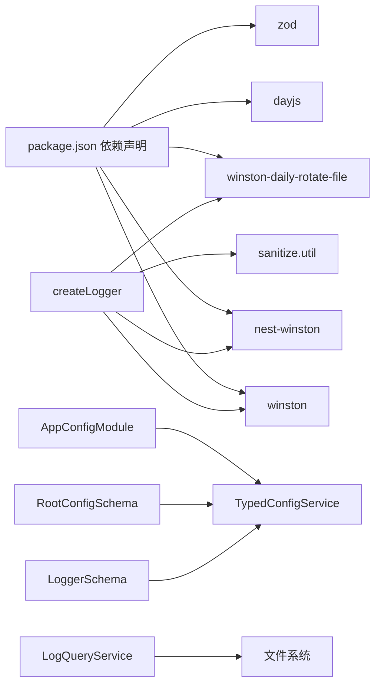

# 日志记录系统

<cite>
**本文档引用的文件**
- [logger.factory.ts](file://src/modules/logger/logger.factory.ts)
- [log-query.service.ts](file://src/modules/logger/log-query.service.ts)
- [logger.module.ts](file://src/modules/logger/logger.module.ts)
- [log-level.constants.ts](file://src/common/constants/log-level.constants.ts)
- [logger.schema.ts](file://src/config/schemas/logger.schema.ts)
- [typed-config.service.ts](file://src/config/typed-config.service.ts)
- [root.schema.ts](file://src/config/schemas/root.schema.ts)
- [config.module.ts](file://src/config/config.module.ts)
- [logging.interceptor.ts](file://src/common/interceptors/logging.interceptor.ts)
- [http-exception.filter.ts](file://src/common/filters/http-exception.filter.ts)
- [main.ts](file://src/main.ts)
- [prisma.service.ts](file://src/prisma/prisma.service.ts)
- [app.module.ts](file://src/app.module.ts)
- [sanitize.util.ts](file://src/common/utils/sanitize.util.ts)
- [sanitize.util.spec.ts](file://src/common/utils/sanitize.util.spec.ts)
- [package.json](file://package.json)
</cite>

## 更新摘要
**所做更改**
- 更新了敏感数据处理机制，从自定义sanitizeMeta函数迁移到统一的sanitizeObject函数
- 增强了敏感数据处理的安全性和一致性
- 移除了重复的敏感字段定义，简化了配置结构
- 更新了日志工厂中的敏感数据清洗逻辑

## 目录
1. [简介](#简介)
2. [项目结构](#项目结构)
3. [核心组件](#核心组件)
4. [架构总览](#架构总览)
5. [详细组件分析](#详细组件分析)
6. [依赖关系分析](#依赖关系分析)
7. [性能考量](#性能考量)
8. [故障排查指南](#故障排查指南)
9. [结论](#结论)
10. [附录](#附录)

## 简介
本文件系统性阐述基于 Winston 的日志记录实现，覆盖日志工厂的配置与使用、结构化日志格式、日志级别管理、日志查询服务、输出格式定制与日志轮转策略。同时给出业务日志、错误日志与调试日志的实践建议，说明日志系统与应用其他模块的集成方式及性能优化要点。

**更新** 本版本重点优化了敏感数据处理机制，采用统一的sanitizeObject函数替代原有的自定义sanitizeMeta函数，提升了数据安全性和处理一致性。

## 项目结构
日志系统主要由以下部分组成：
- 配置层：类型化配置服务与配置 Schema，统一读取日志相关配置项
- 工厂层：根据配置动态创建 Winston 日志实例，支持控制台与文件输出
- 查询层：提供日志检索能力（当前实现为文件扫描解析）
- 应用集成：在主程序中设置全局日志器，在拦截器与过滤器中使用日志
- 安全层：统一的敏感数据处理工具，确保日志安全性

**图表来源**
- [main.ts:17](file://src/main.ts#L17)
- [logger.factory.ts:114-155](file://src/modules/logger/logger.factory.ts#L114-L155)
- [sanitize.util.ts:17-35](file://src/common/utils/sanitize.util.ts#L17-L35)
- [typed-config.service.ts:23-38](file://src/config/typed-config.service.ts#L23-L38)
- [root.schema.ts:10-15](file://src/config/schemas/root.schema.ts#L10-L15)
- [logger.schema.ts:4-10](file://src/config/schemas/logger.schema.ts#L4-L10)
- [logging.interceptor.ts:14](file://src/common/interceptors/logging.interceptor.ts#L14)
- [http-exception.filter.ts:26](file://src/common/filters/http-exception.filter.ts#L26)
- [prisma.service.ts:16](file://src/prisma/prisma.service.ts#L16)
- [log-query.service.ts:24-128](file://src/modules/logger/log-query.service.ts#L24-L128)

**章节来源**
- [main.ts:17](file://src/main.ts#L17)
- [logger.factory.ts:114-155](file://src/modules/logger/logger.factory.ts#L114-L155)
- [sanitize.util.ts:17-35](file://src/common/utils/sanitize.util.ts#L17-L35)
- [typed-config.service.ts:23-38](file://src/config/typed-config.service.ts#L23-L38)
- [root.schema.ts:10-15](file://src/config/schemas/root.schema.ts#L10-L15)
- [logger.schema.ts:4-10](file://src/config/schemas/logger.schema.ts#L4-L10)
- [logging.interceptor.ts:14](file://src/common/interceptors/logging.interceptor.ts#L14)
- [http-exception.filter.ts:26](file://src/common/filters/http-exception.filter.ts#L26)
- [prisma.service.ts:16](file://src/prisma/prisma.service.ts#L16)
- [log-query.service.ts:24-128](file://src/modules/logger/log-query.service.ts#L24-L128)

## 核心组件
- 日志工厂：依据配置创建 Winston 实例，按需启用文件输出与错误分离输出，统一格式化与着色策略
- 日志查询服务：从日志目录读取最近若干日志文件，解析行内容，支持按级别、关键词、时间范围与模块过滤
- 类型化配置：通过 Zod Schema 定义日志配置键值，提供类型安全的读取接口
- 应用集成：在启动阶段设置全局日志器；在拦截器与异常过滤器中记录请求与异常信息
- **更新** 统一敏感数据处理：采用sanitizeObject函数统一处理所有敏感数据，移除重复定义，提升安全性和一致性

**章节来源**
- [logger.factory.ts:114-155](file://src/modules/logger/logger.factory.ts#L114-L155)
- [log-query.service.ts:24-128](file://src/modules/logger/log-query.service.ts#L24-L128)
- [typed-config.service.ts:23-38](file://src/config/typed-config.service.ts#L23-L38)
- [logger.schema.ts:4-10](file://src/config/schemas/logger.schema.ts#L4-L10)
- [main.ts:17](file://src/main.ts#L17)
- [sanitize.util.ts:17-35](file://src/common/utils/sanitize.util.ts#L17-L35)

## 架构总览
下图展示日志系统在应用中的位置与交互：

**图表来源**
- [main.ts:17](file://src/main.ts#L17)
- [logger.factory.ts:114-155](file://src/modules/logger/logger.factory.ts#L114-L155)
- [sanitize.util.ts:17-35](file://src/common/utils/sanitize.util.ts#L17-L35)
- [logging.interceptor.ts:14](file://src/common/interceptors/logging.interceptor.ts#L14)
- [http-exception.filter.ts:26](file://src/common/filters/http-exception.filter.ts#L26)
- [prisma.service.ts:16](file://src/prisma/prisma.service.ts#L16)

## 详细组件分析

### 日志工厂与配置
- 配置项来源：通过类型化配置服务读取命名空间下的日志配置，包含日志级别、是否启用文件输出、日志目录、最大文件数、最大文件大小等
- 输出目标：
  - 控制台传输：开发环境启用彩色输出，生产环境禁用彩色
  - 文件传输：按日期轮转，分别输出综合日志与错误日志，统一非彩色格式
- 格式化策略：
  - 时间戳使用本地时间格式化
  - 支持 ms 执行时长显示
  - **更新** 统一应用sanitizeObject函数进行敏感数据清洗，确保所有元数据的一致性处理
  - 结构化元数据以 JSON 字符串形式附加在行尾

**图表来源**
- [logger.factory.ts:114-155](file://src/modules/logger/logger.factory.ts#L114-L155)
- [logger.factory.ts:24-38](file://src/modules/logger/logger.factory.ts#L24-L38)
- [logger.factory.ts:40-112](file://src/modules/logger/logger.factory.ts#L40-L112)
- [sanitize.util.ts:17-35](file://src/common/utils/sanitize.util.ts#L17-L35)

**章节来源**
- [logger.factory.ts:114-155](file://src/modules/logger/logger.factory.ts#L114-L155)
- [logger.schema.ts:4-10](file://src/config/schemas/logger.schema.ts#L4-L10)
- [typed-config.service.ts:23-38](file://src/config/typed-config.service.ts#L23-L38)
- [sanitize.util.ts:17-35](file://src/common/utils/sanitize.util.ts#L17-L35)

### 日志级别管理
- 级别常量：定义了标准的多级日志枚举，便于跨模块一致使用
- 配置默认值：通过 Schema 为日志级别提供默认值，确保不同环境一致性
- 使用建议：
  - 开发环境可设为较低级别以获得更多信息
  - 生产环境建议仅记录必要级别，避免噪声

**章节来源**
- [log-level.constants.ts:1-10](file://src/common/constants/log-level.constants.ts#L1-L10)
- [logger.schema.ts:6](file://src/config/schemas/logger.schema.ts#L6)

### 结构化日志记录
- **更新** 统一敏感数据处理：采用sanitizeObject函数递归识别并清洗包含敏感词的键，替换为占位符，移除了之前重复的敏感字段定义
- 结构化输出：除时间戳、级别、上下文、消息外，额外输出执行耗时与结构化元数据 JSON
- 建议实践：
  - 在业务日志中传入上下文与结构化元数据，便于后续查询与分析
  - 避免在元数据中直接包含明文敏感信息

**章节来源**
- [logger.factory.ts:24-38](file://src/modules/logger/logger.factory.ts#L24-L38)
- [logger.factory.ts:40-112](file://src/modules/logger/logger.factory.ts#L40-L112)
- [sanitize.util.ts:17-35](file://src/common/utils/sanitize.util.ts#L17-L35)

### 日志轮转策略
- 轮转规则：按日期生成新文件，保留指定数量的历史文件
- 分类输出：综合日志与错误日志分离，便于针对性检索
- 存储控制：限制单文件大小与历史文件数量，平衡磁盘占用与检索效率

**章节来源**
- [logger.factory.ts:129-149](file://src/modules/logger/logger.factory.ts#L129-L149)
- [logger.schema.ts:8-9](file://src/config/schemas/logger.schema.ts#L8-L9)

### 日志查询服务
- 功能概述：扫描最近若干日志文件，解析行内容，支持按级别、关键词、时间范围与模块过滤
- 解析规则：基于正则匹配提取时间、级别、模块与消息
- 性能注意：当前实现为顺序读取与解析，适合小规模日志检索；大规模场景建议引入索引或专用日志平台

**图表来源**
- [log-query.service.ts:31-90](file://src/modules/logger/log-query.service.ts#L31-L90)
- [log-query.service.ts:105-119](file://src/modules/logger/log-query.service.ts#L105-L119)
- [log-query.service.ts:92-103](file://src/modules/logger/log-query.service.ts#L92-L103)

**章节来源**
- [log-query.service.ts:24-128](file://src/modules/logger/log-query.service.ts#L24-L128)

### 应用集成与使用示例
- 启动阶段：在主程序中创建并设置全局日志器，确保整个应用使用统一的日志格式与输出
- HTTP 请求日志：拦截器记录请求方法、URL、用户标识、IP、UA 以及响应状态与耗时
- 异常与业务告警：异常过滤器记录业务码、HTTP 状态与请求信息，用于问题定位
- 数据库日志：ORM 初始化时记录数据库提供商信息，便于诊断连接问题

**图表来源**
- [logging.interceptor.ts:16-38](file://src/common/interceptors/logging.interceptor.ts#L16-L38)
- [http-exception.filter.ts:28-78](file://src/common/filters/http-exception.filter.ts#L28-L78)
- [prisma.service.ts:33](file://src/prisma/prisma.service.ts#L33)

**章节来源**
- [main.ts:17](file://src/main.ts#L17)
- [logging.interceptor.ts:14-38](file://src/common/interceptors/logging.interceptor.ts#L14-L38)
- [http-exception.filter.ts:26-78](file://src/common/filters/http-exception.filter.ts#L26-L78)
- [prisma.service.ts:16-34](file://src/prisma/prisma.service.ts#L16-L34)

### 统一敏感数据处理工具
**新增** 本节详细介绍新的统一敏感数据处理机制

- **sanitizeObject函数**：作为核心的敏感数据处理工具，提供递归清洗功能
- **功能特性**：
  - 递归遍历对象的所有层级
  - 识别包含敏感关键词的键名
  - 将敏感值替换为指定掩码（默认为"[敏感信息]"）
  - 支持自定义掩码字符串
- **使用优势**：
  - 移除了重复的敏感字段定义
  - 提供了一致的处理逻辑
  - 支持深层嵌套对象的处理
  - 确保所有日志输出的敏感数据都被正确处理

**图表来源**
- [sanitize.util.ts:17-35](file://src/common/utils/sanitize.util.ts#L17-L35)

**章节来源**
- [sanitize.util.ts:17-35](file://src/common/utils/sanitize.util.ts#L17-L35)
- [sanitize.util.spec.ts:1-123](file://src/common/utils/sanitize.util.spec.ts#L1-L123)

## 依赖关系分析
- 外部依赖：Winston、nest-winston、winston-daily-rotate-file、dayjs、zod
- 内部依赖：配置模块提供类型化配置服务；日志工厂依赖配置服务；查询服务依赖配置服务与文件系统；**更新** 新增对sanitize.util模块的依赖
- 模块耦合：日志工厂独立于查询模块，查询模块通过 LoggerModule 导出供外部使用

**图表来源**
- [package.json:26-54](file://package.json#L26-L54)
- [config.module.ts:6-19](file://src/config/config.module.ts#L6-L19)
- [typed-config.service.ts:7-18](file://src/config/typed-config.service.ts#L7-L18)
- [root.schema.ts:10-15](file://src/config/schemas/root.schema.ts#L10-L15)
- [logger.schema.ts:4-10](file://src/config/schemas/logger.schema.ts#L4-L10)
- [logger.factory.ts:114-155](file://src/modules/logger/logger.factory.ts#L114-L155)
- [sanitize.util.ts:17-35](file://src/common/utils/sanitize.util.ts#L17-L35)
- [log-query.service.ts:24-128](file://src/modules/logger/log-query.service.ts#L24-L128)

**章节来源**
- [package.json:26-54](file://package.json#L26-L54)
- [config.module.ts:6-19](file://src/config/config.module.ts#L6-L19)
- [typed-config.service.ts:7-18](file://src/config/typed-config.service.ts#L7-L18)
- [root.schema.ts:10-15](file://src/config/schemas/root.schema.ts#L10-L15)
- [logger.schema.ts:4-10](file://src/config/schemas/logger.schema.ts#L4-L10)
- [logger.factory.ts:114-155](file://src/modules/logger/logger.factory.ts#L114-L155)
- [sanitize.util.ts:17-35](file://src/common/utils/sanitize.util.ts#L17-L35)
- [log-query.service.ts:24-128](file://src/modules/logger/log-query.service.ts#L24-L128)

## 性能考量
- I/O 与轮转：文件轮转与写入在高并发下可能成为瓶颈，建议：
  - 合理设置文件大小与保留数量，避免过多文件碎片
  - 在容器或云环境中使用集中式日志采集（如 Fluent Bit、Filebeat）替代本地轮转
- 解析与查询：日志查询服务采用顺序扫描与正则解析，建议：
  - 限制查询扫描的文件数量与结果条数
  - 大规模检索场景迁移至 ELK 或 Loki 等日志平台
- 格式化成本：格式化器包含时间格式化与 JSON 序列化，建议：
  - 在生产环境关闭彩色输出，减少 ANSI 转义开销
  - 控制元数据复杂度，避免过深嵌套导致序列化成本上升
- **更新** 敏感数据处理性能：sanitizeObject函数采用递归算法，对于深层嵌套对象可能存在性能影响，建议：
  - 控制日志元数据的嵌套深度
  - 对于超大对象，考虑在传递前进行预处理
  - 在高频日志场景中评估敏感数据处理的性能开销

## 故障排查指南
- 启动后无日志输出
  - 检查是否已调用设置全局日志器
  - 确认配置项中的日志级别与开关
- 文件未生成或未轮转
  - 检查日志目录是否存在且具备写权限
  - 核对文件大小与保留数量配置
- 查询不到日志
  - 确认查询服务扫描的文件数量限制
  - 检查日志格式是否符合解析正则
- **更新** 敏感信息泄露
  - 确保元数据中未直接包含敏感字段
  - 检查sanitizeObject函数的敏感词配置
  - 验证自定义掩码设置是否正确
- **新增** 统一敏感数据处理问题
  - 检查sanitizeObject函数是否被正确调用
  - 验证敏感词列表配置的完整性
  - 确认递归处理逻辑对深层嵌套对象的支持

**章节来源**
- [main.ts:17](file://src/main.ts#L17)
- [logger.factory.ts:114-155](file://src/modules/logger/logger.factory.ts#L114-L155)
- [log-query.service.ts:92-103](file://src/modules/logger/log-query.service.ts#L92-L103)
- [log-query.service.ts:105-119](file://src/modules/logger/log-query.service.ts#L105-L119)
- [sanitize.util.ts:17-35](file://src/common/utils/sanitize.util.ts#L17-L35)

## 结论
该日志系统以类型化配置为核心，结合 Winston 的灵活传输与格式化能力，提供了可控、可扩展的日志方案。通过工厂模式抽象配置与输出，配合拦截器与过滤器实现关键业务日志，满足开发与生产的双重需求。

**更新** 最新版本的重大改进在于引入了统一的敏感数据处理机制，通过sanitizeObject函数替代原有的自定义处理逻辑，显著提升了数据安全性与处理一致性。这一优化消除了重复的敏感字段定义，简化了配置结构，为日志系统的长期维护奠定了更好的基础。

对于大规模日志检索与分析，建议引入集中式日志平台以提升性能与可观测性。

## 附录

### 配置项一览
- logger.loggerDir：日志目录，默认值为 logs
- logger.loggerLevel：日志级别，默认为 info
- logger.loggerEnableFile：是否启用文件输出，默认为 false
- logger.loggerMaxFiles：保留的文件数量，默认为 7
- logger.loggerMaxSize：单文件最大大小，默认为 20m

**章节来源**
- [logger.schema.ts:4-10](file://src/config/schemas/logger.schema.ts#L4-L10)

### 日志使用示例（路径指引）
- 启动阶段设置全局日志器
  - [main.ts:17](file://src/main.ts#L17)
- HTTP 请求日志
  - [logging.interceptor.ts:25-35](file://src/common/interceptors/logging.interceptor.ts#L25-L35)
- 异常与业务告警
  - [http-exception.filter.ts:40](file://src/common/filters/http-exception.filter.ts#L40)
  - [http-exception.filter.ts:65](file://src/common/filters/http-exception.filter.ts#L65)
- 数据库连接日志
  - [prisma.service.ts:33](file://src/prisma/prisma.service.ts#L33)

### 集成点与最佳实践
- 在 AppModule 中注册 LoggerModule 以便查询服务可用（若需要）
  - [app.module.ts:31](file://src/app.module.ts#L31)
- 在各模块中通过 Logger 类记录模块级日志
  - [logging.interceptor.ts:14](file://src/common/interceptors/logging.interceptor.ts#L14)
  - [http-exception.filter.ts:26](file://src/common/filters/http-exception.filter.ts#L26)
  - [prisma.service.ts:16](file://src/prisma/prisma.service.ts#L16)
- **更新** 统一敏感数据处理最佳实践
  - 在记录日志前调用sanitizeObject函数处理元数据
  - 定期审查敏感词列表，确保覆盖最新的敏感字段
  - 对于高频日志场景，考虑性能优化策略
  - 在开发环境中可以使用更详细的掩码信息进行测试

### 统一敏感数据处理工具参考
- **sanitizeObject函数**：核心处理函数，支持递归对象清洗
- **sanitizeString函数**：字符串级别的敏感数据处理
- **使用示例**：在日志记录前调用sanitizeObject处理所有元数据对象

**章节来源**
- [sanitize.util.ts:17-35](file://src/common/utils/sanitize.util.ts#L17-L35)
- [sanitize.util.spec.ts:1-123](file://src/common/utils/sanitize.util.spec.ts#L1-L123)