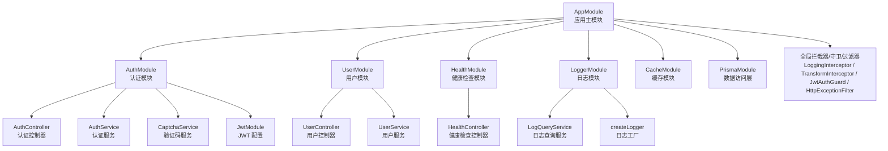
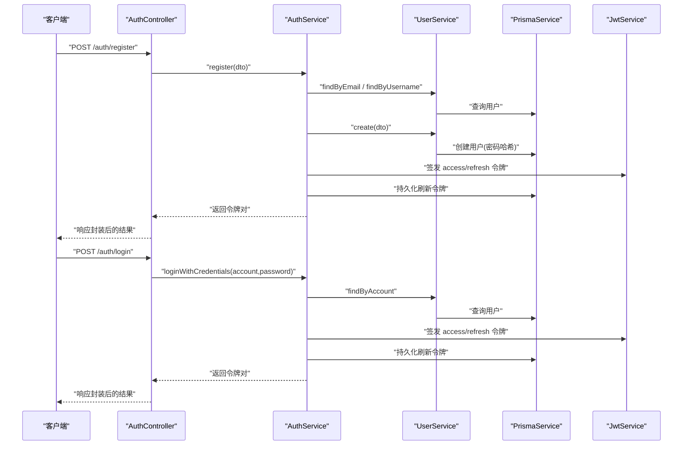
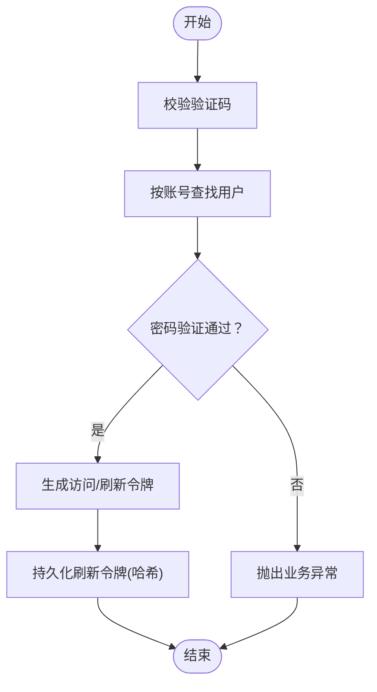
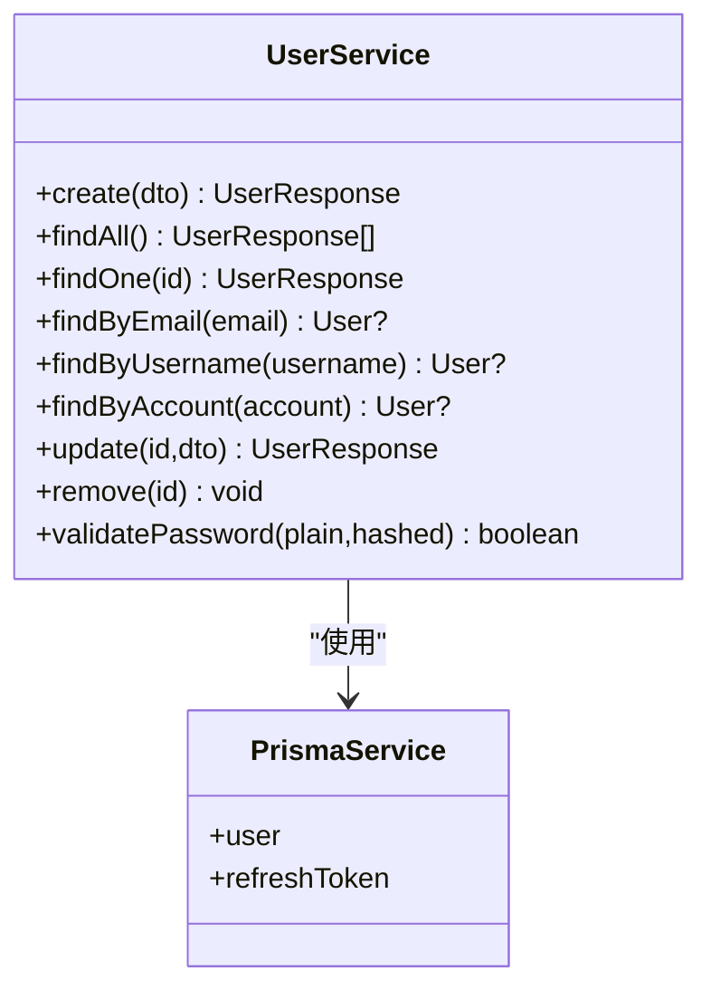
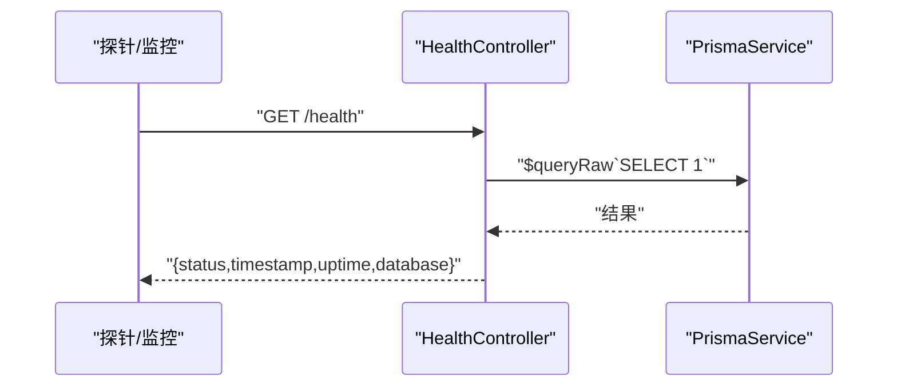
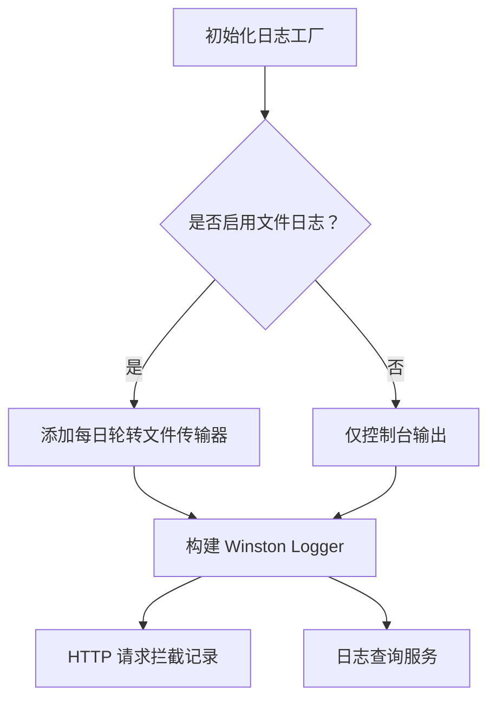
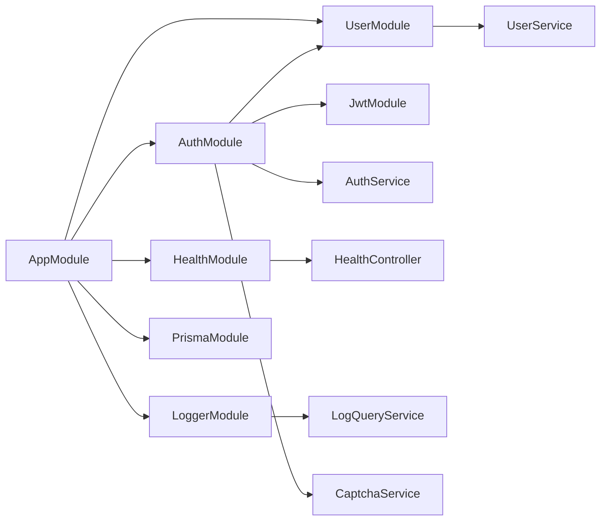

# 核心功能特性

<cite>
**本文引用的文件**
- [src/app.module.ts](file://src/app.module.ts)
- [src/main.ts](file://src/main.ts)
- [src/modules/auth/auth.module.ts](file://src/modules/auth/auth.module.ts)
- [src/modules/auth/auth.controller.ts](file://src/modules/auth/auth.controller.ts)
- [src/modules/auth/auth.service.ts](file://src/modules/auth/auth.service.ts)
- [src/modules/auth/captcha.service.ts](file://src/modules/auth/captcha.service.ts)
- [src/modules/user/user.module.ts](file://src/modules/user/user.module.ts)
- [src/modules/user/user.controller.ts](file://src/modules/user/user.controller.ts)
- [src/modules/user/user.service.ts](file://src/modules/user/user.service.ts)
- [src/modules/health/health.module.ts](file://src/modules/health/health.module.ts)
- [src/modules/health/health.controller.ts](file://src/modules/health/health.controller.ts)
- [src/modules/logger/logger.module.ts](file://src/modules/logger/logger.module.ts)
- [src/modules/logger/logger.factory.ts](file://src/modules/logger/logger.factory.ts)
- [src/modules/logger/log-query.service.ts](file://src/modules/logger/log-query.service.ts)
- [src/common/interceptors/logging.interceptor.ts](file://src/common/interceptors/logging.interceptor.ts)
- [src/common/interceptors/transform.interceptor.ts](file://src/common/interceptors/transform.interceptor.ts)
</cite>

## 目录
1. [简介](#简介)
2. [项目结构](#项目结构)
3. [核心组件](#核心组件)
4. [架构总览](#架构总览)
5. [详细组件分析](#详细组件分析)
6. [依赖分析](#依赖分析)
7. [性能考虑](#性能考虑)
8. [故障排查指南](#故障排查指南)
9. [结论](#结论)
10. [附录](#附录)

## 简介
本项目基于 NestJS 构建的企业级后端服务，围绕“认证与授权”“用户管理”“健康检查”“日志记录”等核心能力进行设计。通过统一的拦截器、守卫、过滤器与全局配置，形成一致的请求处理链路；结合 Prisma 数据访问层与 JWT 令牌体系，提供安全、可观测、可扩展的服务能力。本文档旨在帮助读者快速理解各功能模块的作用、实现方式与使用场景，并给出交互关系与数据流图，便于在实际业务中落地。

## 项目结构
项目采用模块化组织，核心模块包括认证、用户、健康检查、日志与缓存等。应用启动时加载配置、启用 CORS、Swagger 文档、全局拦截器与守卫，并注入 Prisma 作为数据访问层。

图表来源
- [src/app.module.ts:18-60](file://src/app.module.ts#L18-L60)
- [src/modules/auth/auth.module.ts:11-33](file://src/modules/auth/auth.module.ts#L11-L33)
- [src/modules/user/user.module.ts:5-10](file://src/modules/user/user.module.ts#L5-L10)
- [src/modules/health/health.module.ts:5-9](file://src/modules/health/health.module.ts#L5-L9)
- [src/modules/logger/logger.module.ts:4-8](file://src/modules/logger/logger.module.ts#L4-L8)

章节来源
- [src/app.module.ts:18-60](file://src/app.module.ts#L18-L60)
- [src/main.ts:8-47](file://src/main.ts#L8-L47)

## 核心组件
- 认证与授权系统：提供注册、登录、刷新令牌、退出登录、获取当前用户信息等功能，基于 JWT 实现访问令牌与刷新令牌的签发与校验，并对刷新令牌进行安全存储与撤销。
- 用户管理：提供用户创建、查询、更新、删除等基础 CRUD 能力，支持按邮箱或用户名查找用户，并对密码进行安全哈希存储。
- 健康检查：提供服务健康状态与数据库连通性检查，以及简单的 Ping 接口，便于容器编排与运维监控。
- 日志记录：集成 Winston 日志框架，支持控制台输出与按日期滚动的文件输出，具备敏感字段脱敏与元数据清洗能力，并提供日志查询服务以辅助问题定位。

章节来源
- [src/modules/auth/auth.controller.ts:35-128](file://src/modules/auth/auth.controller.ts#L35-L128)
- [src/modules/auth/auth.service.ts:14-161](file://src/modules/auth/auth.service.ts#L14-L161)
- [src/modules/user/user.controller.ts:25-87](file://src/modules/user/user.controller.ts#L25-L87)
- [src/modules/user/user.service.ts:14-124](file://src/modules/user/user.service.ts#L14-L124)
- [src/modules/health/health.controller.ts:8-85](file://src/modules/health/health.controller.ts#L8-L85)
- [src/modules/logger/logger.factory.ts:114-155](file://src/modules/logger/logger.factory.ts#L114-L155)
- [src/modules/logger/log-query.service.ts:23-128](file://src/modules/logger/log-query.service.ts#L23-L128)

## 架构总览
下图展示了从客户端到服务端的关键交互路径，包括认证流程、用户管理流程与日志拦截链路。

图表来源
- [src/modules/auth/auth.controller.ts:57-86](file://src/modules/auth/auth.controller.ts#L57-L86)
- [src/modules/auth/auth.service.ts:50-65](file://src/modules/auth/auth.service.ts#L50-L65)
- [src/modules/auth/auth.service.ts:29-43](file://src/modules/auth/auth.service.ts#L29-L43)
- [src/modules/user/user.service.ts:17-37](file://src/modules/user/user.service.ts#L17-L37)

## 详细组件分析

### 认证与授权系统
- 功能要点
  - 获取验证码：返回验证码 ID 与 SVG 图片，登录时需携带。
  - 用户注册：校验邮箱与用户名唯一性，创建用户并返回访问/刷新令牌。
  - 用户登录：校验账号与密码，校验验证码，签发令牌并对刷新令牌进行持久化。
  - 刷新令牌：校验刷新令牌有效性并签发新的令牌，同时撤销旧刷新令牌。
  - 退出登录：撤销当前用户的所有未撤销刷新令牌。
  - 获取当前用户信息：基于已认证上下文返回用户详情。
- 安全设计
  - 刷新令牌以哈希形式存储，过期与撤销状态受控。
  - 登录与注册接口均受速率限制保护。
  - 全局拦截器记录请求与响应状态，便于审计。
- 使用场景
  - 企业后台系统的登录与权限控制。
  - 需要长期会话与短期访问令牌的系统。
  - 需要严格令牌生命周期管理的多终端接入场景。

图表来源
- [src/modules/auth/auth.controller.ts:80-86](file://src/modules/auth/auth.controller.ts#L80-L86)
- [src/modules/auth/auth.service.ts:29-43](file://src/modules/auth/auth.service.ts#L29-L43)
- [src/modules/auth/auth.service.ts:117-147](file://src/modules/auth/auth.service.ts#L117-L147)

章节来源
- [src/modules/auth/auth.controller.ts:35-128](file://src/modules/auth/auth.controller.ts#L35-L128)
- [src/modules/auth/auth.service.ts:14-161](file://src/modules/auth/auth.service.ts#L14-L161)
- [src/modules/auth/captcha.service.ts](file://src/modules/auth/captcha.service.ts)

### 用户管理
- 功能要点
  - 创建用户：校验邮箱唯一性，密码经哈希后写入。
  - 查询用户：支持分页查询与按 ID 查询，返回脱敏字段集。
  - 更新用户：部分字段更新，保持未提供字段不变。
  - 删除用户：删除用户及其关联数据（含刷新令牌），不可逆。
- 数据模型与选择字段
  - 统一使用 select 字段集避免泄露敏感信息。
  - 支持按邮箱或用户名查找用户，满足多入口登录需求。
- 使用场景
  - 人事系统中的员工信息维护。
  - 多租户平台下的用户生命周期管理。
  - 需要细粒度字段更新的后台管理界面。

图表来源
- [src/modules/user/user.service.ts:14-124](file://src/modules/user/user.service.ts#L14-L124)

章节来源
- [src/modules/user/user.controller.ts:25-87](file://src/modules/user/user.controller.ts#L25-L87)
- [src/modules/user/user.service.ts:14-124](file://src/modules/user/user.service.ts#L14-L124)

### 健康检查
- 功能要点
  - 健康检查：返回服务状态、时间戳、运行时长与数据库连通性。
  - Ping 检查：简单响应“pong”，用于存活探测。
  - 特殊策略：跳过全局限流装饰器，确保监控探针稳定。
- 使用场景
  - Kubernetes/容器编排的 liveness/readiness 探针。
  - 运维侧快速判断服务与数据库可用性。
  - CI/CD 流程中的部署后自检。

图表来源
- [src/modules/health/health.controller.ts:48-63](file://src/modules/health/health.controller.ts#L48-L63)

章节来源
- [src/modules/health/health.controller.ts:8-85](file://src/modules/health/health.controller.ts#L8-L85)

### 日志记录
- 功能要点
  - 日志工厂：根据环境变量动态配置控制台与文件输出，支持彩色/非彩色格式。
  - 敏感字段脱敏：对包含敏感关键词的元数据进行屏蔽。
  - 日志查询：按级别、关键字、时间范围与模块过滤，支持最近日志与错误日志查询。
- 使用场景
  - 开发调试与生产排障。
  - 审计日志与用户行为追踪。
  - 运维监控与告警联动。

图表来源
- [src/modules/logger/logger.factory.ts:114-155](file://src/modules/logger/logger.factory.ts#L114-L155)
- [src/modules/logger/log-query.service.ts:23-128](file://src/modules/logger/log-query.service.ts#L23-L128)
- [src/common/interceptors/logging.interceptor.ts:12-39](file://src/common/interceptors/logging.interceptor.ts#L12-L39)

章节来源
- [src/modules/logger/logger.factory.ts:14-155](file://src/modules/logger/logger.factory.ts#L14-L155)
- [src/modules/logger/log-query.service.ts:23-128](file://src/modules/logger/log-query.service.ts#L23-L128)
- [src/common/interceptors/logging.interceptor.ts:12-39](file://src/common/interceptors/logging.interceptor.ts#L12-L39)

## 依赖分析
- 模块耦合
  - AppModule 作为根模块，集中导入配置、缓存、Prisma、认证、用户、健康检查与日志模块，并注入全局守卫、拦截器、管道与过滤器。
  - AuthModule 依赖 UserModule 与 JwtModule，AuthService 同时依赖 PrismaService 与 UserService。
  - UserModule 依赖 PrismaService，提供用户 CRUD 能力。
  - HealthModule 依赖 PrismaModule，用于数据库连通性检测。
  - LoggerModule 提供日志查询服务，配合全局拦截器与工厂函数使用。
- 外部依赖
  - JWT：用于访问令牌与刷新令牌的签发与校验。
  - Prisma：ORM 层，负责数据库读写与事务。
  - Winston：日志框架，支持文件轮转与格式化。
  - Swagger：自动生成 API 文档。

图表来源
- [src/app.module.ts:18-60](file://src/app.module.ts#L18-L60)
- [src/modules/auth/auth.module.ts:11-33](file://src/modules/auth/auth.module.ts#L11-L33)
- [src/modules/user/user.module.ts:5-10](file://src/modules/user/user.module.ts#L5-L10)
- [src/modules/health/health.module.ts:5-9](file://src/modules/health/health.module.ts#L5-L9)
- [src/modules/logger/logger.module.ts:4-8](file://src/modules/logger/logger.module.ts#L4-L8)

章节来源
- [src/app.module.ts:18-60](file://src/app.module.ts#L18-L60)

## 性能考虑
- 速率限制：全局启用 ThrottlerModule 并在认证接口上设置不同粒度的配额，防止暴力破解与滥用。
- 并发签发：令牌签发采用异步并发生成，减少往返延迟。
- 数据库访问：Prisma 查询使用 select 字段集，避免不必要的字段传输；健康检查使用最小查询验证连通性。
- 日志开销：生产环境建议开启文件日志并合理设置保留天数与大小，避免磁盘压力过大。
- 缓存模块：项目已预留 CacheModule，可在热点数据与验证码等场景引入缓存以降低数据库压力。

## 故障排查指南
- 认证失败
  - 现象：登录返回凭证无效或注册返回邮箱/用户名已存在。
  - 排查：确认验证码是否正确提交；检查用户是否存在且密码哈希匹配；查看业务异常码。
- 令牌过期或刷新失败
  - 现象：访问接口提示鉴权失败；刷新令牌接口报错。
  - 排查：确认刷新令牌是否过期或已被撤销；检查服务端 JWT 配置与密钥；核对数据库中刷新令牌状态。
- 健康检查异常
  - 现象：/health 返回 degraded 或数据库状态为 disconnected。
  - 排查：检查数据库连接字符串与网络连通性；查看 Prisma 初始化日志；确认数据库服务状态。
- 日志缺失或乱码
  - 现象：控制台无日志或文件日志缺失。
  - 排查：确认日志目录权限与路径配置；检查文件轮转参数；验证敏感字段脱敏是否影响定位。

章节来源
- [src/modules/auth/auth.service.ts:72-96](file://src/modules/auth/auth.service.ts#L72-L96)
- [src/modules/health/health.controller.ts:48-63](file://src/modules/health/health.controller.ts#L48-L63)
- [src/modules/logger/logger.factory.ts:114-155](file://src/modules/logger/logger.factory.ts#L114-L155)

## 结论
本项目通过模块化设计与统一的基础设施（认证、用户、健康检查、日志），为企业级应用提供了高内聚、低耦合的基础能力。结合全局拦截器与守卫，形成一致的请求处理与安全策略；借助 Prisma 与 JWT，实现可靠的用户生命周期管理与令牌治理。建议在生产环境中进一步完善缓存策略、监控告警与审计日志，以满足更严苛的可靠性与合规要求。

## 附录
- 快速开始
  - 启动应用：执行启动脚本后，应用监听配置中的端口，并在启用 Swagger 时提供在线文档。
  - 访问健康检查：调用 /{apiPrefix}/health 获取服务与数据库状态。
  - 访问文档：若启用 Swagger，可在 /{apiPrefix}/docs 查看接口说明。
- 常用接口示例（路径）
  - 注册：POST /auth/register
  - 登录：POST /auth/login
  - 刷新令牌：POST /auth/refresh
  - 退出登录：POST /auth/logout
  - 获取当前用户：GET /auth/profile
  - 创建用户：POST /users
  - 获取用户列表：GET /users
  - 获取单个用户：GET /users/:id
  - 更新用户：PATCH /users/:id
  - 删除用户：DELETE /users/:id
  - 健康检查：GET /health
  - Ping：GET /health/ping

章节来源
- [src/main.ts:24-33](file://src/main.ts#L24-L33)
- [src/modules/auth/auth.controller.ts:57-127](file://src/modules/auth/auth.controller.ts#L57-L127)
- [src/modules/user/user.controller.ts:31-86](file://src/modules/user/user.controller.ts#L31-L86)
- [src/modules/health/health.controller.ts:14-84](file://src/modules/health/health.controller.ts#L14-L84)