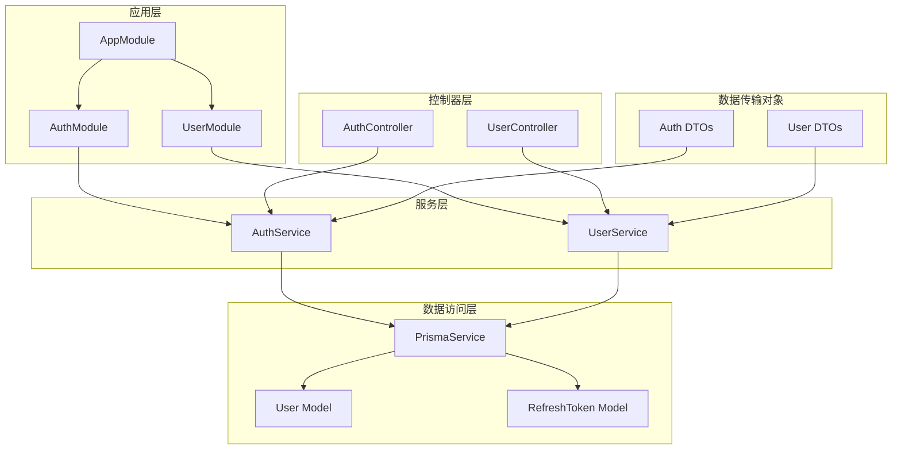
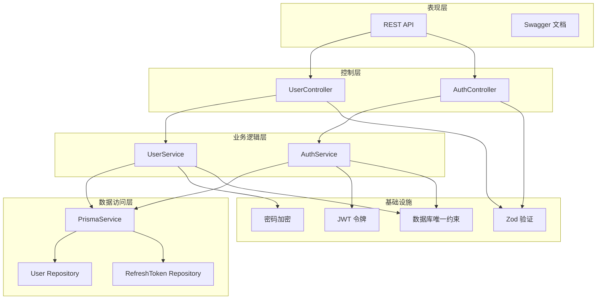
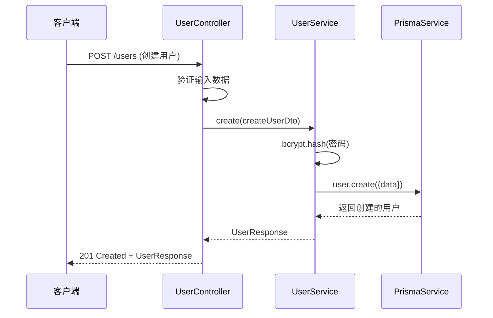
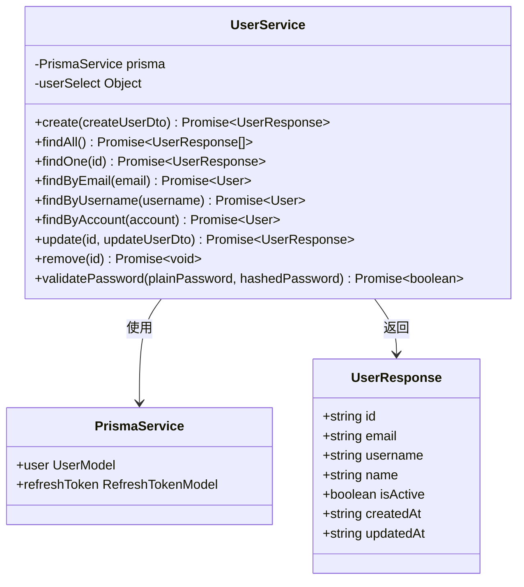
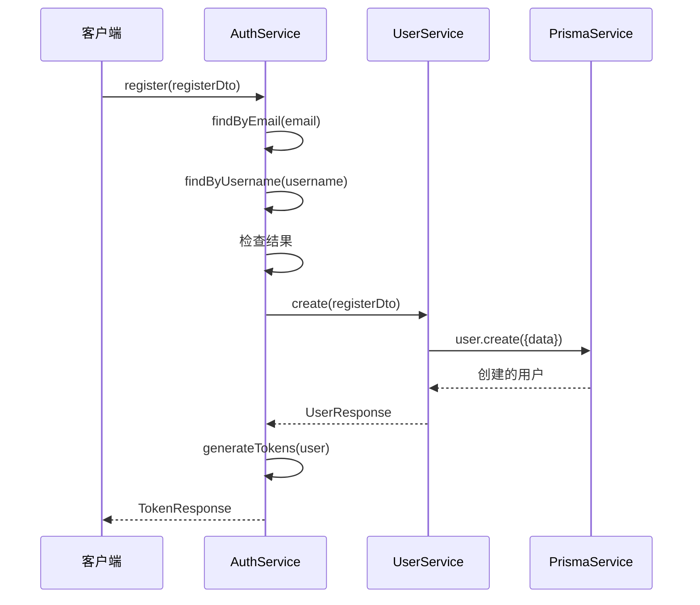
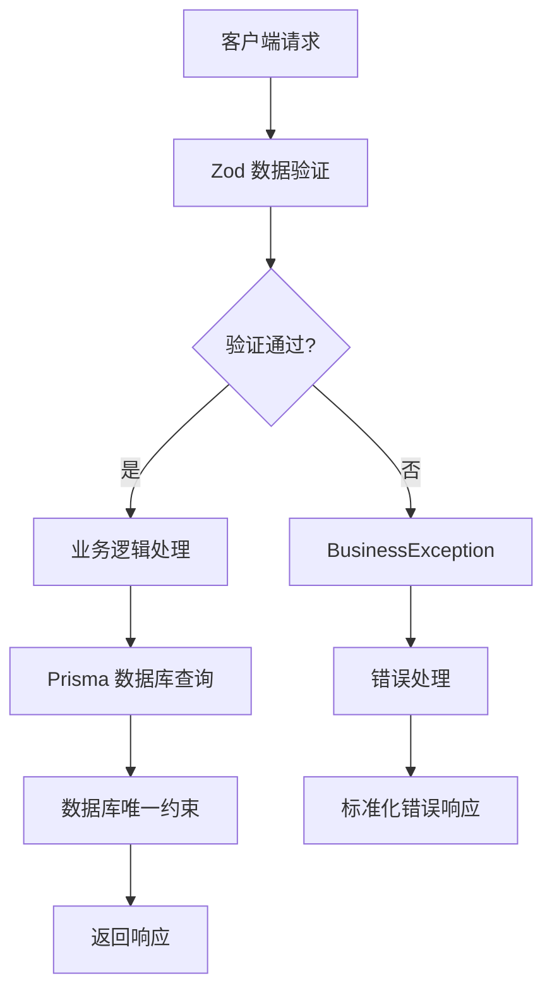
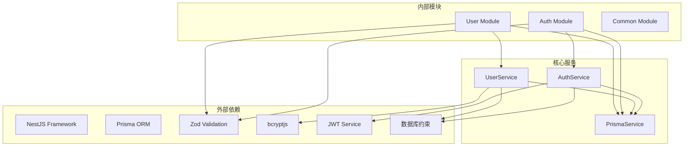

# 用户管理系统

<cite>
**本文档引用的文件**
- [src/modules/user/user.controller.ts](file://src/modules/user/user.controller.ts)
- [src/modules/user/user.service.ts](file://src/modules/user/user.service.ts)
- [src/modules/user/dto/user.dto.ts](file://src/modules/user/dto/user.dto.ts)
- [src/modules/user/user.module.ts](file://src/modules/user/user.module.ts)
- [src/modules/user/user.service.spec.ts](file://src/modules/user/user.service.spec.ts)
- [prisma/schema/User.prisma](file://prisma/schema/User.prisma)
- [prisma/schema/RefreshToken.prisma](file://prisma/schema/RefreshToken.prisma)
- [src/common/schemas/user-fields.schema.ts](file://src/common/schemas/user-fields.schema.ts)
- [src/common/schemas/datetime.schema.ts](file://src/common/schemas/datetime.schema.ts)
- [src/common/enums/biz-code.enum.ts](file://src/common/enums/biz-code.enum.ts)
- [src/common/exceptions/business.exception.ts](file://src/common/exceptions/business.exception.ts)
- [src/common/decorators/api-success-response.decorator.ts](file://src/common/decorators/api-success-response.decorator.ts)
- [src/common/interfaces/user.interface.ts](file://src/common/interfaces/user.interface.ts)
- [src/modules/auth/auth.service.ts](file://src/modules/auth/auth.service.ts)
- [src/modules/auth/dto/auth.dto.ts](file://src/modules/auth/dto/auth.dto.ts)
- [src/app.module.ts](file://src/app.module.ts)
- [package.json](file://package.json)
</cite>

## 更新摘要
**变更内容**
- 更新了用户服务的邮箱唯一性检查机制，移除了显式校验逻辑
- 修改了认证集成流程，强调调用方前置校验的重要性
- 更新了架构图和流程图以反映新的验证策略
- 补充了数据库唯一约束作为最终防线的说明

## 目录
1. [简介](#简介)
2. [项目结构](#项目结构)
3. [核心组件](#核心组件)
4. [架构概览](#架构概览)
5. [详细组件分析](#详细组件分析)
6. [依赖关系分析](#依赖关系分析)
7. [性能考虑](#性能考虑)
8. [故障排除指南](#故障排除指南)
9. [结论](#结论)
10. [附录](#附录)

## 简介

用户管理系统是一个基于 NestJS 框架构建的企业级用户管理解决方案。该系统提供了完整的用户生命周期管理功能，包括用户创建、查询、更新、删除等 CRUD 操作，以及与认证系统的深度集成。

系统采用现代化的技术栈，包括 TypeScript、Prisma ORM、Zod 数据验证、JWT 令牌认证等技术，确保了代码的类型安全性、数据验证可靠性和系统的可维护性。

**更新** 系统进行了架构优化，移除了用户服务中的显式邮箱唯一性检查，改为依赖调用方（如 AuthService.register）进行前置校验，数据库唯一约束作为最终防线，简化了验证流程并提高了系统的灵活性。

## 项目结构

用户管理系统采用模块化的架构设计，主要由以下核心模块组成：



**图表来源**
- [src/app.module.ts:18-61](file://src/app.module.ts#L18-L61)
- [src/modules/user/user.module.ts:5-10](file://src/modules/user/user.module.ts#L5-L10)
- [src/modules/auth/auth.module.ts](file://src/modules/auth/auth.module.ts)

**章节来源**
- [src/app.module.ts:18-61](file://src/app.module.ts#L18-L61)
- [src/modules/user/user.module.ts:1-11](file://src/modules/user/user.module.ts#L1-L11)

## 核心组件

### 用户数据模型

用户系统的核心数据模型基于 Prisma 定义，具有以下关键特性：

| 字段名 | 类型 | 约束 | 描述 |
|--------|------|------|------|
| id | String | 主键, UUID | 用户唯一标识符 |
| email | String | 唯一索引 | 用户邮箱地址 |
| username | String | 唯一索引 | 用户名 |
| password | String |  | 加密后的用户密码 |
| name | String | 可选 | 用户显示名称 |
| isActive | Boolean | 默认true | 用户账户状态 |
| createdAt | DateTime | 默认now() | 创建时间 |
| updatedAt | DateTime | 自动更新 | 更新时间 |

**更新** 数据库层面的唯一约束现在作为最终的安全防线，确保即使调用方校验失败也能保证数据完整性。

### 数据传输对象 (DTO)

系统使用 Zod 进行数据验证，确保输入数据的完整性和安全性：

**创建用户 DTO**
- 邮箱：必填，格式验证
- 用户名：必填，最小长度3字符
- 密码：必填，最小长度6字符
- 显示名称：可选

**更新用户 DTO**
- 继承创建 DTO 的所有字段
- 密码字段排除在外，防止意外重置

**用户响应 DTO**
- 包含用户基本信息但排除敏感字段
- 标准化的时间格式输出

**章节来源**
- [prisma/schema/User.prisma:1-15](file://prisma/schema/User.prisma#L1-L15)
- [src/modules/user/dto/user.dto.ts:6-32](file://src/modules/user/dto/user.dto.ts#L6-L32)
- [src/common/schemas/user-fields.schema.ts:8-23](file://src/common/schemas/user-fields.schema.ts#L8-L23)

## 架构概览

用户管理系统采用分层架构设计，确保关注点分离和代码的可维护性：



**更新** 新增了数据库唯一约束作为最终防线的保护层，形成了三层防护机制。

**图表来源**
- [src/modules/user/user.controller.ts:28-88](file://src/modules/user/user.controller.ts#L28-L88)
- [src/modules/user/user.service.ts:14-125](file://src/modules/user/user.service.ts#L14-L125)
- [src/modules/auth/auth.service.ts:15-162](file://src/modules/auth/auth.service.ts#L15-L162)

## 详细组件分析

### 用户控制器 (UserController)

用户控制器负责处理所有用户相关的 HTTP 请求，提供 RESTful API 接口：



**更新** 移除了邮箱唯一性检查步骤，因为该验证现在由调用方负责。

**图表来源**
- [src/modules/user/user.controller.ts:31-41](file://src/modules/user/user.controller.ts#L31-L41)
- [src/modules/user/user.service.ts:17-37](file://src/modules/user/user.service.ts#L17-L37)

**核心功能特性**：

1. **创建用户**：直接调用用户服务创建，不再进行邮箱唯一性检查
2. **查询用户列表**：支持分页和过滤
3. **获取单个用户**：按 ID 查询，包含错误处理
4. **更新用户**：部分更新，支持字段选择性修改
5. **删除用户**：级联删除相关数据

**章节来源**
- [src/modules/user/user.controller.ts:28-88](file://src/modules/user/user.controller.ts#L28-L88)

### 用户服务 (UserService)

用户服务是业务逻辑的核心实现，提供完整的用户管理功能：



**更新** 移除了邮箱唯一性检查方法，现在完全依赖调用方进行前置校验。

**图表来源**
- [src/modules/user/user.service.ts:14-125](file://src/modules/user/user.service.ts#L14-L125)

**核心业务逻辑**：

1. **密码安全**：使用 bcrypt 进行密码哈希存储
2. **查询优化**：使用 select 选项只返回必要字段
3. **错误处理**：统一的业务异常处理机制
4. **数据库约束**：依赖数据库唯一约束保证数据完整性

**章节来源**
- [src/modules/user/user.service.ts:14-125](file://src/modules/user/user.service.ts#L14-L125)

### 认证集成

用户管理与认证系统的深度集成，确保用户数据的一致性和安全性：



**更新** 强调了认证服务在前置校验中的关键作用，现在是唯一负责邮箱和用户名唯一性检查的服务。

**图表来源**
- [src/modules/auth/auth.service.ts:50-65](file://src/modules/auth/auth.service.ts#L50-L65)
- [src/modules/user/user.service.ts:17-37](file://src/modules/user/user.service.ts#L17-L37)

**章节来源**
- [src/modules/auth/auth.service.ts:15-162](file://src/modules/auth/auth.service.ts#L15-L162)

### 数据验证机制

系统采用多层数据验证确保数据完整性：



**更新** 新增了数据库唯一约束作为最终防线，形成了三层验证机制。

**图表来源**
- [src/common/decorators/api-success-response.decorator.ts:88-128](file://src/common/decorators/api-success-response.decorator.ts#L88-L128)
- [src/common/enums/biz-code.enum.ts:13-78](file://src/common/enums/biz-code.enum.ts#L13-L78)

**章节来源**
- [src/common/schemas/user-fields.schema.ts:8-23](file://src/common/schemas/user-fields.schema.ts#L8-L23)
- [src/common/decorators/api-success-response.decorator.ts:1-172](file://src/common/decorators/api-success-response.decorator.ts#L1-L172)

## 依赖关系分析

系统采用清晰的依赖层次结构，确保模块间的松耦合：



**更新** 新增了数据库约束作为最终防线的依赖关系。

**图表来源**
- [package.json:26-55](file://package.json#L26-L55)
- [src/app.module.ts:18-61](file://src/app.module.ts#L18-L61)

**依赖特点**：

1. **模块化设计**：每个功能模块独立封装
2. **依赖注入**：使用 NestJS 的依赖注入容器
3. **接口隔离**：服务间通过接口通信，降低耦合度
4. **可测试性**：支持单元测试和集成测试
5. **安全分层**：多层验证机制确保数据安全

**章节来源**
- [package.json:26-55](file://package.json#L26-L55)
- [src/app.module.ts:18-61](file://src/app.module.ts#L18-L61)

## 性能考虑

系统在设计时充分考虑了性能优化：

### 数据库优化
- 使用 `select` 选项只查询必要字段，减少网络传输
- 为常用查询字段建立索引（邮箱、用户名）
- 使用连接池管理数据库连接
- **更新** 数据库唯一约束提供高效的重复数据检测

### 缓存策略
- 集成缓存模块，支持热点数据缓存
- 合理设置缓存过期时间
- 实现缓存失效策略

### 并发处理
- 使用异步操作避免阻塞
- 实现请求限流防止滥用
- 支持并发用户数限制

### 安全优化
- 密码使用 bcrypt 进行哈希存储
- JWT 令牌包含必要的用户信息
- 输入数据进行严格验证
- **更新** 多层验证机制提高安全性

## 故障排除指南

### 常见错误及解决方案

**用户不存在 (USER_NOT_FOUND)**
- 症状：查询特定用户时报错
- 解决方案：确认用户 ID 是否正确，检查用户是否被删除

**邮箱已存在 (AUTH_EMAIL_ALREADY_REGISTERED)**
- 症状：注册时邮箱冲突
- 解决方案：使用不同的邮箱地址，或联系管理员
- **更新** 现在由认证服务负责前置校验，确保在用户服务之前拦截重复注册

**用户名已被占用 (AUTH_USERNAME_ALREADY_TAKEN)**
- 症状：注册时用户名冲突
- 解决方案：选择不同的用户名
- **更新** 同样由认证服务负责前置校验

**数据库约束冲突**
- 症状：用户服务创建时数据库抛出唯一约束异常
- 解决方案：检查调用方是否正确执行了前置校验
- **更新** 这是最后的防线，应该很少发生

**权限不足**
- 症状：访问受保护资源被拒绝
- 解决方案：确保用户已登录并具有相应权限

### 调试技巧

1. **启用日志记录**：查看详细的请求和响应日志
2. **使用 Swagger UI**：直观地测试 API 接口
3. **单元测试**：运行测试套件验证功能正常
4. **数据库监控**：检查数据库查询性能
5. **验证调用链**：确保认证服务正确执行了前置校验

**章节来源**
- [src/common/enums/biz-code.enum.ts:47-52](file://src/common/enums/biz-code.enum.ts#L47-L52)
- [src/common/exceptions/business.exception.ts:16-42](file://src/common/exceptions/business.exception.ts#L16-L42)

## 结论

用户管理系统是一个设计精良的企业级解决方案，经过架构优化后具有以下优势：

1. **架构清晰**：采用分层架构，职责明确
2. **安全可靠**：完善的多层验证机制
3. **易于扩展**：模块化设计支持功能扩展
4. **开发友好**：丰富的工具链和文档支持
5. **性能优秀**：优化的数据访问和缓存策略
6. **高可用性**：数据库唯一约束作为最终防线

**更新** 新的架构通过移除重复的验证逻辑，简化了代码结构，同时保持了相同的安全级别，并通过数据库约束提供了额外的保护层。

系统为后续的功能扩展和维护奠定了坚实的基础，能够满足企业级应用的需求。

## 附录

### API 使用示例

**创建用户**
```
POST /users
Content-Type: application/json

{
  "email": "user@example.com",
  "username": "username",
  "password": "password123",
  "name": "用户姓名"
}
```

**获取用户列表**
```
GET /users
Authorization: Bearer {jwt_token}
```

**更新用户信息**
```
PATCH /users/{id}
Authorization: Bearer {jwt_token}
Content-Type: application/json

{
  "name": "新姓名"
}
```

**删除用户**
```
DELETE /users/{id}
Authorization: Bearer {jwt_token}
```

### 配置说明

系统支持多种配置方式，包括环境变量、配置文件等。主要配置项包括：

- 数据库连接配置
- JWT 令牌配置
- 缓存配置
- 日志配置

**更新** 数据库唯一约束配置现在作为系统的重要安全保障，无需额外配置即可生效。

**章节来源**
- [src/app.module.ts:18-61](file://src/app.module.ts#L18-L61)
- [package.json:1-88](file://package.json#L1-L88)