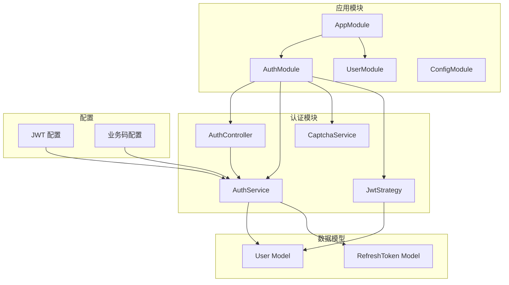
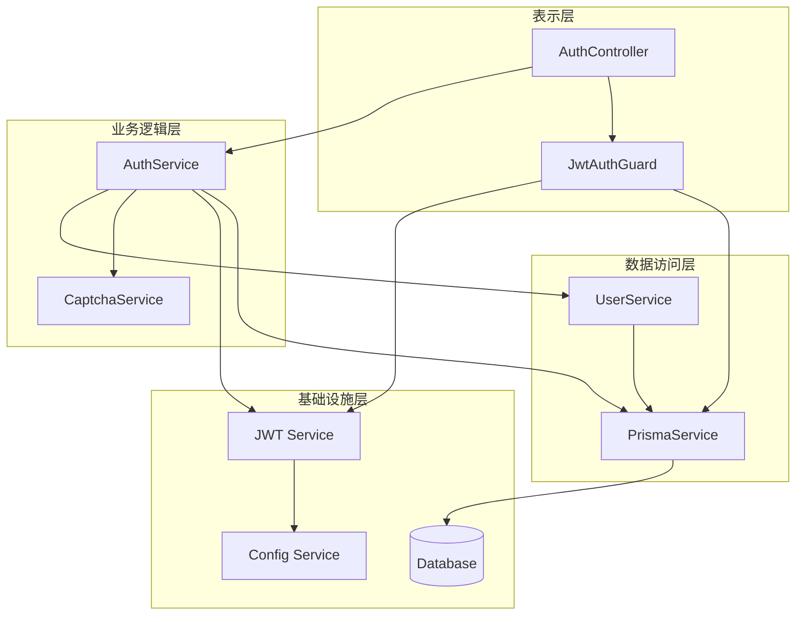
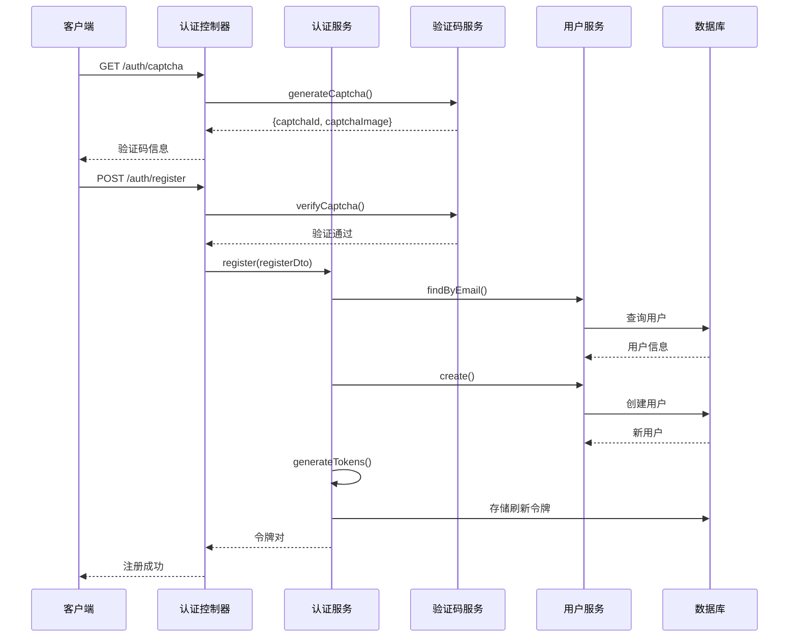
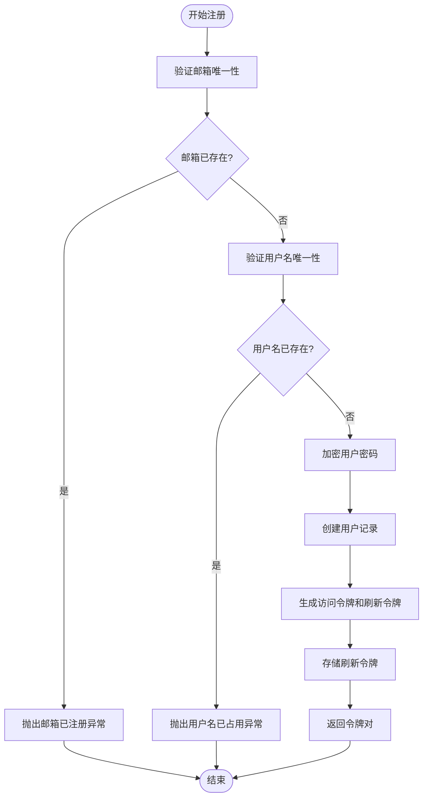
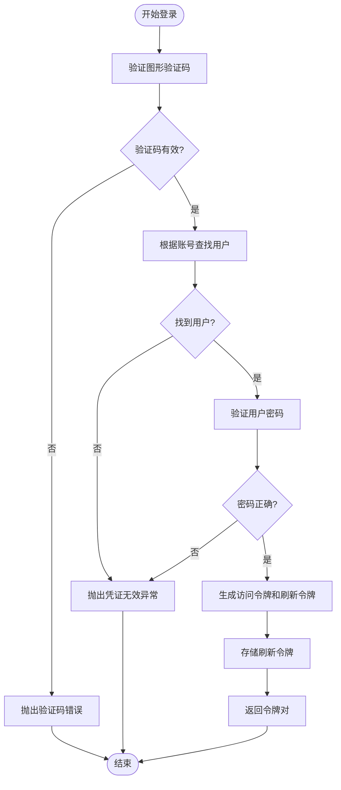
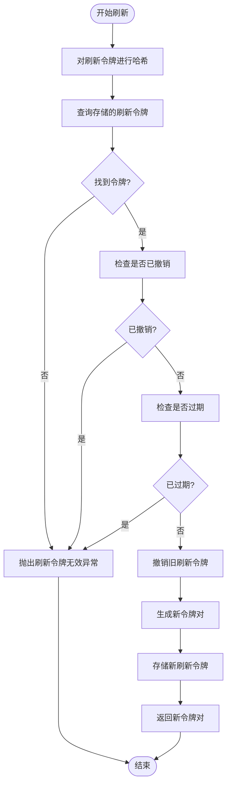
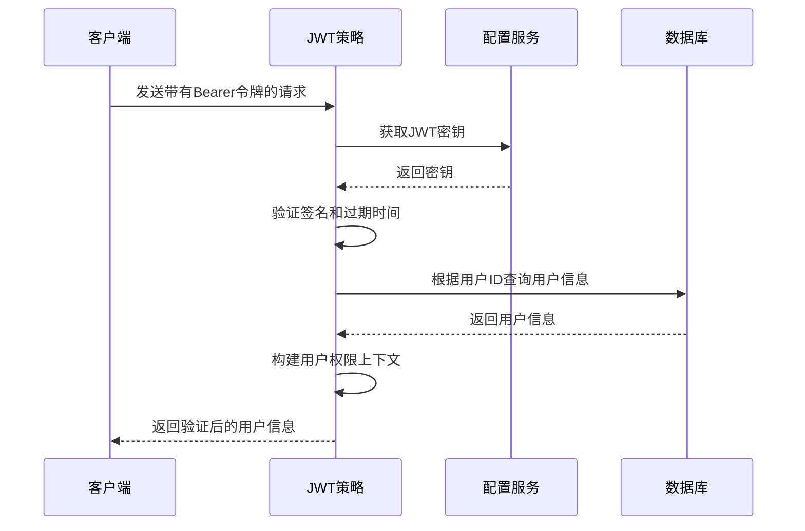
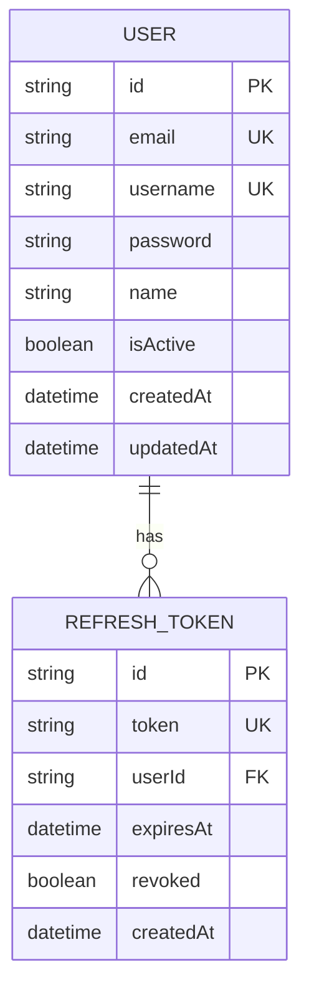
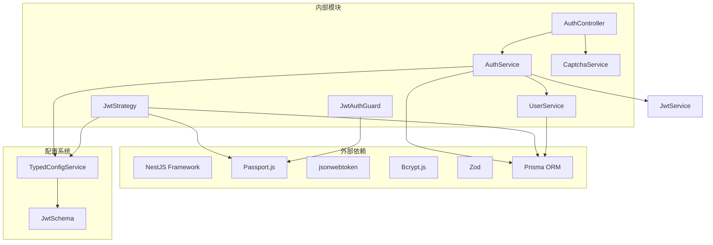

# 用户认证授权系统

<cite>
**本文档引用的文件**
- [auth.module.ts](file://src/modules/auth/auth.module.ts)
- [auth.service.ts](file://src/modules/auth/auth.service.ts)
- [auth.controller.ts](file://src/modules/auth/auth.controller.ts)
- [jwt.strategy.ts](file://src/modules/auth/strategies/jwt.strategy.ts)
- [captcha.service.ts](file://src/modules/auth/captcha.service.ts)
- [auth.dto.ts](file://src/modules/auth/dto/auth.dto.ts)
- [jwt-auth.guard.ts](file://src/common/guards/jwt-auth.guard.ts)
- [jwt.schema.ts](file://src/config/schemas/jwt.schema.ts)
- [User.prisma](file://prisma/schema/User.prisma)
- [RefreshToken.prisma](file://prisma/schema/RefreshToken.prisma)
- [user.service.ts](file://src/modules/user/user.service.ts)
- [biz-code.enum.ts](file://src/common/enums/biz-code.enum.ts)
- [business.exception.ts](file://src/common/exceptions/business.exception.ts)
- [app.module.ts](file://src/app.module.ts)
- [jwt.interface.ts](file://src/common/interfaces/jwt.interface.ts)
- [user.interface.ts](file://src/common/interfaces/user.interface.ts)
- [public.decorator.ts](file://src/common/decorators/public.decorator.ts)
</cite>

## 目录
1. [简介](#简介)
2. [项目结构](#项目结构)
3. [核心组件](#核心组件)
4. [架构概览](#架构概览)
5. [详细组件分析](#详细组件分析)
6. [依赖关系分析](#依赖关系分析)
7. [性能考虑](#性能考虑)
8. [故障排除指南](#故障排除指南)
9. [结论](#结论)

## 简介

本项目是一个基于 NestJS 框架构建的用户认证授权系统，采用 JWT（JSON Web Token）作为主要的身份认证机制。系统实现了完整的用户生命周期管理，包括用户注册、登录、令牌刷新和登出功能。

该系统的核心特点包括：
- 基于 JWT 的无状态认证机制
- 图形验证码集成，防止暴力破解攻击
- 双重令牌策略（访问令牌和刷新令牌）
- 完整的用户权限管理和角色系统
- 统一的业务异常处理机制
- 基于装饰器的权限控制

## 项目结构

认证系统采用模块化设计，主要包含以下核心模块：



**图表来源**
- [app.module.ts:18-61](file://src/app.module.ts#L18-L61)
- [auth.module.ts:11-34](file://src/modules/auth/auth.module.ts#L11-L34)

**章节来源**
- [app.module.ts:1-61](file://src/app.module.ts#L1-L61)
- [auth.module.ts:1-34](file://src/modules/auth/auth.module.ts#L1-L34)

## 核心组件

### 认证控制器 (AuthController)

认证控制器是系统对外暴露的 API 接口层，负责处理所有认证相关的 HTTP 请求。它提供了四个核心端点：

1. **获取验证码** (`GET /auth/captcha`)
   - 生成 SVG 格式的图形验证码
   - 返回验证码 ID 和图片内容
   - 支持限流保护

2. **用户注册** (`POST /auth/register`)
   - 创建新用户账户
   - 验证邮箱和用户名唯一性
   - 自动登录并返回令牌对

3. **用户登录** (`POST /auth/login`)
   - 用户凭据验证
   - 验证图形验证码
   - 返回访问令牌和刷新令牌

4. **刷新令牌** (`POST /auth/refresh`)
   - 使用刷新令牌获取新的访问令牌
   - 旧刷新令牌立即失效
   - 实现令牌续期机制

5. **退出登录** (`POST /auth/logout`)
   - 撤销用户的所有刷新令牌
   - 完全登出当前会话

**章节来源**
- [auth.controller.ts:35-129](file://src/modules/auth/auth.controller.ts#L35-L129)

### 认证服务 (AuthService)

认证服务是系统的核心业务逻辑层，负责处理所有认证相关的业务逻辑：

#### 主要功能

1. **凭据登录** (`loginWithCredentials`)
   - 验证用户凭据的有效性
   - 使用 bcrypt 验证密码
   - 生成访问令牌和刷新令牌对

2. **用户注册** (`register`)
   - 验证邮箱和用户名唯一性
   - 使用 bcrypt 加密用户密码
   - 创建新用户并返回令牌

3. **令牌刷新** (`refreshToken`)
   - 验证刷新令牌的有效性
   - 检查令牌是否过期或被撤销
   - 生成新的令牌对并撤销旧令牌

4. **用户登出** (`logout`)
   - 撤销指定用户的所有刷新令牌
   - 实现完全的会话清理

#### 令牌管理机制

系统采用双重令牌策略：
- **访问令牌 (Access Token)**: 短期有效的令牌，用于 API 访问
- **刷新令牌 (Refresh Token)**: 长期有效的令牌，用于获取新的访问令牌

令牌存储采用哈希加密存储，确保安全性。

**章节来源**
- [auth.service.ts:14-162](file://src/modules/auth/auth.service.ts#L14-L162)

### JWT 策略 (JwtStrategy)

JWT 策略负责验证和解析 JWT 令牌，是认证系统的核心验证组件：

#### 配置特性

1. **令牌提取**: 从 HTTP Authorization 头部提取 Bearer 令牌
2. **签名验证**: 使用配置的密钥验证令牌签名
3. **过期检查**: 自动检查令牌是否过期
4. **用户信息提取**: 从令牌载荷中提取用户信息

#### 用户信息映射

策略从数据库加载用户的角色信息，构建完整的用户权限上下文：
- 用户基础信息 (ID、邮箱、用户名)
- 用户角色列表 (ID、名称)
- 权限继承关系

**章节来源**
- [jwt.strategy.ts:9-49](file://src/modules/auth/strategies/jwt.strategy.ts#L9-L49)

### 图形验证码服务 (CaptchaService)

图形验证码服务提供防暴力破解的安全机制：

#### 核心功能

1. **验证码生成**: 使用 svg-captcha 库生成随机验证码
2. **存储管理**: 在内存中存储验证码数据（进程内）
3. **验证机制**: 验证用户输入的验证码是否正确
4. **过期处理**: 自动清理过期的验证码

#### 安全特性

- 验证码有效期为 5 分钟
- 支持最大存储容量限制 (10,000 个)
- 自动清理过期数据的定时任务
- 区分大小写的验证码验证

**章节来源**
- [captcha.service.ts:20-98](file://src/modules/auth/captcha.service.ts#L20-L98)

## 架构概览

系统采用分层架构设计，确保关注点分离和代码的可维护性：



**图表来源**
- [auth.controller.ts:35-129](file://src/modules/auth/auth.controller.ts#L35-L129)
- [auth.service.ts:14-162](file://src/modules/auth/auth.service.ts#L14-L162)
- [jwt-auth.guard.ts:17-46](file://src/common/guards/jwt-auth.guard.ts#L17-L46)

### 数据流图



**图表来源**
- [auth.controller.ts:57-86](file://src/modules/auth/auth.controller.ts#L57-L86)
- [auth.service.ts:50-65](file://src/modules/auth/auth.service.ts#L50-L65)
- [captcha.service.ts:69-87](file://src/modules/auth/captcha.service.ts#L69-L87)

## 详细组件分析

### 认证流程详解

#### 用户注册流程



**图表来源**
- [auth.service.ts:50-65](file://src/modules/auth/auth.service.ts#L50-L65)
- [user.service.ts:17-37](file://src/modules/user/user.service.ts#L17-L37)

#### 用户登录流程



**图表来源**
- [auth.controller.ts:80-86](file://src/modules/auth/auth.controller.ts#L80-L86)
- [auth.service.ts:29-43](file://src/modules/auth/auth.service.ts#L29-L43)
- [captcha.service.ts:69-87](file://src/modules/auth/captcha.service.ts#L69-L87)

#### 令牌刷新流程



**图表来源**
- [auth.service.ts:72-96](file://src/modules/auth/auth.service.ts#L72-L96)

### JWT 配置与验证

#### 配置结构

JWT 配置采用强类型验证，确保安全性：

| 配置项 | 类型 | 默认值 | 必需 | 描述 |
|--------|------|--------|------|------|
| secret | string | - | 是 | 访问令牌签名密钥，长度至少32位 |
| accessTokenTtl | string | '15m' | 否 | 访问令牌有效期，默认15分钟 |
| refreshTokenTtl | string | '7d' | 否 | 刷新令牌有效期，默认7天 |
| refreshSecret | string | - | 是 | 刷新令牌签名密钥，长度至少32位 |

#### 验证流程



**图表来源**
- [jwt.strategy.ts:15-47](file://src/modules/auth/strategies/jwt.strategy.ts#L15-L47)
- [jwt.schema.ts:3-8](file://src/config/schemas/jwt.schema.ts#L3-L8)

**章节来源**
- [jwt.schema.ts:1-11](file://src/config/schemas/jwt.schema.ts#L1-L11)
- [jwt.strategy.ts:1-49](file://src/modules/auth/strategies/jwt.strategy.ts#L1-L49)

### 权限控制机制

#### JWT 守卫 (JwtAuthGuard)

JWT 守卫实现了基于装饰器的权限控制：

1. **公共路由支持**: 通过 `@Public()` 装饰器允许匿名访问
2. **自动验证**: 对非公共路由自动执行 JWT 验证
3. **错误处理**: 统一处理认证失败的情况
4. **用户上下文**: 将用户信息注入到请求对象

#### 路由装饰器

```typescript
// 允许匿名访问
@Public()
@Post('login')

// 需要认证访问
@Post('profile')
@ApiBearerAuth()
```

**章节来源**
- [jwt-auth.guard.ts:17-46](file://src/common/guards/jwt-auth.guard.ts#L17-L46)
- [public.decorator.ts:1-5](file://src/common/decorators/public.decorator.ts#L1-L5)

### 数据模型设计

#### 用户模型 (User)



**图表来源**
- [User.prisma:1-15](file://prisma/schema/User.prisma#L1-L15)
- [RefreshToken.prisma:1-12](file://prisma/schema/RefreshToken.prisma#L1-L12)

#### 关系说明

1. **一对一关系**: 用户与刷新令牌的一对多关系
2. **外键约束**: 刷新令牌的用户 ID 引用用户表
3. **级联删除**: 删除用户时自动删除其所有刷新令牌
4. **索引优化**: 为用户 ID 建立数据库索引提高查询性能

**章节来源**
- [User.prisma:1-15](file://prisma/schema/User.prisma#L1-L15)
- [RefreshToken.prisma:1-12](file://prisma/schema/RefreshToken.prisma#L1-L12)

## 依赖关系分析

### 组件依赖图



**图表来源**
- [auth.module.ts:14-27](file://src/modules/auth/auth.module.ts#L14-L27)
- [app.module.ts:18-32](file://src/app.module.ts#L18-L32)

### 循环依赖检测

系统设计避免了循环依赖：
- 控制器仅依赖服务，不反向依赖
- 服务之间通过接口通信，避免直接耦合
- 配置服务提供单点配置管理
- 数据访问层独立于业务逻辑层

**章节来源**
- [auth.module.ts:1-34](file://src/modules/auth/auth.module.ts#L1-L34)
- [app.module.ts:1-61](file://src/app.module.ts#L1-L61)

## 性能考虑

### 缓存策略

1. **验证码缓存**: 使用内存 Map 存储验证码，支持自动清理
2. **令牌缓存**: JWT 策略结果可结合 Redis 缓存优化
3. **用户信息缓存**: 用户权限信息可短期缓存减少数据库查询

### 并发处理

1. **令牌生成并发**: 使用 Promise.all 并行生成访问令牌和刷新令牌
2. **数据库连接池**: Prisma 提供连接池管理
3. **限流保护**: 内置 ThrottlerModule 防止暴力破解

### 安全优化

1. **密码哈希**: 使用 bcryptjs，成本因子 10
2. **令牌哈希存储**: 刷新令牌存储前进行 SHA-256 哈希
3. **输入验证**: 使用 Zod 进行严格的输入验证
4. **SQL 注入防护**: Prisma ORM 自动防护 SQL 注入

## 故障排除指南

### 常见问题及解决方案

#### 认证相关错误

| 错误码 | 错误描述 | 可能原因 | 解决方案 |
|--------|----------|----------|----------|
| 10001 | 凭证无效 | 邮箱或密码错误 | 检查用户凭据，确认大小写 |
| 10002 | 邮箱已注册 | 邮箱已被使用 | 更换其他邮箱地址 |
| 10003 | 用户名已被占用 | 用户名已被使用 | 更换其他用户名 |
| 10004 | 刷新令牌无效 | 令牌过期或被撤销 | 使用登录重新获取令牌 |
| 10005 | 验证码不存在 | 验证码已过期 | 重新获取验证码 |
| 10006 | 验证码已过期 | 超过5分钟有效期 | 重新生成验证码 |
| 10007 | 验证码错误 | 输入验证码不匹配 | 检查验证码输入 |

#### 业务异常处理

系统使用统一的 BusinessException 类处理业务异常：

```typescript
// 抛出业务异常的标准模式
throw new BusinessException(
  BizCode.AUTH_INVALID_CREDENTIALS,
  '自定义错误消息'
);
```

#### 调试技巧

1. **启用日志**: 使用 LoggingInterceptor 查看请求处理日志
2. **数据库调试**: 使用 Prisma Studio 查看数据状态
3. **令牌调试**: 使用 scripts/debug-token.ts 工具调试 JWT 令牌

**章节来源**
- [biz-code.enum.ts:31-46](file://src/common/enums/biz-code.enum.ts#L31-L46)
- [business.exception.ts:16-42](file://src/common/exceptions/business.exception.ts#L16-L42)

### 最佳实践建议

1. **配置管理**
   - 使用强密码作为 JWT 密钥
   - 合理设置令牌有效期
   - 在生产环境使用环境变量管理配置

2. **安全实践**
   - 始终使用 HTTPS 传输令牌
   - 定期轮换 JWT 密钥
   - 实施适当的速率限制
   - 使用安全的 Cookie 属性存储令牌

3. **性能优化**
   - 实现刷新令牌的批量撤销
   - 使用数据库连接池
   - 实施适当的缓存策略
   - 监控系统性能指标

4. **监控告警**
   - 监控认证失败率
   - 监控令牌刷新频率
   - 监控数据库查询性能
   - 设置异常告警机制

**章节来源**
- [jwt.schema.ts:3-8](file://src/config/schemas/jwt.schema.ts#L3-L8)
- [auth.service.ts:117-153](file://src/modules/auth/auth.service.ts#L117-L153)

## 结论

本用户认证授权系统采用现代化的 NestJS 架构，实现了完整的 JWT 认证机制。系统具有以下优势：

1. **安全性**: 采用双令牌策略、密码哈希、验证码防护等多重安全措施
2. **可扩展性**: 模块化设计，易于添加新功能和集成第三方服务
3. **可维护性**: 清晰的分层架构和统一的错误处理机制
4. **性能**: 并发优化、缓存策略和数据库连接池
5. **易用性**: 完善的 API 文档和 TypeScript 类型支持

系统适用于中大型企业级应用，能够满足高并发、高安全性的业务需求。通过合理的配置和扩展，可以轻松适配各种业务场景。