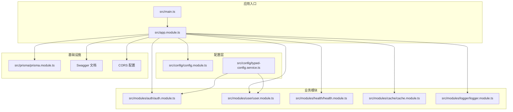
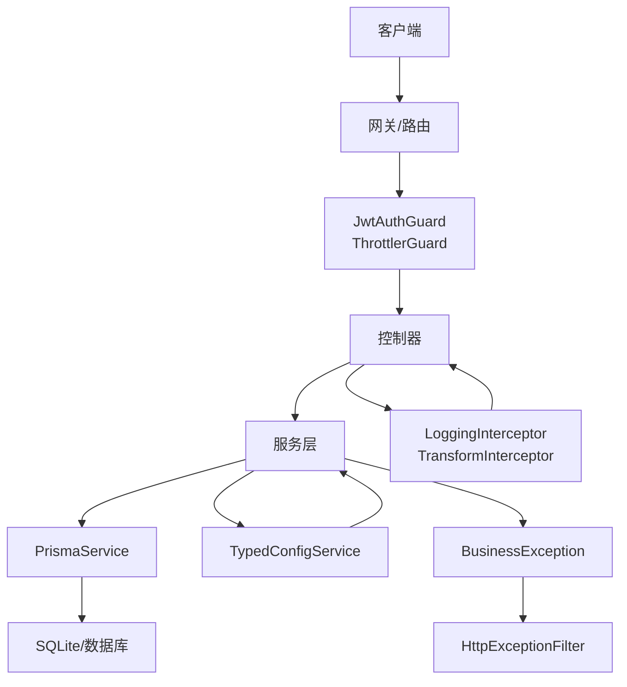
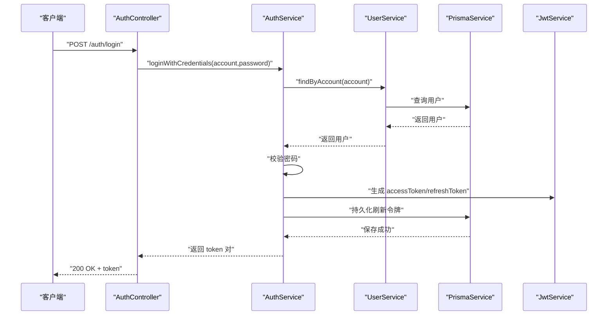
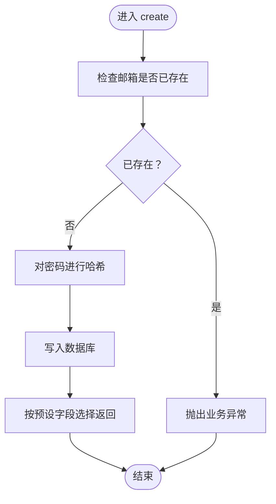

# 项目介绍

<cite>
**本文引用的文件**
- [README.md](file://README.md)
- [package.json](file://package.json)
- [src/main.ts](file://src/main.ts)
- [src/app.module.ts](file://src/app.module.ts)
- [src/config/config.module.ts](file://src/config/config.module.ts)
- [src/config/typed-config.service.ts](file://src/config/typed-config.service.ts)
- [src/modules/auth/auth.module.ts](file://src/modules/auth/auth.module.ts)
- [src/modules/auth/auth.service.ts](file://src/modules/auth/auth.service.ts)
- [src/modules/user/user.module.ts](file://src/modules/user/user.module.ts)
- [src/modules/user/user.service.ts](file://src/modules/user/user.service.ts)
- [src/common/guards/jwt-auth.guard.ts](file://src/common/guards/jwt-auth.guard.ts)
- [src/common/enums/biz-code.enum.ts](file://src/common/enums/biz-code.enum.ts)
- [src/common/exceptions/business.exception.ts](file://src/common/exceptions/business.exception.ts)
- [src/modules/auth/dto/auth.dto.ts](file://src/modules/auth/dto/auth.dto.ts)
- [src/prisma/prisma.module.ts](file://src/prisma/prisma.module.ts)
- [prisma/schema/User.prisma](file://prisma/schema/User.prisma)
- [prisma/schema/Role.prisma](file://prisma/schema/Role.prisma)
</cite>

## 目录

1. [引言](#引言)
2. [项目结构](#项目结构)
3. [核心组件](#核心组件)
4. [架构总览](#架构总览)
5. [详细组件分析](#详细组件分析)
6. [依赖分析](#依赖分析)
7. [性能考虑](#性能考虑)
8. [故障排查指南](#故障排查指南)
9. [结论](#结论)
10. [附录](#附录)

## 引言

本项目是一个基于 NestJS 的企业级后端服务骨架，旨在提供一套可扩展、可维护、具备生产就绪能力的服务基础能力：认证鉴权、用户管理、数据库访问、日志记录、配置管理、接口文档与安全防护等。项目通过模块化设计、强类型配置、统一业务异常体系与标准化响应结构，满足中大型团队在开发与运维层面的共同需求。

- 项目名称：nest-server
- 版本：0.0.1
- 许可证：UNLICENSED（私有项目）
- 框架：NestJS v11
- 数据库：Prisma + SQLite（适配器）
- 认证：JWT + Passport
- 校验：Zod
- 日志：Winston
- 其他：Swagger 文档、限流、缓存、健康检查等

本项目适合以下人群：

- 初学者：快速上手企业级后端开发，理解模块化、依赖注入、中间件与拦截器等概念
- 开发者：作为企业级项目的脚手架，快速搭建认证、用户、菜单、角色、字典等基础模块
- 团队：统一业务异常、响应结构与配置管理，降低沟通成本与维护成本

## 项目结构

项目采用 NestJS 官方推荐的“按功能域”组织方式，核心目录如下：

- src/common：通用装饰器、守卫、拦截器、过滤器、工具与枚举
- src/config：配置加载与类型化配置服务
- src/modules：业务模块（auth、user、health、cache、logger）
- src/prisma：Prisma 服务与模块
- prisma/schema：数据库模型定义
- test：端到端测试与环境初始化
- scripts：辅助脚本（如调试 token）

图表来源

- [src/main.ts:1-50](file://src/main.ts#L1-L50)
- [src/app.module.ts:1-61](file://src/app.module.ts#L1-L61)
- [src/config/config.module.ts:1-20](file://src/config/config.module.ts#L1-L20)
- [src/config/typed-config.service.ts:1-48](file://src/config/typed-config.service.ts#L1-L48)
- [src/prisma/prisma.module.ts:1-10](file://src/prisma/prisma.module.ts#L1-L10)

章节来源

- [src/main.ts:1-50](file://src/main.ts#L1-L50)
- [src/app.module.ts:1-61](file://src/app.module.ts#L1-L61)

## 核心组件

- 应用引导与中间件
  - 在应用启动时启用日志、CORS、全局前缀与 Swagger 文档；支持优雅关闭钩子
- 配置系统
  - 通过全局配置模块加载多层 Schema，提供类型化访问与命名空间读取
- 认证与授权
  - JWT 登录/注册/刷新/注销；基于 Passport 的策略；统一业务异常与状态码映射
- 用户管理
  - 用户增删改查、密码哈希与账号查询
- 数据访问
  - Prisma 服务封装，统一选择字段与错误处理
- 统一异常与响应
  - 业务异常类携带业务码与消息，自动映射 HTTP 状态码

章节来源

- [src/main.ts:1-50](file://src/main.ts#L1-L50)
- [src/config/config.module.ts:1-20](file://src/config/config.module.ts#L1-L20)
- [src/config/typed-config.service.ts:1-48](file://src/config/typed-config.service.ts#L1-L48)
- [src/modules/auth/auth.service.ts:1-162](file://src/modules/auth/auth.service.ts#L1-L162)
- [src/modules/user/user.service.ts:1-125](file://src/modules/user/user.service.ts#L1-L125)
- [src/prisma/prisma.module.ts:1-10](file://src/prisma/prisma.module.ts#L1-L10)
- [src/common/enums/biz-code.enum.ts:1-171](file://src/common/enums/biz-code.enum.ts#L1-L171)
- [src/common/exceptions/business.exception.ts:1-42](file://src/common/exceptions/business.exception.ts#L1-L42)

## 架构总览

整体架构围绕“模块化 + 中间件 + 统一异常 + 类型化配置”的设计原则构建，确保高内聚、低耦合与可扩展性。

图表来源

- [src/app.module.ts:18-60](file://src/app.module.ts#L18-L60)
- [src/common/guards/jwt-auth.guard.ts:1-46](file://src/common/guards/jwt-auth.guard.ts#L1-L46)
- [src/common/exceptions/business.exception.ts:16-41](file://src/common/exceptions/business.exception.ts#L16-L41)
- [src/config/typed-config.service.ts:20-46](file://src/config/typed-config.service.ts#L20-L46)
- [src/prisma/prisma.module.ts:1-10](file://src/prisma/prisma.module.ts#L1-L10)

## 详细组件分析

### 认证模块（Auth）

- 功能要点
  - 支持账号（邮箱/用户名）+ 密码登录，注册时进行邮箱与用户名去重校验
  - 生成访问令牌与刷新令牌，刷新令牌安全存储（SHA-256 哈希）
  - 刷新流程校验过期与撤销状态，支持用户登出撤销所有刷新令牌
- 关键流程（登录）

图表来源

- [src/modules/auth/auth.service.ts:29-43](file://src/modules/auth/auth.service.ts#L29-L43)
- [src/modules/auth/auth.service.ts:117-153](file://src/modules/auth/auth.service.ts#L117-L153)
- [src/modules/user/user.service.ts:76-83](file://src/modules/user/user.service.ts#L76-L83)

章节来源

- [src/modules/auth/auth.module.ts:1-34](file://src/modules/auth/auth.module.ts#L1-L34)
- [src/modules/auth/auth.service.ts:1-162](file://src/modules/auth/auth.service.ts#L1-L162)
- [src/modules/auth/dto/auth.dto.ts:1-89](file://src/modules/auth/dto/auth.dto.ts#L1-L89)

### 用户模块（User）

- 功能要点
  - 创建用户时对邮箱去重，密码使用 bcrypt 哈希
  - 提供按 ID/邮箱/用户名查询与账号（邮箱或用户名）查询
  - 统一选择字段返回，避免泄露敏感信息
- 核心流程（创建用户）

图表来源

- [src/modules/user/user.service.ts:17-37](file://src/modules/user/user.service.ts#L17-L37)

章节来源

- [src/modules/user/user.module.ts:1-11](file://src/modules/user/user.module.ts#L1-L11)
- [src/modules/user/user.service.ts:1-125](file://src/modules/user/user.service.ts#L1-L125)

### 配置系统（TypedConfigService）

- 设计理念
  - 将配置以命名空间形式组织，提供类型安全的访问方法与运行时点语法路径解析
  - 在应用启动阶段完成根配置加载，缺失时立即终止进程，避免静默失败
- 关键点
  - namespace 方法用于一次性获取完整命名空间对象
  - get 方法支持点语法访问深层配置

章节来源

- [src/config/config.module.ts:1-20](file://src/config/config.module.ts#L1-L20)
- [src/config/typed-config.service.ts:1-48](file://src/config/typed-config.service.ts#L1-L48)

### 业务异常与状态码（BizCode）

- 设计理念
  - 统一业务码与 HTTP 状态码映射，异常类携带业务码、消息与可选详情
  - 业务码按模块划分命名空间，便于维护与扩展
- 关键点
  - 异常类自动根据业务码映射 HTTP 状态码
  - BizMessage 提供默认中文消息，支持覆盖

章节来源

- [src/common/enums/biz-code.enum.ts:1-171](file://src/common/enums/biz-code.enum.ts#L1-L171)
- [src/common/exceptions/business.exception.ts:1-42](file://src/common/exceptions/business.exception.ts#L1-L42)

### 数据模型（Prisma）

- 用户模型（User）
  - 主键：String（uuid）
  - 唯一索引：email、username
  - 字段：name、isActive、时间戳
  - 关系：一对多关联 RefreshToken、多对多关联 Role
- 角色模型（Role）
  - 主键：String（uuid）
  - 唯一索引：name
  - 字段：description、isActive、时间戳
  - 关系：多对多关联 User、Menu

章节来源

- [prisma/schema/User.prisma:1-15](file://prisma/schema/User.prisma#L1-L15)
- [prisma/schema/Role.prisma:1-13](file://prisma/schema/Role.prisma#L1-L13)

## 依赖分析

- 运行时依赖
  - @nestjs/\*：框架核心、配置、平台、Swagger、限流、缓存
  - passport-\*：本地与 JWT 策略
  - prisma 与 @prisma/adapter-better-sqlite3：ORM 与 SQLite 适配器
  - winston：日志
  - nestjs-zod + zod：请求参数校验
  - bcryptjs：密码哈希
- 开发依赖
  - Jest、ESLint、Prettier、TypeScript 及相关插件

章节来源

- [package.json:26-55](file://package.json#L26-L55)
- [package.json:56-86](file://package.json#L56-L86)

## 性能考虑

- 启用限流：在全局模块中注册多组限流策略，按短/中/长窗口控制并发
- 缓存：集成缓存模块，建议在热点接口使用
- 日志：Winston 分文件轮转，避免日志过大影响 IO
- 数据库：Prisma 查询尽量使用 select 精确字段，避免 N+1 查询
- CORS：仅允许白名单域名，减少跨域风险与额外开销
- Swagger：仅在开发环境开启，避免生产暴露接口文档

章节来源

- [src/app.module.ts:18-60](file://src/app.module.ts#L18-L60)
- [src/main.ts:19-33](file://src/main.ts#L19-L33)

## 故障排查指南

- 启动失败（配置缺失）
  - 现象：应用启动即退出
  - 原因：根配置缺失或未加载
  - 处理：检查配置加载逻辑与环境变量
- 未授权/鉴权失败
  - 现象：返回 401 业务码
  - 原因：缺少有效 JWT 或被守卫拦截
  - 处理：确认请求头携带 Bearer Token，或使用公开接口装饰器
- 参数校验失败
  - 现象：返回 400 业务码
  - 原因：Zod 校验未通过
  - 处理：根据异常 details 修正请求体
- 资源不存在/业务异常
  - 现象：根据业务码返回对应 HTTP 状态码
  - 处理：根据 BizCode 定位模块与具体场景

章节来源

- [src/config/typed-config.service.ts:14-18](file://src/config/typed-config.service.ts#L14-L18)
- [src/common/guards/jwt-auth.guard.ts:36-44](file://src/common/guards/jwt-auth.guard.ts#L36-L44)
- [src/common/enums/biz-code.enum.ts:127-170](file://src/common/enums/biz-code.enum.ts#L127-L170)

## 结论

本项目以 NestJS 为基础，结合 Prisma、JWT、Zod、Winston 等成熟生态，提供了企业级后端服务所需的基础设施与最佳实践。通过模块化拆分、类型化配置、统一异常与响应体系，既能帮助初学者快速入门，也能支撑团队在复杂业务场景下的持续演进。建议在实际项目中按需扩展菜单、角色、字典等模块，并完善测试与监控体系。

## 附录

- 快速开始
  - 安装依赖：pnpm install
  - 开发运行：pnpm run start:dev
  - 生产运行：pnpm run start:prod
  - 测试：pnpm run test / pnpm run test:e2e
- 部署建议
  - 使用 Docker 与 docker-compose 构建镜像与编排服务
  - 生产环境关闭 Swagger，严格限制 CORS 域名
  - 配置数据库连接字符串与密钥，避免硬编码

章节来源

- [README.md:28-99](file://README.md#L28-L99)
- [package.json:8-25](file://package.json#L8-L25)
