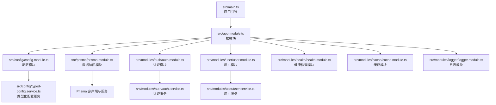
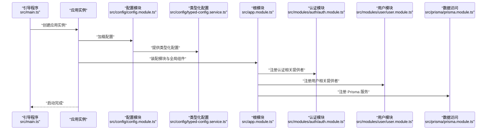
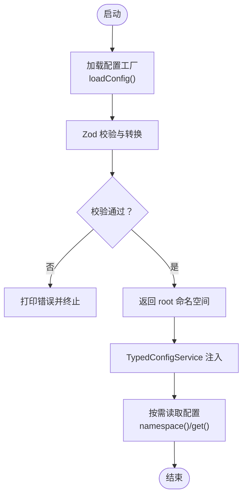
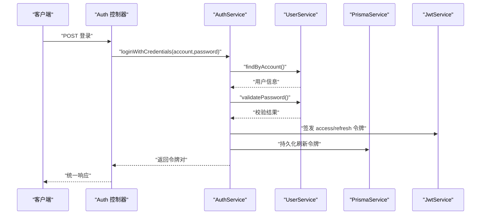
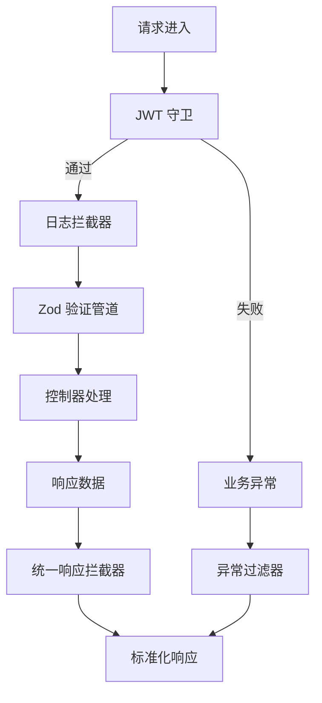
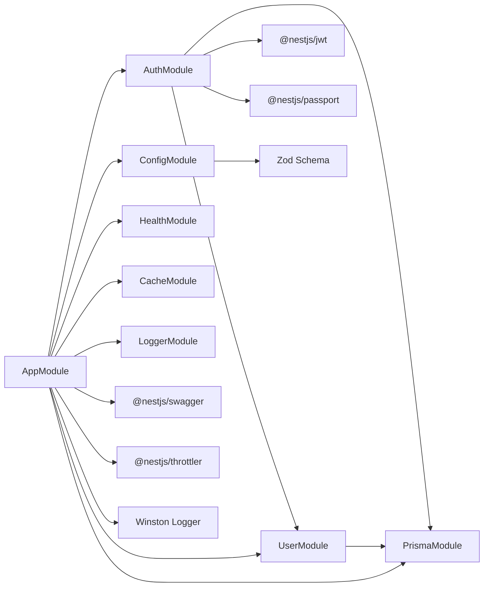

# 项目概述

<cite>
**本文引用的文件**
- [README.md](file://README.md)
- [package.json](file://package.json)
- [src/main.ts](file://src/main.ts)
- [src/app.module.ts](file://src/app.module.ts)
- [src/config/config.module.ts](file://src/config/config.module.ts)
- [src/config/config-loader.ts](file://src/config/config-loader.ts)
- [src/config/typed-config.service.ts](file://src/config/typed-config.service.ts)
- [src/modules/auth/auth.module.ts](file://src/modules/auth/auth.module.ts)
- [src/modules/auth/auth.service.ts](file://src/modules/auth/auth.service.ts)
- [src/modules/user/user.module.ts](file://src/modules/user/user.module.ts)
- [src/modules/user/user.service.ts](file://src/modules/user/user.service.ts)
- [src/prisma/prisma.module.ts](file://src/prisma/prisma.module.ts)
- [src/common/guards/jwt-auth.guard.ts](file://src/common/guards/jwt-auth.guard.ts)
- [src/common/interceptors/logging.interceptor.ts](file://src/common/interceptors/logging.interceptor.ts)
- [src/common/interceptors/transform.interceptor.ts](file://src/common/interceptors/transform.interceptor.ts)
- [src/common/filters/http-exception.filter.ts](file://src/common/filters/http-exception.filter.ts)
- [prisma/schema.prisma](file://prisma/schema.prisma)
- [prisma/schema/User.prisma](file://prisma/schema/User.prisma)
- [prisma/schema/RefreshToken.prisma](file://prisma/schema/RefreshToken.prisma)
- [prisma/schema/Role.prisma](file://prisma/schema/Role.prisma)
- [prisma/schema/Dict.prisma](file://prisma/schema/Dict.prisma)
- [prisma/schema/Menu.prisma](file://prisma/schema/Menu.prisma)
- [prisma.config.ts](file://prisma.config.ts)
</cite>

## 更新摘要
**所做更改**
- 移除了 zod-prisma-types 依赖生态系统的相关内容
- 删除了 Prisma schema 中的 zod 生成器配置
- 更新了依赖关系分析，反映当前的 zod 使用方式
- 调整了配置系统中 Zod Schema 的使用说明

## 目录
1. [引言](#引言)
2. [项目结构](#项目结构)
3. [核心组件](#核心组件)
4. [架构总览](#架构总览)
5. [详细组件分析](#详细组件分析)
6. [依赖关系分析](#依赖关系分析)
7. [性能考虑](#性能考虑)
8. [故障排查指南](#故障排查指南)
9. [结论](#结论)
10. [附录](#附录)

## 引言
本项目是一个基于 NestJS 的企业级后端服务骨架，旨在提供一套可扩展、可维护且具备生产就绪能力的服务端解决方案。项目围绕认证授权、用户管理、数据库访问、配置管理、日志与拦截器、异常过滤等关键领域进行模块化设计，结合 Prisma ORM 实现数据访问抽象，配合 Swagger 提供接口文档，通过 Zod 进行环境变量与请求体的强类型校验，形成从入口引导到业务处理再到基础设施的完整闭环。

项目目标与价值：
- 快速搭建企业级 REST API 基础设施
- 统一的认证授权与令牌生命周期管理
- 可观测性与可调试性（日志、拦截器、异常过滤）
- 配置即代码（TypedConfigService），提升配置安全性与可维护性
- 良好的模块边界与职责分离，便于团队协作与演进

**更新** 移除了对 zod-prisma-types 依赖生态系统的依赖，当前项目直接使用 Zod 进行数据验证，不再生成 Prisma 模型的 Zod 类型定义。

## 项目结构
项目采用 NestJS 推荐的"按功能模块"组织方式，核心目录与职责如下：
- src/common：通用装饰器、守卫、拦截器、过滤器、工具与接口定义
- src/config：配置加载、类型化配置服务与 Schema 定义
- src/modules：业务模块（如 auth、user、cache、health、logger）
- src/prisma：Prisma 服务与模块封装
- src/main.ts：应用引导、中间件与文档配置
- src/app.module.ts：根模块聚合所有子模块与全局管道/拦截器/守卫/过滤器

**图表来源**
- [src/main.ts:1-50](file://src/main.ts#L1-L50)
- [src/app.module.ts:1-61](file://src/app.module.ts#L1-L61)
- [src/config/config.module.ts:1-20](file://src/config/config.module.ts#L1-L20)
- [src/prisma/prisma.module.ts:1-10](file://src/prisma/prisma.module.ts#L1-L10)
- [src/modules/auth/auth.module.ts:1-34](file://src/modules/auth/auth.module.ts#L1-L34)
- [src/modules/user/user.module.ts:1-11](file://src/modules/user/user.module.ts#L1-L11)

**章节来源**
- [src/main.ts:1-50](file://src/main.ts#L1-L50)
- [src/app.module.ts:1-61](file://src/app.module.ts#L1-L61)

## 核心组件
- 应用引导与中间件
  - 在引导阶段启用关闭钩子、设置全局前缀、CORS、日志器与可选 Swagger 文档
  - 参考路径：[src/main.ts:8-47](file://src/main.ts#L8-L47)
- 根模块聚合
  - 引入配置、缓存、Prisma、认证、用户、健康检查、日志等模块
  - 注册全局守卫（JWT 与限流）、拦截器（日志与统一响应）、验证管道（Zod）、异常过滤器
  - 参考路径：[src/app.module.ts:18-59](file://src/app.module.ts#L18-L59)
- 配置系统
  - 通过 ConfigModule 加载扁平环境变量并映射为命名空间对象，使用 Zod 进行严格校验
  - TypedConfigService 提供类型化与点语法访问能力
  - 参考路径：[src/config/config.module.ts:6-19](file://src/config/config.module.ts#L6-L19)，[src/config/config-loader.ts:5-52](file://src/config/config-loader.ts#L5-L52)，[src/config/typed-config.service.ts:20-46](file://src/config/typed-config.service.ts#L20-L46)
- 认证模块
  - 基于 Passport/JWT 的认证流程；提供登录、注册、刷新令牌、登出能力
  - 使用 Prisma 存储刷新令牌并进行哈希保护
  - 参考路径：[src/modules/auth/auth.module.ts:11-33](file://src/modules/auth/auth.module.ts#L11-L33)，[src/modules/auth/auth.service.ts:29-161](file://src/modules/auth/auth.service.ts#L29-L161)
- 用户模块
  - 用户增删改查、密码哈希、账号唯一性校验、选择性字段查询
  - 使用 Zod Schema 对响应进行二次校验，确保输出一致性
  - 参考路径：[src/modules/user/user.module.ts:5-10](file://src/modules/user/user.module.ts#L5-L10)，[src/modules/user/user.service.ts:17-124](file://src/modules/user/user.service.ts#L17-L124)
- 数据访问层
  - PrismaModule 以全局单例形式提供 PrismaService，简化注入与复用
  - 参考路径：[src/prisma/prisma.module.ts:4-9](file://src/prisma/prisma.module.ts#L4-L9)
- 安全与可观测性
  - JWT 守卫支持"公开路由"注解跳过鉴权；日志拦截器记录请求与耗时；统一响应拦截器包装标准 API 结构；异常过滤器将错误映射为业务码与消息
  - 参考路径：[src/common/guards/jwt-auth.guard.ts:23-44](file://src/common/guards/jwt-auth.guard.ts#L23-L44)，[src/common/interceptors/logging.interceptor.ts:16-38](file://src/common/interceptors/logging.interceptor.ts#L16-L38)，[src/common/interceptors/transform.interceptor.ts:21-39](file://src/common/interceptors/transform.interceptor.ts#L21-L39)，[src/common/filters/http-exception.filter.ts:28-78](file://src/common/filters/http-exception.filter.ts#L28-L78)

**更新** 用户模块现在直接使用 Zod Schema 进行响应校验，不再依赖 zod-prisma-types 生成的类型定义。

**章节来源**
- [src/main.ts:8-47](file://src/main.ts#L8-L47)
- [src/app.module.ts:18-59](file://src/app.module.ts#L18-L59)
- [src/config/config.module.ts:6-19](file://src/config/config.module.ts#L6-L19)
- [src/config/config-loader.ts:5-52](file://src/config/config-loader.ts#L5-L52)
- [src/config/typed-config.service.ts:20-46](file://src/config/typed-config.service.ts#L20-L46)
- [src/modules/auth/auth.module.ts:11-33](file://src/modules/auth/auth.module.ts#L11-L33)
- [src/modules/auth/auth.service.ts:29-161](file://src/modules/auth/auth.service.ts#L29-L161)
- [src/modules/user/user.module.ts:5-10](file://src/modules/user/user.module.ts#L5-L10)
- [src/modules/user/user.service.ts:17-124](file://src/modules/user/user.service.ts#L17-L124)
- [src/prisma/prisma.module.ts:4-9](file://src/prisma/prisma.module.ts#L4-L9)
- [src/common/guards/jwt-auth.guard.ts:23-44](file://src/common/guards/jwt-auth.guard.ts#L23-L44)
- [src/common/interceptors/logging.interceptor.ts:16-38](file://src/common/interceptors/logging.interceptor.ts#L16-L38)
- [src/common/interceptors/transform.interceptor.ts:21-39](file://src/common/interceptors/transform.interceptor.ts#L21-L39)
- [src/common/filters/http-exception.filter.ts:28-78](file://src/common/filters/http-exception.filter.ts#L28-L78)

## 架构总览
下图展示了应用启动到请求处理的关键交互，包括配置加载、模块装配、全局中间件与拦截器链路，以及认证与用户服务在请求生命周期中的作用。

**图表来源**
- [src/main.ts:8-47](file://src/main.ts#L8-L47)
- [src/config/config.module.ts:6-19](file://src/config/config.module.ts#L6-L19)
- [src/config/typed-config.service.ts:11-18](file://src/config/typed-config.service.ts#L11-L18)
- [src/app.module.ts:18-59](file://src/app.module.ts#L18-L59)
- [src/modules/auth/auth.module.ts:11-33](file://src/modules/auth/auth.module.ts#L11-L33)
- [src/modules/user/user.module.ts:5-10](file://src/modules/user/user.module.ts#L5-L10)
- [src/prisma/prisma.module.ts:4-9](file://src/prisma/prisma.module.ts#L4-L9)

## 详细组件分析

### 配置系统（ConfigModule + TypedConfigService）
- 设计要点
  - 将扁平环境变量映射为命名空间对象，避免分散读取
  - 使用 Zod 对配置进行运行时校验与类型转换，失败则阻断启动
  - TypedConfigService 提供 get(namespace) 与 namespace(key) 两种访问方式，支持点语法路径
- 关键流程
  - ConfigModule.forRoot 加载配置工厂
  - loadConfig 将 process.env 转换为分层结构并 Zod 校验
  - TypedConfigService 缓存解析后的配置并在缺失时终止进程

**图表来源**
- [src/config/config.module.ts:8-16](file://src/config/config.module.ts#L8-L16)
- [src/config/config-loader.ts:5-52](file://src/config/config-loader.ts#L5-L52)
- [src/config/typed-config.service.ts:11-18](file://src/config/typed-config.service.ts#L11-L18)

**章节来源**
- [src/config/config.module.ts:6-19](file://src/config/config.module.ts#L6-L19)
- [src/config/config-loader.ts:5-52](file://src/config/config-loader.ts#L5-L52)
- [src/config/typed-config.service.ts:20-46](file://src/config/typed-config.service.ts#L20-L46)

### 认证与令牌管理（AuthModule + AuthService）
- 功能范围
  - 登录（账号/密码校验）
  - 注册（邮箱/用户名唯一性校验、密码哈希）
  - 刷新令牌（安全存储与撤销）
  - 登出（撤销用户全部刷新令牌）
- 安全设计
  - 刷新令牌入库并进行 SHA-256 哈希存储
  - 使用独立的刷新密钥与过期时间配置
- 处理流程（登录）

**图表来源**
- [src/modules/auth/auth.service.ts:29-43](file://src/modules/auth/auth.service.ts#L29-L43)
- [src/modules/auth/auth.service.ts:117-153](file://src/modules/auth/auth.service.ts#L117-L153)
- [src/modules/user/user.service.ts:76-83](file://src/modules/user/user.service.ts#L76-L83)

**章节来源**
- [src/modules/auth/auth.module.ts:11-33](file://src/modules/auth/auth.module.ts#L11-L33)
- [src/modules/auth/auth.service.ts:29-161](file://src/modules/auth/auth.service.ts#L29-L161)
- [src/modules/user/user.service.ts:17-124](file://src/modules/user/user.service.ts#L17-L124)

### 用户管理（UserModule + UserService）
- 能力清单
  - 创建用户（邮箱唯一、密码哈希）
  - 查询列表/详情（选择性字段）
  - 更新与删除（存在性前置校验）
  - 账号查询（邮箱或用户名）
- 设计细节
  - 使用 Prisma 的 select 精准控制返回字段，降低传输开销
  - 使用 Zod Schema 对响应进行二次校验，确保输出一致性
  - 通过 UserResponseSchema.parse() 进行运行时类型验证

**更新** 用户模块现在直接使用 Zod Schema 进行响应校验，移除了对 zod-prisma-types 生成类型的依赖。

**章节来源**
- [src/modules/user/user.module.ts:5-10](file://src/modules/user/user.module.ts#L5-L10)
- [src/modules/user/user.service.ts:17-124](file://src/modules/user/user.service.ts#L17-L124)
- [src/modules/user/user.service.ts:90-92](file://src/modules/user/user.service.ts#L90-L92)

### 安全与可观测性（守卫、拦截器、过滤器）
- JWT 守卫
  - 支持通过注解标记"公开路由"，否则沿用 Passport JWT 流程
  - 失败时抛出业务异常，交由统一过滤器处理
- 日志拦截器
  - 记录请求方法、URL、用户标识、IP、UA 与响应状态与耗时
- 统一响应拦截器
  - 将控制器返回值包装为统一结构，包含业务码、消息与数据
- 异常过滤器
  - 将 HttpException/BusinessException/Zod 校验异常映射为业务码与消息
  - 自动记录警告日志并返回标准化错误响应

**图表来源**
- [src/common/guards/jwt-auth.guard.ts:23-44](file://src/common/guards/jwt-auth.guard.ts#L23-L44)
- [src/common/interceptors/logging.interceptor.ts:16-38](file://src/common/interceptors/logging.interceptor.ts#L16-L38)
- [src/common/interceptors/transform.interceptor.ts:21-39](file://src/common/interceptors/transform.interceptor.ts#L21-L39)
- [src/common/filters/http-exception.filter.ts:28-78](file://src/common/filters/http-exception.filter.ts#L28-L78)

**章节来源**
- [src/common/guards/jwt-auth.guard.ts:23-44](file://src/common/guards/jwt-auth.guard.ts#L23-L44)
- [src/common/interceptors/logging.interceptor.ts:16-38](file://src/common/interceptors/logging.interceptor.ts#L16-L38)
- [src/common/interceptors/transform.interceptor.ts:21-39](file://src/common/interceptors/transform.interceptor.ts#L21-L39)
- [src/common/filters/http-exception.filter.ts:28-78](file://src/common/filters/http-exception.filter.ts#L28-L78)

## 依赖关系分析
- 模块耦合
  - AppModule 作为根模块，聚合各子模块并注册全局组件，体现高内聚低耦合
  - AuthModule 依赖 UserModule 与 JwtModule，体现业务模块间的自然依赖
  - PrismaModule 以全局单例提供服务，被多个业务模块共享
- 外部依赖
  - 配置与校验：@nestjs/config + Zod
  - 认证：@nestjs/passport + @nestjs/jwt
  - ORM：@prisma/client + adapter-better-sqlite3
  - 日志：nest-winston + winston
  - 文档：@nestjs/swagger + swagger-ui-express
  - 限流：@nestjs/throttler
  - 校验管道：nestjs-zod

**更新** 移除了 zod-prisma-types 依赖，当前项目直接使用 Zod 进行数据验证，不再生成 Prisma 模型的 Zod 类型定义。

**图表来源**
- [src/app.module.ts:18-59](file://src/app.module.ts#L18-L59)
- [src/modules/auth/auth.module.ts:11-33](file://src/modules/auth/auth.module.ts#L11-L33)
- [src/modules/user/user.module.ts:5-10](file://src/modules/user/user.module.ts#L5-L10)
- [src/prisma/prisma.module.ts:4-9](file://src/prisma/prisma.module.ts#L4-L9)
- [package.json:26-54](file://package.json#L26-L54)

**章节来源**
- [src/app.module.ts:18-59](file://src/app.module.ts#L18-L59)
- [package.json:26-54](file://package.json#L26-L54)

## 性能考虑
- 启动与初始化
  - 使用 ConfigModule 的 ignoreEnvFile 与 Zod 校验在启动阶段尽早发现配置问题，减少运行时开销
  - 全局守卫与拦截器仅在必要时执行，避免无谓的序列化/反序列化
- 数据访问
  - Prisma 的 select 精准投影减少网络与序列化成本
  - 批量操作与并发写入建议结合事务与批量 API
- 缓存与限流
  - 使用 @nestjs/cache-manager 与 @nestjs/throttler 控制外部依赖压力与滥用风险
- 日志与监控
  - 日志拦截器记录关键指标（状态码、耗时、用户），便于后续性能分析与告警

## 故障排查指南
- 启动失败（配置校验）
  - 现象：启动时报错并终止
  - 排查：检查环境变量是否满足 Zod Schema；查看控制台输出的 treeifyError 详情
  - 参考路径：[src/config/config-loader.ts:39-46](file://src/config/config-loader.ts#L39-L46)
- 未授权/鉴权失败
  - 现象：业务异常（UNAUTHORIZED）
  - 排查：确认请求头携带有效 Bearer Token；检查公有路由注解；查看日志拦截器输出
  - 参考路径：[src/common/guards/jwt-auth.guard.ts:40-44](file://src/common/guards/jwt-auth.guard.ts#L40-L44)，[src/common/interceptors/logging.interceptor.ts:25-36](file://src/common/interceptors/logging.interceptor.ts#L25-L36)
- 参数校验失败
  - 现象：VALIDATION_ERROR，details 中包含字段与错误信息
  - 排查：根据 details 定位字段路径，修正请求体或查询参数
  - 参考路径：[src/common/filters/http-exception.filter.ts:107-115](file://src/common/filters/http-exception.filter.ts#L107-L115)
- 数据库连接/权限
  - 现象：Prisma 报错或查询失败
  - 排查：核对 DATABASE_URL 与连接数限制；检查 Prisma 日志开关
  - 参考路径：[src/config/config-loader.ts:15-20](file://src/config/config-loader.ts#L15-L20)

**章节来源**
- [src/config/config-loader.ts:39-46](file://src/config/config-loader.ts#L39-L46)
- [src/common/guards/jwt-auth.guard.ts:40-44](file://src/common/guards/jwt-auth.guard.ts#L40-L44)
- [src/common/interceptors/logging.interceptor.ts:25-36](file://src/common/interceptors/logging.interceptor.ts#L25-L36)
- [src/common/filters/http-exception.filter.ts:107-115](file://src/common/filters/http-exception.filter.ts#L107-L115)
- [src/config/config-loader.ts:15-20](file://src/config/config-loader.ts#L15-L20)

## 结论
本项目以 NestJS 为核心，结合模块化设计、类型化配置、统一拦截器与异常过滤、JWT 认证与 Prisma 数据访问，构建了具备生产可用性的后端骨架。其优势在于：
- 清晰的模块边界与职责划分，便于团队协作与演进
- 强类型的配置与请求校验，显著降低运行时风险
- 统一的响应与错误处理，提升接口一致性与可维护性
- 完备的安全与可观测性组件，支撑企业级需求

**更新** 项目现已移除对 zod-prisma-types 依赖生态系统的依赖，采用更简洁的 Zod 直接验证方式，减少了构建复杂性和维护成本。

## 附录
- 快速开始与命令
  - 安装依赖、开发/生产启动、测试与部署参考：[README.md:28-84](file://README.md#L28-L84)
- 依赖概览
  - 关键依赖与版本信息参考：[package.json:26-54](file://package.json#L26-L54)
- Prisma 模型结构
  - 用户模型：邮箱唯一、用户名唯一、密码存储
  - 角色模型：角色名称唯一、关联用户和菜单
  - 菜单模型：支持父子层级关系、按钮/链接类型
  - 字典模型：字典类型与值的关联关系

**章节来源**
- [README.md:28-84](file://README.md#L28-L84)
- [package.json:26-54](file://package.json#L26-L54)
- [prisma/schema.prisma:1-9](file://prisma/schema.prisma#L1-L9)
- [prisma/schema/User.prisma:1-15](file://prisma/schema/User.prisma#L1-L15)
- [prisma/schema/Role.prisma:1-13](file://prisma/schema/Role.prisma#L1-L13)
- [prisma/schema/Menu.prisma:1-28](file://prisma/schema/Menu.prisma#L1-L28)
- [prisma/schema/Dict.prisma:1-34](file://prisma/schema/Dict.prisma#L1-L34)
- [prisma.config.ts:1-13](file://prisma.config.ts#L1-L13)